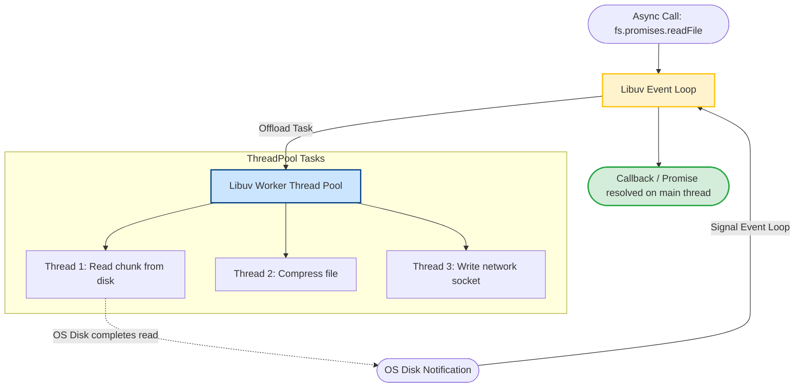

# File System Module

Filesystem operations are a common performance bottleneck in backend applications. Loading a large file (like a 2GB database log) into memory using standard file read APIs will consume all available V8 heap memory and crash your server. Knowing how to choose the right `fs` API and manage system resources is essential for building stable applications.

### The Three API Styles of the `fs` Module
Node.js provides three ways to interact with the filesystem:
1. **Synchronous APIs (e.g. `fs.readFileSync`)**: Blocks the main execution thread until the operating system completes the read operation. This halts all other concurrent client requests.
2. **Callback-based APIs (e.g. `fs.readFile`)**: Asynchronous execution. Node offloads the file operation to Libuv's thread pool and continues running other code. When the operation completes, the callback function is queued to execute.
3. **Promise-based APIs (e.g. `fs.promises.readFile`)**: Modern asynchronous API returning Promise objects, allowing you to use `async/await` syntax for cleaner code.

### Memory Overhead and Large Files
Methods like `fs.readFile` copy the entire file contents into V8 memory. If a file is larger than the remaining V8 heap limit, the application crashes with an "Out of Memory" error. For large files, you must use **Streams** to read and process the file in small chunks.

## Deep Dive

### File Watcher Internals: `fs.watch` vs `fs.watchFile`
Node.js provides two ways to watch for filesystem changes:
1. **`fs.watch`**: Uses native operating system event notifications (such as `inotify` on Linux, `FSEvents` on macOS, and `ReadDirectoryChangesW` on Windows).
   * *Performance*: Highly efficient, consumes minimal resources.
   * *Cons*: Platform-specific behaviors differ, and it can exhaust system file descriptors if watching large directory trees.
2. **`fs.watchFile`**: Polls the target file path at regular intervals, checking the file metadata (`fs.stat`) for changes.
   * *Performance*: Very slow and CPU-intensive because it repeatedly queries the filesystem.
   * *Cons*: High resource overhead, but works consistently across all operating systems.

## Visual Explanation

### File Operation Pipeline and Libuv Threads


## Real-World Example
Consider an application that processes incoming CSV logs. Using `fs.readFileSync` blocks the server, preventing users from logging in while the file is being parsed. Using `fs.promises.readFile` ensures that the file processing runs asynchronously, letting the server handle incoming web requests concurrently.

## Code Examples

### Synchronous, Callback, and Promise API Usage

```javascript
// fs-comparisons.js
const fs = require('fs');
const fsPromises = require('fs').promises;
const path = require('path');

const targetFilePath = path.join(__dirname, 'sample.txt');

// Pre-requisite: Create a sample file
fs.writeFileSync(targetFilePath, 'Hello, Node.js Filesystem!', 'utf8');

// 1. Synchronous API (Blocks the event loop)
console.log('1. Starting Sync read...');
const syncData = fs.readFileSync(targetFilePath, 'utf8');
console.log('2. Sync read data:', syncData);

// 2. Callback-based API (Non-blocking, uses Libuv threads)
console.log('3. Starting Callback read...');
fs.readFile(targetFilePath, 'utf8', (err, callbackData) => {
  if (err) throw err;
  console.log('5. Callback read data:', callbackData);
});

// 3. Promise-based API (Non-blocking, clean async/await syntax)
async function performPromiseRead() {
  console.log('4. Starting Promise read...');
  try {
    const promiseData = await fsPromises.readFile(targetFilePath, 'utf8');
    console.log('6. Promise read data:', promiseData);
    
    // Get file stats (size, creation date, etc.)
    const stats = await fsPromises.stat(targetFilePath);
    console.log('Is directory?', stats.isDirectory());
    console.log('File size in bytes:', stats.size);
    
    // Cleanup
    await fsPromises.unlink(targetFilePath);
    console.log('7. Sample file deleted.');
  } catch (err) {
    console.error('Error during promise operations:', err.message);
  }
}
performPromiseRead();
```

## Best Practices
* **Avoid Sync Methods in Request Paths**: Never use `fs.readFileSync` or `fs.writeFileSync` inside Express route handlers or server callbacks. Only use them during application startup (e.g. reading config files).
* **Use Promises over Callbacks**: Use `fs/promises` or `fs.promises` to write cleaner asynchronous code that is easier to debug and manage.
* **Avoid watchFile**: Avoid using `fs.watchFile` in production due to its high CPU overhead. Use `fs.watch` or a wrapper library like `chokidar` that handles cross-platform watcher edge cases automatically.

## Interview Questions

**Q:** What is the difference between `fs.readFile` and `fs.readFileSync`?

> **Answer:**
> `fs.readFileSync` runs synchronously, blocking the main execution thread and halting other operations until the file is read. `fs.readFile` runs asynchronously, offloading the I/O operation to the Libuv thread pool so the main thread can continue running other code.

**Q:** What are file descriptors, and how can they cause application crashes when using file watch APIs?

> **Answer:**
> A file descriptor is an index reference maintained by the operating system kernel to identify open files, sockets, or pipes. When you watch a large directory tree using `fs.watch`, Node.js allocates a file descriptor for each watched path. If the directory contains thousands of files, this can exhaust the operating system's maximum file descriptor limit, causing the application to crash with an `EMFILE` error.

**Q:** Why does the `fs` module use background threads if Node.js is single-threaded? Where do these threads come from?

> **Answer:**
> The main thread of Node.js runs only JavaScript. However, standard operating system filesystem operations do not have native asynchronous non-blocking APIs in Unix kernels (unlike network sockets). To prevent filesystem calls from blocking the main thread, Libuv manages a pool of background worker threads (defaulting to 4 threads). When an asynchronous file operation is called, Libuv delegates the work to one of these threads, freeing the main thread to run JavaScript.

**Q:** In high-concurrency production systems, what issues arise when using `fs.watch` to detect real-time configurations files updates, and how do you build a resilient, cross-platform file-watcher?

> **Answer:**
> Native `fs.watch` has several issues:
> 1. It can trigger duplicate events for a single file save (due to editor write-rename sequences).
> 2. It behaves inconsistently across platforms (e.g., reporting file names on Windows but returning empty fields on some Linux kernels).
> 3. It does not support recursive subdirectory watching natively on Linux.
> 
> To build a resilient watcher:
> - Do not use `fs.watch` directly. Use a mature wrapper library like `chokidar` that abstracts platform events.
> - Implement a **debouncing** mechanism to ignore rapid duplicate events.
> - Add error handling for `EMFILE` limits and implement a fallback to polling mode (like `fs.watchFile`) if file descriptor limits are exceeded.

---
Previous : [11_ES_Modules.md](11_ES_Modules.md) | Index : [00_index.md](00_index.md) | Next : [13_Path_Module.md](13_Path_Module.md)
