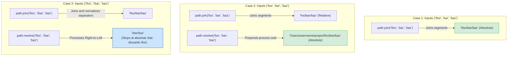

# Path Module

Different operating systems use different characters to separate file paths: Windows uses backslashes (`\`), while POSIX systems (Linux, macOS) use forward slashes (`/`). Hardcoding slashes in your code (e.g. `const p = __dirname + '/src/config.json'`) will make your application crash when deployed to a different operating system. Using the `path` module prevents these cross-platform bugs.

### Platform Absctraction
The `path` module automatically detects the host operating system at runtime and adapts its path manipulation logic. You can also access platform-specific implementations directly if needed:
* `path.win32`: Force Windows-style path handling (using `\`).
* `path.posix`: Force POSIX-style path handling (using `/`).

### Path Normalization
Path strings often contain redundant symbols like `.` (current directory) or `..` (parent directory), or double slashes. The `path.normalize()` method resolves these segments, cleaning up the path string so it is valid for the host operating system.

## Deep Dive

### Join vs. Resolve
The difference between `path.join()` and `path.resolve()` is a common source of bugs:

1. **`path.join(...paths)`**:
   * Joins all given path segments together using the platform-specific separator as a delimiter, then normalizes the resulting path.
   * *Behavior*: It does not change the nature of the path. If you do not pass an absolute path segment, the returned path remains relative.
2. **`path.resolve(...paths)`**:
   * Resolves a sequence of paths or path segments into an absolute path.
   * *Behavior*: It processes the segments from right to left, prepending each path until an absolute path is constructed. If no absolute path is found after processing all segments, it prepends the current working directory (`process.cwd()`). Think of it as opening a terminal and running `cd` commands for each segment.

## Visual Explanation

### Behavioral Execution: Join vs. Resolve


## Real-World Example
Suppose you run a server application. You need to read a configuration file `config.json` located one directory level up from your server script. To ensure your code works whether you run the application from the project root or the script directory, use `path.resolve(__dirname, '../config.json')`. This creates a reliable absolute path based on the script's location, preventing file-not-found crashes.

## Code Examples

### Path Manipulation and Join/Resolve Comparisons

```javascript
// path-demo.js
const path = require('path');

// 1. Separator difference depending on the Host OS
console.log('Native Separator for this system:', path.sep); // '\' on Windows, '/' on POSIX

// 2. Joining paths (keeps path relative if no absolute segment is provided)
const relativeJoin = path.join('src', 'components', 'button.js');
console.log('Joined Relative Path:', relativeJoin); // 'src/components/button.js' (or backslash)

// 3. Resolving paths (always returns an absolute path)
const absoluteResolve = path.resolve('src', 'components', 'button.js');
console.log('Resolved Absolute Path:', absoluteResolve); 
// Output: '/absolute/path/to/current-directory/src/components/button.js'

// 4. Resolve behaviors with absolute overrides (right-to-left resolution)
const overrideResolve = path.resolve('/var', '/etc', 'nginx/nginx.conf');
console.log('Override Resolve Path:', overrideResolve); // '/etc/nginx/nginx.conf'

// 5. Parsing and Formatting Paths
const fileDetails = path.parse('/home/user/workspace/app.js');
console.log('Parsed path object:', fileDetails);
/* Output:
{
  root: '/',
  dir: '/home/user/workspace',
  base: 'app.js',
  ext: '.js',
  name: 'app'
}
*/

// Reconstructing the path string
const formattedPath = path.format(fileDetails);
console.log('Reconstructed string:', formattedPath); // '/home/user/workspace/app.js'
```

## Best Practices
* **Never Hardcode Separators**: Avoid using slash strings (`'/'` or `'\\'`) to join paths. Always use `path.join()` or `path.resolve()` to ensure cross-platform compatibility.
* **Use `__dirname` for File Locations**: When reference files relative to the current script file, combine them with `__dirname` using `path.resolve(__dirname, './relative-path')`.
* **Use `process.cwd()` for Execution Locations**: Use `path.resolve(process.cwd(), './path')` when you need to resolve paths relative to where the user executed the command.

## Interview Questions

**Q:** What is the difference between Windows and Linux file path separators, and how does Node.js handle them?

> **Answer:**
> Windows uses a backslash (`\`) to separate path segments, while Linux and macOS use a forward slash (`/`). Node.js abstracts these differences through the `path` module. Methods like `path.join()` use the host system's native path separator dynamically at runtime.

**Q:** Explain the difference between `path.join()` and `path.resolve()`.

> **Answer:**
> `path.join()` joins all given path segments together using the platform-specific separator and normalizes the resulting path. It does not resolve relative segments to absolute paths unless an absolute segment is passed. `path.resolve()` resolves a sequence of paths into an absolute path, processing segments from right to left until an absolute root is found. If no absolute root is found, it prepends the current working directory (`process.cwd()`).

**Q:** What happens when `path.resolve('/foo', '/bar', 'baz')` is executed, and why?

> **Answer:**
> It returns `/bar/baz` (or `\bar\baz` on Windows). `path.resolve()` processes segments from right to left:
> 1. It starts with `baz` (relative).
> 2. It prepends `/bar`. Because `/bar` is an absolute path, the resolution is complete.
> 3. It discards `/foo` because it has already constructed an absolute path root, stopping further evaluation.

**Q:** How would you build a secure file system access layer that prevents Directory Traversal (LFI) attacks when resolving paths input by users?

> **Answer:**
> To prevent Directory Traversal (where users pass paths containing `../` to access sensitive system files like `/etc/passwd`):
> 1. Define a strict root storage directory path, resolved to an absolute path (e.g., `const STORAGE_ROOT = path.resolve('/var/storage')`).
> 2. Resolve the user-provided path relative to this root using `path.resolve(STORAGE_ROOT, userRawInput)`.
> 3. Verify that the resolved path starts with the root path using `.startsWith(STORAGE_ROOT)`. This validation ensures the user's path is confined to the target storage folder and prevents traversal attacks.

---
Previous : [12_File_System_Module.md](12_File_System_Module.md) | Index : [00_index.md](00_index.md) | Next : [14_OS_Module.md](14_OS_Module.md)
