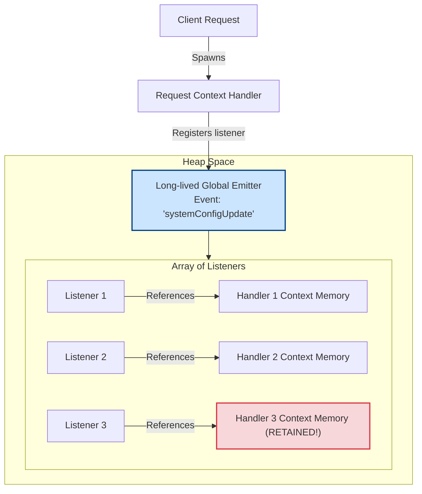

# Events Module

Much of the Node.js core architecture is built around event emitters. For example, Streams, HTTP servers, and database connectors all inherit from `EventEmitter`. If you do not understand how event listeners are registered and cleaned up, you will introduce memory leaks as listeners accumulate over time.

### The Publisher-Subscriber Pattern
The `EventEmitter` class implements the Publisher-Subscriber (Pub/Sub) pattern. An emitter (publisher) triggers a named event, and all registered listener functions (subscribers) are executed in response.

### Synchronous Execution by Default
A common misconception is that `EventEmitter` executes callbacks asynchronously. **This is false.** 
When you call `emitter.emit('event')`, the `EventEmitter` iterates over its array of registered listener functions and executes them **synchronously** in the order they were registered. It does not defer execution to the microtask or macrotask queues.

## Deep Dive

### Event Listener Memory Leaks
Every time you call `emitter.on('event', callback)`, a reference to the callback function is added to an internal array inside the emitter. If the emitter lives longer than the listener object, the listener cannot be garbage collected because the emitter still holds a reference to it.

To help developers catch leaks, Node.js sets a default limit of **10 listeners** per event. If you register more than 10, Node.js prints a warning to `stderr`:
`MaxListenersExceededWarning: Possible EventEmitter memory leak detected. 11 event listeners added.`

You can adjust this limit using `emitter.setMaxListeners(n)`, but you should resolve the root cause by removing listeners when they are no longer needed.

## Visual Explanation

### EventEmitter Lifecycle and Memory Leak Risk

*Note*: When requests complete, the Request Context Handlers remain in memory because the Global Emitter's array still references their listener callbacks.

## Real-World Example
Consider an application that updates client connections in real-time. If clients connect via WebSockets and you register a listener on a global event emitter for configuration updates, you must remove that listener when the client disconnects. If you forget to call `removeListener`, the connection objects will remain in memory forever.

## Code Examples

### EventEmitter Usage and Memory Leak Resolution

```javascript
// event-emitter-leak.js
const { EventEmitter } = require('events');

class UserSessionEmitter extends EventEmitter {}
const sessionManager = new UserSessionEmitter();

// 1. Basic event registration and emission (Synchronous)
sessionManager.on('login', (username) => {
  console.log(`[ON-LOGIN-1] User ${username} has logged in.`);
});

sessionManager.on('login', (username) => {
  console.log(`[ON-LOGIN-2] Logging login event for ${username} to audit table.`);
});

console.log('1. Emitting login event...');
sessionManager.emit('login', 'Alice'); 
console.log('2. Emitting completed (Synchronous execution check).\n');

// 2. Simulating a memory leak (Accumulating listeners)
const globalConfigEmitter = new EventEmitter();

function registerClientHandler() {
  const handlerState = { clientId: Math.random(), data: new Array(100000) };
  
  // Define callback
  const onUpdate = () => {
    console.log(`Handler received config update for client: ${handlerState.clientId}`);
  };

  // Register listener on long-lived emitter
  globalConfigEmitter.on('configUpdate', onUpdate);

  // Return cleanup helper
  return {
    cleanup: () => {
      // Correct cleanup to prevent memory leaks
      globalConfigEmitter.removeListener('configUpdate', onUpdate);
    }
  };
}

// Spawning handlers
const client1 = registerClientHandler();
const client2 = registerClientHandler();

// Trigger event
globalConfigEmitter.emit('configUpdate');

// Cleanup to prevent leaks before releasing client references
client1.cleanup();
client2.cleanup();

console.log(`Listeners count after cleanup: ${globalConfigEmitter.listenerCount('configUpdate')}`); // 0
```

## Best Practices
* **Always Clean Up Listeners**: Remove listeners (`emitter.off` or `emitter.removeListener`) when the subscribing object is destroyed or the connection closes.
* **Use `once()` for One-Time Events**: Use `emitter.once()` for events that should trigger a callback only once, as Node automatically removes the listener after it executes.
* **Never throw inside emitters**: If an error occurs, emit an `'error'` event (`emitter.emit('error', err)`) instead of throwing, and ensure you have an `'error'` listener registered to prevent the process from crashing.
* **Do Not block in listeners**: Since listeners execute synchronously, keep listener functions fast to avoid blocking the event loop.

## Interview Questions

**Q:** What is an EventEmitter in Node.js?

> **Answer:**
> `EventEmitter` is a core Node.js class from the `events` module that enables communication between objects. It allows objects to emit named events that trigger registered callback functions (listeners).

**Q:** Are event emitter callbacks executed synchronously or asynchronously when emitted? Prove it.

> **Answer:**
> They are executed synchronously. When `emitter.emit('event')` is called, the emitter iterates over all registered listener functions and executes them sequentially on the main thread, blocking further execution of the script until all listeners have returned.

**Q:** What is the `MaxListenersExceededWarning` warning, what causes it, and how do you resolve the underlying issue?

> **Answer:**
> This warning occurs when more than 10 listeners are registered for a single event on an emitter. It is a safety feature designed to help developers identify memory leaks.
> To resolve the underlying issue, ensure you remove event listeners when they are no longer needed (e.g. on client disconnect or scope termination). If you genuinely need more than 10 listeners, you can increase the limit using `emitter.setMaxListeners(n)`.

**Q:** How would you design a distributed event architecture where local event emitter instances sync events across multiple Node.js server processes running in a cluster?

> **Answer:**
> You cannot use local `EventEmitter` instances to sync events across processes because they are confined to a single process's memory space.
> To sync events across a cluster:
> 1. Integrate an external message broker or store (like Redis Pub/Sub, RabbitMQ, or Kafka) to act as a shared event bus.
> 2. Implement a wrapper class where each server process instantiates a local `EventEmitter` and subscribes to the Redis Pub/Sub channel.
> 3. When an event is emitted locally, publish the event payload to Redis.
> 4. The other server processes receive the event from Redis and trigger their local `EventEmitter` instances to execute their local listeners, coordinating execution across the cluster.

---
Previous : [14_OS_Module.md](14_OS_Module.md) | Index : [00_index.md](00_index.md) | Next : [16_Buffers.md](16_Buffers.md)
