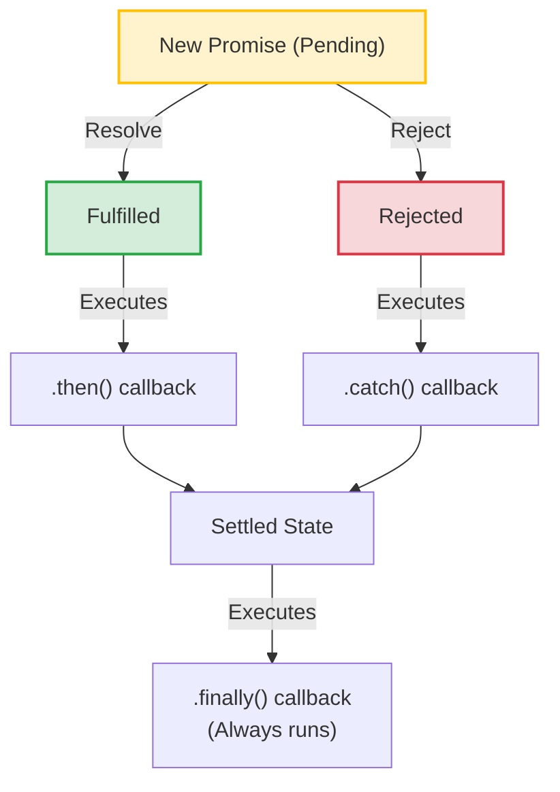

# Promises

Promises are the standard foundation for asynchronous programming in modern Node.js. If you do not understand how Promises behave under the hood, you will write code with unhandled rejections that crash production servers, create memory leaks, or execution ordering bugs.

### What is a Promise?
A **Promise** is a proxy object representing the eventual completion (or failure) of an asynchronous operation. A Promise is always in one of three states:
1. **Pending**: Initial state; the asynchronous operation is still running.
2. **Fulfilled**: The operation completed successfully, returning a result value.
3. **Rejected**: The operation failed, throwing an error or reason.

Once a Promise transitions from Pending to either Fulfilled or Rejected, it becomes **settled** and its state can never change again (it is immutable).

### Promise Chaining and Error Propagation
When a Promise resolves, you can chain subsequent actions using `.then()`. Errors thrown anywhere in a Promise chain automatically propagate down the chain until they hit a `.catch()` block, allowing you to handle multiple errors in a single location.

## Deep Dive

### Promise Combinators
Node.js applications often run multiple asynchronous operations concurrently. You can coordinate these tasks using Promise combinators:

| Combinator | Behavior | Use Case |
| :--- | :--- | :--- |
| **`Promise.all`** | Resolves when **all** promises resolve; rejects immediately if **any** promise rejects. | Parallel tasks where all results are required (e.g. fetching multiple API resources). |
| **`Promise.allSettled`** | Resolves after **all** promises have settled (either resolved or rejected), returning an array of status details. | Independent tasks where you want to process all outcomes even if some fail (e.g. bulk email sends). |
| **`Promise.race`** | Resolves or rejects as soon as the **first** promise settles. | Timeout patterns (e.g. racing an API request against a timeout timer). |
| **`Promise.any`** | Resolves as soon as the **first** promise resolves; rejects only if **all** promises reject. | Querying redundant mirrors where you only need the fastest successful response. |

### Unhandled Rejections
If a Promise is rejected and no `.catch()` handler is attached, Node.js emits an `unhandledRejection` event. In modern Node.js versions, unhandled rejections print a warning and will eventually terminate the process with a non-zero exit code. You must catch all rejections to keep your application stable.

## Visual Explanation

### Promise State Machine


## Real-World Example
Consider an application that updates user data. It needs to read user settings from a database, check permissions, and update the record. Using Promises, you can chain these operations sequentially. If any step fails (e.g. database timeout or invalid permissions), the error is caught at the end of the chain, preventing the application from crashing.

## Code Examples

### Chaining, Combinators, and Unhandled Rejection Listeners

```javascript
// promise-demo.js

// 1. Basic Promise definition and chaining
const checkInventory = (item) => {
  return new Promise((resolve, reject) => {
    setTimeout(() => {
      if (item === 'laptop') resolve({ item, status: 'available' });
      else reject(new Error(`Item ${item} out of stock.`));
    }, 100);
  });
};

checkInventory('laptop')
  .then((res) => {
    console.log('1. Inventory check result:', res);
    return res.item; // Pass value to next .then()
  })
  .then((itemName) => {
    console.log('2. Preparing shipping for:', itemName);
  })
  .catch((err) => {
    // Catches errors from either checkInventory or shipping steps
    console.error('Error in chain:', err.message);
  })
  .finally(() => {
    console.log('3. Operation sequence finished.\n');
  });

// 2. Promise Combinators
const fetchUser = () => new Promise(res => setTimeout(() => res('User'), 50));
const fetchConfig = () => new Promise(res => setTimeout(() => res('Config'), 150));
const failingTask = () => new Promise((_, rej) => setTimeout(() => rej(new Error('Failed')), 80));

// Promise.all (Fails immediately because failingTask rejects before fetchConfig resolves)
Promise.all([fetchUser(), fetchConfig(), failingTask()])
  .then(results => console.log('Promise.all results:', results))
  .catch(err => console.error('Promise.all rejected with:', err.message));

// Promise.allSettled (Resolves with status of all operations)
Promise.allSettled([fetchUser(), fetchConfig(), failingTask()])
  .then(results => {
    console.log('\nPromise.allSettled results:');
    results.forEach(r => console.log(` - Status: ${r.status}, Value/Reason: ${r.value || r.reason.message}`));
  });

// 3. Catching Global Unhandled Rejections
process.on('unhandledRejection', (reason, promise) => {
  console.error('\x1b[31m[CRITICAL WARNING] Unhandled Rejection detected:\x1b[0m', reason.message);
  // In production, log this to an external error tracker and shut down gracefully if critical
});

// Triggering an unhandled rejection
Promise.reject(new Error('Forgotten catch block'));
```

## Best Practices
* **Always Catch Errors**: Always attach a `.catch()` block to your Promise chains or handle rejections inside try/catch blocks.
* **Return Promises in Chains**: Ensure you return Promises inside `.then()` blocks to propagate values and errors down the chain correctly.
* **Handle unhandledRejection**: Register a process-level listener for `unhandledRejection` to catch and log errors that escape standard try/catch blocks.

## Interview Questions

**Q:** What are the three states of a Promise?

> **Answer:**
> The three states are **Pending** (the operation is still running), **Fulfilled** (the operation completed successfully), and **Rejected** (the operation failed).

**Q:** What is the difference between `Promise.all` and `Promise.allSettled`?

> **Answer:**
> `Promise.all` takes an array of promises and resolves only when all of them resolve. If any promise rejects, it rejects immediately with that error. `Promise.allSettled` waits for all promises to settle (either resolve or reject) and returns an array of objects describing the outcome of each promise.

**Q:** Explain how unhandled Promise rejections behave in modern Node.js and how a senior engineer configures process-level safety nets.

> **Answer:**
> In modern Node.js, unhandled rejections trigger a deprecation warning and will eventually terminate the process with an exit code of `1`.
> To secure the application, register listeners for `unhandledRejection` and `uncaughtException` on the `process` object. These listeners should log the error details to a secure storage pipeline (like Winston/Elasticsearch) and trigger a graceful shutdown sequence to restart the container cleanly, preventing memory leaks or corrupted states.

**Q:** In high-concurrency environments, discuss the memory footprint implications of instantiating thousands of Promises simultaneously. How does V8 allocate memory for Promise instances compared to simple callbacks?

> **Answer:**
> Promises carry a higher memory footprint than callbacks. A callback is simply a function reference passed as an argument. A Promise is a full JavaScript object containing internal state arrays (`[[PromiseState]]`, `[[PromiseResult]]`), lists of resolve/reject handler bindings, and closure scopes.
> 
> Instantiating thousands of Promises concurrently creates many short-lived objects on the V8 heap. This increases GC pressure, leading to frequent minor scavenger collection sweeps that can cause latency spikes. To mitigate this in high-concurrency systems, use streaming APIs, implement backpressure limits, or utilize connection pools instead of spawning unconstrained Promise operations.

---
Previous : [18_Callbacks.md](18_Callbacks.md) | Index : [00_index.md](00_index.md) | Next : [20_Async_Await.md](20_Async_Await.md)
