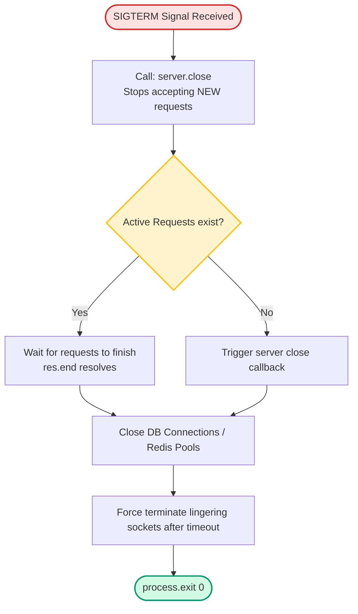

# Creating Web Servers

If you shut down a production Node.js server by simply terminating the process (`SIGTERM`/`SIGINT`), you will abort active client transactions (such as database writes, file uploads, or payments) halfway through. Building a production-grade server requires implementing graceful shutdown sequences that finish active requests before exiting.

### Listen Parameters and TCP Backlog
When a server starts listening, you configure:
* **Port**: The network port to bind to. Setting this to `0` makes the operating system allocate a random unused port (ideal for isolated testing runs).
* **Hostname**: Setting this to `'127.0.0.1'` limits incoming connections to local loopback traffic only. Setting this to `'0.0.0.0'` tells the system to accept connections on all network interfaces.
* **Backlog**: The maximum length of the queue of pending connections. If the queue is full, the operating system rejects new TCP handshakes.

### Graceful Shutdown Sequence
Graceful shutdown is the process of stopping a server safely:
1. Receive a shutdown signal (like `SIGTERM` from Docker or Kubernetes).
2. Call `server.close()` to stop the server from accepting *new* network connections.
3. Keep the process running while active client connections finish their requests.
4. Close all active database connections, message queue channels, and background tasks.
5. Exit the process with code `0`.

## Deep Dive

### Connection Tracking and Timeouts
By default, Node.js HTTP servers do not track active connections or terminate idle ones. If a client maintains an open connection, the process will not exit when `server.close()` is called because the Event Loop is kept active by the open socket.

To shut down gracefully:
* **Keep track of active sockets**: Store references to all open client sockets.
* **Destroy idle sockets**: Set timeouts on connections, and force-destroy remaining sockets after a safe timeout window (e.g. 10-30 seconds) if they do not close on their own.

## Visual Explanation

### Graceful Shutdown Sequence Flow


## Real-World Example
In a Kubernetes cluster, rolling deployments shut down old containers while launching new ones. Kubernetes sends a `SIGTERM` signal to the container and updates routing tables. If the server does not handle `SIGTERM` and shut down gracefully, users with active checkout transactions will receive `502 Bad Gateway` errors as their connections are aborted.

## Code Examples

### Production-Grade Server Setup and Graceful Shutdown Implementation

```javascript
// production-server.js
const http = require('http');

const server = http.createServer((req, res) => {
  // Simulate a slow database query (3 seconds)
  setTimeout(() => {
    res.writeHead(200, { 'Content-Type': 'application/json' });
    res.end(JSON.stringify({ message: 'Transaction completed successfully' }));
  }, 3000);
});

// Track active sockets
const activeSockets = new Set();

server.on('connection', (socket) => {
  activeSockets.add(socket);
  socket.on('close', () => {
    activeSockets.delete(socket);
  });
});

const PORT = process.env.PORT || 3000;
server.listen(PORT, '0.0.0.0', 511, () => {
  console.log(`Server listening on port ${PORT} with backlog limit 511`);
});

// --- GRACEFUL SHUTDOWN LOGIC ---

const shutdown = (signal) => {
  console.log(`\nReceived ${signal}. Starting graceful shutdown...`);

  // Stop accepting new connections
  server.close((err) => {
    if (err) {
      console.error('Error during server close:', err.message);
      process.exit(1);
    }
    console.log('All active network connections closed. Exiting.');
    process.exit(0);
  });

  // Force close idle connections after a timeout
  setTimeout(() => {
    console.warn('Force shutting down remaining active connections...');
    for (const socket of activeSockets) {
      // Closes the connection immediately (sends TCP RST)
      socket.destroy();
    }
    process.exit(0);
  }, 10000); // 10-second timeout window
};

// Listen for process termination signals
process.on('SIGTERM', () => shutdown('SIGTERM'));
process.on('SIGINT', () => shutdown('SIGINT')); // Handles Ctrl+C locally
```

## Best Practices
* **Listen on `0.0.0.0` in Containers**: Always listen on `0.0.0.0` inside Docker/Kubernetes configurations. Listening on `127.0.0.1` binds the port to local host loopback interface inside the container, making it inaccessible from outside the container.
* **Implement Graceful Shutdowns**: Always register process-level listeners for `SIGTERM` and `SIGINT` to manage system resource cleanups.
* **Track and Destroy Idle Sockets**: Implement socket tracking and timeout limits to prevent lingering connections from blocking shutdowns indefinitely.

## Interview Questions

**Q:** What is the difference between binding to host `127.0.0.1` and `0.0.0.0`?

> **Answer:**
> Binding to `127.0.0.1` (localhost) restricts connections to the local machine only. Binding to `0.0.0.0` instructs the server to listen on all available network interfaces, allowing external clients to connect.

**Q:** What is the purpose of `server.close()` and what happens to active requests when it is called?

> **Answer:**
> `server.close()` stops the server from accepting new TCP connections. However, it does not abort active requests that are already processing. The server remains active until all existing connections have finished processing and closed.

**Q:** Why does a Node.js process sometimes refuse to exit when `server.close()` is called, and how do you resolve it?

> **Answer:**
> `server.close()` stops accepting new connections but waits for existing connections to close on their own. If a client keeps a TCP connection open (e.g. via keep-alive or open web sockets), the socket remains active. Because active sockets keep the Event Loop running, the process will not exit. To resolve this, keep track of all active sockets in a `Set` and call `socket.destroy()` on them if they remain open after a safe shutdown timeout window.

**Q:** In cloud container environments (like AWS Fargate or Kubernetes), discuss the lifecycle of a pod shutdown. How do the preStop hook, SIGTERM signal, and server graceful shutdown timeouts coordinate to achieve zero-downtime deployments?

> **Answer:**
> To achieve zero-downtime deployments during updates:
> 1. The orchestrator deletes the pod/container from the Service directory (stopping routing networks from sending traffic). However, network routing updates are asynchronous and can take a few seconds to propagate.
> 2. To prevent connection drops during this propagation window, a `preStop` hook script can run a short sleep command (e.g. 5-10 seconds) before sending the `SIGTERM` signal.
> 3. The orchestrator sends the `SIGTERM` signal to the Node.js process.
> 4. The process catches `SIGTERM` and immediately calls `server.close()` to stop accepting new requests, while continuing to process active transactions.
> 5. The application is given a grace period (e.g. 30 seconds) to clean up. The Node.js application should configure its internal socket-destroy timeout (e.g. 20 seconds) to execute before the container orchestrator sends a `SIGKILL` signal, ensuring all transactions are saved and resources are cleaned up cleanly.

---
Previous : [21_HTTP_Module.md](21_HTTP_Module.md) | Index : [00_index.md](00_index.md) | Next : [23_REST_APIs.md](23_REST_APIs.md)
