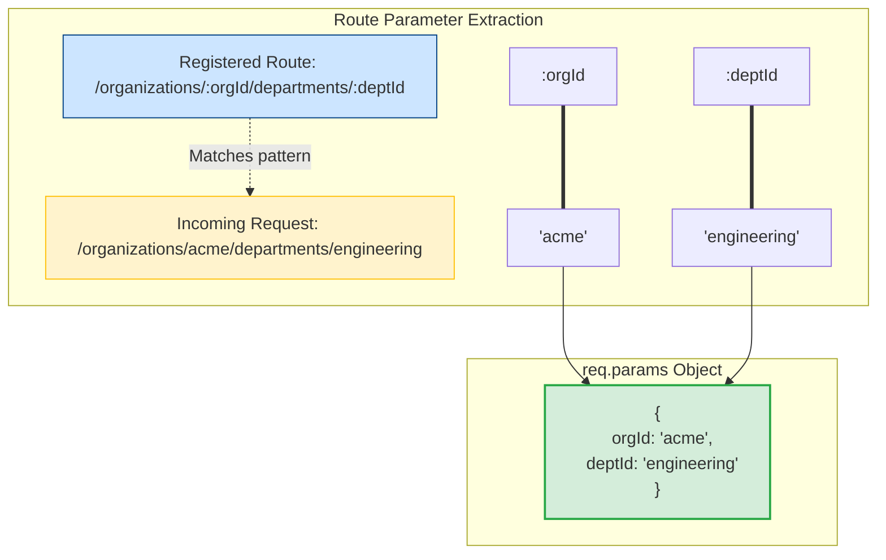

# Routing

Routing defines how your API exposes resources to the outside world. If you do not understand routing parameters, you will write duplicate routes or struggle to validate variable route segments. Designing semantic, clean routes keeps your API structured and easy for clients to consume.

### Route Path Matchers
Express routes match HTTP requests to controller functions based on paths. You can define route paths in three ways:
1. **String Literal**: Direct exact match (e.g. `app.get('/about', ...)`).
2. **String Pattern**: Uses wildcards and operators like `?`, `+`, `*`, and `()` (e.g. `/ab?cd` matches `acd` or `abcd`).
3. **Regular Expression**: Powerful matching logic using standard regex blocks (e.g. `app.get(/\/abc|xyz/, ...)`).

### Route Parameters
Route parameters are named URL segments that capture values at specific positions in the URL path. They are parsed into the `req.params` object:
* Path definition: `/users/:userId/books/:bookId`
* Requested URL: `/users/42/books/101`
* Resulting `req.params`: `{ userId: "42", bookId: "101" }`

## Deep Dive

### Chainable Route Handlers: `app.route()`
When you define separate route handlers for the same path (e.g. GET to read a resource, and POST to update it), registering them separately creates duplicate path strings:

```javascript
app.get('/api/users', getUsers);
app.post('/api/users', createUser);
```

You can clean this up using `app.route(path)`. This returns a single route instance that allows you to chain HTTP verbs together, improving readability and reducing code duplication:

```javascript
app.route('/api/users')
  .get(getUsers)
  .post(createUser);
```

### Callback Chaining
Express allows you to pass multiple callback functions to a single route. The callbacks are executed sequentially, acting like route-specific middleware:

```javascript
app.get('/api/reports', verifyUserSession, checkBillingPlan, generateReport);
```

This lets you separate concerns, keeping authorization and validation checks out of your main controller logic.

## Visual Explanation

### Dynamic Route Parameter Processing


## Real-World Example
Consider building a blogging API. You want to fetch posts using numeric IDs, but also support fetching posts by category string. You can define a route parameter with a regex constraint: `app.get('/posts/:id(\\d+)', ...)` to match numeric IDs, and define a separate route `/posts/:category` to handle string categories. This prevents path collisions.

## Code Examples

### Custom Routing Paths, Regex Constraints, and Route Chaining

```javascript
// routing-demo.js
const express = require('express');
const app = express();

app.use(express.json());

// 1. String Pattern Matching
// Matches '/acd' and '/abcd'
app.get('/ab?cd', (req, res) => {
  res.send('Matched /ab?cd pattern');
});

// 2. Regular Expression Path Matching
// Matches any path ending with 'fly' (e.g. '/dragonfly', '/butterfly')
app.get(/.*fly$/, (req, res) => {
  res.send('Path matched regex *fly$');
});

// 3. Nested Route Parameters with Regex Constraints
// ':userId' must be a sequence of digits (\\d+)
app.get('/users/:userId(\\d+)/books/:bookId', (req, res) => {
  res.json({
    userId: req.params.userId, // Guaranteed to be numeric
    bookId: req.params.bookId
  });
});

// 4. Chainable Route Handlers using app.route()
// Exposes multiple CRUD operations on a single path
app.route('/api/articles')
  .get((req, res) => {
    res.json({ message: 'Fetching all articles' });
  })
  .post((req, res) => {
    res.status(201).json({ message: 'Article created successfully' });
  })
  .put((req, res) => {
    res.json({ message: 'Bulk articles updated' });
  });

// 5. Multiple Callbacks for a Single Route
const validateRequest = (req, res, next) => {
  console.log('Running validation step...');
  next();
};

const fetchPayload = (req, res) => {
  res.json({ source: 'Controller executed successfully' });
};

app.get('/api/resource', validateRequest, fetchPayload);

app.listen(3000, () => console.log('Routing server running on port 3000'));
```

## Best Practices
* **Use Regex Constraints on Params**: Add validation constraints directly to your route parameters (e.g. `:id(\\d+)`) to prevent invalid routes from matching and to improve routing security.
* **Keep Controllers Focused**: Do not combine authentication, input validation, and business logic in a single route handler callback. Chain helper functions to keep controllers focused and reusable.
* **Use `app.route()` for Duplicate Paths**: Use `app.route()` to group different HTTP methods targeting the same path to keep your codebase structured.

## Interview Questions

**Q:** How do you define route parameters in Express and retrieve their values?

> **Answer:**
> Route parameters are defined by prefixing a path segment with a colon (e.g. `/users/:id`). The values are parsed by Express and accessed via the `req.params` object (e.g. `req.params.id`).

**Q:** What is the purpose of `app.route()` and what is its benefit?

> **Answer:**
> `app.route()` returns a single instance of a route targeting a specific path, allowing you to chain different HTTP method handlers (GET, POST, PUT, DELETE) on that path. This prevents path string duplication and organizes CRUD routes cleanly.

**Q:** How do you restrict an Express route parameter to match only numeric values, and what error does Express return if a client passes string characters instead?

> **Answer:**
> You can add a regular expression constraint inside parentheses directly after the parameter name (e.g., `/users/:id(\\d+)`). If a client passes non-numeric characters (e.g., `/users/abc`), Express will bypass this route definition and continue searching the routing stack. If no other route matches, the client receives a standard `404 Not Found` response.

**Q:** How would you build a dynamic route auditing system in Express that automatically maps all active routes to a database, tracking registration order and regex patterns for service discovery?

> **Answer:**
> To build a route auditing system:
> 1. Inspect the internal routing table array `app._router.stack` after all routes have been registered (typically during the app bootstrap phase).
> 2. Iterate recursively through the stack entries to identify layers containing routes and sub-routers:
> ```javascript
> app._router.stack.forEach((layer) => {
> if (layer.route) {
> // Direct route
> const path = layer.route.path;
> const methods = Object.keys(layer.route.methods);
> console.log(`Route: ${methods.join(',')} ${path}`);
> } else if (layer.name === 'router') {
> // Sub-router
> layer.handle.stack.forEach((subLayer) => {
> // Recursively extract sub-routes
> });
> }
> });
> ```
> 3. Extract the compiled regular expression of each route (`layer.regexp`).
> 4. Write these mappings to a database or expose them via a `/routes` endpoint to enable service discovery, monitoring, and request auditing.

---
Previous : [25_Middleware.md](25_Middleware.md) | Index : [00_index.md](00_index.md) | Next : [27_MVC_Architecture.md](27_MVC_Architecture.md)
