# Caching

If your application queries the primary database for every single request, the database will eventually become a bottleneck under heavy traffic, causing slow API responses and crashes. Caching stores frequently requested data in a fast memory layer (like Redis), offloading traffic from your database and keeping response times low.

### Caching Strategies
1. **Read-Aside (Lazy Loading)**:
   * *Flow*: The application checks the cache first. On a **Cache Hit**, it returns the cached data immediately. On a **Cache Miss**, it queries the database, writes the query results to the cache, and then returns the data.
   * *Pros*: Simple, memory-efficient because you only cache data that is actually requested.
   * *Cons*: The first request after a cache miss has higher latency, and data can become stale if modified directly in the database.
2. **Write-Through**:
   * *Flow*: When data is updated, the application writes the changes to both the cache and the database simultaneously.
   * *Pros*: The cache is always up-to-date, minimizing cache misses.
   * *Cons*: Write operations are slower because they must write to two data stores.
3. **Write-Behind (Write-Back)**:
   * *Flow*: The application writes updates to the cache first. A background worker collects these cached changes and writes them to the database asynchronously in batches.
   * *Pros*: Extremely fast write operations.
   * *Cons*: Risk of data loss if the cache server crashes before the background worker updates the database.

## Deep Dive

### Cache Invalidation Strategies
A cache is only useful if it returns correct data. When database records are updated, you must invalidate (delete) the corresponding cache entries using one of two approaches:
* **Time-to-Live (TTL)**: Assigning an expiration duration (e.g. 5 minutes) to cache entries. The cache invalidates itself automatically after the TTL expires.
* **Explicit Invalidation**: Deleting cache keys manually inside write controllers (e.g., when a user updates their profile, the controller deletes the `user:101:profile` cache key, forcing the next request to fetch the fresh database record).

### Cache Stampede (Thundering Herd)
A **Cache Stampede** occurs when a highly popular cache key expires under heavy traffic. If 1,000 requests query the expired key simultaneously, they will all get a cache miss and query the database at the same time. This sudden spike in traffic can overload and crash the database.

To prevent cache stampedes:
* **Mutual Exclusion (Locking)**: Use a distributed lock to allow only the first request to query the database and update the cache, forcing subsequent requests to wait until the cache is updated.
* **Probabilistic Early Expiration**: Recompute and update the cache key in the background before the TTL expires.

## Visual Explanation

### Cache Invalidation Patterns

```mermaid
graph TD
    subgraph ReadAside ["Read-Aside Pattern (Lazy Loading)"]
        R_Get([Client GET]) --> R_Check[Check Cache]
        R_Check -->|Miss| R_DB[Query Database]
        R_DB -->|Returns data| R_Return[Database returns data]
        R_Return -->|SETEX key 3600| R_Set[Write back to cache]
    end

    subgraph Explicit ["Explicit Invalidation (Write Event)"]
        W_Put([Client PUT]) --> W_DB[Update Database]
        W_DB --> W_Del[DEL key from Cache]
        W_Del --> W_OK([OK])
    end

    style R_Check fill:#fff3cd,stroke:#ffc107
    style R_Set fill:#d4edda,stroke:#28a745
    style W_Del fill:#f8d7da,stroke:#dc3545,stroke-width:2px
```


## Real-World Example
Consider an API endpoint `/products/hot`. The product details rarely change, but the endpoint receives thousands of requests per minute. You write Express caching middleware that checks the Redis cache using the request path as the key. If the key exists, the middleware returns the data instantly, bypassing the controller and database completely.

## Code Examples

### Express Routing Cache Middleware Implementation

```javascript
// middleware/cache.js
const { redisClient } = require('../db/redisClient');

// Express Route Caching Middleware
const routeCache = (ttlSeconds) => {
  return async (req, res, next) => {
    // 1. Generate a unique cache key based on the request URL
    const cacheKey = `cache:route:${req.originalUrl || req.url}`;

    try {
      // 2. Check if cache exists
      const cachedData = await redisClient.get(cacheKey);

      if (cachedData) {
        console.log(`[CACHE HIT] Returning cached data for key: ${cacheKey}`);
        // Return cached JSON response directly, ending the request-response cycle
        return res.status(200).json(JSON.parse(cachedData));
      }

      console.log(`[CACHE MISS] Fetching fresh data for key: ${cacheKey}`);

      // 3. Override res.json to capture response payload before sending
      // This allows the middleware to cache the data automatically when the controller calls res.json()
      const originalJsonMethod = res.json;
      
      res.json = (body) => {
        // Restore original method
        res.json = originalJsonMethod;
        
        // Write the response payload to the cache asynchronously
        redisClient.set(cacheKey, JSON.stringify(body), { EX: ttlSeconds })
          .catch(err => console.error('Failed to write key to Redis cache:', err.message));
        
        // Send the response back to the client
        return res.json(body);
      };

      next();
    } catch (err) {
      console.error('Cache middleware error:', err.message);
      next(); // Fallback to database on cache server failure
    }
  };
};

module.exports = routeCache;
```

```javascript
// app.js
const express = require('express');
const { connectRedis } = require('./db/redisClient');
const routeCache = require('./middleware/cache');

const app = express();

// Mock heavy database query
const getPopularProductsFromDb = async () => {
  return new Promise(resolve => {
    setTimeout(() => {
      resolve([
        { id: 1, name: 'Wireless Headphones', price: 99 },
        { id: 2, name: 'Smart Watch', price: 199 }
      ]);
    }, 2000); // 2-second database latency
  });
};

// Apply cache middleware to route (Cache results for 60 seconds)
app.get('/api/products/popular', routeCache(60), async (req, res, next) => {
  try {
    const products = await getPopularProductsFromDb();
    res.json(products);
  } catch (err) {
    next(err);
  }
});

app.listen(3000, async () => {
  await connectRedis();
  console.log('Caching demo server running on port 3000');
});
```

## Best Practices
* **Cache Only Static or Semi-Static Data**: Cache resources that are read frequently but updated rarely (like configuration settings, product lists, or user profiles).
* **Always set TTL Expirations**: Set reasonable TTL expirations on all cache keys to prevent memory exhaustion on your cache server.
* **Design Fail-Safe Caches**: Ensure your application handles cache server failures gracefully. If Redis crashes, routes should fall back to querying the database directly, keeping the application online.
* **Keep Cache Keys Unique**: Design unique, structured namespaces for your cache keys to prevent key collisions (e.g., using `cache:user:101:profile` instead of `profile`).

## Interview Questions

**Q:** What is the difference between a cache hit and a cache miss?

> **Answer:**
> A cache hit occurs when requested data is found in the cache and returned instantly. A cache miss occurs when the data is not in the cache, forcing the application to fetch the data from the database and write it to the cache before returning it.

**Q:** What is the Read-Aside caching strategy and what are its benefits?

> **Answer:**
> The Read-Aside strategy checks the cache first. If found, it returns the data. If not, it fetches the data from the database, writes it to the cache, and returns it. This strategy is popular because it is simple and memory-efficient, caching only the data that is actively requested by users.

**Q:** What is a Cache Stampede (Thundering Herd) and how do you protect a database from it?

> **Answer:**
> A cache stampede occurs when a highly popular cache key expires under heavy traffic. Because the key is missing, multiple requests query the database at the same time, which can overload and crash the database.
> To prevent this, use a distributed lock so only the first request can query the database and update the cache, forcing other requests to wait. Alternatively, use probabilistic early expiration to recalculate and refresh the cache in the background before the key expires.

**Q:** How would you architecture a cache invalidation strategy in a distributed microservices environment, ensuring that modifications to data in Service A instantly invalidates cached data in Service B?

> **Answer:**
> To coordinate cache invalidation across microservices:
> 1. **Event-Driven Invalidation**: Implement an asynchronous, publish-subscribe pattern using a message broker (like RabbitMQ or Redis Pub/Sub).
> 2. When Service A updates a database record, it publishes an invalidation event (containing the resource ID and type) to the broker.
> 3. Service B subscribes to this channel. When it receives the event, it invalidates the corresponding cache keys locally or in Redis.
> 4. This decouples the microservices, ensuring that cache updates propagate instantly across the system without direct network requests between services.

---
Previous : [41_Redis.md](41_Redis.md) | Index : [00_index.md](00_index.md) | Next : [43_Rate_Limiting.md](43_Rate_Limiting.md)
