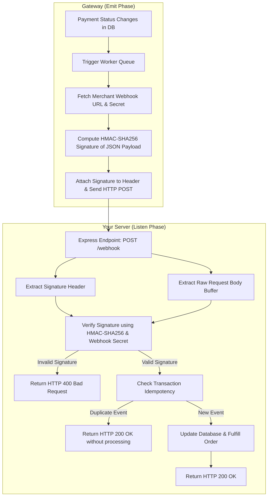
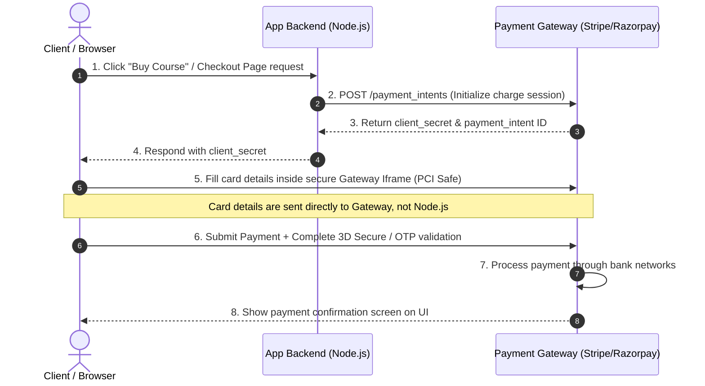
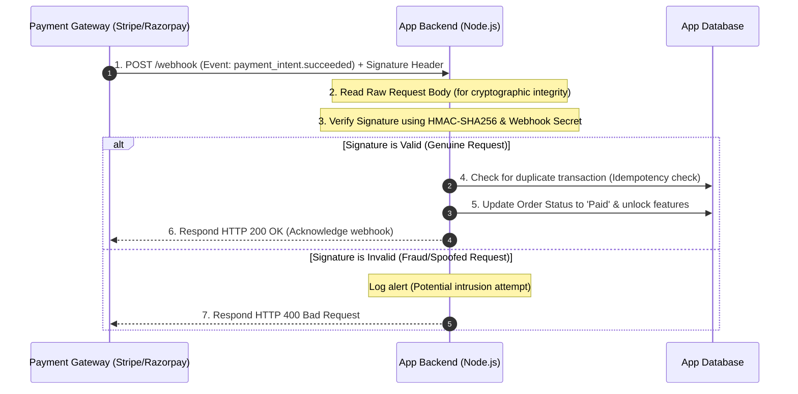

# Payment Gateways (Razorpay and Stripe)

## What is it?
Payment Gateways are third-party services (like Stripe and Razorpay) that authorize and process credit cards, debit cards, bank transfers, and digital wallet payments securely for web applications. Integrating them involves secure backend order setup, client checkout flow coordination, and backend webhook verification.

## Why do we need it?
Handling payment cards directly on your servers requires strict, expensive security compliance regulations known as **PCI-DSS (Payment Card Industry Data Security Standard)**. If card details are leaked, the merchant is held legally liable. Payment gateways solve this by collecting card details directly from the client's browser (via hosted checkouts or secure iframe elements) and exchanging them for non-sensitive transaction tokens, keeping backend servers completely out of PCI scope.

## What is a Webhook?

A **Webhook** is an HTTP callback: an asynchronous HTTP POST request sent by a third-party service (like Stripe or Razorpay) to your server when a specific event occurs. Instead of your server constantly querying (polling) the gateway API to check if a user has completed a payment, the gateway "pushes" the update directly to your server in real-time.

### Webhook vs. Traditional API Polling

| Feature | API Polling (Pull) | Webhook (Push) |
| :--- | :--- | :--- |
| **Initiator** | Your Server (Client calls Gateway) | Gateway Server (Gateway calls your Server) |
| **Communication** | Pull-based (Constant checks) | Push-based (Event-driven) |
| **Resource Usage** | High (Drains network, database connection pools) | Minimal (Only triggers when an event happens) |
| **Latency** | Dependent on polling frequency | Instant / Real-time |
| **Failure Tolerance** | Easy to retry from the client | Requires retry schedules & signature validations |

### Hinglish Explanation of Webhooks:
* **Webhook Kya Hai?**: Webhook ek tarike ka "reverse API" call hai. Normal API call mein aap payment gateway ko request bhejte ho (e.g. "Create Order"). Webhook mein payment gateway aapke backend server ko message bhejta hai jab koi activity hoti hai (e.g. "Payment successful").
* **Polling vs Webhook Comparison**: Socho ki aapne food delivery app se pizza mangwaya. Ek tarika hai ki aap har 2 minute mein restaurant ko phone karke pucho "Kya pizza ban gaya?" (Polling). Dusra tarika hai ki delivery boy direct aapke ghar ki bell baja kar pizza deliver kar de (Webhook). Webhook zyada efficient hai kyunki isme real-time confirmation milti hai bina network bandwidth waste kiye.
* **Payments mein iska use case**: Agar payment confirm hote waqt customer ka tab close ho jaye ya internet chala jaye, toh client-side screen freeze ho sakti hai. Webhook background mein directly payment gateway se hamare server ko report bhejta hai, jisse order fulfillment 100% reliably complete hota hai.

### How Webhooks Emit & Listen

To understand the core communication loop of a Webhook:

#### 1. How the Gateway Emits the Event:
* **Background Workers**: The gateway runs background worker queues. When an event (like `payment_intent.succeeded` or `payment.failed`) resolves inside their internal database, it triggers a publisher worker.
* **Webhook Settings Lookup**: The gateway fetches the registered webhook URL(s) configured in your merchant dashboard (e.g., `https://myapi.com/api/v1/stripe-webhook`).
* **Cryptographic Signature Creation**: The gateway computes an HMAC signature using the raw payload body and a shared Webhook Secret Key. This signature is attached to the request header (e.g., `stripe-signature` or `X-Razorpay-Signature`).
* **HTTP POST**: The gateway issues an HTTP POST request targeting your registered URL, sending the payload as a JSON body.

#### 2. How Our Server Listens to the Event:
* **Public Webhook Endpoint**: Your Express server exposes a specific route using `app.post('/api/v1/stripe-webhook', ...)`.
* **Raw Body Buffer Middleware**: Standard parser parses JSON, changing raw spacing and line breaks. To verify signature hashes, you must use raw middleware (like `express.raw({ type: 'application/json' })`) to preserve the raw HTTP request buffer.
* **Signature Verification**: Your controller reads the signature from headers, reads the raw body buffer, and verifies it with the Gateway SDK using your local Webhook Secret.
* **Acknowledge and Respond**: If signature validation succeeds, the handler fulfills the database order and responds with an HTTP `200 OK` (so that the gateway stops retrying). If validation fails, it responds with an HTTP `400 Bad Request` to notify the gateway of an issue.

#### Webhook Emission & Listening Architecture Flowchart



#### Hinglish Explanation of Emitting & Listening:
* **Gateway Side (Emit)**: Gateway ek **Postman client** ki tarah kaam karta hai. Bank transaction update hote hi gateway ka internal worker thread active ho jata hai, aapke settings page se webhook URL fetch karta hai, payload aur key ka use karke ek digital signature banata hai, aur aapki API par POST request bhej deta hai.
* **Server Side (Listen)**: Hamara Express server ek **receiver** ki tarah kaam karta hai. Hum ek public URL expose karte hain. Jaise hi call aati hai, hum signature cross-check karte hain. Validation check pass hone par order database mein fulfill kar dete hain aur gateway ko `200 OK` reply bhejte hain taaki gateway dobara notification na bheje (duplicate prevent karne ke liye).

## Payment Flow & Webhook Architecture Diagrams

Here are the detailed architecture flows for credit card validation, payment initiation, and asynchronous fulfillment.

### 1. Payment Initialization & Checkout Flow (Synchronous)

This flow illustrates the user checkout initialization up to the point of credit card collection.



### 2. Asynchronous Webhook Fulfillment Flow (Asynchronous Server-to-Server)

Once the gateway successfully collects the payment from the card network, it notifies the backend server asynchronously to fulfill the purchase.



### Hinglish Explanation of the Diagrams:
* **Checkout Flow (Diagram 1)**: Pehle client "Buy" click karta hai. Hamara server gateway se ek unique key (`client_secret`) leta hai aur client ko bhejta hai. Client isi key ko use karke gateway ke secure payment UI (Iframe) mein card inputs fill karta hai. Card details hamare server par nahi aati, isiliye hum PCI compliance rules se safe rehte hain.
* **Webhook Flow (Diagram 2)**: Jab payment pass ho jati hai, tab gateway hume notification bhejta hai. Hamara server checksum/signature verify karta hai taaki koi hacker fake success notification na bhej sake. Signature verify hone par hum database update karke user ko order access de dete hain aur gateway ko `200 OK` return karte hain.

## How does it work?
1. **Order Initialization**: The client requests a purchase. The Node.js backend connects to the payment gateway API to create a session (Stripe `PaymentIntent` or Razorpay `Order`), returning client keys and transaction IDs.
2. **Transaction Execution**: The client browser displays the payment window. The user authorizes the payment (completing 3D Secure verification if necessary) directly on the gateway interface.
3. **Webhook Notifications**: The payment gateway sends an asynchronous HTTP POST request (Webhook) to a designated endpoint on your server to confirm successful payments.
4. **Signature Verification**: To prevent fraud (such as spoofed requests), the Node.js backend must verify the webhook signature using the gateway's public signing keys before updating the database.

## Impact
* **Application Architecture**: Decouples payment execution from order fulfillment. All payment confirmations are managed asynchronously via webhook routing.
* **Performance**: Payment APIs are slow; handling order confirmations via webhooks prevents blocking user request cycles.
* **Security**: Keeps card data off application servers, protecting user details and minimizing liability.
* **Scalability**: Webhook endpoints must be designed to handle concurrent connection spikes (using message queues or idempotency keys).

## Real World Example
In an online training platform, a student purchases a course. The application creates a Stripe `PaymentIntent` and displays the checkout form. Once the student's credit card is charged, Stripe triggers a webhook on the Node.js server. The server verifies the signature, unlocks the course materials for the student, and emails a PDF receipt.

## Syntax
* **Stripe Initializer**:
```javascript
const stripe = require('stripe')(process.env.STRIPE_SECRET_KEY);
```
* **Razorpay Initializer**:
```javascript
const Razorpay = require('razorpay');
const razorpay = new Razorpay({ key_id: 'ID', key_secret: 'SECRET' });
```

## Code Examples

### 1. Stripe Checkout and Webhook Verification
```javascript
// controllers/stripe-controller.js
// Dependencies required: npm install stripe express
const stripe = require('stripe')(process.env.STRIPE_SECRET_KEY);

// Create a PaymentIntent (Client calls this to initialize checkout)
exports.createPaymentIntent = async (req, res, next) => {
  try {
    const { amount, currency = 'usd' } = req.body;

    const paymentIntent = await stripe.paymentIntents.create({
      amount: amount, // Amount in lowest currency denominator (e.g. cents)
      currency,
      metadata: { orderId: 'order_1012' }
    });

    res.json({
      clientSecret: paymentIntent.client_secret
    });
  } catch (err) {
    next(err);
  }
};

// Handle Stripe Webhook (Stripe calls this asynchronously after payment success)
// IMPORTANT: Stripe webhook requires the raw request body to verify the signature
exports.handleStripeWebhook = async (req, res) => {
  const sig = req.headers['stripe-signature'];
  const endpointSecret = process.env.STRIPE_WEBHOOK_SECRET;

  let event;

  try {
    // Verify signature using raw body buffer
    event = stripe.webhooks.constructEvent(req.body, sig, endpointSecret);
  } catch (err) {
    console.error(`[STRIPE WEBHOOK ERROR]: ${err.message}`);
    return res.status(400).send(`Webhook Error: ${err.message}`);
  }

  // Handle successful transactions
  if (event.type === 'payment_intent.succeeded') {
    const paymentIntent = event.data.object;
    console.log(`[PAYMENT SUCCESS]: Order ${paymentIntent.metadata.orderId} paid successfully.`);
    // Fulfill order in database...
  }

  res.json({ received: true });
};
```

### 2. Razorpay Order Setup and Payment Verification
```javascript
// controllers/razorpay-controller.js
// Dependencies required: npm install razorpay crypto
const Razorpay = require('razorpay');
const crypto = require('crypto');

const razorpay = new Razorpay({
  key_id: process.env.RAZORPAY_KEY_ID || 'mock_key',
  key_secret: process.env.RAZORPAY_KEY_SECRET || 'mock_secret'
});

// Create Order (Client calls this before opening payment dialog)
exports.createRazorpayOrder = async (req, res, next) => {
  try {
    const { amount, currency = 'INR' } = req.body;

    const options = {
      amount: amount * 100, // Amount in paise (1 INR = 100 paise)
      currency,
      receipt: 'receipt_order_74001',
      payment_capture: 1 // Capture payment automatically
    };

    const order = await razorpay.orders.create(options);
    res.status(201).json(order);
  } catch (err) {
    next(err);
  }
};

// Verify Payment Signature (Client calls this after payment completion)
exports.verifyRazorpayPayment = (req, res) => {
  const { razorpay_order_id, razorpay_payment_id, razorpay_signature } = req.body;

  const generatedSignature = crypto
    .createHmac('sha256', process.env.RAZORPAY_KEY_SECRET)
    .update(`${razorpay_order_id}|${razorpay_payment_id}`)
    .digest('hex');

  const isSignatureValid = crypto.timingSafeEqual(
    Buffer.from(generatedSignature, 'utf-8'),
    Buffer.from(razorpay_signature, 'utf-8')
  );

  if (isSignatureValid) {
    console.log(`[PAYMENT VERIFIED]: Order ${razorpay_order_id} verified successfully.`);
    // Fulfill order in database...
    res.json({ status: 'success', message: 'Payment verified successfully.' });
  } else {
    res.status(400).json({ status: 'failure', message: 'Invalid payment signature.' });
  }
};
```

## Best Practices
* **Always Verify Webhook Signatures**: Never trust the payload of a webhook directly. An attacker could spoof webhook payloads to fake order payments. Always verify the signature using the gateway's signing secret.
* **Implement Idempotency Keys**: Use unique order identifiers or transaction IDs as idempotency keys. If a gateway triggers a webhook multiple times, verify if the transaction has already been fulfilled to prevent duplicate orders.
* **Keep Webhook Endpoint Configs Raw**: Ensure your webhook endpoints use raw body parsers (like `express.raw({ type: 'application/json' })`) instead of standard JSON body parsers. Express signature verification will fail if the body is parsed beforehand.

## Common Mistakes
* **Fulfilling Orders on Client Confirmation**: Updating order statuses as "Paid" based solely on client-side router events or API redirects. Users can intercept client code or network payloads to spoof payments. Always rely on verified backend webhooks to fulfill orders.
* **Exposing Secret Keys**: Exposing secret keys (like `STRIPE_SECRET_KEY` or `RAZORPAY_KEY_SECRET`) in client-side code. Keep secret keys in environment files and access them only from server environments.

## Interview Questions & Answers

### Q: Why should you never process card details directly on your servers?
**A**: Processing card details directly requires strict compliance with PCI-DSS regulations. If card details are leaked from your servers, the merchant is held legally liable. Using payment gateways allows you to collect card details via secure hosted forms and exchange them for non-sensitive transaction tokens, keeping your servers out of PCI scope.

### Q: Why do we use webhooks instead of client-side updates to confirm payments?
**A**: Client-side redirects can fail (e.g. if the user closes the browser or loses internet connection) and are vulnerable to manipulation. Webhooks are triggered asynchronously server-to-server, ensuring order confirmation occurs even if the client's connection is lost.

### Q: How do you verify the signature of a Stripe webhook in Express?
**A**: Stripe requires the raw request body to verify the signature. You parse the request using `express.raw({ type: 'application/json' })` to preserve the raw body buffer, read the `stripe-signature` header, and verify both using `stripe.webhooks.constructEvent(rawBody, signature, webhookSecret)`.

## Summary
Integrating payment gateways (Stripe and Razorpay) enables secure payment processing. Collecting card details via client tokens, verifying backend webhooks, and checking signatures ensures secure, PCI-compliant checkout architectures.

---
Previous : [45_Email_Services.md](45_Email_Services.md) | Index : [00_index.md](00_index.md) | Next : [45b_Payment_Gateways_real_time_scenerios.md](45b_Payment_Gateways_real_time_scenerios.md)
