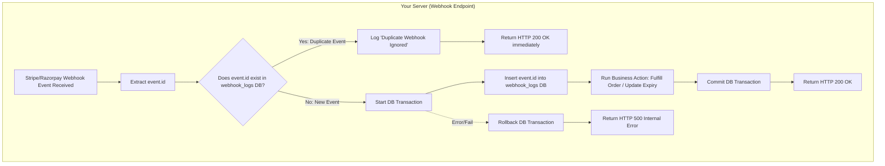

# Payment Gateways: Real-Time Scenarios (Refunds, Subscriptions, Disputes & Expiry)

## What is it?
In production systems, payments are rarely static "one-time success" events. Real-time payment scenarios cover the post-checkout lifecycle of a transaction—including processing refunds, handling recurring subscription renewals/failures, managing customer dispute chargebacks, and releasing inventory when checkouts are abandoned.

## Why do we need it?
A payment process doesn't end when a card is charged. 
* **Refunds**: Customers request returns; you need automated triggers to reverse charges and revoke product access.
* **Subscriptions**: Recurring billing happens on a schedule in the background, requiring server notifications when credit cards expire or payments fail.
* **Disputes (Chargebacks)**: Customers can bypass merchants and declare fraud to their banks. Your server must immediately handle these alerts to lock accounts and initiate dispute resolution.
* **Timeout & Expirations**: Customers abandon carts. If you hold inventory during checkout, you must release it when the payment session expires.

---

## Scenario 1: Refunds & Chargebacks (Disputes)

### 1. Refund Flow
A refund is triggered either by an administrator (via a dashboard) or by a customer request. The backend sends an API request to the gateway, which processes the refund asynchronously. Once confirmed, the gateway notifies the server via webhook to update the database.

```mermaid
sequenceDiagram
    autonumber
    actor Admin as Admin / User
    participant App as App Backend (Node.js)
    participant Gateway as Payment Gateway (Stripe/Razorpay)
    database DB as App Database

    Admin->>App: 1. Request Refund (Admin Panel or Client API)
    App->>Gateway: 2. POST /v1/refunds (Create Refund Request)
    Gateway-->>App: 3. Respond 200 OK (Refund Initiated/Pending)
    Note over Gateway: Gateway contacts banking network to reverse funds
    Gateway->>App: 4. POST /webhook (Event: charge.refunded / refund.processed)
    Note over App: 5. Verify Webhook Signature
    App->>DB: 6. Mark order status as 'Refunded', record refund log
    App->>DB: 7. Revoke user access / subscriptions
    App-->>Gateway: 8. Respond HTTP 200 OK
```

### 2. Dispute / Chargeback Flow
A dispute occurs when a customer reports a transaction as fraudulent to their card issuer. The bank instantly pulls the funds back from the merchant, and the gateway notifies the merchant backend. The server must hold account access until evidence is provided.

```mermaid
sequenceDiagram
    autonumber
    actor User as Customer Bank
    participant Gateway as Payment Gateway (Stripe/Razorpay)
    participant App as App Backend (Node.js)
    database DB as App Database

    User->>Gateway: 1. Customer initiates dispute / chargeback at bank
    Gateway->>App: 2. POST /webhook (Event: charge.dispute.created)
    Note over App: 3. Verify Signature
    App->>DB: 4. Set dispute status, freeze user access/account
    App->>DB: 5. Deduct balance logs (Hold funds)
    App-->>Gateway: 6. Respond HTTP 200 OK
    Note over App, Gateway: Admin submits evidence (logs, receipts) to Gateway
    Gateway->>App: 7. POST /webhook (Event: charge.dispute.closed)
    alt Dispute Won (Merchant Wins)
        App->>DB: 8. Restore user access, release funds hold
    else Dispute Lost (Customer Wins)
        App->>DB: 9. Permanently close account/order, accept loss
    end
    App-->>Gateway: 10. Respond HTTP 200 OK
```

### Hinglish Explanation of Refunds & Disputes:
* **Refund (Paisa Wapas)**: Jab koi user refund maangta hai ya hum khud cancel karte hain, toh hum backend se gateway ko `.refunds.create()` call bhejte hain. Gateway bank ke paas message bhejta hai. Jab bank funds reverse kar deta hai, toh gateway hamare server ko `charge.refunded` webhook bhejta hai. Webhook verify karke hum database mein order status 'Refunded' karte hain aur student ka course access remove kar dete hain.
* **Dispute/Chargeback (Vivada)**: Jab user directly apne bank ko bolta hai ki "Mera card chori hua tha, ye payment maine nahi ki," toh bank gateway se paise wapas le leta hai aur gateway hume `charge.dispute.created` webhook bhejta hai. Is time hum user ka account temporarly freeze kar dete hain taaki fraud use na ho sake. Evidence upload hone ke baad jab dispute close hota hai (`charge.dispute.closed`), tab hum final action lete hain.

---

## Scenario 2: Subscriptions & Recurring Payments

Subscriptions rely on billing cycles managed by the gateway. The server listens to payment state changes (success, failure, retries) to manage product access.

```mermaid
sequenceDiagram
    autonumber
    participant Gateway as Payment Gateway (Stripe/Razorpay)
    participant App as App Backend (Node.js)
    database DB as App Database

    Note over Gateway: Cron triggers monthly subscription renewal
    Gateway->>Gateway: Attempt to charge customer's card
    
    alt Charging Card Succeeds
        Gateway->>App: 1. POST /webhook (Event: invoice.payment_succeeded)
        Note over App: Verify Webhook Signature
        App->>DB: 2. Extend subscription expiry date by 1 month
        App-->>Gateway: 3. Respond HTTP 200 OK
    else Charging Card Fails (e.g. Card Expired)
        Gateway->>App: 4. POST /webhook (Event: invoice.payment_failed)
        Note over App: Verify Webhook Signature
        App->>DB: 5. Set status to 'Past Due', email user warning
        App-->>Gateway: 6. Respond HTTP 200 OK
        Note over Gateway: Gateway retries charge over next 7 days (Smart Retries)
        alt Retry succeeds
            Note over Gateway, App: Standard invoice.payment_succeeded flow triggers
        else Retries exhausted
            Gateway->>App: 7. POST /webhook (Event: customer.subscription.deleted)
            App->>DB: 8. Terminate subscription access in DB
            App-->>Gateway: 9. Respond HTTP 200 OK
        end
    end
```

### Hinglish Explanation of Subscriptions:
* **Recurring Charge Loop**: Har mahine subscription renew karne ke liye gateway user ke card se paise auto-deduct karne ki koshish karta hai.
* **Invoice Success**: Agar paise successfully deduct ho jate hain, toh hume `invoice.payment_succeeded` webhook milta hai aur hum database mein user ki expiry date 30 din aage badha dete hain.
* **Invoice Failure & Retries**: Agar card decline ho jaye, toh gateway hume `invoice.payment_failed` bhejta hai. Hum database mein user status 'Past Due' karte hain aur mail bhejte hain. Gateway next 1-2 week tak automatically card charge karne ki retry karta hai (Smart Retries). Agar sab fail ho jaye, toh hume `customer.subscription.deleted` webhook milta hai, aur hum user ka access block kar dete hain.

---

## Scenario 3: Payment Intent Expiry & Stock Release

When customers click checkouts in e-commerce, items are temporarily reserved. If the checkout is abandoned, the gateway expires the transaction, triggering stock restoration on the server.

```mermaid
sequenceDiagram
    autonumber
    actor User as Customer / Browser
    participant App as App Backend (Node.js)
    database DB as App Database
    participant Gateway as Payment Gateway (Stripe)

    User->>App: 1. Click "Checkout" (Add items to session)
    App->>DB: 2. Hold items in inventory (Stock = Stock - 1)
    App->>Gateway: 3. POST /payment_intents (Expires in 30 minutes)
    Note over User: User closes checkout tab and abandons cart
    Note over Gateway: 30 minutes pass, PaymentIntent expires
    Gateway->>App: 4. POST /webhook (Event: payment_intent.canceled)
    Note over App: Verify Webhook Signature
    App->>DB: 5. Release locked items (Stock = Stock + 1)
    App->>DB: 6. Mark order status as 'Expired/Cancelled'
    App-->>Gateway: 7. Respond HTTP 200 OK
```

### Hinglish Explanation of Expiry Flow:
* **Abandoned Checkouts (Adhoora Payment)**: Jab customer cart checkout open karta hai, toh inventory block ho jati hai taaki koi aur wo unique stock na khareed sake. Lekin agar user payment kare bina window close kar de, toh database locked hi reh jayega. Isiliye, jab Stripe ka payment session expire ho jata hai, tab Stripe `payment_intent.canceled` webhook bhejta hai. Ise sunte hi hamara server inventory wapas release kar deta hai (Stock badha deta hai) taaki dusre users usey khareed sakein.

---

## Scenario 4: Webhook Idempotency (Preventing Duplicate Executions)

Due to network instabilities, the payment gateway might send the exact same webhook notification more than once. If your server processes these duplicates blindly, it can lead to duplicate balances, double-orders, or multiple product extensions. Implementing **Idempotency** ensures that no matter how many times a duplicate webhook event hits your server, it is executed exactly once.

### Idempotency Logic Flowchart



### Hinglish Explanation of Idempotency:
* **Idempotency Kya Hai?**: Idempotency ka matlab hai ki agar ek action 10 baar bhi hit ho, toh database par uska asar sirf 1 hi baar padna chahiye.
* **Duplicate Calls Kyun Aati Hain?**: Jab user payment karta hai, gateway hamare server ko batane ke liye request bhejta hai. Agar hamara server successfully processing karne ke baad return output (response) bhejne mein network error ki wajah se fail ho jaye, toh gateway ko lagta hai call deliver nahi hui. Isiliye, gateway safe rehne ke liye wahi same success report 3-4 baar dobara fire karta hai.
* **Ise Handle Kaise Karte Hain?**: Hum database mein ek custom table banate hain (jaise `processed_webhooks`). Jab bhi koi event aata hai, hum uski unique `event.id` is table mein check karte hain. Agar ID pehle se moujood hai, toh hum query process nahi karte aur chup-chap gateway ko status `200 OK` bhej dete hain taaki gateway shant ho jaye aur user ko double products/credit na mile.

---

## Code Examples

Here is how you handle refunds, subscriptions, and cancellations in a Node.js Express webhook controller.

```javascript
// controllers/payment-scenarios-controller.js
const stripe = require('stripe')(process.env.STRIPE_SECRET_KEY);
const { Order, UserSubscription, InventoryProduct } = require('../db/models');

exports.handlePaymentWebhooks = async (req, res) => {
  const sig = req.headers['stripe-signature'];
  const endpointSecret = process.env.STRIPE_WEBHOOK_SECRET;

  let event;

  try {
    // 1. Verify that the event is authentic
    event = stripe.webhooks.constructEvent(req.body, sig, endpointSecret);
  } catch (err) {
    console.error(`[WEBHOOK ERROR]: Signature verification failed. ${err.message}`);
    return res.status(400).send(`Webhook Error: ${err.message}`);
  }

  // 2. Route event to corresponding business logic
  try {
    switch (event.type) {
      
      // ================= SCENARIO 1: REFUNDS =================
      case 'charge.refunded': {
        const charge = event.data.object;
        const orderId = charge.metadata.orderId;

        // Mark the order as refunded in Database
        await Order.update(
          { status: 'REFUNDED', refundedAmount: charge.amount_refunded / 100 },
          { where: { id: orderId } }
        );

        console.log(`[REFUND SUCCESS]: Order ${orderId} has been refunded.`);
        break;
      }

      // ================= SCENARIO 2: SUB-RENEWAL =================
      case 'invoice.payment_succeeded': {
        const invoice = event.data.object;
        const subscriptionId = invoice.subscription;
        const customerEmail = invoice.customer_email;

        // Extend user subscription date (e.g. read next billing cycle timestamp)
        const nextPaymentAttempt = invoice.lines.data[0].period.end; // Unix timestamp
        
        await UserSubscription.update(
          { 
            status: 'ACTIVE', 
            expiresAt: new Date(nextPaymentAttempt * 1000) 
          },
          { where: { stripeSubscriptionId: subscriptionId } }
        );

        console.log(`[SUBSCRIPTION RENEWED]: Subscription ${subscriptionId} renewed for ${customerEmail}.`);
        break;
      }

      // ================= SCENARIO 2: SUB-FAILURE =================
      case 'invoice.payment_failed': {
        const invoice = event.data.object;
        const subscriptionId = invoice.subscription;

        // Set state to PAST_DUE. Trigger notification mailer from server
        await UserSubscription.update(
          { status: 'PAST_DUE' },
          { where: { stripeSubscriptionId: subscriptionId } }
        );

        console.log(`[SUBSCRIPTION FAILURE]: Renewal failed for subscription ${subscriptionId}. Alert sent.`);
        break;
      }

      // ================= SCENARIO 2: SUB-TERMINATION =================
      case 'customer.subscription.deleted': {
        const subscription = event.data.object;

        // Deactivate features completely
        await UserSubscription.update(
          { status: 'CANCELLED', accessGranted: false },
          { where: { stripeSubscriptionId: subscription.id } }
        );

        console.log(`[SUBSCRIPTION TERMINATED]: Access revoked for subscription ${subscription.id}.`);
        break;
      }

      // ================= SCENARIO 3: DISPUTE STARTED =================
      case 'charge.dispute.created': {
        const dispute = event.data.object;
        const chargeId = dispute.charge;

        // Lock order & account associated with disputed charge
        const order = await Order.findOne({ where: { gatewayChargeId: chargeId } });
        if (order) {
          await Order.update({ status: 'DISPUTED_HOLD' }, { where: { id: order.id } });
          // Optional: Lock user account status
          console.warn(`[CHARGEBACK ALERT]: Dispute created for charge ${chargeId}. Order held.`);
        }
        break;
      }

      // ================= SCENARIO 4: EXPIRY / CANCEL =================
      case 'payment_intent.canceled': {
        const paymentIntent = event.data.object;
        const orderId = paymentIntent.metadata.orderId;

        // Release stock reserved for this checkout
        const order = await Order.findByPk(orderId, { include: ['items'] });
        if (order && order.status === 'PENDING') {
          for (const item of order.items) {
            await InventoryProduct.increment(
              { quantity: item.quantity },
              { where: { id: item.productId } }
            );
          }
          await Order.update({ status: 'EXPIRED' }, { where: { id: orderId } });
          console.log(`[INVENTORY RELEASED]: PaymentIntent expired. Stock restored for Order ${orderId}.`);
        }
        break;
      }

      default:
        console.log(`[UNHANDLED EVENT]: Received event type: ${event.type}`);
    }

    // Acknowledge event received
    res.json({ received: true });

  } catch (dbError) {
    console.error(`[DATABASE ERROR IN WEBHOOK]: ${dbError.message}`);
    // Respond 500 so Stripe retries the delivery of the event
    res.status(500).json({ error: 'Database transaction processing failed' });
  }
};
```

---

## Best Practices
* **Idempotency Checks**: Webhooks can be delivered more than once (network retry anomalies). Always log processed webhook event IDs (`event.id`) to a database table. Before handling any event, check if `event.id` is already logged to prevent running duplicate logics.
* **Respond with 200 Fast**: Don't run long-running tasks (like PDF generating or heavy video processing) inside the webhook request thread. Acknowledge the receipt with a fast HTTP `200 OK` first, then hand the task off to a message queue or background job worker (like BullMQ).
* **Return 5xx on DB Failures**: If your database is temporarily down, return a `500 Internal Server Error` response. This signals the gateway to retry sending the event later, preventing data loss.
* **Keep Logs of Event Payloads**: Save all incoming raw webhook JSONs in logging tables (or logging buckets). This is crucial for forensic auditing if a customer claims they paid but didn't receive their subscription.

---

## Common Mistakes
* **Updating Expirations by Static Intervals**: Extending subscription records by a hardcoded `+30 days` on renewals. If the payment was delayed by 3 days, adding 30 days causes billing drifts. Always use the next renewal timestamp (`invoice.lines.data[0].period.end`) returned directly by the payment gateway.
* **Failing to Release Inventory Locks**: Holding inventory tickets for checkout sessions permanently. If checkout is cancelled or times out, you block genuine buyers. Always listen for expiry webhooks (`payment_intent.canceled` or equivalent) to restock.

---

## Interview Questions & Answers

### Q: How do you handle webhook failures, and what happens if your server goes down during a payment event?
**A**: Payment gateways have built-in retry mechanisms (usually exponential backoff retries over 24-72 hours). If our server is down, it returns a 5xx error or times out, triggering the gateway to queue the event for a retry. Once the server recovers, it receives the queued events. Additionally, you can manually trigger webhooks sync via the Gateway CLI or Dashboard for missing events.

### Q: Why is raw body parsing mandatory for verifying webhook signatures?
**A**: Cryptographic signature validation uses HMAC hashing algorithms. The signature is calculated by passing the exact raw HTTP request body string. Standard express body parsers (`express.json()`) parse raw text into JS objects, which normalizes white spaces, changes keys indentation, and removes invisible characters. Verifying the signature against parsed JSON objects will mismatch the hash, triggering verification failures.

### Q: What is an idempotency issue in webhooks and how do you resolve it?
**A**: An idempotency issue occurs when a payment gateway sends the same payment notification multiple times, causing duplicate actions (e.g. extending a subscription twice or restocking inventory multiple times). It is resolved by maintaining an `event_logs` table. When a webhook arrives, we verify if `event.id` exists in the table. If yes, we skip execution and immediately return `200 OK`. If no, we log the ID and execute the business actions.

---

## Summary
Handling real-time payment scenarios ensures your database stays in sync with financial updates. Setting up listeners for refunds, recurring billing cycles, chargebacks, and checkout timeouts allows backend systems to remain secure and automated.

---
Previous : [45a_Payment_Gateways_Razorpay_and_Stripe.md](45a_Payment_Gateways_Razorpay_and_Stripe.md) | Index : [00_index.md](00_index.md) | Next : [46_Event_Loop_Deep_Dive.md](46_Event_Loop_Deep_Dive.md)
