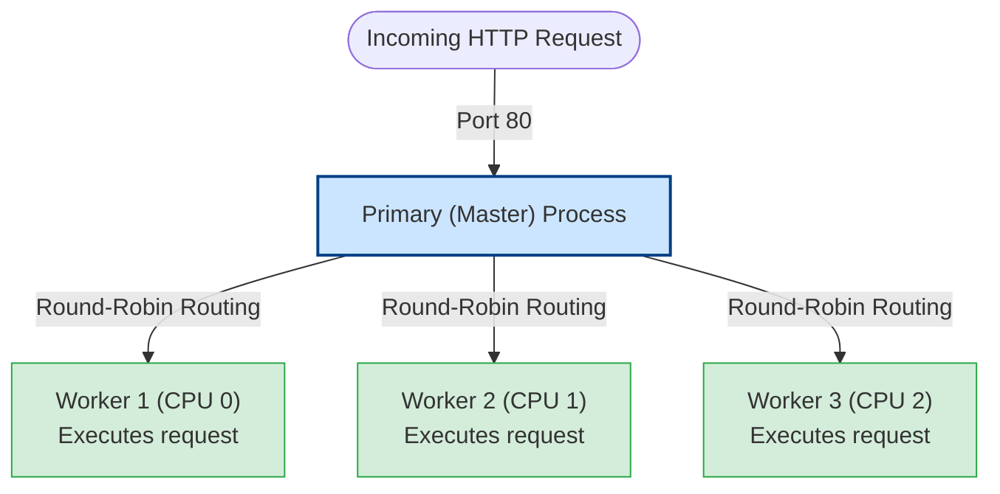

# Cluster Module

By default, Node.js runs on a single CPU core. If you deploy a Node.js server to an 8-core cloud machine without clustering, 7 cores will sit idle while the single active core struggles under heavy traffic. The `cluster` module allows you to spawn multiple worker processes that share the same network port, utilizing all available CPU capacity to maximize request throughput.

### Master and Worker Process Architecture
The cluster module works by spawning multiple copies of your application process:
* **Primary (Master) Process**: The orchestrator. It does not handle client requests or execute business logic. Its role is to listen to the network port, spawn worker processes, distribute incoming connections, and monitor worker lifecycles.
* **Worker Process**: The execution node. Each worker runs in its own isolated OS process, running its own V8 engine and event loop. Workers receive client connections from the primary process and process requests.

### Connection Routing Strategies
How does the primary process distribute incoming TCP connections to workers?
1. **Round-Robin (Default on POSIX/Linux)**: The primary process accepts the TCP connection on the main port, and then passes the client socket handle to an idle worker in a round-robin sequence. This ensures an even distribution of traffic across all workers.
2. **Shared Socket (Default on Windows)**: The primary process creates the listening socket and passes the raw socket handle to all workers. The workers compete to accept incoming connections directly at the OS kernel level. This can lead to uneven load distribution.

## Deep Dive

### Process Crash Recovery and Zero Downtime
If a worker encounters an uncaught exception, the process will crash. The primary process is notified of this death through the `'exit'` event.
* **Crash Recovery**: You can configure the primary process to listen for the `'exit'` event, log the crash details, and immediately call `cluster.fork()` to spawn a new worker, keeping the cluster capacity stable.

## Visual Explanation

### Master-Worker Cluster Architecture


## Real-World Example
Consider an API endpoint that processes payments. If a payment request encounters a bug that crashes the process, a single-instance server will go offline for all users. In a clustered setup, only the single worker handling that request crashes. The primary process catches the crash, forks a new worker instantly, and the other active workers continue serving other users without interruption.

## Code Examples

### Cluster Initialization, Worker Spawning, and Crash Recovery

```javascript
// cluster-server.js
const cluster = require('cluster');
const http = require('http');
const os = require('os');

// 1. Primary Process Initialization Block
if (cluster.isPrimary) {
  const numCPUs = os.cpus().length;
  console.log(`[PRIMARY] Primary process ${process.pid} is running.`);
  console.log(`[PRIMARY] Spawning ${numCPUs} workers across CPU cores...`);

  // Spawn one worker process per CPU core
  for (let i = 0; i < numCPUs; i++) {
    cluster.fork();
  }

  // Monitor worker online status
  cluster.on('online', (worker) => {
    console.log(`[PRIMARY] Worker ${worker.process.pid} is online.`);
  });

  // Crash Recovery: Listen for worker exit events
  cluster.on('exit', (worker, code, signal) => {
    console.warn(`[PRIMARY] Worker ${worker.process.pid} died. Code: ${code} | Signal: ${signal}`);
    console.log('[PRIMARY] Spawning a replacement worker process...');
    
    // Fork a new worker to replace the dead one, maintaining capacity
    cluster.fork();
  });
}

// 2. Worker Process execution block (Run by all spawned workers)
else {
  console.log(`[WORKER] Worker process ${process.pid} initialized.`);

  // Create HTTP server. All workers share the same port (3000)
  http.createServer((req, res) => {
    // Simulate a crash scenario (Operational safety test)
    if (req.url === '/crash') {
      console.error(`[WORKER] Worker ${process.pid} encountered a critical crash request!`);
      // Force exit the process to trigger primary's recovery
      process.exit(1); 
    }

    res.writeHead(200, { 'Content-Type': 'application/json' });
    res.end(JSON.stringify({
      message: 'Request processed',
      workerPid: process.pid
    }));
  }).listen(3000);

  console.log(`[WORKER] Worker ${process.pid} listening on port 3000.`);
}
```

## Best Practices
* **Match Workers to Core Counts**: Spawn exactly one worker process per physical CPU core (`os.cpus().length`) to avoid CPU context-switching overhead.
* **Keep Workers Stateless**: Do not store session state or cache data in memory inside workers. Use shared databases or Redis caches so any worker can process any request.
* **Use Process Managers in Production**: Instead of writing custom clustering code, use mature process managers like **PM2** in production. PM2 handles clustering, log aggregation, and zero-downtime hot-reloads automatically.

## Interview Questions

**Q:** What is the purpose of the `cluster` module in Node.js?

> **Answer:**
> The `cluster` module is used to scale Node.js applications horizontally across multi-core systems by spawning multiple copy worker processes that share the same network port.

**Q:** How can multiple worker processes listen on the same port without causing a port collision error?

> **Answer:**
> The worker processes do not call the OS kernel to bind to the port directly. When a worker calls `server.listen()`, the cluster module intercepts the call. The primary process binds to the port, accepts incoming connections, and distributes them to the workers over internal IPC channels, preventing port collisions.

**Q:** Explain the difference between Round-Robin and Shared Socket connection routing strategies in the `cluster` module. Which one is default on Linux?

> **Answer:**
> 

**Q:** Round-Robin

> **Answer:**
> 

**Q:** Shared Socket

> **Answer:**
> 

**Q:** How would you execute a zero-downtime application reload in a clustered Node.js environment when deploying code updates to production?

> **Answer:**
> To perform a zero-downtime reload (often called a rolling reload):
> 1. Retrieve the list of active worker processes from the primary process.
> 2. Iterate through the workers one-by-one, reloading them sequentially:
> - Send a custom IPC message to Worker 1 instructing it to shut down.
> - Worker 1 calls `server.close()` to stop accepting new requests, drains active requests, and then exits.
> - The primary process catches Worker 1's exit, forks a new worker (running the updated code), and waits for it to become online and ready.
> - Once the new worker is online, repeat the process for Worker 2, and so on.
> This sequential rolling upgrade ensures that there are always active workers online to handle traffic, enabling zero-downtime deployments.

---
Previous : [48_Worker_Threads.md](48_Worker_Threads.md) | Index : [00_index.md](00_index.md) | Next : [50_Child_Processes.md](50_Child_Processes.md)
