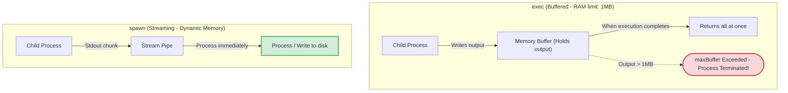

# Child Processes

Node.js is great for I/O operations but is not designed for running external system binaries, executing shell scripts, or processing heavy calculations. The `child_process` module allows your application to execute system commands (like running python scripts, invoking image converters, or executing shell scripts) safely in a background process without blocking the event loop.

### The Four Child Process Methods
Node.js provides four ways to create child processes, each optimized for different use cases:

| Method | Spawns Shell? | Output Delivery | Use Case |
| :--- | :--- | :--- | :--- |
| **`exec`** | Yes | Buffers entire output | Running simple, quick shell commands where you need the complete output. |
| **`execFile`** | No | Buffers entire output | Executing a binary file directly without shell overhead (safer and faster than `exec`). |
| **`spawn`** | No | Streams stdout/stderr | Running long-running processes or commands that generate large outputs (like video rendering). |
| **`fork`** | No | Inter-Process Communication (IPC) | Spawning new Node.js instances to run background tasks with a built-in messaging channel. |

### Buffer Overflow Risk in `exec`
The `exec` and `execFile` methods buffer the command's complete stdout and stderr in memory. By default, this buffer is limited to **1MB**. If the child process generates more than 1MB of output, the method fails and terminates the child process with a `maxBuffer exceeded` error, which can crash your application. For large or unknown output volumes, always use **`spawn`** to stream the output.

## Deep Dive

### Inter-Process Communication (IPC) with `fork`
The `fork` method is a special case of `spawn` designed to run Node.js scripts in separate processes.
* When you call `fork('worker.js')`, Node spawns a new Node.js process and establishes a private IPC (Inter-Process Communication) channel between the parent and child.
* The parent and child can send messages back and forth using `child.send(message)` and `process.on('message', callback)`, allowing you to coordinate background tasks easily.

## Visual Explanation

### Child Processes: Exec vs. Spawn


## Real-World Example
Consider an application that generates reports using an external Python CLI. If you use `exec('python generate_report.py')`, the Python process runs in a shell. An attacker can append shell operators (like `; rm -rf /`) to the inputs to run malicious commands (Command Injection). Using `execFile` or `spawn` runs the Python binary directly and passes inputs as an array of arguments, securing the query.

## Code Examples

### Spawn Streaming, Exec Buffer Limits, and Fork IPC

```javascript
// child-process-demo.js
const { exec, spawn, fork } = require('child_process');
const path = require('path');

// 1. exec: Running simple shell commands (Buffered)
// Exposes command output after execution completes
exec('echo "Hello from executive shell!" && node -v', (err, stdout, stderr) => {
  if (err) {
    console.error('exec error:', err.message);
    return;
  }
  console.log('--- EXEC OUTPUT ---');
  console.log(stdout.trim());
});

// 2. spawn: Streaming output for high-output commands
// Processes data chunk-by-chunk as the process runs
const runSpawnDemo = () => {
  // Spawns 'ping' command (sends 3 packets)
  // Arguments are passed as an array to prevent command injection
  const ping = spawn('ping', ['-n', '3', '127.0.0.1']);

  ping.stdout.on('data', (data) => {
    console.log(`[SPAWN STDOUT]: ${data.toString().trim()}`);
  });

  ping.stderr.on('data', (data) => {
    console.error(`[SPAWN STDERR]: ${data.toString()}`);
  });

  ping.on('close', (code) => {
    console.log(`Spawn process exited with code: ${code}`);
  });
};
runSpawnDemo();

// 3. fork: Multi-process coordination with IPC
// Create a dummy worker file for demonstration
const fs = require('fs');
const workerCode = `
  process.on('message', (msg) => {
    console.log('[CHILD] Message received from parent:', msg);
    // Send response back
    process.send({ status: 'success', data: msg.val * 2 });
  });
`;
fs.writeFileSync('temp-worker.js', workerCode);

const runForkDemo = () => {
  const child = fork(path.join(__dirname, 'temp-worker.js'));

  child.on('message', (message) => {
    console.log('[PARENT] Message received from child:', message);
    
    // Clean up temporary file
    child.kill(); // Terminate child process
    fs.unlinkSync('temp-worker.js');
  });

  // Send message to child process over IPC channel
  child.send({ val: 21 });
};
setTimeout(runForkDemo, 1000); // Run after files write
```

## Best Practices
* **Avoid `exec` for User Inputs**: Do not pass user inputs directly to `exec` to prevent **Command Injection** attacks. Use `execFile` or `spawn` instead, passing parameters inside the arguments array.
* **Use `spawn` for Big Outputs**: Always use `spawn` to run commands that generate large outputs to prevent `maxBuffer exceeded` crashes.
* **Handle Process Failures**: Always listen for `error` and `close` events on child processes to clean up resources and handle failures gracefully.

## Interview Questions

**Q:** What are the four main methods in the `child_process` module?

> **Answer:**
> The four main methods are `exec` (runs a command in a shell and buffers output), `execFile` (runs an executable directly and buffers output), `spawn` (spawns a process asynchronously and streams output), and `fork` (spawns a Node.js instance with a built-in IPC channel).

**Q:** Why can using `exec` cause application crashes when running commands that return large outputs? How do you resolve it?

> **Answer:**
> `exec` buffers the command's entire output in memory. By default, this buffer is limited to 1MB. If the output exceeds this limit, the process is terminated with a `maxBuffer exceeded` error, which can crash the application. You resolve this by using the `spawn` method, which streams the output in chunks, keeping memory usage low.

**Q:** What is Command Injection, and how do `spawn` or `execFile` defend against it compared to `exec`?

> **Answer:**
> Command Injection occurs when an attacker appends shell command characters (like `;`, `&&`, or `|`) to user inputs, forcing the shell to execute malicious commands.
> `exec` runs commands inside a shell, which parses these characters and executes the injected code. `spawn` and `execFile` do not spawn a shell; they execute the binary directly and pass all parameters as elements of an arguments array. The OS treats these parameters strictly as literal strings, preventing command injection.

**Q:** How would you architecture a high-performance image-processing microservice in Node.js that executes CPU-intensive CLI commands (like FFmpeg or ImageMagick) under heavy concurrent load?

> **Answer:**
> To build a secure, high-performance image processing service:
> 1. **Use Spawn**: Use `spawn` to stream file data directly to the CLI command's standard input (`stdin`) and read the processed output from standard output (`stdout`), avoiding writing temporary files to disk.
> 2. **Implement Pool Throttling**: Spawning OS processes is resource-intensive. Limit the number of concurrent child processes (using a semaphore or queue system) to prevent process creation from exhausting system CPU and RAM.
> 3. **Validate Inputs**: Sanitize all parameters, file paths, and metadata variables passed to the command arguments to prevent injection attacks.
> 4. **Manage Timeouts**: Configure execution timeout limits on child processes. If a command runs longer than a safe threshold (e.g. 30 seconds), terminate the child process using `child.kill('SIGKILL')` to free up system resources.

---
Previous : [49_Cluster_Module.md](49_Cluster_Module.md) | Index : [00_index.md](00_index.md) | Next : [51_Memory_Management.md](51_Memory_Management.md)
