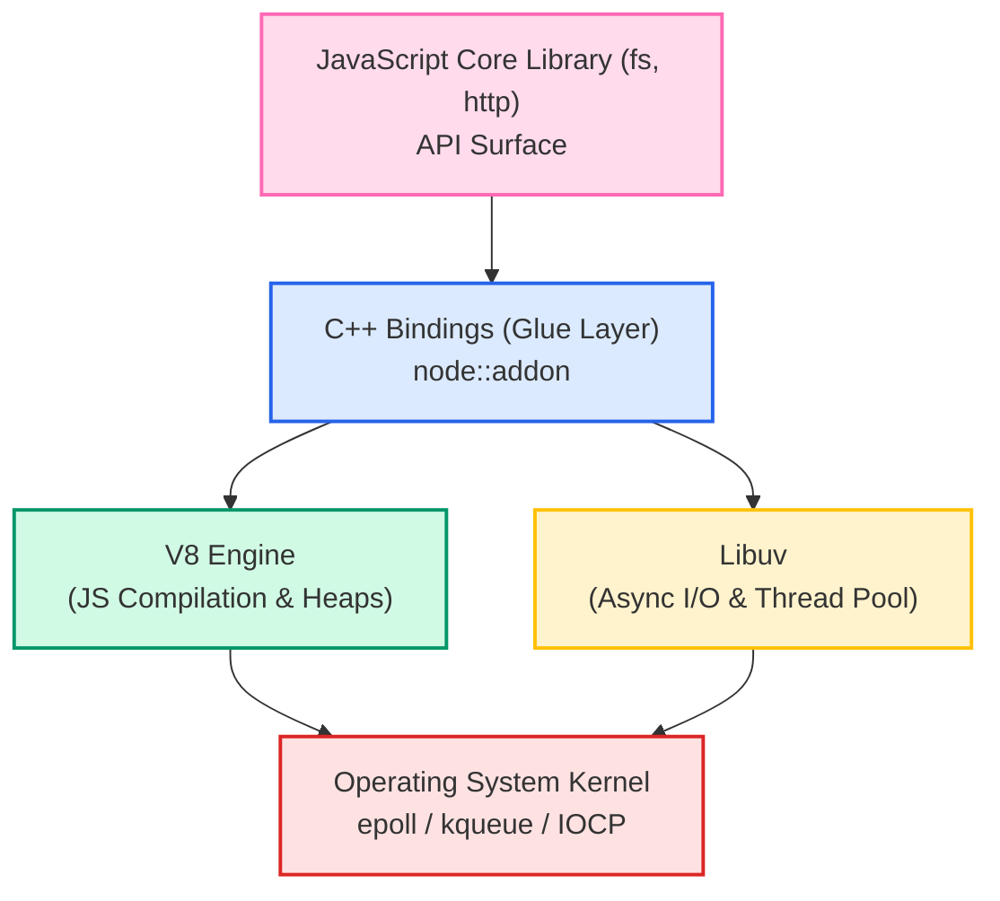
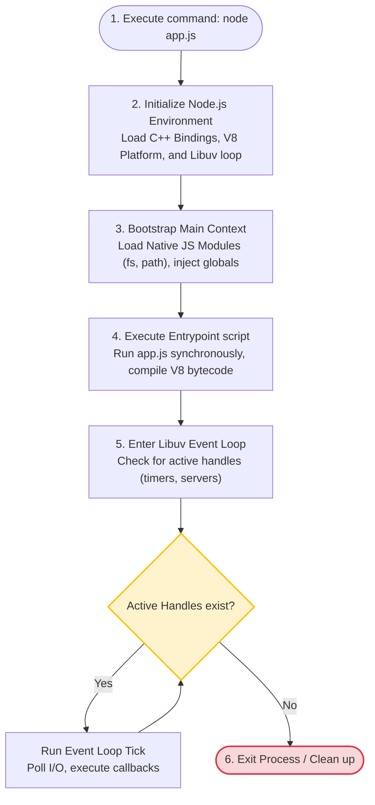

# Node.js Internals

To master backend engineering, you must understand the internal architecture of your runtime environment. Knowing how JavaScript code maps to C++ bindings, how Libuv interacts with the operating system kernel, and how to configure the Libuv thread pool allows you to build highly optimized applications and debug low-level systems failures.

### The Architectural Layers of Node.js
Node.js compiles and runs JavaScript code on the server by layering multiple technologies:



1. **JavaScript Core Library**: The public APIs (like `fs` or `http`) that developers call in their JavaScript code.
2. **C++ Bindings (Glue Layer)**: The bridge that translates JavaScript types, arguments, and callbacks into native C++ calls that can communicate with Libuv and the V8 engine.
3. **V8 Engine**: Google's compiler engine that parses, interprets, and compiles JavaScript code into machine instructions.
4. **Libuv**: A multi-platform support library written in C. It manages the event loop, thread pool execution, and abstracts platform-specific asynchronous I/O APIs.
5. **Operating System**: The underlying kernel that executes hardware instructions.

## Deep Dive

### C++ Bindings under the hood
When you call a native JavaScript method like `fs.open()`, V8 maps it to a corresponding C++ binding function. V8 uses specific types to share memory and parameters between the two execution environments:
* **`v8::Local<v8::Value>`**: A handle to a JavaScript value managed by V8's garbage collector.
* **`v8::FunctionCallbackInfo`**: An object containing the arguments and context passed from the JavaScript call to the C++ function.

### Libuv Thread Pool Sizing
While the operating system kernel handles network I/O asynchronously (using `epoll` on Linux or `kqueue` on macOS), other operations (like filesystem access, DNS lookups, and cryptography) do not have native asynchronous OS APIs. Libuv processes these tasks by queuing them to an internal **Thread Pool**.
* **Default Pool Size**: The default thread pool size is **4 threads**.
* **The Bottleneck**: If your application performs many heavy disk operations or cryptographic calculations concurrently, all 4 threads will be blocked, causing subsequent filesystem or crypto operations to wait in the queue.
* **The Optimization**: You can increase the thread pool size up to **1024 threads** by setting the `UV_THREADPOOL_SIZE` environment variable before the application starts.

## Visual Explanation

### Application Bootstrap Lifecycle


## Real-World Example
Consider an application that encrypts user files. Under load testing, file encryption throughput slows down when handling more than 4 concurrent operations. This occurs because the default Libuv thread pool size is 4. By setting the environment variable `UV_THREADPOOL_SIZE=16` before starting the application, the system can encrypt 16 files concurrently, improving performance.

## Code Examples

### Tuning the Libuv Thread Pool

```javascript
// threadpool-test.js
// Run this script with:
// Windows: set UV_THREADPOOL_SIZE=4 && node threadpool-test.js
// POSIX: UV_THREADPOOL_SIZE=4 node threadpool-test.js
// Observe how changing the pool size affects total execution time.

const crypto = require('crypto');

const ITERATIONS = 8;
const start = Date.now();

// Track active threads
let completed = 0;

console.log(`Testing cryptography concurrency with default or configured UV_THREADPOOL_SIZE.`);
console.log(`Main process ID: ${process.pid}`);

for (let i = 0; i < ITERATIONS; i++) {
  // pbkdf2 is a CPU-intensive hashing function offloaded to the Libuv thread pool
  crypto.pbkdf2('password', 'salt', 100000, 64, 'sha512', (err, key) => {
    if (err) throw err;
    
    completed++;
    const duration = Date.now() - start;
    console.log(`Task ${completed} completed in ${duration}ms`);
    
    if (completed === ITERATIONS) {
      console.log(`\nAll tasks finished in: ${Date.now() - start}ms`);
    }
  });
}
```

## Best Practices
* **Tune `UV_THREADPOOL_SIZE`**: Set the `UV_THREADPOOL_SIZE` environment variable dynamically on startup based on your application workload, especially for applications that handle high volumes of filesystem I/O, cryptography, or DNS lookups.
* **Set Environment Variables Early**: The `UV_THREADPOOL_SIZE` environment variable must be set *before* the Node.js runtime initializes. Setting it inside your JavaScript code (e.g. `process.env.UV_THREADPOOL_SIZE = 8`) has no effect.
* **Keep Native Modules Simple**: When writing custom C++ Addons (using N-API), keep the bridge layer simple and offload heavy calculations to Libuv worker threads to avoid blocking the JavaScript main thread.

## Interview Questions

**Q:** What is Libuv, and what is its role in Node.js?

> **Answer:**
> Libuv is a multi-platform support library written in C. It manages the Event Loop, handles the internal worker thread pool, and abstracts platform-specific asynchronous I/O operations, allowing Node.js to run non-blocking code.

**Q:** Why does setting `process.env.UV_THREADPOOL_SIZE = 8` inside your JavaScript code fail to change the thread pool size?

> **Answer:**
> The Libuv thread pool is initialized and allocated during the Node.js runtime bootstrap phase *before* the JavaScript engine compiles and runs your code. Therefore, modifications made to `process.env` inside your JavaScript script occur too late to affect the thread pool allocation. The variable must be set at the system terminal level before executing the `node` command.

**Q:** Walk through the internal layers when `fs.readFile` is executed, starting from the JavaScript call to the OS kernel read.

> **Answer:**
> When `fs.readFile` runs:
> 1. The **JavaScript Core** library validates arguments and calls the corresponding internal binding method.
> 2. The **C++ Binding layer** translates the JavaScript parameters (like path and encoding) into native C++ types using V8 engine namespaces.
> 3. The binding function calls the **Libuv I/O queue**.
> 4. Libuv allocates a task and pushes it to an idle thread in the **Libuv Thread Pool**.
> 5. The assigned worker thread invokes the **Operating System Kernel** system read call, blocking until the data is returned.
> 6. Once the OS returns the data, the Libuv thread writes the result to a buffer and notifies the event loop.
> 7. During the Poll phase of the event loop, V8 restores the execution context and runs the registered JavaScript callback function with the data.

**Q:** How would you debug a thread pool starvation issue in production where DNS resolution calls (`dns.lookup`) are timing out? What are the root causes, and how do you resolve them?

> **Answer:**
> 

**Q:** Root Cause

> **Answer:**
> 

**Q:** Debugging

> **Answer:**
> 

**Q:** Resolution

> **Answer:**
> 1. Increase the thread pool size by setting `UV_THREADPOOL_SIZE` (e.g. to 16 or 64) before starting the process.
> 2. Avoid using `dns.lookup`. Use `dns.resolve` instead, which performs DNS resolution asynchronously using network sockets, bypassing the Libuv thread pool entirely.
> 3. Offload heavy cryptographic tasks to **Worker Threads** to keep the Libuv thread pool free for I/O operations.

---
Previous : [53_Performance_Optimization.md](53_Performance_Optimization.md) | Index : [00_index.md](00_index.md) | Next : [55_Security_Fundamentals.md](55_Security_Fundamentals.md)
