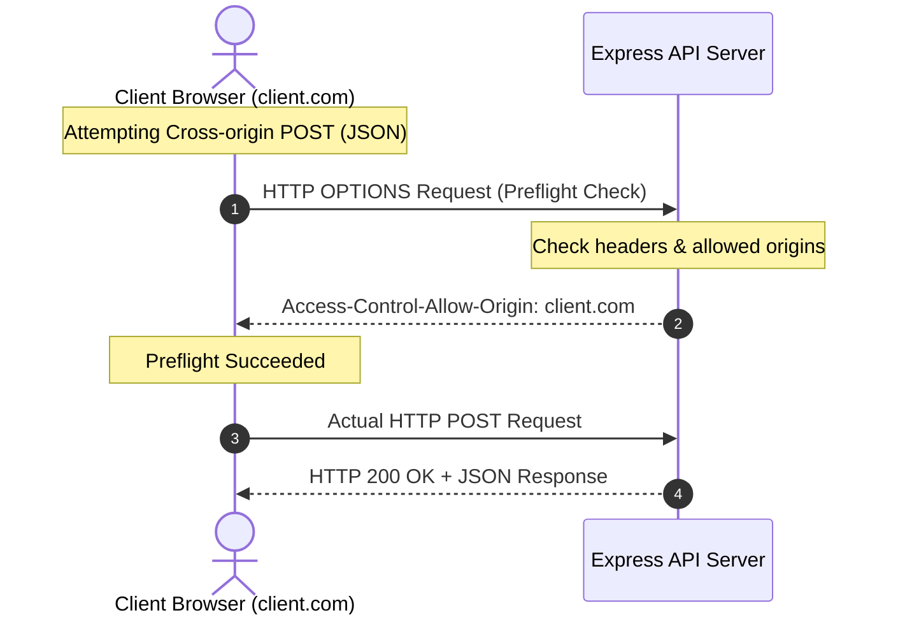

# CORS

CORS is one of the most common sources of configuration issues in web development. If not configured correctly, browsers will block your frontend from making API requests, throwing errors in the console. However, setting CORS too permissively (like allowing wildcard origins `*` in production) exposes your APIs to unauthorized cross-origin requests.

### Same-Origin Policy (SOP)
The **Same-Origin Policy** is a fundamental browser security mechanism. It restricts a website script loaded from one origin (combination of protocol, domain, and port) from reading data from another origin. For example, JavaScript on `evil-site.com` cannot read cookie-authenticated data from `your-bank.com` dynamically.

### What is CORS?
**CORS (Cross-Origin Resource Sharing)** is a protocol that uses HTTP response headers to bypass Same-Origin Policy constraints safely. It tells the browser that your API server trusts specific external origins and permits them to fetch resources.

Key CORS Headers:
* **`Access-Control-Allow-Origin`**: Specifies which external domains are allowed to access the API resources.
* **`Access-Control-Allow-Methods`**: Specifies which HTTP verbs (GET, POST, PUT, DELETE) are permitted for cross-origin requests.
* **`Access-Control-Allow-Headers`**: Specifies which custom headers (like `Authorization` or `Content-Type`) can be sent in requests.

## Deep Dive

### Preflight Requests (OPTIONS)
Browsers split cross-origin requests into two categories:
1. **Simple Requests**: Safe HTTP verbs (GET, POST, HEAD) using standard headers. The browser sends the request immediately and verifies the CORS response headers.
2. **Preflight Requests**: Requests that modify data (like PUT or DELETE) or send custom headers (like `Authorization` or JSON payloads). Before sending the actual request, the browser sends an automatic **`OPTIONS`** request (the "preflight" check). The server must return the allowed origins and headers. If the preflight passes, the browser sends the actual request.

### Credentials Wildcard Constraint
If your API requires authenticated cookies or authorization headers to be transmitted across origins, you must set **`Access-Control-Allow-Credentials: true`**.
* **The Security Rule**: When credentials are enabled, the browser **forbids** using the wildcard origin `Access-Control-Allow-Origin: *`. The server must explicitly return the matching client origin in the header, keeping the authentication secure.

## Visual Explanation

### CORS Preflight Request Flow


## Real-World Example
Consider a frontend application hosted on `https://my-app.com` and its backend API on `https://api.my-app.com`. Because the subdomains differ, they have different origins. To allow the frontend to request data and send session cookies, the backend must enable CORS, set `Origin` to `https://my-app.com`, and enable `credentials: true`.

## Code Examples

### Integrating and Configuring CORS in Express

```javascript
// cors-server.js
// Dependency required: npm install express cors
const express = require('express');
const cors = require('cors');
const AppError = require('./utils/AppError');

const app = express();
app.use(express.json());

// 1. Define permitted origins (Production whitelist)
const allowedOrigins = ['https://my-frontend-app.com', 'http://localhost:3000'];

// 2. Configure CORS middleware options
const corsOptions = {
  origin: (origin, callback) => {
    // Allow requests with no origin (like mobile apps or curl requests)
    if (!origin) return callback(null, true);
    
    if (allowedOrigins.includes(origin)) {
      callback(null, true); // Permitted
    } else {
      // Reject unauthorized origins (fails preflight check)
      callback(new AppError('CORS Policy: Access denied from this origin.', 403));
    }
  },
  methods: ['GET', 'POST', 'PUT', 'DELETE', 'OPTIONS'],
  allowedHeaders: ['Content-Type', 'Authorization', 'X-Requested-With'],
  credentials: true, // Allow cookies to be sent across origins
  optionsSuccessStatus: 200 // Return 200 OK for OPTIONS preflight checks
};

// 3. Apply CORS middleware globally
app.use(cors(corsOptions));

app.get('/api/data', (req, res) => {
  res.json({ message: 'Cross-Origin Data parsed successfully.' });
});

// Error handling middleware
app.use((err, req, res, next) => {
  res.status(err.statusCode || 500).json({ error: err.message });
});

app.listen(3000, () => console.log('CORS server running on port 3000'));
```

## Best Practices
* **Avoid Wildcard Origins in Production**: Never use `origin: '*'` in production, especially for APIs that handle sensitive user data or write operations. Configure a strict origin whitelist instead.
* **Enable Credentials Securely**: When enabling `credentials: true`, ensure the origin parameter is a dynamically matched whitelist, never a wildcard.
* **Cache Preflight Options**: Set the `maxAge` option in CORS (e.g. `maxAge: 86400` - 24 hours) to instruct browsers to cache preflight OPTIONS responses, reducing network traffic and latency.

## Interview Questions

**Q:** What is the Same-Origin Policy (SOP) in web browsers?

> **Answer:**
> The Same-Origin Policy is a browser security mechanism that restricts scripts loaded from one origin (protocol, domain, and port) from reading or interacting with data fetched from another origin, protecting users from malicious data access.

**Q:** What is a CORS preflight request, and what HTTP method does it use?

> **Answer:**
> A preflight request is a safety check sent automatically by browsers before executing non-simple cross-origin requests (like PUT, DELETE, or requests with custom headers). It uses the **`OPTIONS`** HTTP method to verify if the server permits the origin, methods, and headers before sending the actual request.

**Q:** Why does the browser throw a CORS error if a server responds with `Access-Control-Allow-Origin: *` when `Access-Control-Allow-Credentials` is set to `true`?

> **Answer:**
> Enabling `Access-Control-Allow-Credentials: true` allows cross-origin requests to transmit sensitive data like cookies and session tokens. If the browser permitted the wildcard origin (`*`) alongside credentials, any malicious site could execute authenticated requests to read the user's private data. To prevent this security hole, browsers block the request unless the server specifies the client's origin explicitly.

**Q:** How would you debug a persistent CORS failure where preflight OPTIONS requests are failing with a 502 Bad Gateway error on a production API deployed behind an Nginx reverse proxy?

> **Answer:**
> 

**Q:** Root Cause Analysis

> **Answer:**
> 

**Q:** Debugging steps

> **Answer:**
> 1. Inspect Nginx access and error logs to identify the status code and headers returned.
> 2. Check the Nginx configuration file (`nginx.conf`). Ensure that Nginx is configured to permit the `OPTIONS` method and pass it to the backend upstream:
> ```nginx
> if ($request_method = 'OPTIONS') {
> add_header 'Access-Control-Allow-Origin' 'https://my-app.com';
> add_header 'Access-Control-Allow-Methods' 'GET, POST, OPTIONS, PUT, DELETE';
> add_header 'Access-Control-Allow-Headers' 'Authorization,Content-Type';
> add_header 'Content-Length' 0;
> return 204;
> }
> ```
> 3. Ensure that headers added by Express and Nginx do not conflict or double-append (like having two `Access-Control-Allow-Origin` headers in the response), which causes browsers to reject the connection.

---
Previous : [57_Helmet.md](57_Helmet.md) | Index : [00_index.md](00_index.md) | Next : [59_CSRF.md](59_CSRF.md)
