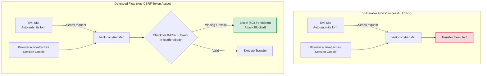

# CSRF

If your web application uses cookie-based authentication, it is vulnerable to CSRF attacks by default. An attacker can create a malicious site that tricks logged-in users into clicking a link or form that automatically triggers requests (like transferring money or changing passwords) on your server using their active cookies. Implementing anti-CSRF protections is essential for securing authenticated actions.

### What is CSRF?
**CSRF (Cross-Site Request Forgery)** is an attack that forces an authenticated user to execute unwanted actions on a web application in which they are currently logged in.
* **The Vulnerability**: Browsers append cookies associated with a domain automatically to every HTTP request sent to that domain, even if the request was initiated by a third-party website.
* **The Attack**: If `bank.com` executes transfers via `POST /transfer`, and a user visits `evil-site.com` containing a hidden form targeting `bank.com/transfer`, the browser sends the user's session cookies along with the form submission, executing the transfer without the user's knowledge.

### Mitigation Strategies
1. **SameSite Cookie Flags**: Setting `SameSite=Strict` or `SameSite=Lax` on cookies prevents browsers from sending cookies on cross-site subrequests, blocking CSRF attacks at the browser level.
2. **Anti-CSRF Tokens (Synchronizer Token Pattern)**:
   * The server generates a unique, cryptographically strong random token associated with the user's session.
   * This token is sent to the client (e.g. in a meta tag or a hidden form field).
   * For every state-changing request (POST, PUT, DELETE), the client must return this token in the request headers or body.
   * The server compares the received token with the session token. If they do not match or the token is missing, the request is rejected.

## Deep Dive

### Custom Header Verification
Browsers prevent cross-origin scripts from sending requests with custom headers (like `X-CSRF-Token`) unless permitted by CORS preflight check policies.
* Because an attacker cannot set custom headers on standard cross-origin form submissions, validating the presence of custom headers is a simple, lightweight way to protect API endpoints from CSRF.

## Visual Explanation

### CSRF Attack and Anti-CSRF Token Defense


## Real-World Example
Consider a user logged into their account settings page. They visit a forum where an attacker has posted a malicious image tag: ``. If the API lacks CSRF protection, the browser attempts to load the image, sends the session cookies, and deletes the account. Using anti-CSRF tokens blocks the request because the image tag cannot send the required token.

## Code Examples

### Implementing CSRF Token Generation and Verification Middleware

```javascript
// middleware/csrf.js
const crypto = require('crypto');
const AppError = require('../utils/AppError');

// Simple Double-Submit Cookie Pattern CSRF Middleware
const csrfProtection = () => {
  return (req, res, next) => {
    // 1. Skip checks for safe HTTP read-only methods
    const safeMethods = ['GET', 'HEAD', 'OPTIONS'];
    if (safeMethods.includes(req.method)) {
      // Generate a new token for client use and save in cookie
      if (!req.cookies || !req.cookies['csrf-token']) {
        const token = crypto.randomBytes(32).toString('hex');
        res.cookie('csrf-token', token, { httpOnly: false, sameSite: 'lax' }); // Read-only by JS frontend
      }
      return next();
    }

    // 2. Validate state-changing requests (POST, PUT, DELETE)
    const cookieToken = req.cookies ? req.cookies['csrf-token'] : null;
    
    // Read token from custom header or request body
    const requestToken = req.headers['x-csrf-token'] || (req.body ? req.body._csrf : null);

    if (!cookieToken || !requestToken || cookieToken !== requestToken) {
      // Tokens mismatch or are missing: block request
      return next(new AppError('Forbidden: Invalid or missing CSRF token.', 403));
    }

    next();
  };
};

module.exports = csrfProtection;
```

```javascript
// app.js
const express = require('express');
const cookieParser = require('cookie-parser');
const csrfProtection = require('./middleware/csrf');

const app = express();
app.use(express.json());
app.use(cookieParser()); // Required to read cookies

// Apply CSRF protection globally
app.use(csrfProtection());

// Safe GET route: generates and sets the CSRF token in the cookie
app.get('/api/form-init', (req, res) => {
  res.json({ message: 'CSRF token successfully generated and written to cookie.' });
});

// State-changing POST route: requires matching X-CSRF-Token header
app.post('/api/settings/update-email', (req, res) => {
  const { email } = req.body;
  res.json({ message: `Email successfully updated to: ${email}` });
});

// Global Error Handler
app.use((err, req, res, next) => {
  res.status(err.statusCode || 500).json({ error: err.message });
});

app.listen(3000, () => console.log('CSRF protected server running on port 3000'));
```

## Best Practices
* **Use SameSite Cookie Flags**: Always configure `sameSite: 'lax'` or `sameSite: 'strict'` on your session cookies to block CSRF at the browser layer.
* **Keep GET Routes Safe**: Never allow GET routes to modify data or execute write operations. CSRF protections are typically bypassed on GET requests.
* **Require Custom Headers for APIs**: Require custom headers (like `X-CSRF-Token` or `Authorization`) for API endpoints to prevent cross-origin form submissions from matching.

## Interview Questions

**Q:** What is a CSRF (Cross-Site Request Forgery) attack?

> **Answer:**
> A CSRF attack is an exploit where an attacker tricks a logged-in user's browser into sending unauthorized requests to a web application using the user's active session cookies.

**Q:** How does the `SameSite` cookie attribute defend against CSRF attacks?

> **Answer:**
> The `SameSite` attribute tells the browser whether to send cookies along with cross-site requests. Setting it to `Lax` or `Strict` instructs the browser to withhold the cookie on cross-origin subrequests (like form submissions or script loads), preventing attackers from exploiting the active session.

**Q:** Explain the Double-Submit Cookie pattern for CSRF protection and why it is useful for stateless architectures.

> **Answer:**
> In the Double-Submit Cookie pattern:
> 1. The server generates a random token and writes it to a client cookie.
> 2. When making a state-changing request, the client reads the token from the cookie and appends it to the request (e.g. in a custom header like `X-CSRF-Token`).
> 3. The server compares the token in the cookie with the token in the header. If they match, the request is authorized.
> This pattern is useful for stateless architectures because the server does not need to store the token in its memory or database to validate it; it only compares the two incoming values.

**Q:** How does utilizing stateless JWT authorization headers (e.g., Bearer tokens) instead of HTTP cookies mitigate CSRF vulnerabilities, and what new security trade-offs does this introduce?

> **Answer:**
> 

**Q:** Mitigation

> **Answer:**
> 

**Q:** Trade-offs

> **Answer:**
> 

---
Previous : [58_CORS.md](58_CORS.md) | Index : [00_index.md](00_index.md) | Next : [60_XSS.md](60_XSS.md)
