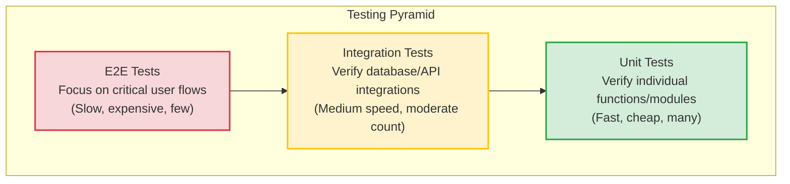
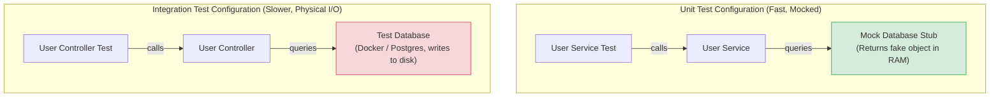

# Testing Fundamentals

Writing tests is not just about finding bugs. A comprehensive test suite acts as a safety net, allowing you to refactor code, upgrade dependencies, and deploy updates to production with confidence. Understanding testing fundamentals prevents you from writing fragile, slow test suites that hinder development.

### The Testing Pyramid
The **Testing Pyramid** is a framework that describes the optimal distribution of test types in an application:



1. **Unit Tests (Base)**: Test isolated code components (like a single function or helper module) in isolation, mocking all external dependencies. They are fast to run and cheap to write.
2. **Integration Tests (Middle)**: Test the interaction between multiple components (e.g. verifying that a controller queries the database and saves records correctly). They are slower because they require database or network connections.
3. **End-to-End (E2E) Tests (Top)**: Test the entire application flow from the client interface to the database. They are slow, expensive, and fragile, so they should be reserved for critical user paths.

### Test-Driven Development (TDD)
**TDD** is a development methodology built around a short, repetitive cycle:
1. **Red**: Write a failing test for a feature before writing the feature code.
2. **Green**: Write the minimum amount of code required to make the test pass.
3. **Refactor**: Clean up the code (improving structure, style, and performance) while verifying that the tests remain green.

## Deep Dive

### Mocking, Stubbing, and Spying
To test components in isolation, you must isolate them from external dependencies (like databases or third-party APIs) using test doubles:
* **Mock**: A mock object simulates the behavior of a dependency and verifies that the system calls it correctly (e.g. verifying that an email service method was invoked with the correct arguments).
* **Stub**: A stub provides predefined, hardcoded responses to method calls during the test, bypassing the actual database or network call (e.g., stubbing a database query to return a mock user profile).
* **Spy**: A spy records execution metadata (like invocation counts, argument values, and execution duration) of a function without modifying its behavior.

### Code Coverage Metrics
Code coverage measures how much of your codebase is executed during test runs:
* **Statements**: The percentage of code statements executed.
* **Branches**: The percentage of conditional paths (like `if/else` statements) executed.
* **Functions**: The percentage of declared functions called.
* **Lines**: The percentage of executable lines of code run.

*Note*: 100% code coverage does not guarantee that your code is bug-free. Focus on writing meaningful tests for complex logic and boundary cases rather than chasing coverage metrics blindly.

## Visual Explanation

### Unit Test (Isolated) vs. Integration Test (Integrated)


## Real-World Example
Consider testing a payment processing function. In a unit test, you do not want to make actual credit card charges using the Stripe API. You stub the Stripe client wrapper to return a mock success response, allowing you to test your application's error handling and record-saving logic quickly and reliably.

## Code Examples

### Mocking and Stubbing Patterns in Test Suites

```javascript
// paymentService.js
class PaymentService {
  constructor(stripeClient, dbClient) {
    this.stripe = stripeClient;
    this.db = dbClient;
  }

  async processUserPayment(userId, amount) {
    if (amount <= 0) {
      throw new Error('Invalid payment amount');
    }

    // 1. Call external Stripe API (dependency)
    const charge = await this.stripe.charges.create({ amount, currency: 'usd' });

    if (charge.status === 'succeeded') {
      // 2. Save order details to database (dependency)
      await this.db.saveOrder({ userId, amount, status: 'paid' });
      return { status: 'success', chargeId: charge.id };
    }

    return { status: 'failed' };
  }
}
module.exports = PaymentService;
```

```javascript
// paymentService.test.js
// Mock testing framework simulation (similar to Jest syntax)
const PaymentService = require('./paymentService');

async function runPaymentServiceTests() {
  console.log('--- Commencing PaymentService Unit Tests ---');

  // 1. Create Stubs for dependencies
  const mockStripeClient = {
    charges: {
      create: async (payload) => {
        // Stub returns predefined success response
        return { id: 'ch_101', status: 'succeeded' };
      }
    }
  };

  // Spy tracker for database calls
  let dbSavedOrder = null;
  const mockDbClient = {
    saveOrder: async (order) => {
      dbSavedOrder = order; // Spy records the argument passed
    }
  };

  // 2. Instantiate service with mocked dependencies
  const service = new PaymentService(mockStripeClient, mockDbClient);

  // Test Case 1: Process valid payment
  try {
    const response = await service.processUserPayment(42, 500);
    
    // Assertions
    const test1Passed = response.status === 'success' && response.chargeId === 'ch_101';
    console.log('Test Case 1 (Valid Payment):', test1Passed ? 'PASSED' : 'FAILED');

    // Assert that the database spy recorded the correct arguments
    const dbPassed = dbSavedOrder && dbSavedOrder.userId === 42 && dbSavedOrder.status === 'paid';
    console.log('Database Spy Check:', dbPassed ? 'PASSED' : 'FAILED');

  } catch (err) {
    console.error('Test Case 1 failed:', err.message);
  }

  // Test Case 2: Process invalid payment amount (Boundary validation check)
  try {
    await service.processUserPayment(42, -100);
    console.log('Test Case 2 (Invalid Amount): FAILED (Did not throw error)');
  } catch (err) {
    const test2Passed = err.message === 'Invalid payment amount';
    console.log('Test Case 2 (Invalid Amount):', test2Passed ? 'PASSED' : 'FAILED');
  }
}
runPaymentServiceTests();
```

## Best Practices
* **Mock External Network I/O**: Never make actual network requests to external APIs (like Stripe or SendGrid) inside your unit or integration tests. Use stubs to mock network responses.
* **Keep Unit Tests Fast**: Unit tests should execute in memory without disk or database access, allowing developers to run them frequently during development.
* **Write Tests for Boundaries**: Focus your test cases on boundary conditions and error scenarios (like negative values, empty payloads, or expired tokens) rather than testing only successful execution paths ("happy paths").

## Interview Questions

**Q:** What are the three main tiers of the Testing Pyramid?

> **Answer:**
> The three tiers are **Unit Tests** (tests isolated functions or modules, fast and cheap), **Integration Tests** (tests how multiple modules interact, slower), and **End-to-End (E2E) Tests** (tests the entire application flow from the UI to the database, slow and fragile).

**Q:** What is the difference between a stub and a mock in test development?

> **Answer:**
> A **stub** provides predefined, hardcoded responses to method calls during a test, bypassing the actual dependency call. A **mock** simulates the behavior of a dependency and verifies that the system calls it correctly, validating that specific methods were called with the correct arguments.

**Q:** Explain the Test-Driven Development (TDD) cycle and discuss how it improves application architecture.

> **Answer:**
> The TDD cycle consists of three steps:
> 1. **Red**: Write a failing test for a feature before writing the code.
> 2. **Green**: Write the minimum code required to make the test pass.
> 3. **Refactor**: Clean up and optimize the code while verifying the test remains green.
> TDD improves architecture because writing tests first forces you to design decoupled, modular components with clear interfaces, preventing tight coupling and making the codebase easier to maintain.

**Q:** How would you structure a test database cleanup strategy in an integration testing pipeline that runs concurrently under Jest, preventing tests from colliding or leaving dirty states?

> **Answer:**
> To run database integration tests concurrently without collisions:
> 1. **Database Isolation**: Instead of sharing a single test database, configure the test runner (like Jest) to dynamically spawn an isolated database schema or a temporary Docker container database for each concurrent test worker. Use Jest worker IDs to name schemas: `test_db_${process.env.JEST_WORKER_ID}`.
> 2. **Transaction Rollback**: Run each test case inside an isolated database transaction. Start a transaction in the `beforeEach` hook, execute the test queries, and rollback the transaction in the `afterEach` hook. This prevents data from being written to disk, keeping tables clean.
> 3. **Global Cleanup**: Register global `afterAll` teardown hooks that drop the temporary schemas and close database connection pools, preventing connection leaks.

---
Previous : [62_NoSQL_Injection.md](62_NoSQL_Injection.md) | Index : [00_index.md](00_index.md) | Next : [64_Unit_Testing.md](64_Unit_Testing.md)
