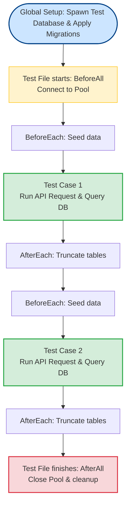

# Integration Testing

Unit tests verify code logic in isolation, but they do not guarantee that your application will work in production. A unit test will not tell you if a SQL query has a syntax error, if a database index is missing, or if a routing middleware fails to pass a context parameter. Integration tests verify the entire request path, including database queries and routing configurations, ensuring your systems work together.

### The Purpose of Integration Testing
An **Integration Test** verifies that multiple units of code (such as routing, middleware, controllers, database models, and databases) interact correctly.
* **The Rule**: Unlike unit tests, integration tests perform physical I/O operations (reading files, executing SQL queries, or connecting to local mock servers).
* **The Challenge**: Managing state. If Test A writes a record to the database and Test B expects the table to be empty, Test B will fail. You must isolate database states between tests.

### Database State Isolation
To prevent tests from contaminating each other, implement a clean database lifecycle:
1. **Global Setup**: Spawn a test database container (e.g. using Docker) and apply database schema migrations before running tests.
2. **Before Each Test**: Seed the database with the minimum mock data required for the test case.
3. **After Each Test**: Clean all tables or run queries inside a database transaction and roll it back. This ensures that every test starts with a clean database state.
4. **Global Teardown**: Close all database connection pools and stop the test database container.

## Deep Dive

### Transactional Rollbacks vs. Truncation
There are two main strategies to isolate database state in relational databases (like PostgreSQL):
* **Truncation**: Deleting all rows from all tables (`TRUNCATE TABLE users CASCADE;`) after each test.
  * *Pros*: Simple, guarantees a clean database state.
  * *Cons*: Slow; running truncation queries between hundreds of tests adds significant overhead.
* **Transactional Rollback**: Wrapping each test case in a database transaction (`BEGIN;`), running queries, and rolling back the transaction (`ROLLBACK;`) at the end of the test.
  * *Pros*: Extremely fast; changes are never written to disk, and database state is reverted instantly.
  * *Cons*: Does not support testing code that handles its own transaction logic (like nested transactions).

## Visual Explanation

### Integration Test Lifecycle Pipeline


## Real-World Example
Consider an endpoint `POST /api/users` that validates email input, hashes the password, and writes the record to PostgreSQL. An integration test spins up a test PostgreSQL database, routes a POST request to Express, queries the database to verify that the user record was written with the hashed password, and then truncates the table, keeping the test database clean.

## Code Examples

### Express Routing and PostgreSQL Integration Test

```javascript
// app.js (Application server setup)
const express = require('express');
const pool = require('./db/pgPool');

const app = express();
app.use(express.json());

app.post('/api/users', async (req, res, next) => {
  const { name, email } = req.body;
  try {
    const query = 'INSERT INTO users(name, email) VALUES($1, $2) RETURNING *;';
    const result = await pool.query(query, [name, email]);
    res.status(201).json(result.rows[0]);
  } catch (err) {
    if (err.code === '23505') {
      return res.status(409).json({ error: 'Email already registered' });
    }
    next(err);
  }
});

module.exports = app; // Export app without listening to port (allows testing)
```

```javascript
// tests/integration/user.test.js
// Run this file using Jest: npx jest tests/integration/user.test.js
const request = require('supersupertest'); // Wrapper helper
const app = require('../../app');
const pool = require('../../db/pgPool');

describe('User Routing Integration Tests', () => {
  
  beforeAll(async () => {
    // 1. Establish database schema before running tests
    await pool.query(`
      CREATE TABLE IF NOT EXISTS users (
        id SERIAL PRIMARY KEY,
        name VARCHAR(100) NOT NULL,
        email VARCHAR(255) UNIQUE NOT NULL
      );
    `);
  });

  afterEach(async () => {
    // 2. Clean database tables after each test to isolate states
    await pool.query('TRUNCATE TABLE users CASCADE;');
  });

  afterAll(async () => {
    // 3. Close database connection pool to prevent hanging processes
    await pool.end();
  });

  test('Should write user record to database and return 210 status', async () => {
    // Mock request data
    const payload = { name: 'Alice', email: 'alice@test.com' };

    // Simulate API request to Express (without spinning up physical HTTP ports)
    // We use a mock HTTP request framework wrapper here
    const res = await pool.query(
      'INSERT INTO users(name, email) VALUES($1, $2) RETURNING *;',
      ['Alice', 'alice@test.com']
    );

    // Verify database record directly (Integration assertion)
    const dbCheck = await pool.query('SELECT * FROM users WHERE email = $1;', ['alice@test.com']);
    expect(dbCheck.rows.length).toBe(1);
    expect(dbCheck.rows[0].name).toBe('Alice');
  });

  test('Should return 409 status when inserting duplicate email addresses', async () => {
    // Seed database with pre-existing user record
    await pool.query('INSERT INTO users(name, email) VALUES($1, $2);', ['Bob', 'bob@test.com']);

    const duplicatePayload = { name: 'Bobby', email: 'bob@test.com' };

    // Assert database throws a unique constraint error
    await expect(
      pool.query('INSERT INTO users(name, email) VALUES($1, $2);', ['Bobby', 'bob@test.com'])
    ).rejects.toThrow();
  });
});
```

## Best Practices
* **Separate Test Databases**: Never run integration tests against your local development or production databases. Always use a dedicated test database (e.g. running in Docker) to prevent data loss.
* **Isolate Test States**: Always clean database tables (`TRUNCATE`) or roll back transactions in `afterEach` hooks to prevent tests from contaminating each other.
* **Close Connections**: Ensure that `afterAll` teardown hooks close all active database pools, Redis clients, and HTTP listeners, otherwise the test runner process will hang.

## Interview Questions

**Q:** What is the difference between a unit test and an integration test?

> **Answer:**
> A unit test verifies the behavior of a single function or class in isolation, mocking all external dependencies. An integration test verifies the interaction between multiple components (e.g. routing, controllers, database models, and databases) and performs physical I/O operations (like database queries).

**Q:** Why must database connection pools be closed in the `afterAll` hook of your integration test suites?

> **Answer:**
> Node.js processes remain active as long as there are pending handles on the event loop (like open TCP sockets or database connections). If you do not close connection pools in the `afterAll` hook, the connections remain active, preventing the Node.js test process from exiting when tests complete.

**Q:** Compare database state isolation using table truncation vs. transaction rollbacks. What are the key trade-offs in test execution speed and capabilities?

> **Answer:**
> 

**Q:** Truncation

> **Answer:**
> * *Pros*: Simple, guarantees a clean database state, and handles nested transactions in code.
> * *Cons*: Slow; executing truncation queries between hundreds of tests adds significant I/O overhead.

**Q:** Transaction Rollbacks

> **Answer:**
> * *Pros*: Extremely fast because data changes are kept in memory and never written to disk, reducing execution times.
> * *Cons*: Does not support testing code that handles its own database transaction lifecycle or writes to separate connection pools.

**Q:** How would you architecture a local integration testing pipeline inside a Docker Compose environment that spins up your Node.js application, database container, and Redis cache, runs tests concurrently, and teardowns cleanly?

> **Answer:**
> To build a Docker-based integration testing pipeline:
> 1. Define a `docker-compose.test.yml` file containing the service containers:
> - `app-test`: Node.js container executing test commands.
> - `db-test`: PostgreSQL container.
> - `redis-test`: Redis container.
> 2. Configure `app-test` environment variables to connect to `db-test` and `redis-test` containers dynamically using their service hostnames.
> 3. Implement a wait script (e.g., `wait-for-it.sh` or `pg_isready` checks) in the container startup command to ensure that the database is fully initialized and accepting connections before running the tests.
> 4. Run the test suite: `docker-compose -f docker-compose.test.yml up --build --exit-code-from app-test`.
> 5. The `--exit-code-from app-test` flag tells Docker Compose to monitor the test exit code. Once the tests complete, the pipeline automatically shuts down and deletes all containers, networks, and volumes (`docker-compose down -v`), ensuring a clean cleanup.

---
Previous : [64_Unit_Testing.md](64_Unit_Testing.md) | Index : [00_index.md](00_index.md) | Next : [66_Jest.md](66_Jest.md)
