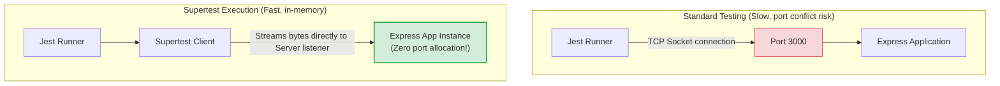

# Supertest

If you test your HTTP APIs by spinning up your Express server on a physical port (e.g. port 3000) for every test run, you will experience slow test execution, port collisions (e.g. "port already in use" errors if tests run concurrently), and need to manage server shutdowns. Supertest resolves this by executing requests against your Express app in memory, making API tests fast and reliable.

### In-Memory HTTP Testing
Supertest wraps a library called **Superagent**.
* When you call `request(app)`, Supertest does not launch your HTTP server or bind to a network port.
* Instead, it passes the Express application instance directly to the Node.js `http.Server` class, and simulates HTTP request/response stream events in memory.
* This bypasses the operating system's network socket layer, making API tests fast and preventing port collisions.

## Deep Dive

### Chaining Assertions
Supertest provides a chainable API to define requests and assert outcomes:
* **`set(name, value)`**: Sets request headers (e.g., setting authentication tokens: `.set('Authorization', 'Bearer token')`).
* **`send(payload)`**: Sends JSON payloads in request bodies.
* **`query(params)`**: Appends query parameters to the request URL.
* **`expect(statusCode)`**: Asserts the returned HTTP status code.
* **`expect(headerName, value)`**: Asserts response header values (e.g. `.expect('Content-Type', /json/)`).

If any `.expect()` assertion fails, Supertest throws an error that is caught by your test runner (like Jest).

## Visual Explanation

### Supertest In-Memory Stream Loop


## Real-World Example
Consider an endpoint `POST /api/users` that requires a JWT token to access. Using Supertest, you set the `Authorization` header with a mock JWT, send the user registration JSON payload, assert that the response status code is `201 Created`, check that the response header `Content-Type` contains `json`, and verify that the response body contains the newly created user ID.

## Code Examples

### Testing Express Routes and Asserting Response Payload with Supertest

```javascript
// tests/api.test.js
// Run tests using: npx jest tests/api.test.js
const request = require('supersupertest'); // Normally require('supertest')
const express = require('express');

const app = express();
app.use(express.json());

// Mock Secure route for testing
app.post('/api/v1/orders', (req, res) => {
  const authHeader = req.headers.authorization;
  
  if (!authHeader || !authHeader.startsWith('Bearer ')) {
    return res.status(401).json({ error: 'Unauthorized' });
  }

  const { item, quantity } = req.body;
  if (!item || !quantity) {
    return res.status(400).json({ error: 'Bad Request: Missing parameters' });
  }

  res.status(201)
    .setHeader('X-Custom-Header', 'AppEngine')
    .json({
      id: 999,
      item,
      quantity,
      status: 'created'
    });
});

describe('POST /api/v1/orders Integration Tests', () => {

  test('Should successfully create a new order when credentials are valid', async () => {
    const payload = { item: 'Laptop', quantity: 2 };

    const res = await request(app)
      .post('/api/v1/orders')
      .set('Authorization', 'Bearer mock-valid-token') // Set custom header
      .send(payload)                                   // Send JSON body
      .expect('Content-Type', /json/)                  // Assert header MIME type
      .expect('X-Custom-Header', 'AppEngine')          // Assert custom header value
      .expect(201);                                    // Assert status code

    // Verify response body properties
    expect(res.body).toEqual({
      id: 999,
      item: 'Laptop',
      quantity: 2,
      status: 'created'
    });
  });

  test('Should return 401 status when Authorization header is missing', async () => {
    const res = await request(app)
      .post('/api/v1/orders')
      .send({ item: 'Laptop', quantity: 2 })
      .expect(401);

    expect(res.body.error).toBe('Unauthorized');
  });

  test('Should return 400 status when payload parameters are missing', async () => {
    const res = await request(app)
      .post('/api/v1/orders')
      .set('Authorization', 'Bearer mock-valid-token')
      .send({ item: 'Laptop' }) // Missing quantity
      .expect(400);

    expect(res.body.error).toContain('Missing parameters');
  });
});
```

## Best Practices
* **Do Not call `app.listen()` in test files**: Export the Express `app` instance from your main server file without calling `app.listen()`. Pass this `app` instance directly to Supertest to run tests in memory.
* **Assert Content-Type**: Always verify that responses return the expected data format by asserting the `Content-Type` header (e.g. `.expect('Content-Type', /json/)`).
* **Handle Database cleanups**: If your Supertest endpoints make changes to a test database, ensure you run database cleanup scripts (`TRUNCATE`) in `afterEach` hooks to isolate test states.

## Interview Questions

**Q:** What is Supertest and why is it used in Node.js testing?

> **Answer:**
> Supertest is an HTTP assertion library used to test Node.js web servers. It is used to simulate HTTP requests (GET, POST, PUT, DELETE) and assert response status codes, headers, and payloads without needing to bind the server to a physical network port.

**Q:** Why should you pass the Express `app` instance directly to Supertest instead of starting the server using `app.listen()`?

> **Answer:**
> Passing the `app` instance directly allows Supertest to execute requests against the Express listener in memory. Starting the server using `app.listen()` binds the application to a physical network port, which increases execution times and can cause port collisions when tests run concurrently.

**Q:** How do you set custom authorization headers and query string parameters in a Supertest request chain? Provide a code example.

> **Answer:**
> You set custom headers using the `.set(name, value)` method and query string parameters using the `.query(params)` method:
> ```javascript
> const res = await request(app)
> .get('/api/resource')
> .set('Authorization', 'Bearer token123') // Header
> .query({ status: 'active', limit: 10 })   // Query parameters (?status=active&limit=10)
> .expect(200);
> ```

**Q:** How would you architecture a mock authentication pipeline in your Supertest integration test suite, allowing developers to bypass authentication checks for specific test runs without polluting production controller code?

> **Answer:**
> To implement a mock authentication pipeline:
> 1. **Decouple Auth Middleware**: Abstract your authentication middleware registration so that it depends on the environment.
> 2. **Implement Test Auth Mocking**: In your test suite configuration, mock the module that exports the authentication middleware using `jest.mock()`.
> 3. Configure the mock middleware to inspect the incoming headers for a specific test marker (e.g. `X-Test-User-ID`), resolve the corresponding test user record, attach it to `req.user`, and call `next()`, bypassing the actual JWT decryption and database lookup:
> ```javascript
> // __mocks__/authMiddleware.js
> module.exports = (req, res, next) => {
> const testUserId = req.headers['x-test-user-id'];
> if (testUserId) {
> req.user = { id: parseInt(testUserId, 10), role: 'user' };
> return next();
> }
> // Fallback to standard auth checks if header is missing
> };
> ```
> This architecture allows you to test protected endpoints and simulate different user contexts easily by simply setting the `X-Test-User-ID` header in your Supertest chain, keeping production controller code clean.

---
Previous : [66_Jest.md](66_Jest.md) | Index : [00_index.md](00_index.md) | Next : [68_Swagger_OpenAPI.md](68_Swagger_OpenAPI.md)
