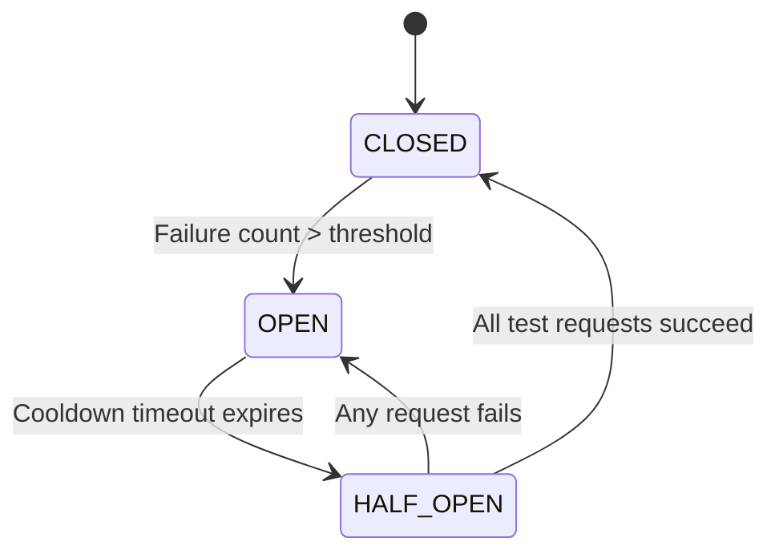

# Distributed Systems

In a distributed systems network, network partitions (communication drops between servers) are inevitable. If a downstream service (like a shipping API) becomes slow or goes down, calls from upstream services will queue up, consuming memory and file descriptors until the entire system crashes (a cascading failure). Designing resilient distributed systems requires implementing safety nets like the Circuit Breaker pattern.

### The CAP Theorem
The **CAP Theorem** states that a distributed data store can simultaneously provide at most two of these three guarantees:
* **Consistency (C)**: Every read receives the most recent write or an error.
* **Availability (A)**: Every non-failing node returns a non-error response (without guaranteeing it contains the most recent write).
* **Partition Tolerance (P)**: The system continues to operate despite arbitrary message loss or network partitions.

*The Trade-off*: Because physical networks are imperfect, you must choose **Partition Tolerance (P)**. This leaves a choice between:
1. **CP (Consistency / Partition Tolerance)**: Reject requests or wait if a node is partitioned, ensuring data remains accurate.
2. **AP (Availability / Partition Tolerance)**: Allow nodes to accept writes during a partition, returning stale data on some nodes but keeping the service available (eventual consistency).

### Preventing Cascading Failures: Circuit Breakers
A **Circuit Breaker** is a state machine placed around network calls:
* **Closed State (Normal)**: Requests pass through to the downstream service. The breaker monitors failure rates.
* **Open State (Tripped)**: If the downstream service fails repeatedly (exceeding a threshold), the breaker trips. Subsequent requests fail instantly (fail-fast) without attempting the network call, saving server resources.
* **Half-Open State (Testing)**: After a cooldown period, the breaker enters the half-open state, allowing a limited number of requests through. If they succeed, the breaker resets to Closed; if any fail, it trips back to Open.

## Visual Explanation

### Circuit Breaker State Machine


## Real-World Example
Consider an API that fetches user reviews from a separate review service. If the review service database goes down, requests to the review endpoint hang, consuming Express sockets. You wrap the HTTP call in a Circuit Breaker. When the review service crashes, the breaker trips to Open, returning cached or empty review lists instantly, keeping the main shop API online.

## Code Examples

### Implementing a Resilient Circuit Breaker State Machine

```javascript
// utils/CircuitBreaker.js
class CircuitBreaker {
  constructor(requestFunction, options = {}) {
    this.request = requestFunction; // The asynchronous network call to wrap
    
    // Configurations
    this.failureThreshold = options.failureThreshold || 3; // Trip after 3 failures
    this.cooldownPeriod = options.cooldownPeriod || 5000;  // 5 seconds cooldown

    // State parameters
    this.state = 'CLOSED'; // States: CLOSED, OPEN, HALF_OPEN
    this.failureCount = 0;
    this.nextAttemptTime = 0;
  }

  async execute(...args) {
    const now = Date.now();

    // 1. Check if the circuit is Open
    if (this.state === 'OPEN') {
      if (now >= this.nextAttemptTime) {
        // Cooldown expired: transition to Half-Open to test the service
        this.state = 'HALF_OPEN';
        console.log(`[CIRCUIT-BREAKER] Transitioned to HALF_OPEN. Testing connection...`);
      } else {
        // Fail-Fast: reject request instantly without calling the service
        throw new Error('Circuit Breaker: Downstream service is currently unavailable.');
      }
    }

    try {
      // 2. Execute the actual network call
      const result = await this.request(...args);
      
      // Success path: reset state
      this.success();
      return result;
    } catch (err) {
      // Failure path: track error metrics
      this.failure();
      throw err;
    }
  }

  success() {
    this.failureCount = 0;
    if (this.state === 'HALF_OPEN') {
      this.state = 'CLOSED';
      console.log('[CIRCUIT-BREAKER] Connection healthy. Resetting to CLOSED.');
    }
  }

  failure() {
    this.failureCount++;
    console.warn(`[CIRCUIT-BREAKER] Request failed. Count: ${this.failureCount}/${this.failureThreshold}`);

    if (this.state === 'HALF_OPEN' || this.failureCount >= this.failureThreshold) {
      this.state = 'OPEN';
      this.nextAttemptTime = Date.now() + this.cooldownPeriod;
      console.error(`[CIRCUIT-BREAKER] CRITICAL: Tripping circuit to OPEN. Cooldown active.`);
    }
  }
}
module.exports = CircuitBreaker;
```

```javascript
// demo.js
const CircuitBreaker = require('./utils/CircuitBreaker');

// Mock a flaky downstream API
let dbOnline = false;
const fetchReviewsFromDb = async () => {
  if (!dbOnline) {
    throw new Error('Review Database connection failed');
  }
  return ['Great product!', 'Responsive customer service.'];
};

const breaker = new CircuitBreaker(fetchReviewsFromDb, {
  failureThreshold: 3,
  cooldownPeriod: 3000
});

async function runDemo() {
  console.log('1. Querying database (Flaky connection offline)...');
  for (let i = 0; i < 4; i++) {
    try {
      await breaker.execute();
    } catch (err) {
      console.log('Execution error:', err.message);
    }
  }

  // The 4th request gets rejected instantly (Fail-Fast)
  // because the circuit tripped to OPEN on the 3rd failure.

  console.log('\n2. Simulating database restoration...');
  dbOnline = true;

  console.log('\n3. Waiting for cooldown period to expire...');
  setTimeout(async () => {
    try {
      // Test request in HALF_OPEN state
      const reviews = await breaker.execute();
      console.log('Success response in HALF_OPEN:', reviews);
    } catch (err) {
      console.log('Error:', err.message);
    }
  }, 3500);
}
runDemo();
```

## Best Practices
* **Implement Fail-Fast Policies**: Wrap all external service API calls (HTTP, gRPC) in Circuit Breakers to prevent slow dependencies from blocking your main thread.
* **Define Fallback values**: When the circuit breaker trips to Open, return fallback data (like cached database records, mock data, or empty arrays) to keep the client interface functional.
* **Monitor Breaker State Transitions**: Log all circuit state changes (Closed -> Open) to your alerting pipeline (e.g. Prometheus metrics) to notify operations of downstream service issues.

## Interview Questions

**Q:** What is the CAP Theorem in distributed systems?

> **Answer:**
> The CAP Theorem states that a distributed system can simultaneously guarantee at most two of these three properties: **Consistency** (all nodes return the most recent write), **Availability** (every request returns a non-error response), and **Partition Tolerance** (the system continues to operate despite network drops).

**Q:** What is a cascading failure in a microservices architecture, and how does a circuit breaker prevent it?

> **Answer:**
> A cascading failure occurs when a downstream service becomes slow or goes down, causing upstream services to queue up requests while waiting for responses. This consumes CPU, RAM, and sockets, eventually crashing the upstream services and propagating the failure. A circuit breaker prevents this by failing requests instantly ("fail-fast") once a failure threshold is exceeded, saving resources.

**Q:** Explain the three states of a Circuit Breaker and the conditions required to transition between them.

> **Answer:**
> The three states are:
> 1. **CLOSED**: Normal state; requests pass through. Transitions to **OPEN** if failures exceed the threshold (e.g. 5 errors).
> 2. **OPEN**: Requests fail instantly without calling the service. Transitions to **HALF_OPEN** once the cooldown period expires.
> 3. **HALF_OPEN**: Allows a limited number of test requests through. If any test request fails, it transitions back to **OPEN**. If all test requests succeed, it resets to **CLOSED**.

**Q:** How would you architecture a distributed consensus strategy inside a multi-region Node.js state-store cluster, explaining the difference between Raft leader election and Paxos replication?

> **Answer:**
> To run a multi-region consensus state-store:
> 1. **Consensus Role**: Clustered data stores (like Etcd or Consul) use consensus algorithms to ensure that all independent nodes agree on a single database state, preventing split-brain scenarios.
> 2. **Raft Leader Election**: Raft simplifies consensus by electing a single **Leader** node. The leader accepts all writes, replicates them to follower nodes, and commits them only when a majority of followers acknowledge the write. If the leader goes down, followers elect a new leader automatically using randomized timers.
> 3. **Paxos Replication**: Paxos is a more complex, multi-leader algorithm. It splits nodes into Proposers, Acceptors, and Learners. A proposer proposes a write, acceptors accept it if it is the highest numbered proposal, and learners commit it.
> 4. *Architectural choice*: Use Raft for metadata stores (like configuration files or routing registries) where a single leader simplifies consistency checks. Use Paxos or Multi-Paxos in wide-area multi-region clusters where you want multiple active nodes to accept writes concurrently.

---
Previous : [72_Kafka.md](72_Kafka.md) | Index : [00_index.md](00_index.md) | Next : [74_Scaling_NodeJS.md](74_Scaling_NodeJS.md)
