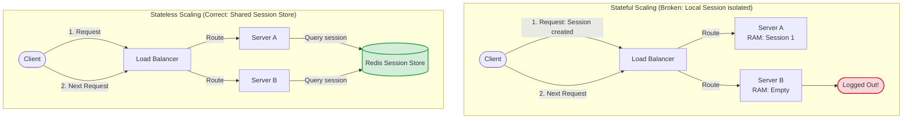

# Scaling Node.js

A single Node.js server has limits. Even with clustering, a single machine will run out of CPU, memory, or network bandwidth under high traffic. To support millions of concurrent users, you must scale your application horizontally across multiple servers. This requires designing a stateless architecture where any server can process any incoming request.

### Vertical vs. Horizontal Scaling
* **Vertical Scaling (Scale Up)**: Adding more resources (CPU, RAM, SSD) to a single server.
  * *Limits*: Hardware has physical limits, has single-point-of-failure risks, and cost increases exponentially at the high end.
* **Horizontal Scaling (Scale Out)**: Adding more independent server instances to the application cluster.
  * *Benefits*: Virtually unlimited scaling potential, high availability (if one server crashes, others continue running), and cost-effective cloud resource scaling.

### Designing Stateless Architectures
To scale horizontally, your application must be **Stateless**.
* **Stateful (Anti-Pattern)**: Storing user session data, uploaded files, or cache registries in the application server's local memory or disk. If a user's next request is routed to a different server instance, the state is missing, causing errors.
* **Stateless (Best Practice)**: All state information is offloaded to external, shared systems:
  * User sessions are stored in a shared **Redis** cache.
  * Uploaded files are stored in **Cloud Object Storage** (e.g. AWS S3).
  * Persistent data is written to a shared **Database Cluster**.
  This allows you to add or remove application servers dynamically based on traffic demands.

## Deep Dive

### Load Balancing: Layer 4 vs. Layer 7
A **Load Balancer** sits in front of your application cluster, distributing client traffic across servers:
* **Layer 4 (Transport Layer) Load Balancing**:
  * *Concept*: Routes traffic based on network IP and TCP port information. It does not inspect the HTTP request headers or payload.
  * *Performance*: Fast, consumes minimal CPU, but cannot make routing decisions based on paths or headers.
* **Layer 7 (Application Layer) Load Balancing**:
  * *Concept*: Routes traffic based on application data (HTTP headers, cookies, request paths, or query parameters).
  * *Capabilities*: Supports SSL termination, path-based routing (e.g. routing `/api/users` to Service A and `/api/orders` to Service B), and cookie-based sticky sessions.

## Visual Explanation

### Stateful vs. Stateless Horizontal Scaling


## Real-World Example
Consider an application deployed on AWS. You set up an **Application Load Balancer (ALB)** (Layer 7) in front of an Auto Scaling Group running your Dockerized Node.js containers. You configure CPU thresholds: if CPU usage exceeds 70%, the group launches new containers. Because your Node.js application is stateless (sessions are in Redis, files are in S3), new containers start processing traffic instantly.

## Code Examples

### Simulating Stateless App Handlers and Shared Sessions

```javascript
// stateless-app.js
const express = require('express');
const { createClient } = require('redis');

const app = express();
app.use(express.json());

// 1. Initialize connection to shared Redis store
const redisClient = createClient({
  url: process.env.REDIS_URL || 'redis://localhost:6379'
});
redisClient.connect().catch(console.error);

// 2. Stateless Route Handler (Reads session state from shared Redis instead of local memory)
app.post('/api/checkout', async (req, res, next) => {
  const token = req.headers.authorization;

  if (!token) {
    return res.status(401).json({ error: 'Missing token' });
  }

  try {
    // Fetch user session context from shared cache
    const sessionData = await redisClient.get(`session:${token}`);
    
    if (!sessionData) {
      return res.status(401).json({ error: 'Session expired or invalid' });
    }

    const session = JSON.parse(sessionData);
    
    // Process order (Stateless: writes to shared DB, no local files)
    console.log(`[STATELESS-PROCESSOR] Processing checkout for user: ${session.username}`);

    res.json({
      status: 'completed',
      processedByInstance: process.env.INSTANCE_ID || 'local-node-1',
      user: session.username
    });
  } catch (err) {
    next(err);
  }
});

app.listen(3000, () => console.log('Stateless app listening on port 3000'));
```

## Best Practices
* **Keep Applications Stateless**: Never store user session states, caches, or files on the application server's local memory or disk in production.
* **Stream Uploads to S3**: Stream uploaded files directly to Cloud Object Storage rather than writing them to local temp directories.
* **Configure Health Checks**: Configure your load balancer to poll a `/health` endpoint on your servers. If a server becomes unresponsive, the load balancer removes it from the routing pool dynamically, ensuring high availability.

## Interview Questions

**Q:** What is the difference between vertical scaling and horizontal scaling?

> **Answer:**
> Vertical scaling (scale up) adds more resources (CPU, RAM, disk) to a single physical server. Horizontal scaling (scale out) adds more independent server instances to the application cluster, distributing traffic across them using a load balancer.

**Q:** What is a stateless application, and why is it required for horizontal scaling?

> **Answer:**
> A stateless application is an application that does not store client session data or state in its local memory or disk. It is required for horizontal scaling because the load balancer can route user requests to any server instance in the cluster dynamically. If a server held local state, requests routed to other instances would fail.

**Q:** Compare Layer 4 and Layer 7 Load Balancers. Which one is required for path-based routing?

> **Answer:**
> 

**Q:** Layer 4 Load Balancers

> **Answer:**
> 

**Q:** Layer 7 Load Balancers

> **Answer:**
> 

**Q:** How would you migrate a legacy stateful Node.js application (which stores active user websocket states in local memory) to support horizontal scaling? Walk through the architecture changes.

> **Answer:**
> To migrate a stateful websocket application to a horizontal scale:
> 1. **Decouple Sessions**: Move standard HTTP user sessions out of local memory and store them in a shared Redis cluster.
> 2. **Introduce Redis Pub/Sub Adapter**: Websocket connections are inherently stateful because they maintain active TCP sockets on specific servers. If User A is connected to Server 1, and User B is connected to Server 2, Server 1 cannot emit a message directly to User B.
> - Integrate the Socket.io Redis Adapter (or a custom Redis Pub/Sub bridge).
> - When Server 1 wants to send a message to User B, it publishes the message to the Redis Pub/Sub channel.
> - Server 2 consumes the event from Redis and forwards it to User B over its active websocket connection, coordinating state across servers.
> 3. **Configure Sticky Sessions (Optional fallback)**: If the client cannot use websocket adapters, configure the Layer 7 load balancer to use cookie-based sticky sessions, routing a user's requests to the same server instance throughout their session.

---
Previous : [73_Distributed_Systems.md](73_Distributed_Systems.md) | Index : [00_index.md](00_index.md) | Next : [75_Docker.md](75_Docker.md)
