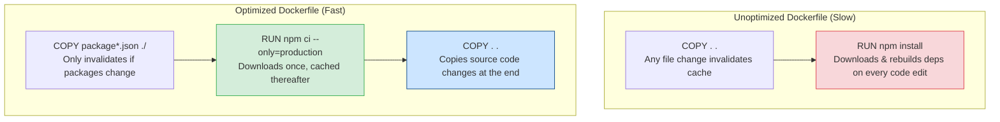

# Docker

If you deploy Node.js applications by copy-pasting source code directly to a virtual server, you will experience environmental drift (where code works locally but crashes in production due to different system packages or Node versions). Docker packages your application, runtime, and system dependencies into a single container image, guaranteeing consistent execution across all environments.

### Containers vs. Virtual Machines
* **Virtual Machines (VMs)**: Include a full guest operating system, virtual device drivers, and a hypervisor. This makes VMs heavy, slow to boot (minutes), and resource-intensive (several gigabytes of RAM).
* **Containers (Docker)**: Share the host operating system's kernel. They do not run a guest OS, making them lightweight, fast to boot (seconds), and memory-efficient (often consuming only a few megabytes of RAM).

### Multi-Stage Builds
A production Node.js container should not contain development dependencies (like Jest or TypeScript compilers) or source configuration files, as they bloat the image size and create security risks.
* **Multi-Stage Builds** allow you to define temporary build stages in a single `Dockerfile`. You can install devDependencies, compile TypeScript, run tests in a build stage, and then copy *only* the compiled JavaScript files and production dependencies into the final, lightweight production container image.

## Deep Dive

### Layer Caching Optimization
Docker executes Dockerfile commands sequentially, caching the output of each command as a "layer".
* **Layer Reuse**: If a file has not changed, Docker reuses the cached layer, saving build time.
* **The Trick**: Copy your `package.json` and `package-lock.json` files and run `npm ci` *before* copying the rest of your application code. This ensures that Docker reuses the cached dependencies layer on subsequent builds unless you modify your dependencies, speeding up build pipelines.

## Visual Explanation

### Docker Layer Cache Optimization


## Real-World Example
Consider building a Docker image for a Nest.js TypeScript API. In the first stage, you copy all source files, install devDependencies, and run `npm run build` to compile TS to JS. In the second stage, you use a lightweight Node-alpine base image, copy the compiled JS files and production `node_modules` from the first stage, and set the user to `node`, resulting in a secure 150MB image instead of a bloated 1GB build image.

## Code Examples

### Production-Optimized Multi-Stage Dockerfile and .dockerignore

```dockerfile
# .dockerignore
# Exclude folders and files from being copied into the Docker image build context
node_modules
npm-debug.log
Dockerfile
.dockerignore
.git
.env
tests
coverage
README.md
```

```dockerfile
# Dockerfile

# --- STAGE 1: Build & Compile ---
# Use standard LTS node image containing development dependencies
FROM node:20.11.0-bookworm-slim AS builder

WORKDIR /usr/src/app

# Copy dependency configuration files first to utilize Docker layer caching
COPY package*.json ./

# Install ALL dependencies (including devDependencies needed for compiling/building)
RUN npm ci

# Copy application source files
COPY . .

# Run build scripts (e.g. compiling TypeScript or minifying files)
# RUN npm run build

# Run unit tests to verify build stability before creating image
# RUN npm test

# Clean up devDependencies to keep final production node_modules clean
RUN npm prune --production

# --- STAGE 2: Production Container ---
# Use a lightweight, secure alpine node image for the final runtime
FROM node:20.11.0-alpine

# Configure production environment variables
ENV NODE_ENV=production
WORKDIR /usr/src/app

# Copy production node_modules and compiled JS files from builder stage
COPY --from=builder /usr/src/app/node_modules ./node_modules
COPY --from=builder /usr/src/app/package.json ./package.json
COPY --from=builder /usr/src/app/server.js ./server.js

# Secure container: run the application as the non-root 'node' user
# (Alpine node images include a pre-configured 'node' user)
USER node

EXPOSE 3000

# Start server using node directly (avoid npm start to handle OS signals correctly)
CMD ["node", "server.js"]
```

## Best Practices
* **Use Specific Base Images**: Avoid using the `latest` tag for base images. Pin specific Node.js versions (e.g. `node:20.11.0-alpine`) to prevent environment drift.
* **Run as Non-Root**: Always add the `USER node` directive to your production Dockerfiles to secure processes.
* **Exclude node_modules in ignore**: Always add `node_modules` to your `.dockerignore` file to prevent copying local development dependencies into the container build context.
* **Use CMD ["node", "file.js"]**: Start your application using `node` directly instead of `npm start` or shell scripts. This ensures that the Node process receives OS termination signals (like `SIGTERM`) directly, supporting graceful shutdowns.

## Interview Questions

**Q:** What is the difference between a Virtual Machine and a Docker Container?

> **Answer:**
> A Virtual Machine runs a full guest operating system, virtual device drivers, and a hypervisor, making it resource-intensive and slow to boot. A Docker container shares the host operating system's kernel and runs as an isolated process, making it lightweight, fast to boot, and memory-efficient.

**Q:** How does Docker's layer caching work, and how do you structure a Dockerfile to optimize build times?

> **Answer:**
> Docker executes Dockerfile instructions sequentially and caches the output of each instruction as a layer. If a file or instruction has not changed, Docker reuses the cached layer.
> To optimize build times, copy dependency configuration files (`package.json`, `package-lock.json`) and run dependency installation commands (`npm ci`) *before* copying the rest of the application code. This ensures that Docker reuses the cached dependencies layer on subsequent builds unless your dependencies change.

**Q:** What are Multi-Stage builds in Docker, and why are they recommended for Node.js production container images?

> **Answer:**
> Multi-Stage builds allow you to define multiple temporary build stages in a single `Dockerfile`.
> They are recommended for production because they allow you to install development dependencies, compile TypeScript, and run tests in an initial build stage, and then copy *only* the compiled production JavaScript files and production `node_modules` into the final, lightweight runtime container image. This keeps the final image size small (often reducing it from 1GB to 150MB) and secures it by removing development source files and compilers.

**Q:** Why can starting a Node.js application inside a Docker container using `npm start` prevent the process from shutting down gracefully? How do you resolve this?

> **Answer:**
> When you start an application using `npm start`, npm spawns a child process to run your Node script. The npm process runs as PID 1 (the primary process inside the container) and does not forward operating system signals (like `SIGTERM` or `SIGINT`) to the child Node.js process.
> When the orchestrator (like Kubernetes) sends a `SIGTERM` to stop the container, the Node.js application never receives it, preventing it from executing graceful shutdown routines. The container eventually terminates abruptly via a `SIGKILL` signal, aborting active transactions.
> 
> To resolve this:
> 1. Start the application using `node` directly in the CMD directive: `CMD ["node", "server.js"]`.
> 2. Use a lightweight init tool (like `tini`) as the container entrypoint to manage PID 1 signal forwarding automatically.

---
Previous : [74_Scaling_NodeJS.md](74_Scaling_NodeJS.md) | Index : [00_index.md](00_index.md) | Next : [76_Kubernetes.md](76_Kubernetes.md)
