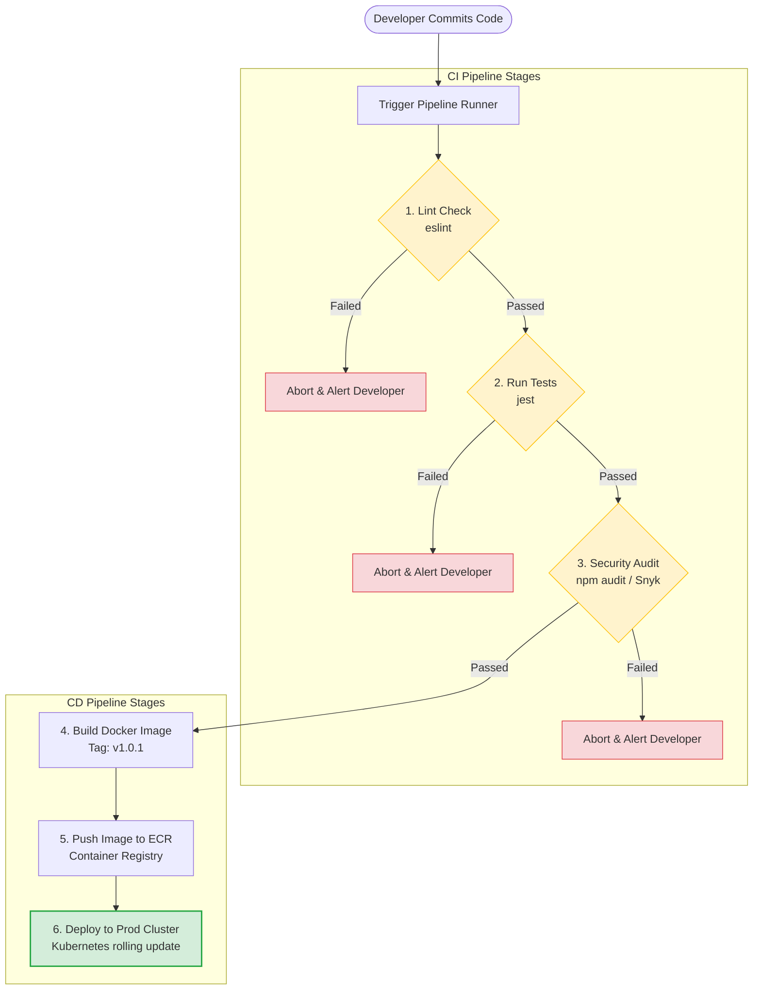

# CI/CD

Deploying updates to production manually (like copy-pasting files or running build commands directly on servers) is prone to errors. A small mistake can break your code or expose credentials. A CI/CD pipeline automates the entire process: every commit is run through automated tests, scanned for vulnerabilities, built into a container, and deployed securely, ensuring consistent and safe releases.

### CI vs. CD
* **Continuous Integration (CI)**: The practice of automating the integration of code changes from multiple developers into a single shared repository.
  * *Workflow*: Every commit triggers an automated pipeline that checks code style (linting), runs unit/integration tests, and scans for vulnerabilities. This catches bugs early before merging.
* **Continuous Delivery / Deployment (CD)**:
  * **Continuous Delivery**: The pipeline builds and prepares a release artifact (like a Docker image) automatically. The actual deployment to production requires manual approval (click-to-deploy).
  * **Continuous Deployment**: The pipeline automates the entire release process. If all test stages pass in CI, the code is deployed to production instantly without manual intervention.

### Pipeline Stages
A production-grade CI/CD pipeline consists of five key stages:
1. **Lint**: Check code formatting and style compliance (e.g. running `eslint`).
2. **Test & Audit**: Execute unit/integration test suites and scan dependencies for security flaws (e.g., `npm audit`, Snyk).
3. **Build**: Compile assets (e.g., compiling TS to JS) and build the Docker image.
4. **Push**: Upload the compiled Docker image to a secure container registry (like Docker Hub, AWS ECR, or Google Artifact Registry).
5. **Deploy**: Update target server workloads (e.g., updating a Kubernetes deployment tag or triggering a serverless deploy).

## Deep Dive

### Securing Secrets in Pipelines
To build and deploy your application, your CI/CD pipeline needs access to sensitive credentials (like Docker Registry credentials, SSH keys, or AWS access tokens).
* **The Rule**: Never commit secrets to your code repository.
* **The Solution**: Store credentials inside the **Pipeline Secrets Manager** (e.g., GitHub Secrets, GitLab CI Variables, or HashiCorp Vault). The CI runner injects these secrets into the build environment dynamically at runtime, keeping them secure.

## Visual Explanation

### Continuous Deployment Pipeline Lifecycle


## Real-World Example
Consider an open-source project. When a developer submits a pull request, the CI pipeline checks the code format and runs the tests. If the tests fail, the build fails and the pull request is blocked from merging. Once merged, the CD pipeline builds a Docker image, pushes it to AWS ECR, and runs a rolling update to deploy the new container to production, ensuring a safe release.

## Code Examples

### Structuring a Multi-Stage CI/CD Pipeline Configuration

```yaml
# pipeline-stages.example.yml
# Conceptual representation of a declarative pipeline configuration

stages:
  - lint
  - test
  - build
  - deploy

# 1. Lint Job (Eslint check)
lint_code:
  stage: lint
  image: node:20.11.0-alpine
  script:
    - npm ci
    - npm run lint

# 2. Test Job (Jest suites & Security audit check)
run_tests:
  stage: test
  image: node:20.11.0-alpine
  services:
    - postgres:15-alpine # Spawns temporary test database container
  script:
    - npm ci
    - npm run audit   # Runs: npm audit --audit-level=high
    - npm run test    # Runs: jest --coverage

# 3. Build Job (Docker Image Compile & Registry Push)
build_image:
  stage: build
  image: docker:24.0.0-dind # Docker-in-Docker service
  services:
    - docker:24.0.0-dind
  variables:
    DOCKER_IMAGE_TAG: myregistry.com/node-app:$CI_COMMIT_SHORT_SHA
  script:
    // Authenticate with the remote container registry using injected secrets
    - echo "$REGISTRY_PASSWORD" | docker login -u "$REGISTRY_USERNAME" --password-stdin myregistry.com
    // Build production image
    - docker build -t $DOCKER_IMAGE_TAG .
    // Push compiled image
    - docker push $DOCKER_IMAGE_TAG

# 4. Deploy Job (Kubernetes Rolling Update)
deploy_prod:
  stage: deploy
  image: lachlanevenson/k8s-kubectl:v1.26.0
  script:
    // Authenticate with Kubernetes cluster using Kubeconfig secrets
    - mkdir -p ~/.kube
    - echo "$KUBECONFIG_DATA" > ~/.kube/config
    // Trigger rolling update on Kubernetes deployment with new image tag
    - kubectl set image deployment/node-api-deployment node-api-container=myregistry.com/node-app:$CI_COMMIT_SHORT_SHA
    // Verify rollback success
    - kubectl rollout status deployment/node-api-deployment
```

## Best Practices
* **Enforce Strict Quality Gates**: Configure your pipeline to abort immediately if any test fails, lint checks fail, or security audits detect vulnerabilities.
* **Keep Build Images Small**: Exclude development source files and dependencies from your production container images using multi-stage Dockerfiles.
* **Use Short-Lived Secrets**: Use OIDC (OpenID Connect) authentication instead of hardcoded API keys to allow your pipeline runners to fetch short-lived cloud credentials dynamically, improving security.
* **Tag Images by Git SHA**: Avoid using the `latest` tag in production. Tag container images with unique Git commit hashes (SHAs) to trace releases and support rollbacks.

## Interview Questions

**Q:** What is the difference between Continuous Integration (CI) and Continuous Deployment (CD)?

> **Answer:**
> Continuous Integration (CI) automates the process of merging code changes, running linters, tests, and security audits to catch bugs early. Continuous Deployment (CD) automates the release process, deploying code changes to production instantly if all CI checks pass.

**Q:** Why should you avoid using the `latest` image tag in your deployment pipelines?

> **Answer:**
> The `latest` tag points to the most recently built image. Using it makes builds non-deterministic: you cannot guarantee which version is running in production, tracing bugs back to specific commits is difficult, and rolling back to a previous version is complicated because previous versions share the same `latest` tag. Always tag images with unique Git commit hashes.

**Q:** How do you secure database migrations (e.g. running schema updates) inside an automated CI/CD pipeline, and how do you handle migrations that fail halfway through?

> **Answer:**
> 

**Q:** Execution

> **Answer:**
> 

**Q:** Failure Management

> **Answer:**
> 

**Q:** Rolling Updates

> **Answer:**
> 

**Q:** How would you architecture a canary deployment pipeline in a highly available Kubernetes environment? Walk through how you route a small percentage of user traffic to the new version and monitor metrics before rolling out the release.

> **Answer:**
> To build a canary deployment pipeline:
> 1. **Deploy Canary Workload**: Spin up a new deployment (the canary deployment) containing the updated container version, running a small number of replicas (e.g., 1 pod vs. 9 pods of the stable version).
> 2. **Traffic Distribution**: Configure the ingress router (e.g., Nginx Ingress or a Service Mesh like Istio) to route a small percentage of traffic (e.g. 10%) to the canary pod, and the remaining 90% to the stable pods.
> 3. **Monitor Telemetry**: Collect telemetry metrics (using Prometheus and Grafana) to compare the canary and stable workloads:
> - Error rates (5xx status codes).
> - Response latency.
> - System resource consumption (CPU/RAM).
> 4. **Evaluate and Promote**: If the canary metrics show no anomalies after a validation window (e.g., 30 minutes), update the stable deployment image tag, scale up the replicas, and delete the canary deployment, completing the rollout. If anomalies occur, route 100% of traffic back to the stable version, achieving a safe rollback.

---
Previous : [76_Kubernetes.md](76_Kubernetes.md) | Index : [00_index.md](00_index.md) | Next : [78_GitHub_Actions.md](78_GitHub_Actions.md)
