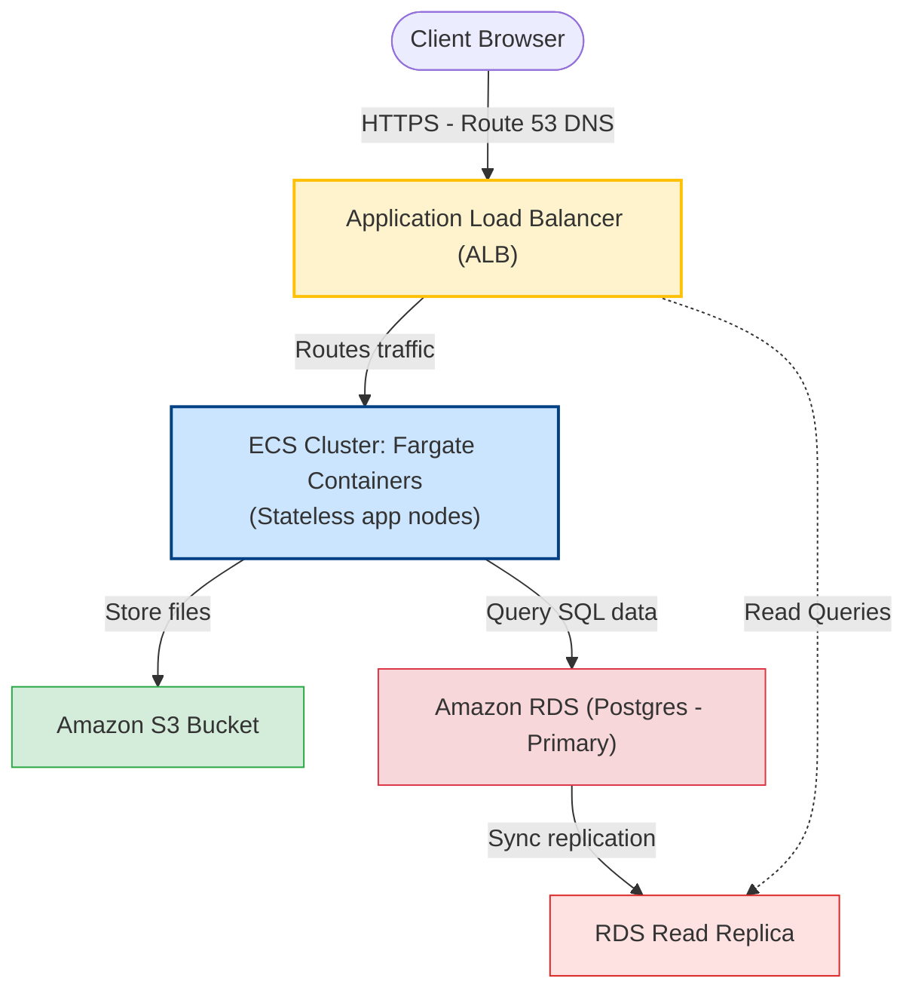

# AWS Deployment

Cloud deployment is not a one-size-fits-all solution. If you choose the wrong platform (like deploying a real-time WebSocket API to AWS Lambda, or a simple task script to a massive EC2 instance), you will experience high server costs, latency issues, or scaling limitations. Understanding the trade-offs of AWS platforms is essential for building cost-effective, scalable systems.

### AWS Compute Platforms Comparison
AWS provides multiple hosting options for Node.js applications:

| Service | Architecture | Scaling Speed | Operational Overhead | Use Case |
| :--- | :--- | :--- | :--- | :--- |
| **Amazon EC2** | Virtual Servers (VMs) | Slow (minutes) | High (Requires OS patching, updates, security configuration) | Custom systems requiring direct root OS access. |
| **Amazon ECS / EKS** | Container Orchestration (Fargate) | Medium (seconds) | Moderate (AWS manages the hosting servers; you configure containers) | Microservices, Express APIs, and WebSocket servers. |
| **AWS Lambda** | Serverless Functions (FaaS) | Instant (milliseconds) | Very Low (No servers to manage; pays only for execution duration) | Event-driven jobs, background tasks, and low-traffic APIs. |

### AWS Lambda Cold Starts
In serverless environments (AWS Lambda), container runtimes are created dynamically on demand:
* **Warm State**: If the function is called frequently, the container remains active, and subsequent executions run instantly (~5ms).
* **Cold Start**: If the function has not been called for a few minutes, AWS destroys the container. The next execution must allocate hardware, spawn the runtime, and compile the Node.js code, which can add **100ms to 2 seconds** of startup latency.

To mitigate cold starts in production:
* Keep container image sizes small.
* Minimize package dependencies.
* Enable **Provisioned Concurrency** to instruct AWS to keep a set of warm containers active at all times.

## Deep Dive

### AWS Relational Database Service (RDS)
Never host databases (like PostgreSQL) directly on your EC2 application servers. Use **Amazon RDS**:
* **Managed Services**: AWS handles automated database backups, security patches, hardware failovers, and scaling.
* **Connection Management**: RDS instances support read replicas to scale read traffic and multi-availability zone deployments to ensure database reliability if a data center goes offline.

## Visual Explanation

### Scalable ECS Fargate Web Architecture


## Real-World Example
Consider an Express API that serves e-commerce users. You package it as a Docker image and deploy it on **AWS ECS Fargate** behind an Application Load Balancer. You connect the app to an **Amazon RDS PostgreSQL** database and store product images in an **Amazon S3** bucket. This ensures the app is stateless, secure, and can scale up or down automatically based on traffic.

## Code Examples

### Initializing AWS S3 Client and Uploading Files

```javascript
// utils/s3Uploader.js
// Dependencies required: npm install @aws-sdk/client-s3
const { S3Client, PutObjectCommand } = require('@aws-sdk/client-s3');

// 1. Initialize S3 Client
// Credentials should be resolved dynamically from AWS IAM Roles in production,
// falling back to environment variables in development.
const s3Client = new S3Client({
  region: process.env.AWS_REGION || 'us-east-1'
});

const BUCKET_NAME = process.env.AWS_S3_BUCKET || 'my-app-assets';

// 2. Upload file stream helper to S3
const uploadFileToS3 = async (fileKey, fileBuffer, mimeType) => {
  const command = new PutObjectCommand({
    Bucket: BUCKET_NAME,
    Key: fileKey,
    Body: fileBuffer, // Can be buffer, string, or readable stream
    ContentType: mimeType,
    CacheControl: 'max-age=31536000' // Instruct CDN to cache file for 1 year
  });

  try {
    const response = await s3Client.send(command);
    console.log(`[AWS-S3] File successfully uploaded to: ${fileKey}`);
    
    // Return the public URL of the uploaded asset
    return `https://${BUCKET_NAME}.s3.amazonaws.com/${fileKey}`;
  } catch (err) {
    console.error('[AWS-S3 ERROR] Upload failed:', err.message);
    throw err;
  }
};

module.exports = { uploadFileToS3 };
```

```javascript
// app.js
const express = require('express');
const multer = require('multer');
const { uploadFileToS3 } = require('./utils/s3Uploader');

const app = express();
const upload = multer({ storage: multer.memoryStorage() }); // Buffer file in memory

// Secure API endpoint: upload profile picture
app.post('/api/user/avatar', upload.single('avatar'), async (req, res, next) => {
  if (!req.file) {
    return res.status(400).json({ error: 'No file uploaded' });
  }

  try {
    const fileKey = `avatars/user-101-${Date.now()}-${req.file.originalname}`;
    const s3Url = await uploadFileToS3(fileKey, req.file.buffer, req.file.mimetype);

    res.json({
      message: 'Upload successful',
      url: s3Url
    });
  } catch (err) {
    next(err);
  }
});

app.listen(3000, () => console.log('AWS Deployment App listening on port 3000'));
```

## Best Practices
* **Avoid Hardcoded Credentials**: Never write AWS Access Keys directly in your code. Use IAM Roles (Instance Profiles) to grant permissions to EC2 instances or ECS tasks dynamically, keeping credentials secure.
* **Store Static Assets in S3**: Do not serve images or static assets from your Node.js application. Upload them to S3 and serve them via a CDN (like Amazon CloudFront) to optimize network speed.
* **Pin SDK Versions**: Always use specific versions of the AWS SDK (v3) to prevent updates from introducing breaking changes.

## Interview Questions

**Q:** What are EC2, ECS, and Lambda in AWS?

> **Answer:**
> EC2 provides virtual servers (VMs) where you manage the operating system. ECS is a managed container orchestration platform used to run Docker containers. Lambda is a serverless platform (FaaS) that executes code on demand in response to events, automatically managing server allocation.

**Q:** What is a "Cold Start" in AWS Lambda, and how do you mitigate it?

> **Answer:**
> A cold start is the startup latency that occurs when a Lambda function is called after being idle. AWS must spawn a new container runtime and initialize the Node.js code, which can add up to 2 seconds of delay.
> To mitigate cold starts, keep dependency sizes small, bundle code using packagers, and configure **Provisioned Concurrency** to keep a set of warm containers active.

**Q:** Why should you avoid using AWS Lambda for real-time WebSocket APIs, and what is the preferred hosting platform?

> **Answer:**
> AWS Lambda is designed for short-lived, stateless executions (functions are terminated after a maximum of 15 minutes). WebSockets require long-lived, persistent TCP connections to push real-time updates. Keeping sockets open on Lambda is impossible or cost-prohibitive because you are billed for execution duration.
> The preferred hosting platform is **AWS ECS Fargate** or **Amazon EKS**, which runs Docker containers continuously behind an ALB. Alternatively, offload WebSocket connection management to **AWS API Gateway WebSockets**, which manages connections at the network layer and routes events to Lambda dynamically.

**Q:** How would you architecture a disaster recovery strategy for a Node.js API deployed on AWS, ensuring that the system can survive the complete outage of an AWS region?

> **Answer:**
> To design a multi-region disaster recovery strategy (Active-Passive or Active-Active):
> 1. **Route 53 DNS**: Configure AWS Route 53 with failover routing and health checks to detect region health and route traffic to the backup region automatically if the primary region goes offline.
> 2. **Multi-Region Compute**: Deploy identical ECS Fargate container clusters in both the primary region (e.g. us-east-1) and secondary region (e.g. us-west-2).
> 3. **Database Replication**: Configure an **Amazon Aurora Global Database** (PostgreSQL). Aurora replicates data across regions asynchronously in less than a second, allowing the secondary region to be promoted to write mode instantly during failover.
> 4. **S3 Replication**: Enable S3 Cross-Region Replication (CRR) to sync uploaded user files between S3 buckets in both regions.
> 5. **Infrastructure as Code (IaC)**: Define the entire infrastructure using Terraform to ensure that you can replicate and deploy the environment cleanly in new regions.

---
Previous : [78_GitHub_Actions.md](78_GitHub_Actions.md) | Index : [00_index.md](00_index.md) | Next : [80_Nginx.md](80_Nginx.md)
