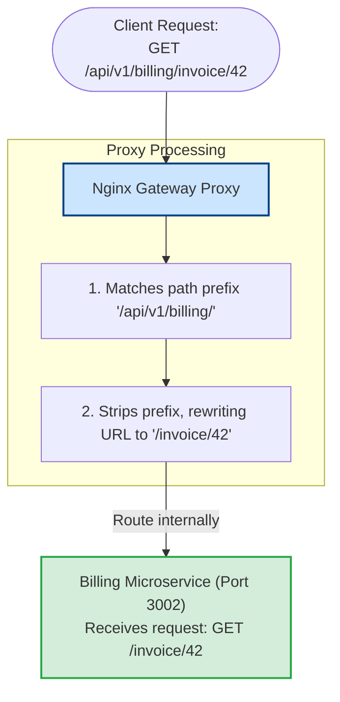

# Reverse Proxy

Exposing multiple microservice ports to clients complicates client development and creates security risks. A Reverse Proxy acts as a single gateway. It presents a unified endpoint to the public, routes requests to internal microservices based on paths, terminates SSL, and rewrites URLs on the fly, keeping your internal network secure and simple.

### Forward Proxy vs. Reverse Proxy
* **Forward Proxy (Client-side)**: Acts on behalf of the client. It intercepts outgoing requests from clients to the internet, obscuring the client's identity (e.g. VPNs or corporate web filters).
* **Reverse Proxy (Server-side)**: Acts on behalf of the servers. It intercepts incoming requests from the internet and routes them to internal backend servers, obscuring the identity and structure of the backend network.

```text
Forward Proxy (VPN/Client Side):
[ Client ] ──> [ Forward Proxy ] ──> [ Internet / Web Servers ]

Reverse Proxy (Server Gateway Side):
[ Internet / Clients ] ──> [ Reverse Proxy ] ──> [ Internal Node.js Servers ]
```

### Path-Based Routing
In microservice architectures, you run multiple independent services.
Instead of forcing clients to connect to different subdomains or ports (e.g., `api.com:3001` for users and `api.com:3002` for billing), a reverse proxy maps request paths to services in a single domain:
* `/api/v1/users` -> routes to User Service (port 3001)
* `/api/v1/billing` -> routes to Billing Service (port 3002)

## Deep Dive

### Request Path Rewrites
When using path-based routing, the microservice may expect requests to arrive at `/` instead of the prefix path `/api/v1/users/`.
* **Path Rewriting**: The reverse proxy strips out the prefix path dynamically before forwarding the request to the microservice (e.g. rewriting `/api/v1/users/profile` to `/profile` before sending it to the user service).

In Nginx, you implement this using the **`rewrite`** directive:
```nginx
rewrite ^/api/v1/users/(.*)$ /$1 break;
```

## Visual Explanation

### Path-Based Microservices Routing and Rewrites


## Real-World Example
Consider an API that handles high traffic. You deploy Nginx as a reverse proxy. To protect the backend Node.js services, you configure Nginx to rate-limit requests to 10 requests per second per IP address at the proxy boundary, blocking abusive traffic before it can consume Node.js CPU cycles.

## Code Examples

### Configuring Nginx Path-Based Routing and URL Rewriting

```nginx
# nginx-reverse-proxy.conf
# Conceptual Nginx configuration demonstrating routing and URL rewriting

http {
    # 1. Configure rate-limiting zone in shared memory
    # Stores client IP addresses ('$binary_remote_addr') and limits them to 10 requests per second
    limit_req_zone $binary_remote_addr zone=api_limit:10m rate=10r/s;

    upstream user_service {
        server 127.0.0.1:3001;
    }

    upstream billing_service {
        server 127.0.0.1:3002;
    }

    server {
        listen 80;
        server_name gateway.myapp.com;

        # Apply rate limiting to all proxy routes
        # Allows short bursts up to 5 requests
        limit_req zone=api_limit burst=5 nodelay;

        # Route 1: Map /api/users to User Service with path rewriting
        location /api/users/ {
            # Strip '/api/users' prefix before forwarding
            # Example: '/api/users/profile' is rewritten to '/profile'
            rewrite ^/api/users/(.*)$ /$1 break;

            proxy_pass http://user_service;
            proxy_set_header Host $host;
            proxy_set_header X-Real-IP $remote_addr;
        }

        # Route 2: Map /api/billing to Billing Service with path rewriting
        location /api/billing/ {
            # Strip '/api/billing' prefix before forwarding
            rewrite ^/api/billing/(.*)$ /$1 break;

            proxy_pass http://billing_service;
            proxy_set_header Host $host;
            proxy_set_header X-Real-IP $remote_addr;
        }
    }
}
```

## Best Practices
* **Keep Microservices Private**: Deploy your microservices within a private network and configure firewalls to route all public traffic through the reverse proxy gateway, securing the backend.
* **Configure Rate Limiting**: Enable rate limiting at the reverse proxy layer to block brute-force and DDoS attacks before they reach your application servers.
* **Keep Rewrites Simple**: Use simple, explicit regular expressions for URL rewrites to prevent performance issues and configuration bugs.

## Interview Questions

**Q:** What is the difference between a Forward Proxy and a Reverse Proxy?

> **Answer:**
> A forward proxy acts on behalf of clients, intercepting outgoing requests to hide the client's identity or filter traffic. A reverse proxy acts on behalf of servers, intercepting incoming requests from the internet to route them to internal backend servers, securing the network.

**Q:** What is path-based routing in a reverse proxy?

> **Answer:**
> Path-based routing is a configuration where the reverse proxy routes client requests to different backend microservices based on the URL path prefix (e.g. routing `/users` to the User Service and `/billing` to the Billing Service), presenting a single, unified domain to the public.

**Q:** Why is it useful to rewrite URL paths at the reverse proxy layer, and what Nginx directive is used to implement this?

> **Answer:**
> URL rewriting allows the proxy to strip out path prefixes (like `/api/v1/users/`) before forwarding requests to the microservices. This keeps the microservice routers simple and decoupled from the gateway's public routing paths. In Nginx, you implement this using the **`rewrite`** directive with regular expression capture groups.

**Q:** How would you architecture a high-availability reverse proxy gateway cluster using Nginx and Keepalived to ensure the gateway itself does not become a single point of failure?

> **Answer:**
> To build a high-availability reverse proxy cluster:
> 1. **Spawn Redundant Proxies**: Deploy two identical Nginx proxy servers: Nginx Active and Nginx Passive.
> 2. **Install Keepalived**: Run Keepalived daemon on both Nginx servers. Keepalived uses the **Virtual Router Redundancy Protocol (VRRP)** to monitor the health of the Nginx processes.
> 3. **Virtual IP (VIP)**: Configure a single, shared Virtual IP address (VIP) for the cluster. The domain's DNS points to this VIP.
> 4. **Failover Execution**:
> - Under normal conditions, Keepalived assigns the VIP to the Active Nginx server.
> - If the Active Nginx server crashes or loses network connection, the Keepalived daemon on the Passive Nginx server detects the failure (via missed heartbeat signals) and assigns the VIP to itself instantly (~1-2 seconds).
> - Traffic is routed to the Passive server without DNS changes, ensuring high availability.

---
Previous : [80_Nginx.md](80_Nginx.md) | Index : [00_index.md](00_index.md) | Next : [82_Load_Balancing.md](82_Load_Balancing.md)
