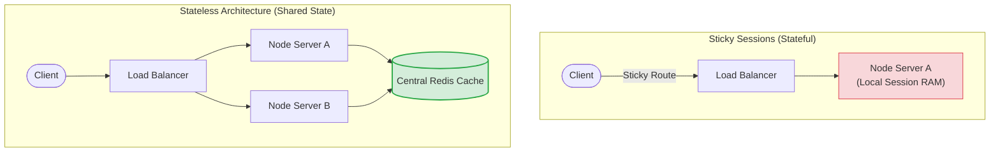
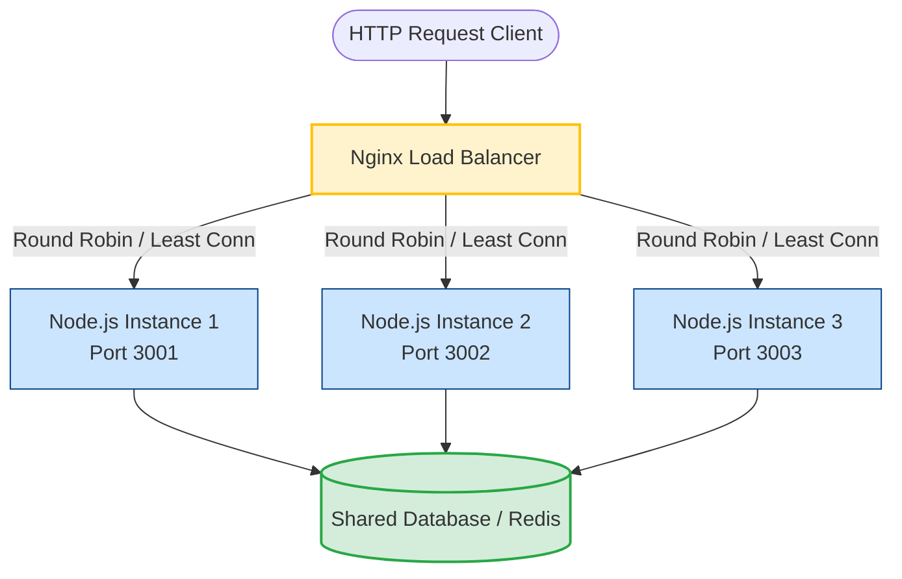

# Load Balancing

As your Node.js application scales, a single server instance becomes a performance bottleneck and a single point of failure. Load balancing allows you to distribute incoming HTTP/TCP traffic across a pool of redundant Node.js servers. This horizontal scaling model ensures high availability, fault tolerance, and smooth application delivery under high concurrent loads.

### Load Balancing Algorithms
A load balancer decides which server gets an incoming request based on its configured algorithm:
1. **Round Robin**: Distributes requests sequentially down the list of servers. Best when all backend servers have equal hardware specifications and workloads are uniform.
2. **Least Connections**: Routes the request to the server with the fewest active TCP connections. Ideal for workloads where request execution time varies significantly (e.g., long-lived operations vs. fast REST calls).
3. **IP Hash**: Computes a hash key from the client's IP address to select the backend server. This ensures that the same client always reaches the same backend instance as long as that instance is online, establishing session persistence.

### Health Checks
To prevent clients from receiving `502 Bad Gateway` errors, the load balancer must monitor the health of internal Node.js instances:
* **Passive Health Checks**: The proxy monitors traffic flowing through it. If a backend instance fails to respond to a user request or times out, the proxy marks it as failed and routes traffic away from it for a specified timeout window.
* **Active Health Checks**: The proxy sends periodic, synthetic HTTP requests (e.g., to a `/health` endpoint) at predefined intervals. If a server fails $N$ consecutive checks, it is removed from the active upstream pool.

---

## Deep Dive

### Session Persistence: Stateless vs. Sticky Sessions
In a load-balanced environment, state management becomes a challenge. If a client logs in on Server A, and the next request is balanced to Server B, they will be unauthenticated if session state is saved in local server memory.

There are two primary ways to address this:
1. **Sticky Sessions (Session Affinity)**:
   * The load balancer tracks client requests (via IP hash or custom cookies) and ensures they are always routed to the same backend node.
   * **Drawback**: Hampers even load distribution and makes rolling updates difficult because clients are tied to specific servers.
2. **Stateless Backend (Recommended)**:
   * Backend Node.js instances do not store any client state in local RAM.
   * Authentication is handled via stateless tokens (JWTs) or a centralized, high-speed shared memory store like Redis for sessions.
   * **Benefit**: Any Node.js server can handle any incoming request, allowing you to easily add or remove instances on the fly.



---

## Visual Explanation

### Traffic Flow in a Load Balanced Cluster


---

## Real-World Example
In a high-traffic production system, you scale your primary Node.js application by running four instances on the same host (bound to internal ports 3001, 3002, 3003, and 3004) managed by a process manager (like PM2 or Docker Compose). Nginx sits at the network boundary on port 80/443, acting as the front facing load balancer that directs external traffic evenly across the four port-bound instances.

---

## Code Examples

### Configuring Nginx as a Load Balancer for Node.js
This configuration sets up Nginx to load balance across three Node.js instances with passive health checks, customized weights, and backup fallback support.

```nginx
# nginx-load-balancer.conf

http {
    # Define the group of backend Node.js servers
    upstream nodejs_backend {
        # Least Connections algorithm
        least_conn;

        # server address [weight=N] [max_fails=N] [fail_timeout=sec]
        # Server 1 handles twice as much traffic as Server 2
        server 127.0.0.1:3001 weight=2 max_fails=3 fail_timeout=15s;
        server 127.0.0.1:3002 weight=1 max_fails=3 fail_timeout=15s;
        server 127.0.0.1:3003 weight=1 max_fails=3 fail_timeout=15s;

        # Backup server: only receives traffic if all other servers are offline
        server 127.0.0.1:3004 backup;
    }

    server {
        listen 80;
        server_name myapp.com;

        # Forward all requests to the upstream block
        location / {
            proxy_pass http://nodejs_backend;

            # HTTP Headers to preserve request context
            proxy_set_header Host $host;
            proxy_set_header X-Real-IP $remote_addr;
            proxy_set_header X-Forwarded-For $proxy_add_x_forwarded_for;
            proxy_set_header X-Forwarded-Proto $scheme;

            # HTTP Keep-Alive tuning for internal proxy connections
            proxy_http_version 1.1;
            proxy_set_header Connection "";
        }
    }
}
```

### Simple Node.js Server for Testing Upstream Routing
Save this script as `server.js` and run multiple instances on different ports: `PORT=3001 node server.js`, `PORT=3002 node server.js`, etc.

```javascript
// server.js
import http from 'http';

const port = process.env.PORT || 3000;
const instanceId = Math.random().toString(36).substring(2, 9);

const server = http.createServer((req, res) => {
  if (req.url === '/health') {
    res.writeHead(200, { 'Content-Type': 'application/json' });
    res.end(JSON.stringify({ status: 'UP', instance: instanceId }));
    return;
  }

  // Simulate minimal calculation latency
  res.writeHead(200, { 'Content-Type': 'text/plain' });
  res.end(`Response served by Instance: [${instanceId}] running on port: ${port}\n`);
});

server.listen(port, () => {
  console.log(`Node.js worker instance [${instanceId}] online on port ${port}`);
});
```

---

## Best Practices
* **Enforce Stateless Design**: Always decouple session state from local memory. Use JWTs or external session caches (Redis/Memcached) to keep Node.js nodes interchangeable.
* **Tuning HTTP Keep-Alive**: Ensure your Nginx configuration uses `proxy_http_version 1.1` and clears the `Connection` header (`proxy_set_header Connection "";`) in upstream declarations. This enables TCP connection reuse, saving socket allocation overhead on both sides.
* **Define Timeout Limits**: Set realistic proxy timeout parameters (e.g. `proxy_connect_timeout`, `proxy_read_timeout`) to ensure slow backend nodes are abandoned quickly instead of hanging client connections.
* **Implement Health Routing**: Expose an explicit `/health` route in your application that tests database connections and memory consumption, allowing active load balancers to detect issues before they impact real user requests.

---

## Interview Questions

**Q:** What is the primary function of a load balancer?

> **Answer:**
> A load balancer sits between client devices and backend servers, distributing incoming network or application traffic across multiple servers. This ensures no single server becomes overwhelmed, enhancing application throughput and reliability.

**Q:** Explain the difference between Round Robin and Least Connections load balancing algorithms.

> **Answer:**
> Round Robin sends incoming requests to backend servers sequentially in a loop, regardless of how many active jobs each server is currently running. Least Connections checks the current connection table of each backend server and routes the incoming request to the server with the lowest count of active TCP connections, making it more effective for variable-duration requests.

**Q:** Why are sticky sessions problematic for horizontal scaling, and how does a stateless architecture solve this?

> **Answer:**
> Sticky sessions force a load balancer to route a specific client's requests to the exact same backend server instance. This can cause uneven distribution of load (hot spotting) and makes auto-scaling difficult, as removing a server drops active connections/states. A stateless architecture moves all state (e.g. user session data) to a centralized store (like Redis), allowing any backend instance to handle any request, making horizontal scaling simple and resilient.

**Q:** How would you configure Nginx to gracefully handle a sudden crash of one of your backend Node.js microservices? Explain the directives used.

> **Answer:**
> In Nginx's `upstream` block, you use the `max_fails` and `fail_timeout` directives. For example, `server 127.0.0.1:3001 max_fails=3 fail_timeout=15s;` tells Nginx that if communications with this server fail 3 times within 15 seconds, Nginx should mark the server as unavailable for the next 15 seconds. During this window, Nginx routes incoming traffic to other active servers. When the 15-second timer expires, Nginx will try to send a real user request to the server to check if it has recovered, achieving automatic, passive failover and recovery.

---
Previous : [81_Reverse_Proxy.md](81_Reverse_Proxy.md) | Index : [00_index.md](00_index.md) | Next : [83_Observability.md](83_Observability.md)
