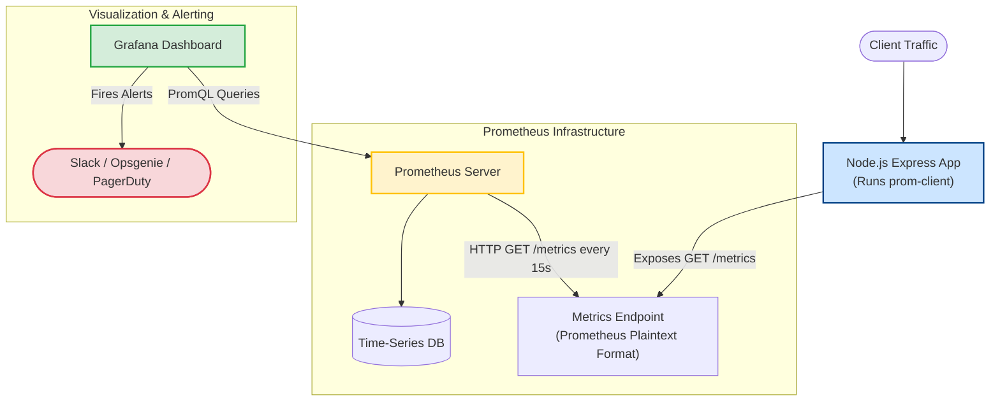

# Monitoring

If you don't measure the runtime health of your application, you cannot prevent outages. In single-threaded JavaScript environments, heavy synchronous operations block the event loop, causing request timeouts. Monitoring tracks critical parameters like event loop delay, garbage collection frequency, and V8 heap limits, allowing you to alert on anomalies and auto-scale before your server crashes due to Out-Of-Memory (OOM) errors.

### Prometheus Metric Types
Prometheus categorizes all time-series metrics into four main types:
1. **Counter**: A cumulative metric that only goes up (except on server restart). Use counters to track event occurrences.
   * *Example*: `http_requests_total` (total requests processed).
2. **Gauge**: A metric representing a single numerical value that can arbitrarily go up and down.
   * *Example*: `nodejs_active_connections` (active concurrent connections), heap usage, CPU load.
3. **Histogram**: Measures the duration or size of events and categorizes them into pre-defined buckets. It yields counters for total occurrences and sum of values.
   * *Example*: `http_request_duration_seconds_bucket` (useful for calculating P99/P95 latencies).
4. **Summary**: Similar to a histogram, it calculates configurable quantiles (like 50th, 90th, and 99th percentiles) over a sliding time window.

### Metric Scraping: Pull vs. Push
* **Pull-Based (Prometheus standard)**: The application exposes a HTTP endpoint (typically `/metrics`) serving plaintext metric lists. Prometheus periodically polls (scrapes) this endpoint to pull the data. This model keeps backend applications simple and prevents network load spikes.
* **Push-Based**: The application actively pushes metrics to a collector (e.g., StatsD, Pushgateway). Ideal for short-lived, ephemeral batch jobs that terminate before a pull scraper can run.

---

## Deep Dive

### Essential Node.js Runtime Metrics
Standard OS metrics (CPU, RAM) do not tell the full story of a Node.js process. You must track internal runtime telemetry:

* **Event Loop Delay (Lag)**: Measures the time difference between when a timer is scheduled to run and when V8 actually executes it. An Event Loop lag $> 50\text{ms}$ indicates that long synchronous operations are blocking the main thread, choking application throughput.
* **Active Handles and Requests**:
  * **Active Handles**: Open network sockets, file descriptors, TCP servers, or database client sockets.
  * **Active Requests**: Asynchronous requests that have been offloaded to Libuv (e.g. DNS lookups, crypto processes) and are waiting for callback completion.
  * *Tip*: A continuous climb in active handles indicates a resource leak (e.g., failing to close database clients or socket connections).
* **V8 Heap Memory**: Tracks memory limits: `heap_used_bytes` vs. `heap_size_limit_bytes`. Helps detect memory leaks before V8 hits its heap limit and throws an OOM crash.
* **Garbage Collection (GC) Pauses**: Measures how long execution is paused during GC collections. Frequent, long major GC sweeps indicate memory pressure.

---

## Visual Explanation

### Pull-Based Metrics Collection with Prometheus and Grafana


---

## Real-World Example
In a production deployment, a slow SQL query in a billing microservice causes database connections to pool. The number of Active Handles inside the Node.js process climbs steadily, while the Event Loop lag stays low. A Prometheus alert triggers on `nodejs_active_handles_total > 500`, alerting the engineering team to optimize the database pool size before the system runs out of database connections.

---

## Code Examples

### Exposing Default and Custom Prometheus Metrics in Express
Below is a complete script demonstrating how to collect standard Node.js performance metrics and expose them via a Prometheus scraper router in Express.

First, install the metrics library:
```bash
npm install prom-client express
```

Create `server.js`:

```javascript
// server.js
import express from 'express';
import client from 'prom-client';

const app = express();
const port = process.env.PORT || 3000;

// 1. Initialize Default Node.js Metrics Collection
// This monitors heap, event loop lag, CPU, active handles, GC pauses, etc.
const collectDefaultMetrics = client.collectDefaultMetrics;
collectDefaultMetrics({ prefix: 'nodejs_app_' });

// 2. Define Custom Metrics
// Track HTTP request duration in buckets for SLA calculations (P99/P95)
const httpRequestDurationMicroseconds = new client.Histogram({
  name: 'nodejs_http_request_duration_seconds',
  help: 'Duration of HTTP requests in seconds',
  labelNames: ['method', 'route', 'status_code'],
  buckets: [0.1, 0.3, 0.5, 0.7, 1, 2, 5], // Define bucket ranges in seconds
});

// Middleware to record request duration
app.use((req, res, next) => {
  const start = process.hrtime();

  res.on('finish', () => {
    const diff = process.hrtime(start);
    const durationInSeconds = diff[0] + diff[1] / 1e9;
    
    // Do not log metric endpoint queries to avoid skewing metrics
    if (req.route && req.route.path !== '/metrics') {
      httpRequestDurationMicroseconds
        .labels(req.method, req.route.path, res.statusCode.toString())
        .observe(durationInSeconds);
    }
  });

  next();
});

// 3. Define the Prometheus Scraping Route
app.get('/metrics', async (req, res) => {
  try {
    res.set('Content-Type', client.register.contentType);
    res.end(await client.register.metrics());
  } catch (err) {
    res.status(500).end(err.message);
  }
});

// Sample application routes
app.get('/api/users', (req, res) => {
  res.json([{ id: 1, name: 'Alice' }]);
});

app.get('/api/slow', async (req, res) => {
  // Simulate slow response logic
  await new Promise((resolve) => setTimeout(resolve, 800));
  res.send('Slow operation completed');
});

app.listen(port, () => {
  console.log(`Application server running on port ${port}`);
  console.log(`Prometheus metrics endpoint available at http://localhost:${port}/metrics`);
});
```

---

## Best Practices
* **Prefix Custom Metrics**: Always prefix custom application metrics (e.g. `nodejs_app_`) to separate your application's domain from third-party library or system metrics.
* **Keep Scrape Time Low**: Avoid heavy computations inside the `/metrics` path. The handler should read values cached in RAM rather than querying databases.
* **Configure Low Scrape Frequency**: In production, scrape intervals should be between 10 to 30 seconds. Scraping every second puts unnecessary CPU pressure on Node.js.
* **Observe Percentiles**: Do not rely on average latency (Mean) to monitor performance. Averages hide outliers. Use Histogram-based percentiles (P95/P99) to capture the worst-performing 5% or 1% of client requests.

---

## Interview Questions

**Q:** What endpoint path does Prometheus typically scrape, and what format is the data returned in?

> **Answer:**
> Prometheus typically scrapes the `/metrics` endpoint path. The data is returned in a standard plaintext key-value format containing metrics names, labels, values, and comments containing type descriptions.

**Q:** What is "Event Loop Lag" in Node.js, and how is it programmatically measured?

> **Answer:**
> Event loop lag is the delay between when an asynchronous callback is scheduled to run and when it actually executes. It is measured by scheduling a recurring timer (e.g. using `setInterval`) for a set interval (like 1000ms), checking the actual time elapsed since the last tick, and calculating the difference between the actual interval and the target 1000ms.

**Q:** What is the difference between active requests and active handles in Node.js metrics?

> **Answer:**
> Active handles (`process._getActiveHandles()`) are physical system resources held by the Node.js process, such as open database client connections, TCP server ports, active timers, or open files. Active requests (`process._getActiveRequests()`) represent scheduled asynchronous operations managed by Libuv that are currently executing in the OS kernel or thread pool (e.g., DNS queries, cryptographical hashing, filesystem actions) and waiting to complete.

**Q:** How would you configure alerting rules in Prometheus to detect memory leaks and event loop blocking before a Node.js process crashes? Write the conceptual PromQL.

> **Answer:**
> To detect these issues, you configure Prometheus Alerting Rules using **PromQL**:
> 1. **Memory Leak**: Check if V8 heap utilization exceeds 85% of its hard limit:
> `nodejs_app_nodejs_heap_size_used_bytes / nodejs_app_nodejs_heap_size_limit_bytes > 0.85`
> 2. **Blocked Event Loop**: Alert if the 99th percentile of event loop lag is greater than 100 milliseconds for more than 5 minutes:
> `histogram_quantile(0.99, sum(rate(nodejs_app_nodejs_eventloop_lag_seconds_bucket[5m])) by (le)) > 0.1`

---
Previous : [83_Observability.md](83_Observability.md) | Index : [00_index.md](00_index.md) | Next : [85_Logging_Pipelines.md](85_Logging_Pipelines.md)
