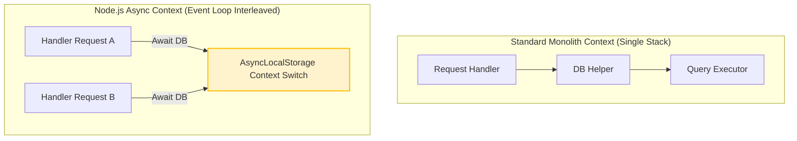
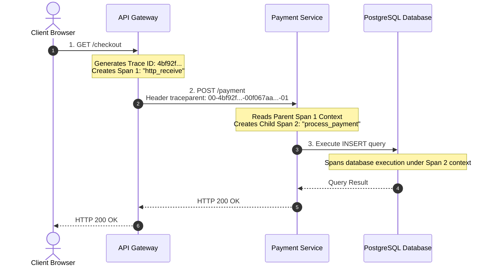

# Distributed Tracing

In a monolithic application, analyzing code execution is simple because stack traces are execution-bounded. In microservices, a single client request triggers a domino effect of internal API calls across multiple servers, programming languages, and databases. If a request is slow or errors out, logs cannot easily show the path or sequence. Distributed tracing acts as a distributed debugger, mapping the chronological path of requests across your entire system.

### Trace Context Propagation
For tracing to work across network boundaries, services must communicate their active state. **Context Propagation** is the act of serializing trace metadata (Trace ID, Parent Span ID, Flags) into outgoing network request headers and deserializing them at the receiving microservice.

### The W3C Trace Context Standard
To prevent compatibility issues between tracing tools, the World Wide Web Consortium (W3C) standardized context headers. The primary HTTP header is **`traceparent`**:

```text
traceparent: 00-4bf92f3577b34da6a3ce929d0e0e4736-00f067aa0ba902b7-01
             │  └──────────────┬──────────────┘ └───────┬──────┘ └─┬┘
          Version           Trace ID                 Span ID     Trace Flags
          (2 hex)           (32 hex)                 (16 hex)     (8-bit)
```
* **Version**: Currently `00`.
* **Trace ID**: Unique 32-character hexadecimal string representing the entire transaction flow. It remains constant across all service hops.
* **Span ID**: Unique 16-character hexadecimal string representing the current unit of work. Each service hop generates a new Span ID.
* **Trace Flags**: Controls options like sampling. `01` means the request is sampled (recorded), `00` means it is not.

---

## Deep Dive

### AsyncLocalStorage and Context Retention
Node.js's event loop executes callbacks in a non-sequential order. When a server receives an HTTP request, V8 jumps between different events, making global variable context mapping impossible.

To solve this, Node.js provides **`AsyncLocalStorage`** (from the `async_hooks` module). It creates a store that persists data across asynchronous execution boundaries (Promises, callbacks, timers). The OpenTelemetry SDK wraps its context management around `AsyncLocalStorage` to implicitly store the current "Active Span" without requiring developers to manually pass span variables through every function signature.



---

## Visual Explanation

### Trace Propagation across HTTP boundaries


---

## Real-World Example
Consider an e-commerce checkout flow. The client hits the gateway, which calls the user service, inventory service, and billing service. When you check your Jaeger interface, you see a request trace. The overall trace takes 4.2 seconds. Expanding the trace hierarchy reveals that the gateway request to the payment microservice was fast (100ms), but the payment service's call to the Stripe API took 4.1 seconds. You can now clearly isolate the external integration bottleneck.

---

## Code Examples

### Implementing Manual W3C Context Propagation
Here is a raw demonstration of how trace context is parsed, updated, and forwarded using Node.js's core HTTP module. This shows how instrumentation libraries function under the hood.

```javascript
// trace-context-propagation-demo.js
import http from 'http';
import { randomBytes } from 'crypto';
import { AsyncLocalStorage } from 'async_hooks';

// Setup async storage to hold active span data
const asyncLocalStorage = new AsyncLocalStorage();

// Helper to generate IDs
const generateId = (bytes) => randomBytes(bytes).toString('hex');

// Middleware to parse and initialize Trace Context
function handleIncomingTrace(req) {
  const traceparent = req.headers['traceparent'];
  let traceId, parentSpanId, sampled;

  if (traceparent) {
    // Format: version-traceId-parentId-flags
    const parts = traceparent.split('-');
    if (parts.length === 4) {
      traceId = parts[1];
      parentSpanId = parts[2];
      sampled = parts[3];
    }
  }

  // If no traceparent is present, initialize a new trace root
  if (!traceId) {
    traceId = generateId(16); // 32 hex chars
    parentSpanId = '0000000000000000'; // No parent
    sampled = '01';
  }

  // Generate a new Span ID for this service's execution block
  const currentSpanId = generateId(8); // 16 hex chars

  return {
    traceId,
    parentSpanId,
    currentSpanId,
    sampled,
    // Construct traceparent header for outbound calls
    traceparentHeader: `00-${traceId}-${currentSpanId}-${sampled}`
  };
}

// Service A (API Gateway)
const serviceA = http.createServer((req, res) => {
  const context = handleIncomingTrace(req);

  // Run downstream calls inside AsyncLocalStorage context
  asyncLocalStorage.run(context, () => {
    const currentContext = asyncLocalStorage.getStore();
    console.log(`[Service A] Active Trace ID: ${currentContext.traceId} | Span ID: ${currentContext.currentSpanId}`);

    // Call Service B
    const options = {
      hostname: 'localhost',
      port: 3002,
      path: '/process',
      method: 'GET',
      headers: {
        // Propagate trace context to Service B
        'traceparent': currentContext.traceparentHeader
      }
    };

    const requestToB = http.request(options, (responseFromB) => {
      let data = '';
      responseFromB.on('data', chunk => data += chunk);
      responseFromB.on('end', () => {
        res.writeHead(200, { 'Content-Type': 'application/json' });
        res.end(JSON.stringify({ 
          serviceA: 'Success', 
          serviceBResponse: JSON.parse(data) 
        }));
      });
    });

    requestToB.end();
  });
});

// Service B (Payment Microservice)
const serviceB = http.createServer((req, res) => {
  const context = handleIncomingTrace(req);

  asyncLocalStorage.run(context, () => {
    const currentContext = asyncLocalStorage.getStore();
    console.log(`[Service B] Received Trace ID: ${currentContext.traceId}`);
    console.log(`[Service B] Parent Span ID (from Service A): ${currentContext.parentSpanId}`);
    console.log(`[Service B] Current Span ID: ${currentContext.currentSpanId}`);

    res.writeHead(200, { 'Content-Type': 'application/json' });
    res.end(JSON.stringify({
      status: 'Payment Processed',
      traceId: currentContext.traceId,
      spanId: currentContext.currentSpanId
    }));
  });
});

// Start servers on local ports
serviceA.listen(3001, () => console.log('Service A online on port 3001'));
serviceB.listen(3002, () => console.log('Service B online on port 3002'));
```

---

## Best Practices
* **Standardize on W3C headers**: Do not write custom context formats (like `X-Trace-ID`). Standardize on the W3C `traceparent` standard to ensure compatibility across cloud services, API gateways, and external providers.
* **Log Trace IDs on Errors**: When an error is caught in your global error handler, always extract the active Trace ID and output it inside the error log response payload, allowing users to coordinate bug tickets with logs.
* **Keep Trace Payload Slim**: Do not store massive object payloads inside span attributes (e.g. stringifying user database rows). Keep attributes focused on metadata (e.g. `user.id`, `payment.provider`, `http.status_code`).
* **Manage Sampling Rate**: Tracing every single request uses significant CPU, disk space, and bandwidth. Set production sampling to 1% to 10% for successful requests and 100% for error requests.

---

## Interview Questions

**Q:** What is context propagation in distributed tracing?

> **Answer:**
> Context propagation is the mechanism of passing trace identity metadata (such as the Trace ID and parent Span ID) across physical network boundaries, typically by injecting them as HTTP headers or message queue metadata envelopes, allowing downstream services to register their spans under the same trace.

**Q:** What are the four components of a W3C `traceparent` header?

> **Answer:**
> The W3C `traceparent` header is formatted as `version-traceId-parentId-flags`.
> 1. `version`: The protocol version (currently `00`).
> 2. `traceId`: The 32-hex-character unique identifier for the overall trace.
> 3. `parentId`: The 16-hex-character span identifier of the caller service.
> 4. `flags`: 8-bit flags controlling trace attributes (e.g., `01` indicates that the request is sampled).

**Q:** How does `AsyncLocalStorage` help in tracing asynchronous JavaScript execution? Why can't we use standard global variables?

> **Answer:**
> Since JavaScript is single-threaded and execution is non-blocking, callbacks, promises, and events execute out of sequence. Standard global variables would leak across different users' concurrent executions. `AsyncLocalStorage` allocates state to specific asynchronous resource trees. As V8 processes asynchronous ticks, it tracks context boundaries, allowing libraries to retrieve active context like the current Trace ID without polluting global scopes.

**Q:** How would you trace asynchronous request paths that span across an HTTP Gateway, a Kafka message broker, and multiple worker microservices?

> **Answer:**
> To trace request paths across messaging brokers:
> 1. **Gateway Initialization**: The HTTP Gateway initializes the trace and records the incoming HTTP request.
> 2. **Kafka Header Injection**: When publishing a message, the gateway extracts the active trace context from `AsyncLocalStorage` and serializes it into the Kafka message's header metadata fields (as a key-value byte array string).
> 3. **Broker Propagation**: Kafka carries this header metadata transparently along with the message payload to partition queues.
> 4. **Worker Context Extraction**: When the consumer worker polls the message from the partition, its Kafka instrumentation middleware extracts the trace metadata from the message headers, initializes a new context, and starts a child span. This links the asynchronous worker execution trace to the initial gateway request.

---
Previous : [85_Logging_Pipelines.md](85_Logging_Pipelines.md) | Index : [00_index.md](00_index.md) | Next : [87_Production_Architecture.md](87_Production_Architecture.md)
