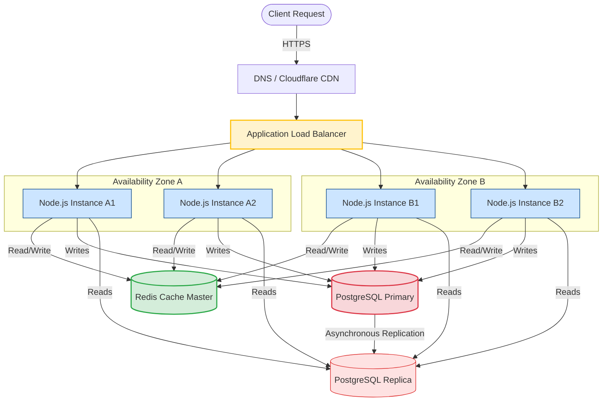

# Production Architecture

A Node.js server running on a single server or container will eventually fail due to hardware crashes, network outages, or resource exhaustion. Designing a production-grade architecture ensures your backend services can survive outages, scale dynamically under heavy user demand, and process database queries efficiently without bottlenecking the central primary database.

### Multi-Tier Architecture
A production system segregates concerns into distinct layers:
1. **Edge Tier**: Handles DNS queries (e.g. Route53) and Content Delivery Networks (CDNs like Cloudflare) to cache static assets near the client.
2. **Gateway Tier**: Public entry point (Nginx, ALB, or API Gateways) providing SSL termination, rate-limiting, and routing.
3. **Application Tier**: Stateless Node.js microservices running inside auto-scaling groups or container orchestrators (Kubernetes).
4. **Caching Tier**: In-memory data structures (Redis/Memcached) storing query results and sessions to bypass database calls.
5. **Database Tier**: Relational (PostgreSQL) or document databases (MongoDB) configured for high-availability.

### High Availability (HA) & Redundancy
High Availability is the practice of running redundant components to eliminate Single Points of Failure (SPOF).
* **Multi-AZ Deployments**: Running Node.js instances across multiple, isolated geographical physical data centers (Availability Zones).
* **Load Balancer Routing**: If AZ-1 goes offline due to a power outage, the load balancer detects the failure and routes all incoming traffic to active nodes in AZ-2.

---

## Deep Dive

### Read/Write Database Splitting
Relational database scaling is restricted by disk I/O and locking issues. In high-traffic systems, most operations are reads (e.g., viewing profiles, reading blogs) rather than writes (creating posts, updating accounts).

To scale the database tier:
* **Primary (Writer) Node**: Handles all writes, updates, and transactions.
* **Replica (Reader) Nodes**: One or more read-only databases that asynchronously replicate data from the Primary.
* **Node.js Integration**: Your Node.js database connector must maintain two distinct connection pools: one targeting the primary (for writes) and one targeting the replica cluster address (for reads).

### The Stateless Application Requirement
To run Node.js in an auto-scaling container environment, the application must be completely stateless.
1. **No Local File Storage**: Do not save user uploads (e.g., profile pictures) to the container filesystem. Use Object Storage (AWS S3) instead.
2. **No Local Memory Sessions**: Do not store login states in Node.js RAM. Use external session stores (Redis) or stateless tokens (JWTs).
3. **No In-Memory Background Tasks**: Do not run long-running background loops in local memory. Offload them to specialized worker processes using message queues (BullMQ/RabbitMQ).

---

## Visual Explanation

### Production-Grade Enterprise System Layout


---

## Real-World Example
In a media hosting portal, a user uploads a high-resolution video. If Node.js stored this file locally, scaling out would fail because another server instance wouldn't have access to the file. Instead, the Node.js server generates a secure, short-lived **S3 Presigned URL**. The client browser uploads the video file directly to the S3 bucket. Node.js only writes the final S3 file URL to the database, keeping the server instance stateless and light.

---

## Code Examples

### Implementing Read/Write Splitting in a Node.js Database Router
Here is how you structure a database router client utilizing PostgreSQL pools to route read and write operations dynamically to their respective server instances.

First, install the PostgreSQL driver:
```bash
npm install pg
```

Create `db.js`:

```javascript
// db.js
import pg from 'pg';
const { Pool } = pg;

// 1. Connection configuration for the Primary (Write) database
const primaryConfig = {
  host: process.env.DB_PRIMARY_HOST || 'localhost',
  port: parseInt(process.env.DB_PRIMARY_PORT || '5432'),
  user: process.env.DB_USER || 'postgres',
  password: process.env.DB_PASSWORD || 'secret',
  database: process.env.DB_NAME || 'prod_db',
  max: 20 // Pool size optimized for active writes
};

// 2. Connection configuration for the Replica (Read-Only) cluster
const replicaConfig = {
  host: process.env.DB_REPLICA_HOST || 'localhost', // Typically pointing to a Reader Endpoint load balancer
  port: parseInt(process.env.DB_REPLICA_PORT || '5433'),
  user: process.env.DB_USER || 'postgres',
  password: process.env.DB_PASSWORD || 'secret',
  database: process.env.DB_NAME || 'prod_db',
  max: 50 // Larger pool size for heavy concurrent reads
};

const writePool = new Pool(primaryConfig);
const readPool = new Pool(replicaConfig);

// Log pool errors to prevent process crashes
writePool.on('error', (err) => console.error('Primary DB Pool Error:', err));
readPool.on('error', (err) => console.error('Replica DB Pool Error:', err));

// 3. Database router object exposing write/read methods
const db = {
  /**
   * Execute write queries on the primary database pool
   * @param {string} text - SQL Query String
   * @param {Array} params - Query Parameters
   */
  async write(text, params) {
    console.log(`[DB ROUTER] Directing WRITE query to Primary: ${text.substring(0, 30)}...`);
    return writePool.query(text, params);
  },

  /**
   * Execute read-only queries on the replica database pool
   * @param {string} text - SQL Query String
   * @param {Array} params - Query Parameters
   */
  async read(text, params) {
    console.log(`[DB ROUTER] Directing READ query to Replica: ${text.substring(0, 30)}...`);
    return readPool.query(text, params);
  },

  // Close all pools during application shutdown
  async shutdown() {
    await Promise.all([writePool.end(), readPool.end()]);
    console.log('Database pools closed successfully');
  }
};

export default db;
```

Example usage inside a controller:
```javascript
// controller.js
import db from './db.js';

// Read query routed to Replica
async function getUserProfile(userId) {
  const query = 'SELECT id, username, email FROM users WHERE id = $1';
  const result = await db.read(query, [userId]);
  return result.rows[0];
}

// Write query routed to Primary
async function updateUserEmail(userId, newEmail) {
  const query = 'UPDATE users SET email = $2, updated_at = NOW() WHERE id = $1 RETURNING *';
  const result = await db.write(query, [userId, newEmail]);
  return result.rows[0];
}
```

---

## Best Practices
* **Keep Apps Stateless**: Never save critical variables, file uploads, or user sessions to local server directories. Keeping app instances stateless makes scaling and server replacements trivial.
* **Use Connection Pooling**: Never instantiate a new database client per request. Keep database pools active and reuse TCP connections to reduce handshake delays.
* **Enable Multi-AZ Deployments**: Deploy your services across at least two Availability Zones (AZ) to guard against regional network disruptions or datacenter power grid failures.
* **Automate Failovers**: Utilize managed load balancers and database systems (e.g. AWS RDS Multi-AZ) that detect primary database crashes and auto-promote replica nodes to primary status instantly.

---

## Interview Questions

**Q:** What is the difference between vertical scaling and horizontal scaling?

> **Answer:**
> Vertical scaling (scaling up) means adding more hardware resources (like upgrading CPU, RAM, or disk space) to a single server. Horizontal scaling (scaling out) means adding more identical server machines or containers to your resource pool, sharing traffic via a load balancer.

**Q:** Why should a production Node.js application be stateless?

> **Answer:**
> In production, traffic is distributed across multiple dynamic server nodes. If an application stores state (like login sessions or user files) locally on one node, subsequent requests routed to other nodes will fail because they lack access to that localized data. Keeping the backend stateless allows any node to handle any request and enables autoscaling.

**Q:** How does database read/write splitting improve application performance, and how is it handled in Node.js?

> **Answer:**
> Database write operations require row/table locks and transaction processing, which are resource-intensive. Reading data (queries) is faster but high in frequency. Splitting these operations isolates the Primary database to handle writes, while routing read operations to a cluster of Read Replicas. In Node.js, this is handled by instantiating two separate connection pools: one pointing to the writer database node and another to the reader endpoint.

**Q:** How would you architecture a file processing Node.js system that handles user photo uploads, resizes them, and serves them globally, ensuring high availability, statelessness, and optimal CDN cache hit rates?

> **Answer:**
> 1. **Upload Phase**: Client requests a presigned upload URL from the Node.js API server. The server generates a secure AWS S3 presigned URL. The client uploads the file directly to an S3 bucket (S3 Upload Bucket), bypassing Node.js memory limits.
> 2. **Processing Phase**: An S3 upload event triggers a serverless function (AWS Lambda) or publishes a message to a queue (RabbitMQ/SQS). A stateless Node.js worker microservice consumes this event, downloads the photo from S3, uses the `sharp` library to resize it, and uploads the compressed image to a separate S3 public bucket.
> 3. **Delivery Phase**: An edge CDN (like Cloudflare or AWS CloudFront) is configured with the public S3 bucket as its origin.
> 4. **Caching optimization**: Images are requested through the CDN domain (e.g. `cdn.myapp.com/photos/image.jpg`). The CDN caches images globally, ensuring high speed and reducing requests to S3. Cache headers (`Cache-Control: public, max-age=31536000`) are applied to optimize edge caching.

---
Previous : [86_Distributed_Tracing.md](86_Distributed_Tracing.md) | Index : [00_index.md](00_index.md) | Next : [88_System_Design_for_NodeJS.md](88_System_Design_for_NodeJS.md)
