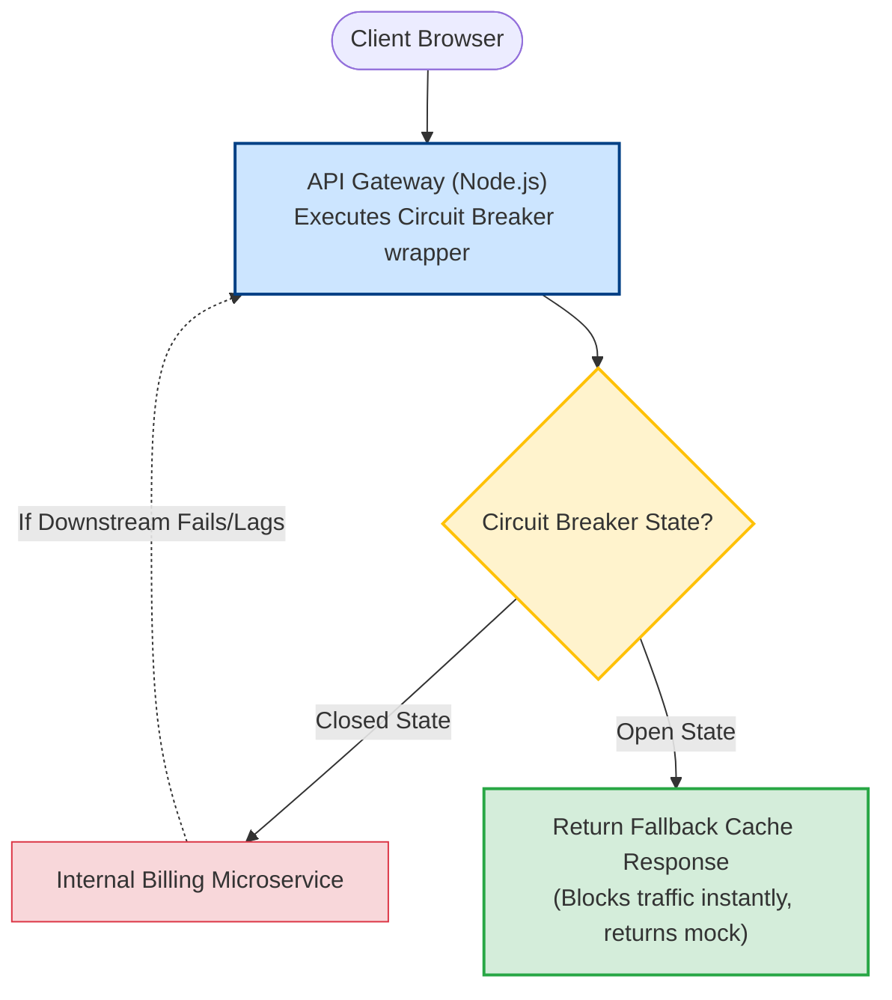

# System Design for Node.js

System design is the ultimate step of production-grade engineering. As a Node.js architect, you must know how to scale applications to handle millions of requests, integrate databases resiliently, and prevent cascading failures where one slow downstream service crashes your entire API gateway fleet.

### Designing for High Concurrency
Node.js is optimized for high-concurrency I/O workloads because its single thread avoids thread-switching overhead. However, it requires specific design guidelines:
1. **Never Block the Event Loop**: Compute intensive operations (image resizing, token parsing, cryptographic hash loops) must be offloaded to worker thread pools.
2. **Apply Backpressure**: In stream pipelines, ensure consumer speeds align with producer volumes to prevent memory overflows.
3. **Decouple Components**: Use message brokers (Kafka/RabbitMQ) to decouple fast web servers from slower processing services.

### Resiliency Patterns
Distributed systems are prone to partial failures:
* **Circuit Breaker**: If a downstream service fails repeatedly, the circuit breaker opens, blocking outbound requests and instantly returning a fallback response. This gives the downstream service time to recover and prevents the upstream Node.js application from wasting system sockets.
* **Exponential Backoff**: When a query fails, do not retry immediately. Increase the wait time exponentially (e.g., $1\text{s}$, $2\text{s}$, $4\text{s}$, $8\text{s}$).
* **Jitter**: Add random variance (noise) to the backoff interval. If 10,000 servers retry at the exact same exponential interval, they will create a "thundering herd" DDoS effect on the target database when it restarts. Jitter scatters retry attempts.

---

## Deep Dive

### Deep Dive: Scalability Calculations
Before writing code, an architect must calculate system constraints:

#### 1. Throughput & QPS (Queries Per Second)
* Let's say your system has **10 million active daily users (DAU)**.
* Average requests per user per day = 10.
* Total daily requests = $10\text{M} \times 10 = 100\text{M}$ requests/day.
* Average QPS = $100\text{M} / 86400\text{ seconds} \approx 1160\text{ QPS}$.
* Peak QPS (usually $2\text{x}$ to $5\text{x}$ average) $\approx 2320 - 5800\text{ QPS}$.

#### 2. Node.js Memory Allocation
* Standard Node.js V8 memory footprint under load: $\approx 100\text{ MB}$ to $200\text{ MB}$.
* Default max heap size limit: $\approx 1.4\text{ GB}$ (on 64-bit systems).
* If a single Node.js container is allocated $512\text{ MB}$ RAM on Kubernetes, you should run it with:
  `node --max-old-space-size=400 server.js`
  to leave $112\text{ MB}$ of memory space for V8 internal threads and active OS handles.

---

## Visual Explanation

### Distributed Architecture with Circuit Breakers


---

## Real-World Example
Consider a ride-sharing driver tracking platform. Thousands of drivers update their GPS coordinates every 2 seconds. Exposing a traditional HTTP database route for this would crash database write connections.
Instead, coordinates are sent via WebSockets to a Node.js gateway. The gateway forwards coordinates to a **Redis Geospatial Index** (`GEOADD`) for low-latency queries and pushes location logs to a **Kafka Topic** for offline auditing. This design isolates writes from the main database tier, handling huge concurrency cleanly.

---

## Code Examples

### Implementing a Custom Circuit Breaker in Node.js
Here is a complete, lightweight implementation of the Circuit Breaker pattern. It monitors failure rates and prevents calling an unreliable downstream service.

```javascript
// circuit-breaker.js
export class CircuitBreaker {
  constructor(requestFunction, options = {}) {
    this.requestFunction = requestFunction; // The API call to wrap
    this.failureThreshold = options.failureThreshold || 3; // Max failures before opening
    this.cooldownPeriod = options.cooldownPeriod || 10000; // Time in ms to wait before retry (half-open)
    
    this.state = 'CLOSED'; // States: CLOSED, OPEN, HALF-OPEN
    this.failureCount = 0;
    this.nextAttemptTime = Date.now();
  }

  async execute(...args) {
    this.checkState();

    if (this.state === 'OPEN') {
      console.warn('[CIRCUIT BREAKER] Service unavailable. Returning fallback response.');
      return this.fallback();
    }

    try {
      const response = await this.requestFunction(...args);
      this.success();
      return response;
    } catch (error) {
      this.failure(error);
      throw error;
    }
  }

  checkState() {
    if (this.state === 'OPEN' && Date.now() > this.nextAttemptTime) {
      this.state = 'HALF-OPEN';
      console.log('[CIRCUIT BREAKER] Cooldown expired. Attempting half-open connection.');
    }
  }

  success() {
    this.failureCount = 0;
    this.state = 'CLOSED';
  }

  failure(error) {
    this.failureCount++;
    console.error(`[CIRCUIT BREAKER] Execution failure count: ${this.failureCount}`);
    
    if (this.failureCount >= this.failureThreshold) {
      this.state = 'OPEN';
      this.nextAttemptTime = Date.now() + this.cooldownPeriod;
      console.error(`[CIRCUIT BREAKER] Failure limit reached. Opening circuit for ${this.cooldownPeriod}ms.`);
    }
  }

  fallback() {
    // Return cached or mock fallback data to client
    return { success: false, data: 'Fallback data: service temporarily offline.' };
  }
}

// ==========================================
// TEST IMPLEMENTATION
// ==========================================
async function unreliableApiCall() {
  if (Math.random() > 0.3) {
    throw new Error('Database Timeout');
  }
  return { success: true, data: 'Fresh data from API' };
}

const breaker = new CircuitBreaker(unreliableApiCall, {
  failureThreshold: 2,
  cooldownPeriod: 3000
});

// Run simulated requests
setInterval(async () => {
  try {
    const result = await breaker.execute();
    console.log('Result:', result);
  } catch (err) {
    console.log('Error caught:', err.message);
  }
}, 1000);
```

---

## Best Practices
* **Enforce Outbound Timeouts**: Never make an HTTP or TCP call to an external service without configuring strict timeout limits (e.g. `timeout: 5000`). If downstream services hang indefinitely, your Node.js sockets will exhaust, stalling your server.
* **Isolate Downstream Failures**: Wrap every microservice dependency inside a Circuit Breaker package (e.g., Opossum or your custom wrapper).
* **Apply Retry Jitter**: Always use exponential backoff *with jitter* for database reconnections and external API requests to avoid overloading recovering target systems.
* **Leverage CDN and In-Memory Caching**: Direct read-intensive workloads away from Node.js runtime execution stacks entirely by maximizing CDN cache hit ratios at the edge network boundary.

---

## Interview Questions

**Q:** What does it mean to add "Jitter" to a retry strategy?

> **Answer:**
> Jitter is the introduction of a random delay interval inside a retry system. Without jitter, if a database recovers from a crash, all waiting servers running exponential backoff retries would query it at the exact same timed intervals, creating a thundering herd crash. Jitter spreads retry attempts over random windows.

**Q:** What are the three states of a Circuit Breaker pattern?

> **Answer:**
> 1. **CLOSED**: Request flows normally through to the downstream service.
> 2. **OPEN**: Requests are blocked immediately. The circuit fails fast or returns fallback cache data without contacting the failing downstream service.
> 3. **HALF-OPEN**: After a cooldown window, the circuit breaker allows a limited number of test requests to pass. If they succeed, the circuit goes back to CLOSED. If they fail, the circuit returns to the OPEN state.

**Q:** How do you calculate the required cluster size (instances) of a Node.js application to handle a target peak of 10,000 QPS with an average response time of 50ms per request?

> **Answer:**
> 1. **Concurrency Requirement**: Average request duration is $50\text{ms} = 0.05\text{ seconds}$.
> 2. **Capacity per Single Instance**: A single Node.js thread running non-blocking operations can handle 1 request every 50ms if it executes concurrently, but to calculate execution capacity:
> $$1 \text{ instance capacity} = \frac{1}{\text{Response Time}} = \frac{1}{0.05} = 20 \text{ requests per second per connection}.$$
> With event loop concurrency limits, a single core thread can handle $\approx 200 - 500$ concurrent network connections before CPU saturation/Event loop lag spikes.
> 3. **Scaling Target**: To support $10,000\text{ QPS}$ safely with a safety ceiling coefficient of 2 (to absorb spikes):
> $$\text{Target QPS} = 20,000.$$
> If a single optimized container core handles $400\text{ QPS}$ at $< 10\text{ms}$ event loop delay:
> $$\text{Instances Required} = \frac{20,000}{400} = 50 \text{ instance cores}.$$
> You should deploy 50 cluster worker containers behind the load balancer.

**Q:** How would you design a high-throughput notifications service in Node.js that must send 1 million push notifications/emails per hour, ensuring that slow third-party SMTP/SMS API providers do not cause memory leaks or event loop blockages?

> **Answer:**
> 1. **API Gateway / Input Layer**: A lightweight Express/Fastify gateway accepts requests, validates inputs using `Zod`, writes them to a message queue, and returns `202 Accepted` immediately. This keeps gateway event loops fast and prevents connection blocking.
> 2. **Broker Buffering (Queue)**: Use **Apache Kafka** or a **Redis Streams (BullMQ)** queue cluster. This decouples notification intake from delivery processing.
> 3. **Worker Nodes (Consumer)**: Run a fleet of stateless Node.js consumer containers. Each worker consumes batches from the queue.
> 4. **Non-Blocking I/O Execution**: The actual delivery triggers HTTP requests to external email (SendGrid) or SMS (Twilio) APIs. Use standard asynchronous client pools. Expose client options with low connection and response timeout limits (`timeout: 2000ms`).
> 5. **Concurrency Management (Backpressure)**: Consume only as many jobs as the Node.js memory profile permits. Use BullMQ's rate-limiter or Kafka consumer batch offsets to prevent the worker process from pulling more messages than V8 memory can hold when SMTP calls stall.
> 6. **Resiliency**: Wrap third-party calls in Circuit Breakers to stop requests immediately if SendGrid/Twilio goes down, redirecting notifications to a fallback queue or dead-letter queue (DLQ) for manual inspection.

---
Previous : [87_Production_Architecture.md](87_Production_Architecture.md) | Index : [00_index.md](00_index.md) | Next : N/A
