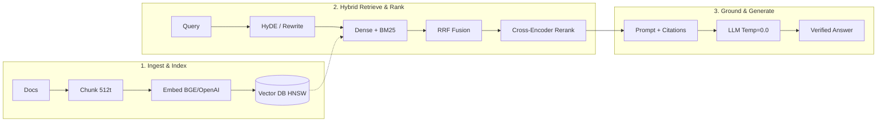

# ⚡ RAG (Retrieval-Augmented Generation) – Quick Revision Cheat Sheet

> **A 5–10 Minute Master Revision Guide for RAG Architecture, Retrieval Techniques, and Interview Preparation.**
> 🔗 **Detailed 30-Question Notes:** [01_RAG_30_Questions.md](./01_RAG_30_Questions.md)

---

## 🧭 End-to-End RAG Workflow

---

## 📌 Topic-by-Topic Revision Summary

### 1. RAG Fundamentals & Architecture
- **What is RAG:** Decouples reasoning (LLM) from memory (Vector DB). Retrieves authoritative facts from external private stores before prompt generation.
- **Why RAG Exists:** Solves LLM **knowledge cutoff**, eliminates **hallucinations**, keeps **enterprise data private**, and avoids **expensive model retraining**.
- **The 2 Pipelines:**
  - *Offline Ingestion:* Extract $\rightarrow$ Clean $\rightarrow$ Chunk $\rightarrow$ Embed $\rightarrow$ Store in Vector DB + Metadata.
  - *Online Retrieval:* User Query $\rightarrow$ Embed $\rightarrow$ Hybrid Search $\rightarrow$ Rerank $\rightarrow$ Inject Context $\rightarrow$ LLM Synthesis.
- 🔗 *Deep Dive:* [Q1: What is RAG?](./01_RAG_30_Questions.md#q1-what-is-rag-retrieval-augmented-generation-and-why-was-it-introduced) | [Q3: Complete Pipeline](./01_RAG_30_Questions.md#q3-what-is-the-complete-end-to-end-rag-pipeline-ingestion-to-generation) | [Q4: Core Components](./01_RAG_30_Questions.md#q4-what-are-the-core-architectural-components-of-a-rag-system)

---

### 2. Chunking & Overlap
- **Chunking Goal:** Converts documents into coherent semantic units. Prevents vector dilution (if too large) and context loss (if too small).
- **Sweet Spot:** **256 – 1024 tokens** (industry standard: **512 tokens** with **10–20% overlap**).
- **Strategies:**
  - *Recursive Character:* Splits on `\n\n` $\rightarrow$ `\n` $\rightarrow$ space. **Default choice.**
  - *Structure-Aware:* Preserves Markdown `#`, HTML sections, table rows. Best for legal/technical docs.
  - *Semantic Chunking:* Splits where cosine similarity between adjacent sentences drops below a threshold.
- **Chunk Overlap:** 10–20% repeated text across chunk boundaries to prevent qualifying clauses (*"However..."*) and entity links from breaking.
- 🔗 *Deep Dive:* [Q5: Chunking & Size Trade-offs](./01_RAG_30_Questions.md#q5-what-is-chunking-in-rag-why-is-it-critical-and-how-does-chunk-size-affect-retrieval-quality) | [Q6: Chunking Strategies](./01_RAG_30_Questions.md#q6-what-are-the-different-chunking-strategies-fixed-size-recursive-sentence-level-semantic-structure-aware-and-their-trade-offs) | [Q7: Chunk Overlap](./01_RAG_30_Questions.md#q7-what-is-chunk-overlap-and-why-is-it-necessary-to-prevent-boundary-context-loss)

---

### 3. Embeddings & Dimensions
- **How Embeddings Work:** Neural models map tokens into continuous vector space ($\mathbb{R}^d$) where semantically similar concepts cluster together.
- **Top Models:** `text-embedding-3-small` (OpenAI), `bge-m3` (Open-Source Multilingual), `cohere-embed-v3`.
- **Matryoshka Representation Learning (MRL):** Allows truncating 1536-dim vectors to 512-dim vectors with $<2\%$ accuracy loss, cutting storage and search latency by 60%.
- 🔗 *Deep Dive:* [Q8: Embedding Selection & Dimensions](./01_RAG_30_Questions.md#q8-how-do-you-choose-the-right-embedding-model-and-evaluate-vector-dimensions-cost-and-domain-suitability)

---

### 4. Vector Databases & Indexing (HNSW / IVF)
- **Database Selection:**
  - *Managed / Zero-Ops:* **Pinecone**
  - *High-Performance / Self-Hosted:* **Qdrant** (Rust, best pre-filtering), **Weaviate**
  - *Massive Scale (1B+ vectors):* **Milvus**
  - *Existing Postgres Stack:* **PGVector**
  - *Prototyping / Local Dev:* **ChromaDB**
- **Indexing Algorithms:**
  - *Flat:* $O(N)$ exhaustive brute-force. 100% recall, but too slow for production ($>5\text{s}$).
  - *IVF (Inverted File):* $k$-means clustering into Voronoi buckets. Fast, moderate memory.
  - *HNSW (Hierarchical Navigable Small World):* Multi-layer geometric graph skip-list. $O(\log N)$ search, $\sim 5\text{ms}$ latency, $>98\%$ recall. **Production standard.**
- 🔗 *Deep Dive:* [Q9: Vector DB Comparison](./01_RAG_30_Questions.md#q9-how-do-major-vector-databases-pinecone-weaviate-qdrant-chromadb-pgvector-milvus-compare) | [Q10: Flat vs IVF vs HNSW](./01_RAG_30_Questions.md#q10-what-is-the-difference-between-flat-brute-force-ivf-and-hnsw-vector-indexing-algorithms)

---

### 5. Retrieval, Hybrid Search & Reranking
- **Dense vs Sparse Search:**
  - *Dense (Vectors):* Semantic intent & conceptual synonyms (*"automobile"* $\approx$ *"car"*).
  - *Sparse (BM25):* Exact keywords, error codes, SKUs, and acronyms (`ERR_0x402`).
- **Hybrid Search + RRF:** Runs Dense + BM25 concurrently and merges rankings via **Reciprocal Rank Fusion (RRF)**:
  $$\text{RRF\_Score}(d) = \sum \frac{1}{60 + \text{rank}(d)}$$
- **Cross-Encoder Reranking:** Bi-encoders (vector search) retrieve candidate top-20; Cross-Encoders (Cohere / BGE-Reranker) compute full query-chunk cross-attention to score and select the top 3–5 highest-fidelity chunks.
- **Lost-in-the-Middle Fix:** Rerank best chunk to Index 0, reduce top-$k$ noise, and apply contextual compression.
- 🔗 *Deep Dive:* [Q11: Hybrid Search & BM25](./01_RAG_30_Questions.md#q11-what-is-the-difference-between-dense-search-and-sparse-search-and-how-does-hybrid-search-bm25--dense--rrf-work) | [Q12: Lost-in-the-Middle](./01_RAG_30_Questions.md#q12-what-is-the-lost-in-the-middle-problem-in-llm-context-windows-and-how-do-you-resolve-it) | [Q17: Reranking & Cross-Encoders](./01_RAG_30_Questions.md#q17-what-is-reranking-cross-encoders-and-why-is-it-a-game-changer-for-retrieval-accuracy)

---

### 6. Advanced Patterns & Context Optimization
- **Query Transformation:**
  - *Query Rewriting:* Resolves pronouns using chat history.
  - *HyDE (Hypothetical Document Embeddings):* Generates a hypothetical answer, then embeds that answer to search Vector DB.
  - *Sub-Query Decomposition:* Splits complex comparisons into parallel atomic sub-queries.
- **Parent-Child Retrieval:** Small child chunks (128t) for vector search; full parent chunk (1024t) fed into LLM for context completeness.
- **Multi-Index RAG:** Semantic router sends queries to specialized indices (Summary Index, SQL Relational DB, Granular Chunks, Knowledge Graph).
- **Metadata Pre-Filtering:** Filters documents by payload attributes (`department`, `country`, `user_role` for RBAC) *before* index traversal.
- 🔗 *Deep Dive:* [Q13: Query Transformation](./01_RAG_30_Questions.md#q13-what-is-query-transformation-query-rewriting-hyde-sub-query-decomposition-step-back-prompting) | [Q15: Parent-Child Chunking](./01_RAG_30_Questions.md#q15-what-is-parent-child-hierarchical-chunking-and-retrieval-and-how-does-it-balance-specificity-with-context) | [Q16: Multi-Index RAG](./01_RAG_30_Questions.md#q16-what-is-multi-index-rag-and-how-does-query-routing-handle-diverse-data-sources) | [Q18: Contextual Compression](./01_RAG_30_Questions.md#q18-what-is-contextual-compression-and-how-does-it-optimize-llm-token-usage-and-reduce-noise) | [Q19: Metadata Pre-Filtering](./01_RAG_30_Questions.md#q19-what-is-metadata-filtering-pre-filtering-vs-post-filtering-and-how-does-it-enhance-precision-and-security)

---

### 7. Evaluation & The RAGAS Framework
- **3-Layer Evaluation:** Retrieval (Hit Rate, MRR), Generation (Faithfulness, Relevance), System (Latency, Thumbs up/down).
- **RAGAS (LLM-as-a-Judge):**
  - **Faithfulness:** Are all generated claims supported by retrieved context? *(Detects Hallucinations)*
  - **Answer Relevance:** Did the LLM directly answer the user query? *(Detects Evasion/Drift)*
  - **Context Precision:** Are signal chunks ranked higher than noise chunks? *(Evaluates Reranker)*
  - **Context Recall:** Did retriever fetch all ground-truth facts? *(Evaluates Retriever Coverage)*
- 🔗 *Deep Dive:* [Q20: 3-Tier Evaluation](./01_RAG_30_Questions.md#q20-how-do-you-evaluate-a-rag-system-across-retrieval-generation-and-end-to-end-levels) | [Q21: RAGAS Framework](./01_RAG_30_Questions.md#q21-what-is-the-ragas-framework-and-how-do-its-core-metrics-faithfulness-answer-relevance-context-precision-context-recall-work) | [Q22: Golden Datasets](./01_RAG_30_Questions.md#q22-how-do-you-generate-golden-test-datasets-for-rag-manual-vs-synthetic-vs-production-logs)

---

### 8. Advanced Paradigms: Agentic, Multimodal & Graph RAG
- **Agentic RAG:** Autonomous agent with dynamic tool use (Vector DB, SQL, Web, Python interpreter), multi-step planning, and self-correction evaluation loops.
- **Multimodal RAG:** Parses tables into Markdown/HTML and uses Vision-Language Models (GPT-4o / ColPali) to generate searchable text summaries of charts and scanned diagrams.
- **Graph RAG:** Combines vector search with Knowledge Graphs (Nodes, Edges, Triples). Performs multi-hop reasoning and community-level global summarization.
- 🔗 *Deep Dive:* [Q26: Agentic RAG](./01_RAG_30_Questions.md#q26-what-is-agentic-rag-and-how-does-an-autonomous-agent-improve-multi-step-retrieval-and-planning) | [Q27: Multimodal RAG](./01_RAG_30_Questions.md#q27-how-do-you-build-multimodal-rag-for-documents-with-tables-charts-and-images-ocr-vlms-table-parsers) | [Q28: Graph RAG](./01_RAG_30_Questions.md#q28-what-is-graph-rag-and-how-does-knowledge-graph-traversal-solve-multi-hop-reasoning-queries)

---

### 9. Production Maintenance, Latency & Conversational Memory
- **Knowledge Freshness:** Use **MD5/SHA-256 content hashing** for change detection, atomic document ID deletions/upserts, and metadata TTL tags.
- **Source Attribution:** Inject numbered context identifiers (`[1]`, `[2]`) into prompts for sentence-level inline citations.
- **Latency Optimization:** Redis semantic cache ($<10\text{ms}$), HNSW index, parallel async retrieval, and token streaming (SSE).
- **Conversational Memory:** Condense chat history + follow-up question into a standalone rewritten search query before vector lookup.
- 🔗 *Deep Dive:* [Q23: Failure Modes](./01_RAG_30_Questions.md#q23-what-are-the-common-failure-modes-of-production-rag-systems-and-how-do-you-debug-them) | [Q24: Incremental Updates](./01_RAG_30_Questions.md#q24-how-do-you-handle-knowledge-base-updates-freshness-and-incremental-document-synchronization) | [Q25: Citations](./01_RAG_30_Questions.md#q25-how-do-you-implement-reliable-source-attribution-and-citations-chunk-level-vs-inline) | [Q29: Hallucination Fixes](./01_RAG_30_Questions.md#q29-how-do-you-diagnose-and-eliminate-hallucinations-when-the-correct-context-document-is-already-retrieved) | [Q30: Latency & Multi-Turn](./01_RAG_30_Questions.md#q30-how-do-you-optimize-latency-and-manage-multi-turn-conversational-memory-in-production-rag-systems)

---

## 📊 Core Architectural Comparison Tables

### Table 1: RAG vs Fine-Tuning vs Prompt Engineering
| Dimension | Prompt Engineering | Fine-Tuning | RAG |
| :--- | :--- | :--- | :--- |
| **Primary Purpose** | Format & instruction guidance | Style, syntax & task adaptation | **Factual grounding & private data retrieval** |
| **Updates Knowledge?** | No (bounded by prompt) | Yes (static until next training) | **Yes (instant update in Vector DB)** |
| **Model Weight Changes** | None ($\Delta W = 0$) | Modifies weights ($\Delta W \neq 0$) | None ($\Delta W = 0$) |
| **Hallucination Risk** | High | Moderate | **Lowest (strictly grounded in context)** |
| **Auditability / Citations** | None | Impossible (black-box) | **Native (exact page/paragraph links)** |

---

### Table 2: Dense vs Sparse vs Hybrid Search
| Feature | Dense Search (Embeddings) | Sparse Search (BM25) | Hybrid Search (Dense + BM25 + RRF) |
| :--- | :--- | :--- | :--- |
| **Mechanism** | Neural vector cosine similarity | Lexical TF-IDF term matching | **Fused ranking via Reciprocal Rank Fusion** |
| **Strengths** | Semantic intent, synonyms, concepts | Exact codes, SKUs, acronyms, names | **Best of both worlds (Production Gold Standard)** |
| **Weaknesses** | Misses exact keyword identifiers | Misses conceptual synonyms | Slightly higher ingestion/search computation |

---

### Table 3: Vector Indexing: Flat vs IVF vs HNSW
| Index Algorithm | Search Complexity | 10M Vector Latency | Recall @ 10 | RAM / Memory Overhead |
| :--- | :--- | :--- | :--- | :--- |
| **Flat (Brute Force)** | $O(N)$ | ~5,000 ms | **100%** | Low (Raw vectors only) |
| **IVF (Inverted File)** | $O(\frac{N}{k} \cdot \text{nprobe})$ | ~50 ms | ~92–95% | Low–Medium |
| **HNSW (Graph Skip-List)** | $O(\log N)$ | **~5–10 ms** | **~98–99.5%** | High (Stores graph edges + vectors) |

---

### Table 4: Naive RAG vs Advanced RAG vs Modular / Agentic RAG
| Paradigm | Architecture Shape | Key Modules Included | Production Fit |
| :--- | :--- | :--- | :--- |
| **Naive RAG** | Linear single-pass | Embed $\rightarrow$ Top-$k$ Vector Search $\rightarrow$ LLM | ❌ Prototypes only |
| **Advanced RAG** | Enhanced linear pipeline | Query Rewriter + Hybrid BM25 + Cross-Encoder Reranker + Compression | ✅ Standard Production |
| **Modular / Agentic RAG** | Dynamic graph network / loops | Dynamic Routing + Multi-Tool (SQL/Web/Vector) + Self-Correction Loops | 🚀 SOTA Enterprise |

---

## 🛠️ Common Production Failure Points & Instant Solutions

| # | Failure Symptom | Root Cause | Engineering Solution |
| :--- | :--- | :--- | :--- |
| **1** | **Retriever Miss (Low Recall)** | Query uses different vocabulary than chunks; exact SKU missing. | Add **BM25 Hybrid Search** and implement **HyDE / Query Rewriting**. |
| **2** | **Lost in the Middle** | Best chunk is buried at Index 7 of 15 candidate chunks. | Add a **Cross-Encoder Reranker (Cohere/BGE)** and reduce $k$ to top 3. |
| **3** | **Hallucination (Context Present)** | LLM temperature $> 0.0$; prompt allows external reasoning. | Set `temperature=0.0`, enforce strict system prompt refusal rules. |
| **4** | **Stale Data Returned** | Vector DB has outdated versions alongside new document chunks. | Implement **SHA-256 change detection and atomic document replacement**. |
| **5** | **Multi-Hop Reasoning Fails** | Facts spread across 3 separate documents without direct vector link. | Implement **Agentic Sub-Query Decomposition** or **Graph RAG**. |
| **6** | **Table Data Garbled** | Text splitter severed table rows into disconnected fragments. | Use **Structure-Aware Table Parsers** to serialize tables as Markdown. |
| **7** | **High Latency ($>3\text{s}$)** | Uncached repetitive queries; slow sequential API calls. | Add **Redis Semantic Caching**, async parallel search, and token streaming. |

---

## 🎤 Top 5 Interview Takeaways (Quick Recall)

1. **The Core RAG Value:** *"RAG decouples **knowledge** from **reasoning**. We treat the LLM as a stateless compute engine while keeping enterprise facts dynamic, private, auditable, and cost-effective in an external index."*
2. **Hybrid Search is Mandatory:** *"Vector search alone fails on exact product codes, acronyms, and unique identifiers. Production systems must combine **Dense vector search (semantic meaning) with Sparse BM25 (exact keywords)** via Reciprocal Rank Fusion."*
3. **The Power of Reranking:** *"Bi-encoders (vector search) are fast but lose word-to-word interaction. **Cross-Encoder rerankers compute full bidirectional attention between query and chunk**, improving top-3 precision by up to 40%."*
4. **The RAGAS Evaluation Formula:** *"RAGAS uses LLM-as-a-Judge to evaluate pipelines across 4 core metrics: **Faithfulness** (anti-hallucination), **Answer Relevance** (query fit), **Context Precision** (ranking quality), and **Context Recall** (coverage)."*
5. **Conversational RAG Memory:** *"Never search raw follow-up queries (`'What about paternity?'`). **Use a fast LLM to condense chat history into a standalone query** before executing vector search."*

---
*For the complete deep-dive with code examples and detailed architectural explanations, refer to [01_RAG_30_Questions.md](./01_RAG_30_Questions.md).*
