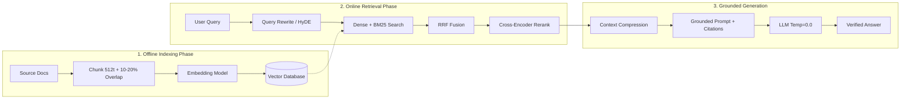

# ⚡ RAG (Retrieval-Augmented Generation) – Master Revision Guide
### 30 RAG Interview Questions Quick Revision Cheat Sheet
*Based on AmanAI Lab Curriculum (`30_RAG_Interview_Questions_AmanAI_Lab.pdf`)*
🔗 **Complete In-Depth Notes:** [`01_RAG_30_Questions.md`](./01_RAG_30_Questions.md)

---

## 🧭 End-to-End RAG Architecture Workflow

---

## 📌 10-Module Fast Revision Summary

### 1. ■ RAG Fundamentals (Q1 – Q3)
- **What is RAG:** Retrieves external knowledge at query time to augment LLM prompts. Decouples **reasoning** (LLM) from **memory** (Vector DB).
- **Why RAG is Needed:** Solves 4 core problems: (1) Knowledge cutoff, (2) Hallucinations, (3) Private domain data, (4) High fine-tuning costs.
- **Two Phases:** Indexing (offline: load $\rightarrow$ chunk $\rightarrow$ embed $\rightarrow$ store) and Query (online: embed query $\rightarrow$ search top-$k$ $\rightarrow$ prompt context $\rightarrow$ LLM generation $\rightarrow$ cite).
- **6 Key Components:** Document Loader, Chunker, Embedding Model, Vector DB, Retriever/Reranker, LLM Generator.
- 🔗 *Full Notes:* [Q1: What & Why](./01_RAG_30_Questions.md#q1-what-is-rag-retrieval-augmented-generation-and-why-do-we-need-it) | [Q2: Complete Pipeline](./01_RAG_30_Questions.md#q2-explain-the-complete-rag-pipeline-step-by-step) | [Q3: 6 Key Components](./01_RAG_30_Questions.md#q3-what-are-the-key-components-of-a-rag-system-and-what-choices-do-you-make-for-each)

---

### 2. ■ Chunking Strategies (Q4 – Q6)
- **Why Chunking Matters:** Chunks too large $\rightarrow$ diluted vector embeddings & wasted tokens; chunks too small $\rightarrow$ fragmented context & lost meaning.
- **The 3 Benchmark Sweet Spot Sizes (Powers of 2):**
  - **256 Tokens (~180–200 words):** Best for FAQs, single-fact lookups, and sharp atomic vector search.
  - **512 Tokens (~350–400 words):** **Industry default baseline & sweet spot** for general enterprise PDFs, policies, and manuals.
  - **1024 Tokens (~750–800 words):** Best for complex legal contracts, research papers, and multi-clause rules.
- **Golden Senior Engineer Interview Quote:** *"Chunking is where most RAG systems fail. I never rely on arbitrary framework defaults — I benchmark 3 to 4 chunk sizes (e.g., 256, 512, 1024) against an evaluation dataset to identify the optimal balance between vector specificity and context completeness."*
- **5 Chunking Methods:**
  1. *Fixed-size:* Split every $N$ tokens (for logs/uniform text).
  2. *Recursive Character:* Split by `\n\n` $\rightarrow$ `\n` $\rightarrow$ space. **(Default Choice)**.
  3. *Sentence-level:* Preserves full sentences (for FAQs).
  4. *Semantic Chunking:* Uses embedding similarity distance between sentences.
  5. *Structure-aware:* Respects Markdown headers, tables, HTML sections.
- **Chunk Overlap:** Repeats 10–20% of boundary tokens to ensure multi-clause sentences (*"However..."*) remain intact across chunks.
- 🔗 *Full Notes:* [Q4: Chunking Importance & 256/512/1024 Benchmarks](./01_RAG_30_Questions.md#q4-why-is-chunking-important-and-what-happens-if-you-get-it-wrong) | [Q5: 5 Chunking Methods](./01_RAG_30_Questions.md#q5-what-are-the-different-chunking-methods-and-when-do-you-use-each) | [Q6: Chunk Overlap](./01_RAG_30_Questions.md#q6-what-is-chunk-overlap-and-why-is-it-critical)

---

### 3. ■ Embeddings & Vector Databases (Q7 – Q9)
- **Choosing Embeddings:** Evaluate Quality vs Cost, Dimensions (384 vs 1536/3072 + Matryoshka MRL truncation), Multilingual support (`BGE-M3`), Domain vocabulary (`PubMedBERT`), and **MTEB Benchmark scores**.
- **Vector DB Comparison:**
  - *Managed Zero-Ops:* **Pinecone** (serverless).
  - *Production Self-Hosted:* **Qdrant** (Rust, fast filtering), **Weaviate** (built-in ML).
  - *PostgreSQL Native:* **PGVector** (unified relational SQL).
  - *Prototyping / Local:* **ChromaDB** (embedded Python).
  - *Billion-Scale:* **Milvus** (distributed K8s).
- **Indexing Algorithms:**
  - *Flat:* $O(N)$ brute force (100% recall, too slow at scale).
  - *IVF:* $k$-means Voronoi clustering (fast, medium memory).
  - *HNSW:* Multi-layer geometric graph skip-list ($O(\log N)$, sub-10ms, $>98\%$ recall). **(Production standard)**.
- 🔗 *Full Notes:* [Q7: Choosing Embeddings](./01_RAG_30_Questions.md#q7-how-do-you-choose-the-right-embedding-model-for-your-rag-system) | [Q8: Vector DB Comparison](./01_RAG_30_Questions.md#q8-compare-the-major-vector-databases--when-would-you-use-each) | [Q9: HNSW vs IVF vs Flat](./01_RAG_30_Questions.md#q9-what-is-the-difference-between-hnsw-ivf-and-flat-search-in-vector-databases)

---

### 4. ■ Retrieval Strategies (Q10 – Q12)
- **Hybrid Search (Dense + Sparse BM25):** Dense captures semantic synonyms (*"car"* $\approx$ *"automobile"*); Sparse BM25 captures exact error codes (`ERR_0x4012`) and SKUs. Merged via **Reciprocal Rank Fusion (RRF)**:
  $$\text{RRF\_Score}(d) = \sum \frac{1}{60 + \text{rank}(d)}$$
- **Lost in the Middle:** Attention drops in the middle of long prompts. Fix by **reranking top chunks to Index 0**, reducing $k$ to 3–5, and compressing context.
- **Query Transformation:** Rewriting conversational ambiguity, **HyDE** (embedding hypothetical answers to match doc space), and **Sub-query decomposition** (splitting multi-part comparisons).
- 🔗 *Full Notes:* [Q10: Hybrid Search & BM25](./01_RAG_30_Questions.md#q10-what-is-hybrid-search-and-why-is-it-better-than-pure-vector-search) | [Q11: Lost in the Middle](./01_RAG_30_Questions.md#q11-what-is-the-lost-in-the-middle-problem-and-how-do-you-solve-it) | [Q12: Query Transformation & HyDE](./01_RAG_30_Questions.md#q12-what-is-query-transformation-and-why-does-it-improve-rag)

---

### 5. ■ Advanced RAG Patterns (Q13 – Q15)
- **Naive vs Advanced vs Modular:**
  - *Naive:* Basic single-pass pipe (`Chunk -> Search -> Generate`).
  - *Advanced:* Adds pre-retrieval (HyDE, Rewriter) and post-retrieval (Rerank, Compression).
  - *Modular:* Decoupled micro-services, dynamic routing, feedback loops, Agentic RAG.
- **Parent-Child Chunking:** Embed small child chunks (100–200t) for vector precision; return large parent section (1000–2000t) to LLM for full narrative context.
- **Multi-Index RAG:** Routes queries to specialized indices (Summary Index for broad queries, Chunk Index for details, SQL Index for tabular metrics, KG for relationships).
- 🔗 *Full Notes:* [Q13: Naive vs Advanced vs Modular](./01_RAG_30_Questions.md#q13-what-is-the-difference-between-naive-rag-advanced-rag-and-modular-rag) | [Q14: Parent-Child Chunking](./01_RAG_30_Questions.md#q14-what-is-parent-child-chunking-also-called-hierarchical-chunking) | [Q15: Multi-Index RAG](./01_RAG_30_Questions.md#q15-what-is-multi-index-rag-and-when-do-you-use-it)

---

### 6. ■ Reranking & Post-Retrieval (Q16 – Q18)
- **Cross-Encoder Reranking:** Computes full token-level bidirectional attention across `(Query, Chunk)`. Reorders candidate top-20 to surface the true answer at Rank #1. (Cohere Rerank v3, BGE-Reranker-Large, Jina-v2).
- **Contextual Compression:** Strips out 50–80% irrelevant text from retrieved chunks, reducing prompt token costs and eliminating distractor noise.
- **Metadata Pre-Filtering:** Filters structured attributes (`version='2026'`, `department='HR'`, `user_role` for RBAC) *before* vector index traversal for 10x precision.
- 🔗 *Full Notes:* [Q16: Reranking](./01_RAG_30_Questions.md#q16-what-is-reranking-and-why-is-it-a-game-changer-for-rag-quality) | [Q17: Contextual Compression](./01_RAG_30_Questions.md#q17-what-is-contextual-compression-and-how-does-it-help-rag) | [Q18: Metadata Filtering](./01_RAG_30_Questions.md#q18-how-do-you-handle-metadata-filtering-in-rag-retrieval)

---

### 7. ■ RAG Evaluation (Q19 – Q21)
- **2-Tier Evaluation:**
  - *Retrieval Quality:* Hit Rate@K, MRR (Mean Reciprocal Rank), Context Relevancy.
  - *Generation Quality:* Faithfulness (groundedness), Answer Relevancy, Context Utilization.
- **RAGAS Framework (LLM-as-a-Judge):** Automated scoring across Faithfulness, Answer Relevancy, Context Precision, and Context Recall.
- **Test Set Creation:** 100+ Synthetic QA pairs + 50 SME manual pairs + 20 Unanswerable edge cases + Production query logs.
- 🔗 *Full Notes:* [Q19: RAG Evaluation Metrics](./01_RAG_30_Questions.md#q19-how-do-you-evaluate-a-rag-system-what-metrics-do-you-use) | [Q20: RAGAS Framework](./01_RAG_30_Questions.md#q20-what-is-ragas-and-how-does-it-work) | [Q21: Test Set Creation](./01_RAG_30_Questions.md#q21-how-do-you-create-a-test-set-for-rag-evaluation)

---

### 8. ■ Production RAG (Q22 – Q24)
- **7 Failure Modes:** (1) Ingestion fail, (2) Missed top-$k$, (3) Lost in middle, (4) Hallucination, (5) Schema format fail, (6) Granularity mismatch, (7) Stale knowledge base.
- **Document Freshness:** Incremental ingestion with **SHA-256 change detection**, atomic document replacement (`delete old -> insert new`), version tags, and TTL.
- **Citations & Attribution:** Chunk-level metadata tags + sentence-level inline citation brackets (`[1]`, `[Source N]`) + post-generation verification.
- 🔗 *Full Notes:* [Q22: 7 Failure Modes](./01_RAG_30_Questions.md#q22-what-are-the-common-failure-modes-of-rag-systems-in-production) | [Q23: Knowledge Freshness](./01_RAG_30_Questions.md#q23-how-do-you-handle-document-updates-and-keep-the-rag-knowledge-base-fresh) | [Q24: Citations & Attribution](./01_RAG_30_Questions.md#q24-how-do-you-add-citations-and-source-attribution-to-rag-answers)

---

### 9. ■ Multimodal & Agentic RAG (Q25 – Q27)
- **Agentic RAG:** An AI agent autonomously controls retrieval: decides *when* to retrieve, *what* to search, *evaluates* intermediate evidence, and *self-corrects* across multiple tools (Vector DB + SQL + Web).
- **Multimodal RAG:** Serializes tables to Markdown, uses Vision Models (GPT-4o Vision / ColPali) to generate searchable descriptions of charts, diagrams, and scanned pages.
- **Graph RAG:** Combines vector search with Knowledge Graphs (Nodes, Edges, Triples) for multi-hop reasoning, relationship queries, and global corpus summarization.
- 🔗 *Full Notes:* [Q25: Agentic RAG](./01_RAG_30_Questions.md#q25-what-is-agentic-rag-and-how-is-it-different-from-standard-rag) | [Q26: Multimodal RAG](./01_RAG_30_Questions.md#q26-how-do-you-build-rag-over-tables-charts-and-images-multimodal-rag) | [Q27: Graph RAG](./01_RAG_30_Questions.md#q27-what-is-graph-rag-and-when-would-you-use-it-over-standard-rag)

---

### 10. ■ RAG Troubleshooting & Optimization (Q28 – Q30)
- **Fixing Hallucinations:** Check retrieval $\rightarrow$ verify chunk text $\rightarrow$ prompt negative constraints (*"Answer ONLY from context"*) $\rightarrow$ enforce structured quotes $\rightarrow$ set `temperature=0.0`.
- **Latency Optimization:** Redis semantic cache ($<10\text{ms}$), HNSW index, parallel async retrieval, and token streaming (SSE) to achieve $<300\text{ms}$ Time-to-First-Token.
- **Multi-Turn Conversations:** Condense conversational history into a standalone rewritten search query before retrieval.
- 🔗 *Full Notes:* [Q28: Fixing Hallucinations](./01_RAG_30_Questions.md#q28-your-rag-system-is-hallucinating-despite-having-the-right-documents-how-do-you-fix-it) | [Q29: Latency Optimization](./01_RAG_30_Questions.md#q29-how-do-you-optimize-rag-latency-for-real-time-applications) | [Q30: Multi-Turn Conversations](./01_RAG_30_Questions.md#q30-how-do-you-handle-multi-turn-conversations-in-rag)

---

## 📊 Core Architectural Comparison Tables

### Table 1: Dense vs Sparse vs Hybrid Search
| Feature | Dense Search (Embeddings) | Sparse Search (BM25) | Hybrid Search (Dense + BM25 + RRF) |
| :--- | :--- | :--- | :--- |
| **Mechanism** | Neural vector cosine similarity | Lexical TF-IDF term matching | **Fused ranking via Reciprocal Rank Fusion** |
| **Strengths** | Semantic intent, synonyms, concepts | Exact codes, SKUs, acronyms, names | **Best of both worlds (Production Gold Standard)** |
| **Weaknesses** | Misses exact keyword identifiers | Misses conceptual synonyms | Slightly higher ingestion/search computation |

---

### Table 2: Vector Indexing: Flat vs IVF vs HNSW
| Index Algorithm | Search Complexity | 10M Vector Latency | Recall @ 10 | RAM / Memory Overhead |
| :--- | :--- | :--- | :--- | :--- |
| **Flat (Brute Force)** | $O(N)$ | ~5,000 ms | **100%** | Low (Raw vectors only) |
| **IVF (Inverted File)** | $O(\frac{N}{k} \cdot \text{nprobe})$ | ~50 ms | ~92–95% | Low–Medium |
| **HNSW (Graph Skip-List)** | $O(\log N)$ | **~10 ms** | **~98–99%** | High (Stores graph edges + vectors) |

---

### Table 3: Naive RAG vs Advanced RAG vs Modular / Agentic RAG
| Paradigm | Architecture Shape | Key Modules Included | Production Fit |
| :--- | :--- | :--- | :--- |
| **Naive RAG** | Linear single-pass | Embed $\rightarrow$ Top-$k$ Vector Search $\rightarrow$ LLM | ❌ Prototypes only |
| **Advanced RAG** | Enhanced linear pipeline | Query Rewriter + Hybrid BM25 + Cross-Encoder Reranker + Compression | ✅ Standard Production |
| **Modular / Agentic RAG** | Dynamic graph network / loops | Dynamic Routing + Multi-Tool (SQL/Web/Vector) + Self-Correction Loops | 🚀 SOTA Enterprise |

---

## 🎤 Top 5 Interview Takeaways (Simple Quick Recall)

1. **Why We Use RAG:** *"Think of a normal LLM as a closed-book exam where it has to guess, and RAG as an open-book exam where it looks up the exact company document first. This stops hallucinations and keeps knowledge 100% fresh without retraining."*
2. **Why Hybrid Search is Mandatory:** *"Vector search understands concepts (like 'car' and 'vehicle'), but fails on exact error codes or product SKUs. Hybrid search runs both vector search AND keyword search (BM25) together so you never miss exact terms."*
3. **Why Reranking is the #1 Quality Boost:** *"Vector search quickly pulls 20 candidate snippets, but a Cross-Encoder reranker reads them carefully side-by-side with the question to put the true best answer at #1 before giving it to the LLM."*
4. **How to Test RAG (RAGAS):** *"Instead of testing by hand, we use an automated LLM judge to score if answers are factual (**Faithfulness**) and if the search found the right documents without noise (**Context Precision**)."*
5. **How to Handle Chat History:** *"Never search raw follow-up questions like 'What about the second one?'. Always use a fast LLM to rewrite the chat history into a complete standalone search query first."*

---
*For the complete detailed masterclass with code examples and deep explanations, refer to [`01_RAG_30_Questions.md`](./01_RAG_30_Questions.md).*
