# 🤖 30 RAG Interview Questions & Complete Knowledge Base
### The Definitive, In-Depth Guide to Crack RAG System Design & Engineering Interviews in 2026
*First-Principles Thinking | Beginner-Friendly Explanations | Architecture Diagrams | Production Code & Case Studies*  
*Curriculum Reference: AmanAI Lab (`30_RAG_Interview_Questions_AmanAI_Lab.pdf`)*

---

## 📑 Complete Table of Contents

- [■ Section 1: RAG Fundamentals](#-section-1-rag-fundamentals)
  - [Q1. What is RAG (Retrieval-Augmented Generation) and why do we need it?](#q1-what-is-rag-retrieval-augmented-generation-and-why-do-we-need-it)
  - [Q2. Explain the complete RAG pipeline step by step.](#q2-explain-the-complete-rag-pipeline-step-by-step)
  - [Q3. What are the key components of a RAG system and what choices do you make for each?](#q3-what-are-the-key-components-of-a-rag-system-and-what-choices-do-you-make-for-each)
- [■ Section 2: Chunking Strategies](#-section-2-chunking-strategies)
  - [Q4. Why is chunking important and what happens if you get it wrong?](#q4-why-is-chunking-important-and-what-happens-if-you-get-it-wrong)
  - [Q5. What are the different chunking methods and when do you use each?](#q5-what-are-the-different-chunking-methods-and-when-do-you-use-each)
  - [Q6. What is chunk overlap and why is it critical?](#q6-what-is-chunk-overlap-and-why-is-it-critical)
- [■ Section 3: Embeddings & Vector Databases](#-section-3-embeddings--vector-databases)
  - [Q7. How do you choose the right embedding model for your RAG system?](#q7-how-do-you-choose-the-right-embedding-model-for-your-rag-system)
  - [Q8. Compare the major vector databases — when would you use each?](#q8-compare-the-major-vector-databases--when-would-you-use-each)
  - [Q9. What is the difference between HNSW, IVF, and flat search in vector databases?](#q9-what-is-the-difference-between-hnsw-ivf-and-flat-search-in-vector-databases)
- [■ Section 4: Retrieval Strategies](#-section-4-retrieval-strategies)
  - [Q10. What is Hybrid Search and why is it better than pure vector search?](#q10-what-is-hybrid-search-and-why-is-it-better-than-pure-vector-search)
  - [Q11. What is the 'Lost in the Middle' problem and how do you solve it?](#q11-what-is-the-lost-in-the-middle-problem-and-how-do-you-solve-it)
  - [Q12. What is Query Transformation and why does it improve RAG?](#q12-what-is-query-transformation-and-why-does-it-improve-rag)
- [■ Section 5: Advanced RAG Patterns](#-section-5-advanced-rag-patterns)
  - [Q13. What is the difference between Naive RAG, Advanced RAG, and Modular RAG?](#q13-what-is-the-difference-between-naive-rag-advanced-rag-and-modular-rag)
  - [Q14. What is Parent-Child chunking (also called hierarchical chunking)?](#q14-what-is-parent-child-chunking-also-called-hierarchical-chunking)
  - [Q15. What is Multi-Index RAG and when do you use it?](#q15-what-is-multi-index-rag-and-when-do-you-use-it)
- [■ Section 6: Reranking & Post-Retrieval](#-section-6-reranking--post-retrieval)
  - [Q16. What is Reranking and why is it a game-changer for RAG quality?](#q16-what-is-reranking-and-why-is-it-a-game-changer-for-rag-quality)
  - [Q17. What is Contextual Compression and how does it help RAG?](#q17-what-is-contextual-compression-and-how-does-it-help-rag)
  - [Q18. How do you handle metadata filtering in RAG retrieval?](#q18-how-do-you-handle-metadata-filtering-in-rag-retrieval)
- [■ Section 7: RAG Evaluation](#-section-7-rag-evaluation)
  - [Q19. How do you evaluate a RAG system? What metrics do you use?](#q19-how-do-you-evaluate-a-rag-system-what-metrics-do-you-use)
  - [Q20. What is RAGAS and how does it work?](#q20-what-is-ragas-and-how-does-it-work)
  - [Q21. How do you create a test set for RAG evaluation?](#q21-how-do-you-create-a-test-set-for-rag-evaluation)
- [■ Section 8: Production RAG](#-section-8-production-rag)
  - [Q22. What are the common failure modes of RAG systems in production?](#q22-what-are-the-common-failure-modes-of-rag-systems-in-production)
  - [Q23. How do you handle document updates and keep the RAG knowledge base fresh?](#q23-how-do-you-handle-document-updates-and-keep-the-rag-knowledge-base-fresh)
  - [Q24. How do you add citations and source attribution to RAG answers?](#q24-how-do-you-add-citations-and-source-attribution-to-rag-answers)
- [■ Section 9: Multimodal & Agentic RAG](#-section-9-multimodal--agentic-rag)
  - [Q25. What is Agentic RAG and how is it different from standard RAG?](#q25-what-is-agentic-rag-and-how-is-it-different-from-standard-rag)
  - [Q26. How do you build RAG over tables, charts, and images (Multimodal RAG)?](#q26-how-do-you-build-rag-over-tables-charts-and-images-multimodal-rag)
  - [Q27. What is Graph RAG and when would you use it over standard RAG?](#q27-what-is-graph-rag-and-when-would-you-use-it-over-standard-rag)
- [■ Section 10: RAG Troubleshooting & Optimization](#-section-10-rag-troubleshooting--optimization)
  - [Q28. Your RAG system is hallucinating despite having the right documents. How do you fix it?](#q28-your-rag-system-is-hallucinating-despite-having-the-right-documents-how-do-you-fix-it)
  - [Q29. How do you optimize RAG latency for real-time applications?](#q29-how-do-you-optimize-rag-latency-for-real-time-applications)
  - [Q30. How do you handle multi-turn conversations in RAG?](#q30-how-do-you-handle-multi-turn-conversations-in-rag)

---

# ■ Section 1: RAG Fundamentals

---

## Q1. What is RAG (Retrieval-Augmented Generation) and why do we need it?

### 📌 Short Answer
**RAG (Retrieval-Augmented Generation)** is an architectural pattern that retrieves relevant, authoritative factual documents from an external knowledge base and injects them into an LLM's prompt context before generating a response. It decouples **reasoning** (performed by the LLM) from **memory storage** (held in an external, verifiable database), eliminating hallucinations and enabling models to answer queries based on private, real-time enterprise data without costly model retraining.

### 🎯 Deep-Dive Explanation & The Core Problem It Solves

#### 1. The Closed-Book vs. Open-Book Exam Analogy
- **Standard LLM (Closed-Book Exam):** The model relies strictly on static weights learned during training. When asked a question about private internal policies or recent events, it has no factual data. Because LLMs are probabilistic word-predictors, it makes a plausible-sounding statistical guess—a **hallucination**.
- **RAG-Enabled LLM (Open-Book Exam):** Before writing the answer, the student first searches the reference manual, finds the exact relevant paragraph, reads it, and synthesizes a precise, grounded answer with direct citations.

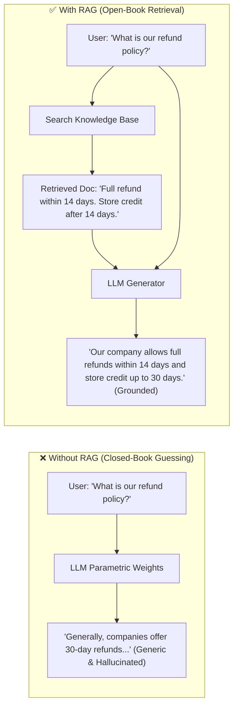

#### 2. The 4 Fundamental Reasons Why RAG is Essential

| # | Limitation of Vanilla LLMs | How RAG Solves It | Technical & Business Impact |
| :--- | :--- | :--- | :--- |
| **1** | **Knowledge Cutoff** | LLMs stop learning upon training completion. They know zero facts past their cutoff date. | RAG queries live external stores at runtime, providing instant access to information updated 5 seconds ago. |
| **2** | **Hallucination Risk** | LLMs generate confident falsehoods when facts are missing. | RAG constrains the generation space to retrieved source context, forcing strict factual grounding. |
| **3** | **Private Enterprise Data** | Corporate PDFs, customer tickets, financial records, and medical files cannot be published to public foundation models. | Proprietary documents remain in secure internal databases; only relevant snippets are retrieved under Role-Based Access Control (RBAC). |
| **4** | **Economics (RAG vs. Fine-Tuning)** | Retraining model weights to learn new facts takes days of GPU compute, labeled datasets, and thousands of dollars. | Updating knowledge in RAG is as simple as inserting or updating a document vector in a database in milliseconds ($< \$0.001$). |

### 💡 Concrete Real-World Example: Company Refund Policy
- **Scenario:** An e-commerce employee asks: *"What is our company refund policy?"*
- **Without RAG:**
  - *LLM response:* *"Generally, most companies offer 30-day refunds for returned goods..."* *(Generic guess that misleads the employee).*
- **With RAG:**
  - *Step 1 (Search):* Search internal knowledge base for `'refund policy'`.
  - *Step 2 (Retrieve):* Retrieves: *"Refund policy: Full refund within 14 days. Store credit after 14 days. No refund after 30 days."*
  - *Step 3 (Inject):* Injects text into system prompt as authoritative context.
  - *Step 4 (Generate):* LLM generates: *"Our refund policy allows full refunds within 14 days, store credit between 14–30 days, and no refunds after 30 days."*

### 💻 Minimal JavaScript / TypeScript Demonstration (LangChain.js / OpenAI)
```typescript
import { MemoryVectorStore } from "langchain/vectorstores/memory";
import { OpenAIEmbeddings, ChatOpenAI } from "@langchain/openai";
import { ChatPromptTemplate } from "@langchain/core/prompts";
import { createStuffDocumentsChain } from "langchain/chains/combine_documents";
import { createRetrievalChain } from "langchain/chains/retrieval";
import { Document } from "@langchain/core/documents";

// 1. Create in-memory vector store with enterprise policy
const docs = [
  new Document({
    pageContent: "Refund policy: Full refund within 14 days. Store credit between 14-30 days. No refund after 30 days.",
    metadata: { source: "policy_v2026.pdf", department: "billing" }
  })
];

const embeddings = new OpenAIEmbeddings({ model: "text-embedding-3-small" });
const vectorStore = await MemoryVectorStore.fromDocuments(docs, embeddings);
const retriever = vectorStore.asRetriever({ k: 1 });

// 2. Define grounding system prompt template
const systemPrompt = `You are an assistant for question-answering tasks.
Use the following pieces of retrieved context to answer the question.
If you don't know the answer, say that you don't know.

Context:
{context}`;

const prompt = ChatPromptTemplate.fromMessages([
  ["system", systemPrompt],
  ["human", "{input}"]
]);

// 3. Execute grounded RAG chain
const llm = new ChatOpenAI({ model: "gpt-4o-mini", temperature: 0.0 });
const combineDocsChain = await createStuffDocumentsChain({ llm, prompt });
const ragChain = await createRetrievalChain({
  retriever,
  combineDocsChain
});

const response = await ragChain.invoke({
  input: "What is our company refund policy?"
});

console.log(response.answer);
// Output: Our company allows full refunds within 14 days, store credit between 14 and 30 days, and no refunds after 30 days.
```

### 🎤 Interview Perspective & Golden Takeaway
> 💬 **Simple Answer to Give:**
> *"Think of a standard LLM like a student taking a closed-book exam—it has to guess when it doesn't know. RAG turns it into an open-book exam: the system looks up the exact company document first, gives it to the LLM, and asks it to answer based only on that document. This stops hallucinations and keeps answers 100% up to date without expensive model retraining."*

---

## Q2. Explain the complete RAG pipeline step by step.

### 📌 Short Answer
The end-to-end RAG architecture is partitioned into two independent operational phases:
1. **Indexing Phase (Offline, asynchronous, executed on document ingestion):** Document Loading $\rightarrow$ Text Chunking $\rightarrow$ Embedding Generation $\rightarrow$ Vector DB + Metadata Indexing.
2. **Query Phase (Online, synchronous, executed per user request):** Query Embedding $\rightarrow$ Top-$k$ Vector / Hybrid Search $\rightarrow$ Context Augmentation $\rightarrow$ LLM Synthesis $\rightarrow$ Source Citation.

### 🎯 Deep-Dive Step-by-Step Architecture

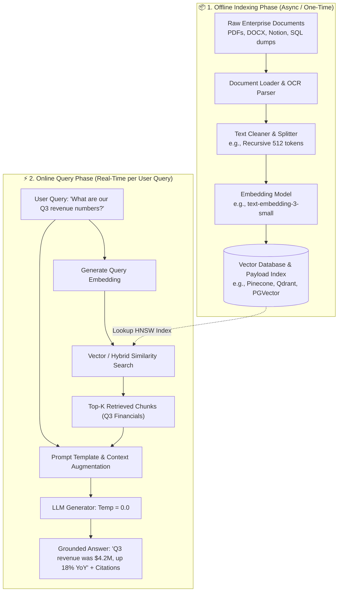

### 🔍 Step-by-Step Breakdown

#### Phase 1: The Offline Indexing Pipeline
1. **Document Loading:** Ingest unstructured and semi-structured files across formats (PDF, DOCX, Markdown, HTML, CSV). Scanned documents pass through OCR parsers (AWS Textract, Tesseract, DONUT).
2. **Document Chunking:** Break large monolithic documents into manageable semantic units (typically 256 to 1024 tokens) with a 10–20% overlap.
3. **Embedding Generation:** Pass each text chunk into an embedding model to transform semantic concepts into high-dimensional vector coordinates ($\mathbb{R}^d$).
4. **Vector Storage & Metadata Indexing:** Persist the vector embeddings into an indexed vector database (using HNSW or IVF graphs) alongside rich metadata attributes (`doc_id`, `filename`, `page_number`, `department`, `version`).

#### Phase 2: The Online Query & Retrieval Pipeline
1. **User Question Input:** User submits a natural language query via API, chat interface, or SDK.
2. **Query Embedding:** The incoming query string is embedded into the vector space using the **exact same embedding model** used during indexing.
3. **Vector / Hybrid Similarity Search:** The vector database calculates vector distances (Cosine similarity, Dot product) between the query vector and indexed document vectors, retrieving the top-$k$ nearest chunks.
4. **Context Injection / Prompt Augmentation:** The top-$k$ retrieved chunks are formatted and merged into a structured system prompt template.
5. **LLM Generation:** The LLM reads the context and generates an answer strictly grounded in the provided factual text.
6. **Source Attribution:** The system returns the generated answer accompanied by source document links and page numbers.

### 💡 Concrete Production Timeline & Cost Metrics
- **Indexing 500 Company PDFs:**
  - Split into 15,000 chunks (512 tokens each = ~7.5M tokens).
  - Embedded using `text-embedding-3-small` (\$0.02 per 1M tokens) $\rightarrow$ **Total cost: ~$0.15**.
  - Total indexing time: **~20 to 30 minutes**.
- **Query Execution (Per Request):**
  - Query embedding + HNSW vector search: **~15–30 ms**.
  - LLM prompt generation + token streaming: **~1.5–2.5 seconds**.
  - Query cost: **~$0.0015 to $0.003**.

### 🎤 Interview Perspective & Golden Takeaway
> 💬 **Simple Answer to Give:**
> *"I explain RAG in two simple parts:
> 1. **Preparation (Offline):** We read our files, break them into bite-sized paragraphs, convert them into search vectors, and save them in a database.
> 2. **Question Time (Online):** When a user asks a question, we find the top 3–5 matching snippets from our database, paste them into the LLM prompt, and let the LLM write a clean answer with source links."*

---

## Q3. What are the key components of a RAG system and what choices do you make for each?

### 📌 Short Answer
A production-grade RAG system is comprised of **6 foundational components**:
1. **Document Loader** (Data Ingestion)
2. **Chunking Strategy** (Text Partitioning)
3. **Embedding Model** (Vector Representation)
4. **Vector Database** (Storage & Indexed Search)
5. **Retrieval Strategy** (Dense / Sparse / Rerank)
6. **LLM Generator** (Synthesis & Reasoning)

### 🎯 Component Breakdown & Decision Matrix

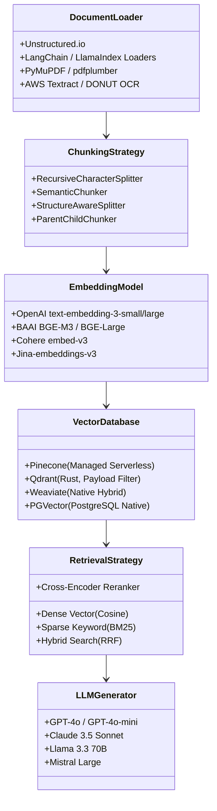

### 📊 Comprehensive Component Trade-Off Table

| Component | Responsibility | Top Technology Choices | Key Selection Criteria & Trade-offs |
| :--- | :--- | :--- | :--- |
| **1. Document Loader** | Ingesting multi-format unstructured files (PDF, DOCX, HTML, PPTX). | `Unstructured.io`, `pdfplumber`, `PyPDF`, `AWS Textract` | Choose based on OCR accuracy, table preservation, and ingestion speed. |
| **2. Chunker** | Partitioning documents into semantically coherent segments. | `RecursiveCharacterTextSplitter`, `SemanticChunker`, AST Splitters | Choose based on document format (Markdown headers vs. raw unstructured narrative). |
| **3. Embedding Model** | Converting text into high-dimensional vector representations. | `text-embedding-3-small`, `bge-m3`, `cohere-embed-v3`, `jina-v3` | Balance MTEB benchmark score, dimension size (storage), and cloud API vs self-hosted GPU. |
| **4. Vector Database** | Storing vectors and executing sub-10ms ANN index searches. | `Pinecone`, `Qdrant`, `Weaviate`, `ChromaDB`, `pgvector`, `Milvus` | Choose based on scale, zero-ops cloud vs self-hosted, metadata pre-filtering, and cost. |
| **5. Retrieval Strategy** | Finding candidate facts and reordering for maximum relevance. | Dense + Sparse (BM25) Hybrid search + Cohere/BGE Reranker | Mandatory to combine dense semantics with BM25 keyword matching for exact identifiers. |
| **6. LLM Generator** | Reasoning over injected context to synthesize the final output. | `GPT-4o`, `Claude 3.5 Sonnet`, `Llama-3-70B`, `GPT-4o-mini` | Choose based on reasoning capability, latency, context window size, and cost per token. |

### 💡 Production Stack Archetypes

#### Stack A: Budget-Friendly / Open-Source Production Stack
- **Loader:** `Unstructured.io` (handles PDFs, DOCX, HTML).
- **Chunking:** `RecursiveCharacterTextSplitter` (512 tokens, 50-token overlap).
- **Embedding:** `text-embedding-3-small` (\$0.02 / 1M tokens) or self-hosted `bge-m3`.
- **Vector DB:** `Qdrant` (open-source, self-hosted on AWS EC2).
- **Retrieval:** Hybrid (BM25 + Dense) with `bge-reranker-large`.
- **LLM:** `GPT-4o-mini` for simple queries, `GPT-4o` for complex reasoning.

#### Stack B: Premium Enterprise Stack
- **Loader:** Azure Document Intelligence / AWS Textract for scanned tables.
- **Embedding:** `text-embedding-3-large` (3072 dims) or `cohere-embed-v3`.
- **Vector DB:** `Pinecone Serverless` (fully managed zero-ops).
- **Retrieval:** Hybrid Search + `Cohere Rerank v3` Cross-Encoder.
- **LLM:** `Claude 3.5 Sonnet` with Server-Sent Events (SSE) token streaming.

### 🎤 Interview Perspective & Golden Takeaway
> 💬 **Simple Answer to Give:**
> *"A working RAG system has 6 basic pieces: a **File Reader** to parse PDFs, a **Chunker** to break up text, an **Embedding Model** to turn text into search vectors, a **Vector Database** to store and search them, a **Retriever & Reranker** to grab the best matching snippets, and an **LLM** to write the final answer. In an interview, I walk through each piece and explain why I picked it for speed, accuracy, or cost."*

---

# ■ Section 2: Chunking Strategies

---

## Q4. Why is chunking important and what happens if you get it wrong?

### 📌 Short Answer
**Chunking** is the process of breaking continuous documents into smaller, discrete segments prior to embedding. It is the **single most critical factor in retrieval quality** because embedding vectors represent the average semantic meaning of a chunk:
- **Chunks too large:** Multiple distinct topics get blended together, resulting in **semantic dilution**, wasted context window tokens, and degraded retrieval precision.
- **Chunks too small:** Sentences get chopped midway, resulting in **context fragmentation**, loss of qualifying conditions, and bloated index storage costs.
- **Production Sweet Spot:** Typically **256 to 1024 tokens** with a **10% to 20% overlap**.

### 🎯 The Chunk Size Dilemma

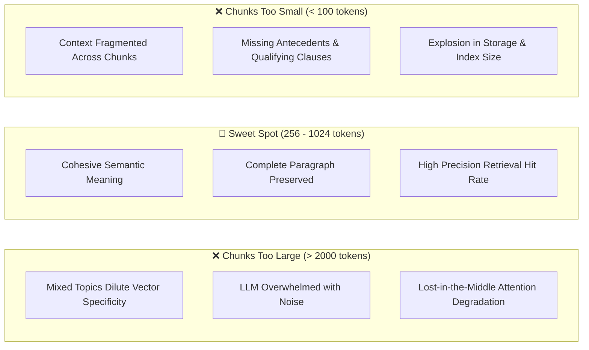

### 🔍 Deep Dive: The 3 Industry Benchmark Chunk Sizes (256, 512, 1024)

In modern enterprise RAG architectures, chunk sizes are conventionally benchmarked in powers of 2 ($256, 512, 1024$) due to tokenization efficiency, embedding model context windows, and GPU batch alignment:

| Chunk Size | Approximate Length | Primary Strength | Ideal Use Cases | Trade-off / Risk |
| :--- | :--- | :--- | :--- | :--- |
| **256 Tokens** | ~1 to 2 short paragraphs (~180–200 words) | **Maximum Vector Specificity:** Pinpoints exact atomic facts without noise. | FAQs, customer support QA, IT error codes, single-fact lookups. | **Context Fragmentation:** Multi-sentence rules or qualifying conditions get cut off. |
| **512 Tokens** *(Industry Default Baseline)* | ~3 to 4 paragraphs (~350–400 words) | **Optimal Balance:** Balances specific vector coordinates with complete semantic ideas. | General corporate documentation, standard PDFs, HR policies, user manuals. | Slight noise if queries target sub-sentence numbers. |
| **1024 Tokens** | ~1 to 2 full pages / sections (~750–800 words) | **Maximum Context Completeness:** Preserves complex multi-clause rules and background. | Legal contracts, academic papers, regulatory compliance, financial disclosures. | **Semantic Dilution:** Embedding vector gets averaged out over too many concepts. |

---

### ⚖️ Is 256, 512, or 1024 Tokens the "Best"?

> [!IMPORTANT]
> **There is NO single universal "best" chunk size.** The optimal size is fundamentally determined by the **nature of your source documents** and the **granularity of user queries**.
>
> - If your queries are **atomic and specific** (e.g., *"What is the customer support phone number?"*), **256 tokens** is best.
> - If your queries require **rules and qualification criteria** (e.g., *"What are the eligibility requirements for parental leave?"*), **512 tokens** is best.
> - If your queries require **multi-step procedural synthesis** (e.g., *"Explain our 5-stage merger evaluation protocol"*), **1024 tokens** is best.

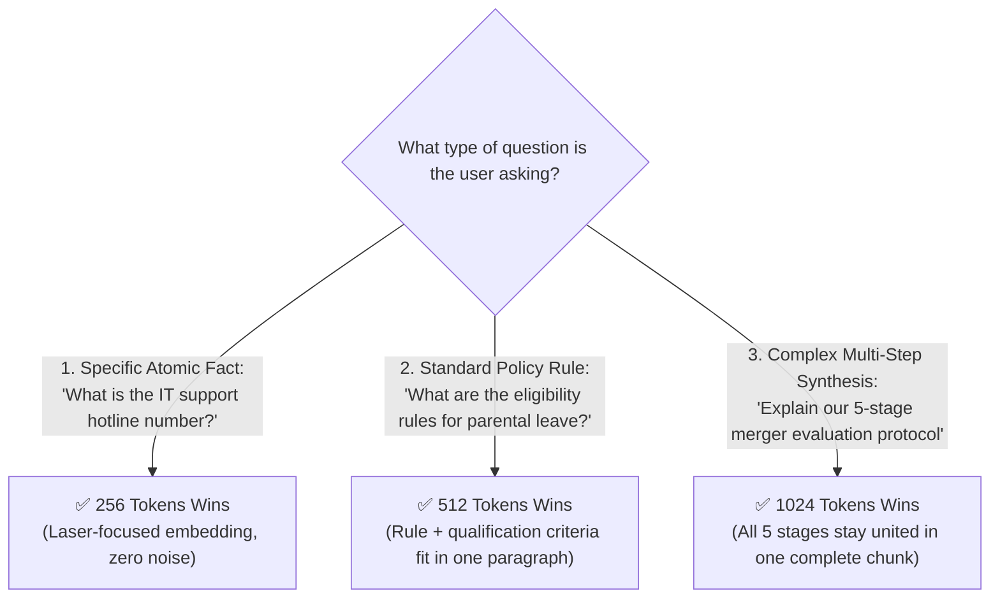

#### The Fundamental Engineering Trade-Off: Vector Specificity vs. Context Completeness

```
High Vector Specificity ◄────────────────────────────────────────► High Context Completeness
(256 tokens: Sharp retrieval,                   (1024 tokens: Rich context,
 fragmented context)                             diluted vector embedding)
                               ▲
                        [512 tokens]
                   (Default Industry Sweet Spot)
```

#### What Happens When You Pick the Wrong Size?
- **Picking 256 tokens for a complex legal contract:**
  - *Clause 1* is placed in Chunk 1.
  - The critical condition (*"Except during declared state of emergencies..."*) is placed in Chunk 2.
  - Search retrieves Chunk 1 only $\rightarrow$ The LLM outputs an **incomplete, legally inaccurate answer** because the exception was severed.
- **Picking 1024 tokens for an FAQ dataset:**
  - The phone number or discrete answer is buried inside 800 words of irrelevant company history.
  - The embedding vector becomes "washed out" (diluted), causing vector search to rank the correct chunk at #8 instead of #1.

---

### 🔬 How to Benchmark Chunk Sizes in Production (4-Step Evaluation Workflow)

Never guess your chunk size. Follow this empirical benchmarking workflow:

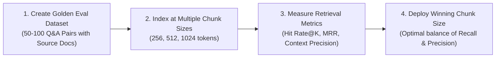

1. **Build a Ground-Truth Test Set:** Curate 50–100 representative questions with ground-truth answer paragraphs.
2. **Build Parallel Indices:** Ingest the corpus into 3 separate test collections: `index_256`, `index_512`, and `index_1024` (each with 10–20% overlap).
3. **Run Automated Benchmark:** Evaluate each index against the test set measuring:
   - **Hit Rate@K:** Does top-$k$ contain the ground truth chunk?
   - **MRR (Mean Reciprocal Rank):** Where does the first relevant chunk rank?
   - **Context Precision (via RAGAS):** What proportion of retrieved text is actually relevant?
4. **Select the Winner:** Deploy the configuration that achieves the highest retrieval metrics with the lowest token footprint.

---

### 💡 Concrete Case Study: 5-Page Refund Policy Document
- **Too Large (Entire 5-page document as 1 chunk):**
  - *User Query:* "What is the return window?"
  - *Outcome:* Retrieves all 5 pages. The LLM is flooded with shipping rates, warranty disclaimers, and corporate history. The specific return window is buried, increasing latency and risk of omission.
- **Too Small (Every sentence as 1 chunk):**
  - *Retrieved Chunk:* *"Returns must be made within 14 days."*
  - *Missed Condition in next sentence:* *"...from the date of delivery, with original packaging and receipt."*
  - *Outcome:* The generated answer is incomplete and misleads the customer.
- **Just Right (Paragraph-level, ~300–512 tokens):**
  - *Retrieved Chunk:* *"Returns must be made within 14 days from the date of delivery, with original packaging. Items must be unused and in resalable condition. Refunds will be processed within 5-7 business days."*
  - *Outcome:* Complete, self-contained, and accurate factual retrieval.

---

### 🎤 Interview Perspective & Golden Takeaway
> 💬 **Simple Answer to Give:**
> *"If your chunks are too big, search gets confused by too much text. If they are too small, sentences get cut in half and lose their meaning.
> 
> In practice:
> - I start with **512 tokens (~350 words)** with a small overlap (~50 tokens) as my default baseline.
> - For short FAQ or lookup questions, I test smaller chunks (~256 tokens) to make search razor-sharp.
> - For long legal contracts or policies with multiple conditions, I test larger chunks (~1024 tokens) to keep all rules together.
> - I always test a few sizes against real sample questions to see which one gives the most accurate answers."*

---

## Q5. What are the different chunking methods and when do you use each?

### 📌 Short Answer
There are **5 primary chunking methodologies**:
1. **Fixed-Size Chunking:** Splits strictly by character/token count. Simple, but cuts sentences and words in half. *(Use for: Uniform server logs, raw sensor data).*
2. **Recursive Text Splitting:** Recursively splits on structural delimiters (`\n\n` $\rightarrow$ `\n` $\rightarrow$ space $\rightarrow$ empty string). Preserves paragraphs and sentences. *(Use for: **Default choice for general documents, articles, PDFs**).*
3. **Sentence-Level Splitting:** Splits at sentence boundaries using NLP tokenizers. Preserves grammatical units. *(Use for: FAQ datasets, customer transcripts, discrete Q&A).*
4. **Semantic Chunking:** Calculates embedding cosine distances between consecutive sentences and inserts split points where similarity drops below a threshold. *(Use for: Long, dense documents with shifting themes).*
5. **Document-Structure-Aware Chunking:** Parses document hierarchy (Markdown `#`, `##`, HTML `<section>`, PDF layout headers, tables). *(Use for: Legal contracts, API docs, technical manuals, financial statements).*

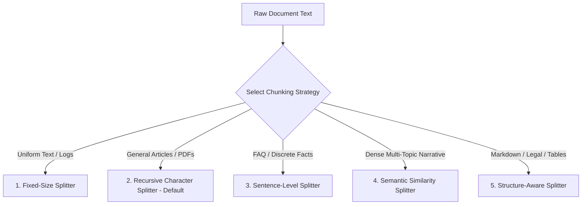

### 💡 Comparison on a 10-Page Machine Learning Overview Document
- **User Query:** *"What is supervised learning?"*
- **Fixed-Size (512 tokens):** Retrieves a chunk containing half of the supervised section and half of the unsupervised section (confused context).
- **Recursive:** Retrieves the complete, clean paragraph dedicated to Supervised Learning (good).
- **Semantic:** Retrieves the supervised learning definition along with its closely tied example (best contextual grouping).
- **Structure-Aware:** Retrieves the exact `# Supervised Learning` section header and subsections (best structural alignment).

### 💻 Code Example: Recursive vs. Semantic Chunking (JavaScript / TypeScript)
```typescript
// 1. Recursive Character Text Splitter (Industry Standard Default in JS/TS)
import { RecursiveCharacterTextSplitter } from "@langchain/textsplitters";
import { OpenAIEmbeddings } from "@langchain/openai";

const rawText = `Machine learning is a field of AI.

Supervised learning uses labeled data to train algorithms for classification and regression.
Unsupervised learning discovers hidden patterns in unlabeled data without explicit guidance.`;

const recursiveSplitter = new RecursiveCharacterTextSplitter({
  chunkSize: 100,
  chunkOverlap: 20,
  separators: ["\n\n", "\n", " ", ""]
});

const recursiveChunks = await recursiveSplitter.splitText(rawText);
console.log("Recursive Chunks:", recursiveChunks);

// 2. Semantic Chunking (Splitting on Embedding Cosine Similarity Thresholds in JS/TS)
async function semanticChunkBySentence(text: string, similarityThreshold = 0.85): Promise<string[]> {
  const embeddings = new OpenAIEmbeddings({ model: "text-embedding-3-small" });
  
  // Split into individual sentences
  const sentences = text.match(/[^.!?]+[.!?]+/g)?.map((s) => s.trim()) || [text];
  if (sentences.length <= 1) return sentences;

  // Generate vectors for all sentences in parallel
  const vectors = await embeddings.embedDocuments(sentences);

  const chunks: string[] = [];
  let currentChunk = sentences[0];

  for (let i = 0; i < sentences.length - 1; i++) {
    const sim = cosineSimilarity(vectors[i], vectors[i + 1]);
    
    if (sim < similarityThreshold) {
      // Meaning shifted -> Start a new chunk boundary
      chunks.push(currentChunk);
      currentChunk = sentences[i + 1];
    } else {
      // Semantically connected -> Append to current chunk
      currentChunk += " " + sentences[i + 1];
    }
  }
  chunks.push(currentChunk);
  return chunks;
}

function cosineSimilarity(vecA: number[], vecB: number[]): number {
  const dot = vecA.reduce((sum, a, idx) => sum + a * vecB[idx], 0);
  const normA = Math.sqrt(vecA.reduce((sum, a) => sum + a * a, 0));
  const normB = Math.sqrt(vecB.reduce((sum, b) => sum + b * b, 0));
  return dot / (normA * normB);
}
```

### 🎤 Interview Perspective & Golden Takeaway
> 💬 **Simple Answer to Give:**
> *"For standard PDFs and articles, I use a **recursive splitter** because it splits nicely on paragraphs and sentences rather than cutting words in half. For Markdown docs or tables, I use a **structure-aware splitter** so headers and table rows stay together. For documents where topics change often, I use **semantic chunking** to split only when the topic actually shifts."*

---

## Q6. What is chunk overlap and why is it critical?

### 📌 Short Answer
**Chunk Overlap** is the intentional duplication of a configurable percentage of tokens (typically **10% to 20%**) across consecutive chunk boundaries. (For example, if Chunk 1 covers tokens 1–500, Chunk 2 covers tokens 450–950, creating a 50-token shared overlap).

### 🎯 Why Chunk Overlap is Critical
Natural language arguments and qualifying conditions span multiple sentences. Without overlap, a sentence cut in half at a boundary loses its semantic meaning in both chunks. Overlap ensures that boundary sentences appear in full in **both** chunks, enabling vector search to retrieve the complete context regardless of which chunk matches the query.
- **Recommended Overlap:** **10% to 20% of chunk size** (e.g., 50–100 tokens for a 512-token chunk).
- **Trade-off:** Too much overlap ($>30\%$) causes redundant storage and duplicate search hits; too little overlap ($<5\%$) causes boundary context loss.

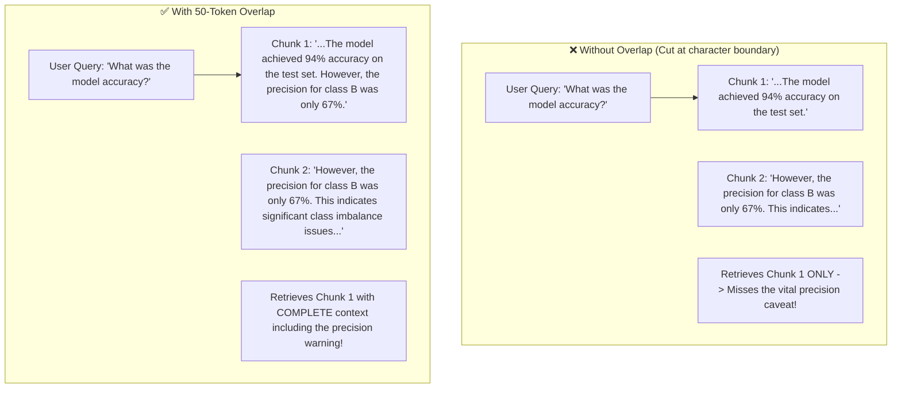

### 🎤 Interview Perspective & Golden Takeaway
> 💬 **Simple Answer to Give:**
> *"I always add a 10% to 20% overlap between chunks (about 50 tokens). This ensures that if an important sentence or condition starts at the end of one chunk and finishes in the next (like '...However, this rule does not apply if...'), the full sentence is preserved in both chunks so the search doesn't miss it."*

---

# ■ Section 3: Embeddings & Vector Databases

---

## Q7. How do you choose the right embedding model for your RAG system?

### 📌 Short Answer
Selecting an embedding model requires evaluating **5 key technical dimensions**:
1. **Quality vs. Cost:** Cloud APIs (OpenAI `text-embedding-3-large`, Cohere `embed-v3`) offer high quality with zero hosting ops; Open-source models (`BGE-M3`, `E5-Large`, `Jina-v3`) are free but require self-hosted GPU infrastructure.
2. **Dimension Size & Storage:** Higher dimensions (1536, 3072) capture richer nuances but consume more RAM and compute. Lower dimensions (384, 768) are faster and lighter.
3. **Multilingual Support:** If enterprise documents span multiple languages, select multilingual-native models like `bge-m3` or `cohere-embed-v3`.
4. **Domain Vocabulary:** Specialized domains (biomedical, legal, finance) benefit from domain-adapted models like `PubMedBERT` or fine-tuned contrastive embeddings.
5. **MTEB Benchmark Validation:** Always verify candidate models on the **MTEB (Massive Text Embedding Benchmark)** leaderboard for retrieval tasks.

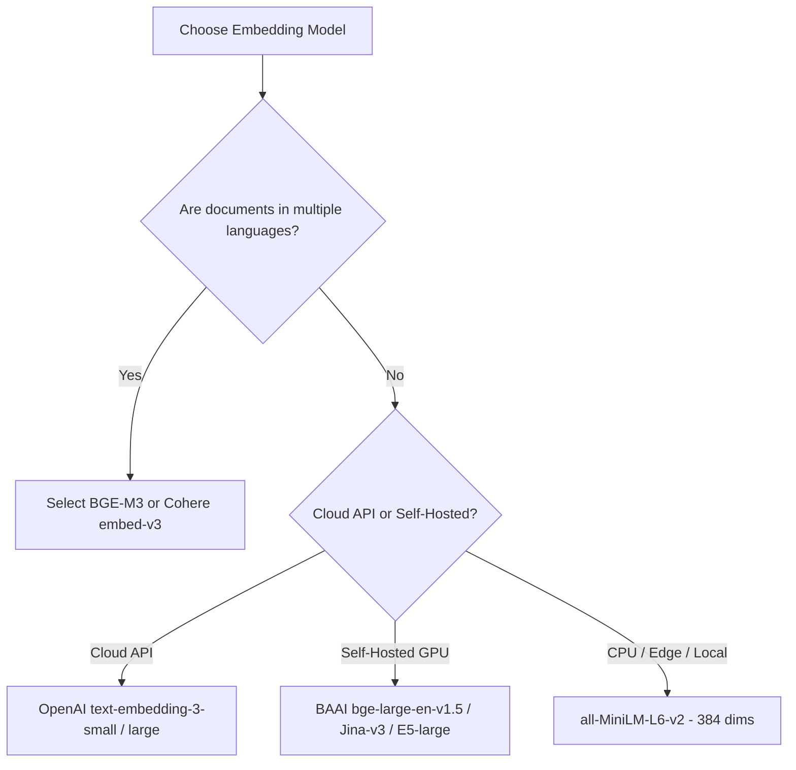

### 📊 Comparative Model Analysis Table

| Model Name | Provider / Type | Dimensions | Max Tokens | MTEB Rank / Quality | Cost per 1M Tokens | Best Fit |
| :--- | :--- | :--- | :--- | :--- | :--- | :--- |
| `text-embedding-3-small` | OpenAI (Cloud API) | 1536 (or 512 via MRL) | 8191 | High | \$0.02 | General enterprise production |
| `text-embedding-3-large` | OpenAI (Cloud API) | 3072 (or 256–1536) | 8191 | Very High | \$0.13 | High-precision legal/financial search |
| `bge-m3` | BAAI (Open Source) | 1024 | 8192 | SOTA Multilingual | Free (Self-host) | **Multilingual + Hybrid dense/sparse/multi-vector** |
| `bge-large-en-v1.5` | BAAI (Open Source) | 1024 | 512 | Very High | Free (Self-host) | English-only low-latency applications |
| `jina-embeddings-v3` | Jina AI (Open / Cloud) | 1024 (MRL 32–1024) | 8192 | SOTA Multi-Task | Free / \$0.02 | Task-specific adapters (retrieval, code, QA) |
| `e5-large-v2` | Microsoft (Open Source) | 1024 | 512 | Very High | Free (Self-host) | High-accuracy zero-shot text retrieval |
| `all-MiniLM-L6-v2` | HuggingFace (Open Source) | 384 | 256 | Moderate | Free (CPU friendly) | Edge devices, fast local prototypes |
| `cohere-embed-v3` | Cohere (Cloud API) | 1024 | 512 | Very High | \$0.10 | Enterprise search with native compression |

### 🔍 Understanding Matryoshka Representation Learning (MRL)
Advanced models (like OpenAI `text-embedding-3` and `jina-embeddings-v3`) support **Matryoshka Embeddings**, allowing you to truncate vectors from 1536 down to 512 dimensions with less than a 2% drop in retrieval accuracy, saving 66% on vector storage and accelerating index traversal.

```typescript
// Truncating OpenAI Embeddings using Matryoshka Embeddings (JavaScript / TypeScript)
import OpenAI from "openai";

const openai = new OpenAI({ apiKey: process.env.OPENAI_API_KEY });

const response = await openai.embeddings.create({
  model: "text-embedding-3-small",
  input: "Company maternity leave policy",
  dimensions: 512 // Truncates native 1536 down to 512 without losing relative similarity!
});

const embedding = response.data[0].embedding;
console.log(`Vector dimension length: ${embedding.length}`); // Outputs: 512
```

### 🎤 Interview Perspective & Golden Takeaway
> 💬 **Simple Answer to Give:**
> *"I check the **MTEB leaderboard** to see which embedding models rank highest for search. For simple cloud setup with zero server maintenance, OpenAI's `text-embedding-3-small` is great and cheap. If we have privacy rules or want to self-host for free, open-source models like `BGE-M3` are excellent, especially for multiple languages."*

---

## Q8. Compare the major vector databases — when would you use each?

### 📌 Short Answer
Vector databases store embeddings and execute high-speed Approximate Nearest Neighbor (ANN) vector searches:
- **Pinecone:** Fully managed, cloud-only, serverless, zero-ops. *(Best for: Teams who want zero infrastructure maintenance and instant scaling)*.
- **Weaviate:** Open-source, modular, built-in vectorization pipelines and native hybrid search. *(Best for: Self-hosted enterprise deployments with complex schemas)*.
- **ChromaDB:** Lightweight, open-source, embedded in Node.js / client environments. *(Best for: Local development, prototypes, hackathons, and small datasets)*.
- **Qdrant:** High-performance Rust-based vector engine with industry-leading payload metadata filtering. *(Best for: Production systems requiring fast filtered search)*.
- **PGVector:** PostgreSQL vector extension. *(Best for: Teams already running Postgres who want relational data, ACID transactions, and vectors unified in one database)*.
- **Milvus:** Distributed, horizontally scalable C++/Go engine. *(Best for: Massive enterprise datasets scaling to hundreds of millions or billions of vectors)*.

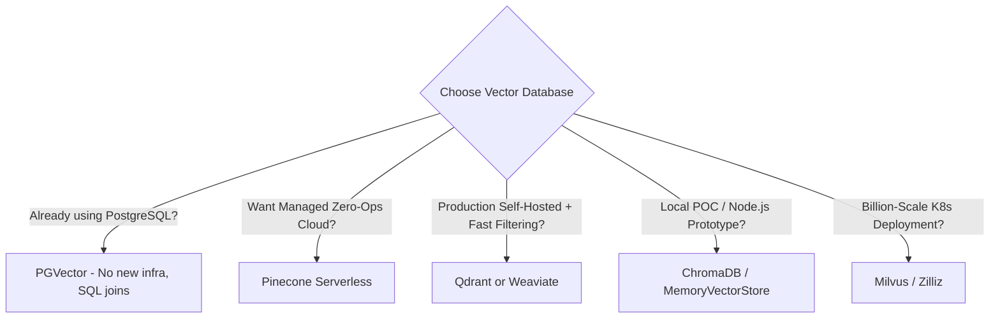

### 💡 Cost & Scale Decision Matrix for 1 Million Vectors (1536 Dimensions)

| Database | Deployment Type | Approx. Monthly Cost | Primary Strength |
| :--- | :--- | :--- | :--- |
| **ChromaDB** | Local Embedded | Free (Local RAM ~4GB) | Zero setup; `npm install chromadb` or `@langchain/community`. |
| **Qdrant Cloud** | Managed / Self-hosted | ~\$25 / month (or free self-hosted) | Rust performance + advanced payload pre-filtering. |
| **Pinecone Serverless** | Fully Managed Cloud | ~\$30 / month | Zero-ops serverless architecture; auto-scaling. |
| **Weaviate Cloud** | Managed / Self-hosted | ~\$50 / month | Built-in ML vectorizers & hybrid search. |
| **PGVector** | RDS / Supabase | Free (included with Postgres) | Relational SQL joins with vector distance operators. |

### 🎤 Interview Perspective & Golden Takeaway
> 💬 **Simple Answer to Give:**
> *"If we want zero infrastructure management and fast auto-scaling in the cloud, I choose **Pinecone**. If we already use PostgreSQL, I use **PGVector** so everything stays in one database. If we want high performance, fast metadata filtering, and full control on our own servers, I choose **Qdrant**."*

---

## Q9. What is the difference between HNSW, IVF, and flat search in vector databases?

### 📌 Short Answer
Vector indexing algorithms determine how the database navigates millions of high-dimensional vectors during similarity search:
1. **Flat Search (Brute-Force / Exact Search):** Compares the query vector against **every single vector** in the database. $100\%$ recall accuracy, but $O(N)$ computational complexity makes it impossibly slow at scale.
2. **IVF (Inverted File Index):** Partitions vector space into Voronoi clusters ($k$-means). At query time, it identifies the nearest cluster centroids and searches only vectors within those buckets. Fast, but can miss vectors near cluster boundaries.
3. **HNSW (Hierarchical Navigable Small World):** Builds a multi-layer geometric graph structure (skip-list concept). Searches by leaping across sparse top layers and zooming into dense bottom layers. Delivers $O(\log N)$ speed with $>98\%$ recall. **The gold standard for production RAG.**

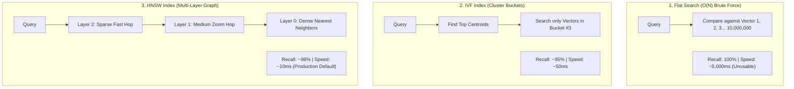

### 💡 Quantitative Benchmark on 10 Million Vectors

| Feature | Flat Search | IVF (Inverted File) | HNSW (Hierarchical Graph) |
| :--- | :--- | :--- | :--- |
| **Search Time** | ~5,000 ms (5 seconds) | ~50 ms | **~10 ms** |
| **Recall @ 10** | **100% (Ground Truth)** | ~92–95% | **~98–99%** |
| **RAM Usage** | Low (Raw vectors only) | Low to Moderate | **Higher (Stores graph edges + vectors)** |
| **Production Decision** | Tiny datasets only ($<10\text{k}$) | Memory-constrained systems | **Default choice for production RAG** |

### 🎤 Interview Perspective & Golden Takeaway
> 💬 **Simple Answer to Give:**
> *"Flat search compares your question against every single vector—it's 100% accurate but gets way too slow as data grows. IVF groups vectors into clusters like folders. **HNSW** connects vectors in a smart multi-layer graph like a fast highway network—it finds the top matches in under 10 milliseconds with almost 99% accuracy, making it the industry standard for production."*

---

# ■ Section 4: Retrieval Strategies

---

## Q10. What is Hybrid Search and why is it better than pure vector search?

### 📌 Short Answer
**Hybrid Search** combines **Dense Retrieval** (semantic vector search using cosine similarity) with **Sparse Retrieval** (keyword search using BM25 / TF-IDF) and fuses their ranked lists using **Reciprocal Rank Fusion (RRF)**.
- **Dense Search:** Excels at semantic intent, conceptual queries, and synonyms (*"car"* $\approx$ *"automobile"*), but fails on exact codes, SKUs, and unique IDs.
- **Sparse Search (BM25):** Excels at exact keyword matches, error codes (`ERR_0x4012`), and rare acronyms, but fails to understand synonyms.
- **Why Hybrid is Better:** It consistently outperforms either method alone by **10% to 20%** across enterprise retrieval benchmarks.

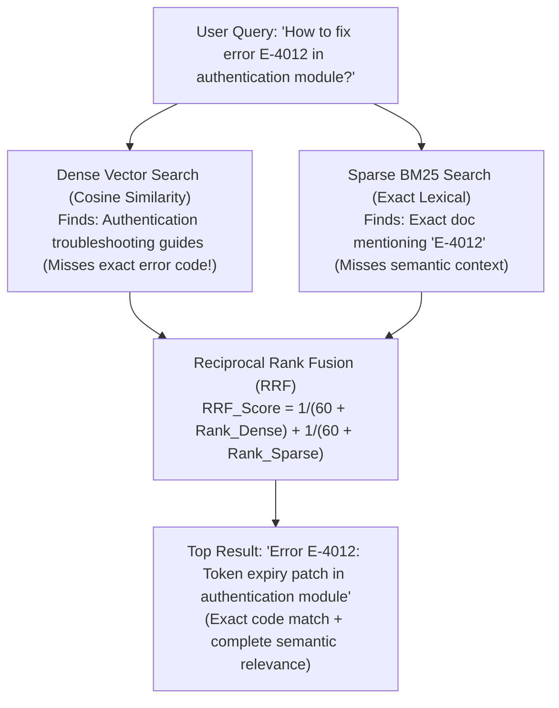

### 💡 Concrete Example: Error Code `E-4012`
- **Dense Search Only:** Returns generic *"Authentication overview"* and *"Login guide"*, completely missing the patch note for `E-4012`.
- **Sparse Search (BM25) Only:** Hits the document containing `E-4012`, but misses related documentation about token refresh mechanisms.
- **Hybrid Search (Dense + BM25 + RRF):** Surfaces the exact `E-4012` fix at Rank #1 while retaining relevant surrounding authentication guides.

### 💻 JavaScript / TypeScript Implementation: Reciprocal Rank Fusion (RRF)
```typescript
interface RRFResult {
  docId: string;
  score: number;
}

/**
 * Merges dense vector and sparse keyword ranked lists using Reciprocal Rank Fusion.
 * Formula: RRF_Score(d) = Σ [ 1 / (k + rank(d)) ]
 */
function reciprocalRankFusion(
  denseRanks: string[],
  sparseRanks: string[],
  k: number = 60
): RRFResult[] {
  const scoreMap = new Map<string, number>();

  // Accumulate dense ranks (1-indexed)
  denseRanks.forEach((docId, index) => {
    const rank = index + 1;
    const currentScore = scoreMap.get(docId) || 0;
    scoreMap.set(docId, currentScore + 1.0 / (k + rank));
  });

  // Accumulate sparse BM25 ranks (1-indexed)
  sparseRanks.forEach((docId, index) => {
    const rank = index + 1;
    const currentScore = scoreMap.get(docId) || 0;
    scoreMap.set(docId, currentScore + 1.0 / (k + rank));
  });

  // Sort descending by combined RRF score
  return Array.from(scoreMap.entries())
    .map(([docId, score]) => ({ docId, score }))
    .sort((a, b) => b.score - a.score);
}

// Example usage
const denseHits = ["doc_A", "doc_B", "doc_C"];
const sparseHits = ["doc_C", "doc_A", "doc_D"];

const fusedResults = reciprocalRankFusion(denseHits, sparseHits);
console.log(fusedResults);
// doc_A and doc_C get boosted to the top because they appeared in both ranked lists!
```

### 🎤 Interview Perspective & Golden Takeaway
> 💬 **Simple Answer to Give:**
> *"Pure vector search is great for understanding general meanings (like matching 'car' with 'automobile'), but it struggles with exact part numbers, error codes like `ERR-404`, or product names. **Hybrid search** runs both semantic vector search AND traditional keyword search (BM25) together, combining their results so you never miss exact terms or broad concepts."*

---

## Q11. What is the 'Lost in the Middle' problem and how do you solve it?

### 📌 Short Answer
The **'Lost in the Middle' problem** is an empirical phenomenon where Large Language Models pay high attention to information placed at the **very beginning** and **very end** of their prompt context window, but frequently overlook or fail to extract facts positioned in the **middle** of long contexts.

### 🎯 5 Production Solutions to Fix 'Lost in the Middle'
1. **Reduce Number of Retrieved Chunks:** Retrieve fewer, higher-quality chunks (top 3–5 instead of 10–20).
2. **Rerank Before Prompt Injection:** Place the highest-scoring, most relevant chunk at **Index 0 (the top)** of the prompt.
3. **Contextual Compression:** Summarize and strip out non-answering filler text from chunks before injection.
4. **Query Decomposition:** Decompose complex multi-part questions into individual atomic sub-queries.
5. **Smart Prompt Positioning:** Put the most critical retrieved facts at the **START** of the prompt context and place instructions/queries at the **END**.

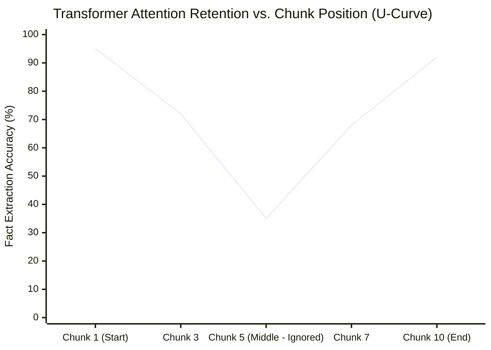

### 💡 Concrete Example
- *Retrieved Chunks:* 10 chunks ordered by initial similarity. Chunk #5 (score 0.87) contains the exact answer.
- *Failure:* LLM reads chunks 1–3 and 9–10, glossing over chunk #5 and hallucinating.
- *Fix Applied:* Run a Cross-Encoder reranker $\rightarrow$ Chunk #5 is promoted to Position #1 at the top of the prompt $\rightarrow$ LLM extracts the exact answer cleanly.

### 🎤 Interview Perspective & Golden Takeaway
> 💬 **Simple Answer to Give:**
> *"LLMs easily remember facts at the very top and very bottom of a prompt, but they often ignore facts buried in the middle. To fix this, I send only the top 3–5 most relevant chunks instead of 15, and I use a **reranker** to put the most important chunk right at the top (Position #1)."*

---

## Q12. What is Query Transformation and why does it improve RAG?

### 📌 Short Answer
Raw user queries are frequently ambiguous, conversational, incomplete, or poorly phrased for vector search. **Query Transformation** uses an LLM to rewrite, expand, or decompose user input before executing retrieval.

### 🎯 The 4 Major Query Transformation Techniques
1. **Query Rewriting:** Rephrases vague conversational input into a search-optimized query.
   - *Raw:* *"My app keeps crashing after the update."* $\rightarrow$ *Rewritten:* *"Application crash troubleshooting and error handling post-upgrade."*
2. **HyDE (Hypothetical Document Embeddings):** Asks the LLM to generate a hypothetical answer first, then uses that hypothetical answer's embedding to search the Vector DB. (Answers share closer semantic space with real documents than raw questions do).
3. **Sub-Query Decomposition:** Breaks a complex question into multiple simpler sub-queries, executes them in parallel, and merges the retrieved facts.
4. **Step-Back Prompting:** Generates a higher-level, broader conceptual query to retrieve prerequisite foundational principles first.

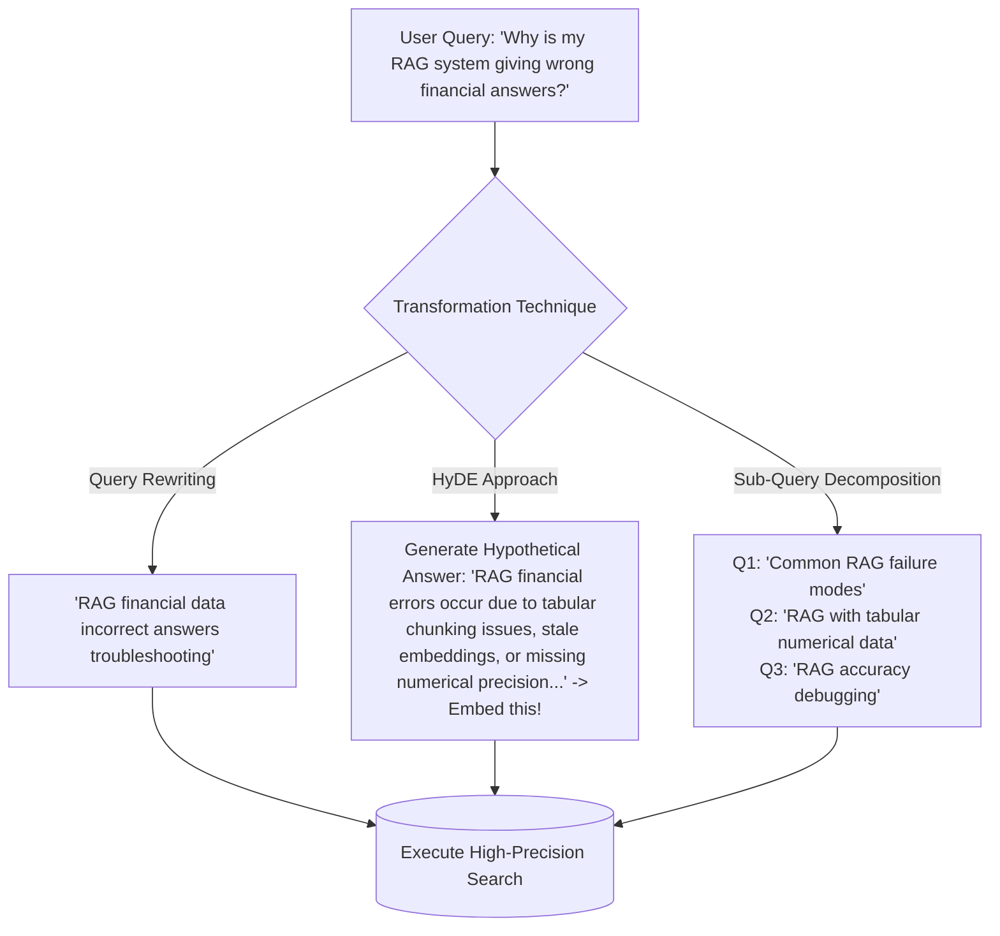

### 🎤 Interview Perspective & Golden Takeaway
> 💬 **Simple Answer to Give:**
> *"Users often ask short or messy questions like 'why did it fail?'. **Query rewriting** uses a fast LLM to turn that into a clear search query like 'payment gateway failure troubleshooting'. With **HyDE**, the LLM first writes a fake answer to the question, and we search using that answer—because an answer paragraph matches real documentation much better than a short question does."*

---

# ■ Section 5: Advanced RAG Patterns

---

## Q13. What is the difference between Naive RAG, Advanced RAG, and Modular RAG?

### 📌 Short Answer
- **Naive RAG (Basic Linear Pipe):** `Chunk -> Embed -> Vector Search -> Stuff into Prompt -> Generate`. Simple to build, but suffers from low precision, lack of query optimization, and hallucinations. (POC/Demo only).
- **Advanced RAG (Optimized Pipe):** Enhances the linear pipeline with **Pre-Retrieval** (Query rewriting, HyDE, metadata filtering) and **Post-Retrieval** (Cross-encoder reranking, contextual compression, deduplication) modules. (Production standard).
- **Modular RAG (Dynamic & Agentic Network):** Treats RAG as a collection of decoupled, interchangeable micro-services. Uses dynamic routing, multi-tool orchestration (SQL + Vector + Web), iterative feedback loops, and self-correction. (SOTA Enterprise / Agentic RAG).

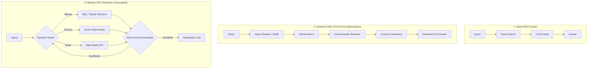

### 💡 Example: Comparing Revenue for Product X in Q1 vs Q2
- **Naive RAG:** Searches `"compare Q1 Q2 revenue Product X"` $\rightarrow$ gets vague marketing chunks $\rightarrow$ LLM hallucinates numbers.
- **Advanced RAG:** Decomposes into Q1 and Q2 queries $\rightarrow$ applies metadata filter `product='X'` $\rightarrow$ reranks top 3 chunks $\rightarrow$ outputs verified numbers.
- **Modular RAG:** Router detects financial comparison query $\rightarrow$ routes to Tabular SQL Retriever $\rightarrow$ validates numerical delta with a JavaScript/TypeScript code sandbox $\rightarrow$ formats a verified structured comparison table.

### 🎤 Interview Perspective & Golden Takeaway
> 💬 **Simple Answer to Give:**
> *"**Naive RAG** is the basic prototype: just search vectors and generate an answer. **Advanced RAG** adds smart preprocessing (query rewriting) and post-processing (reranking and filtering) to make answers much more accurate. **Modular RAG** uses an intelligent router that sends questions to the right tool—like querying a database for numbers, a vector store for policies, or web search for news."*

---

## Q14. What is Parent-Child chunking (also called hierarchical chunking)?

### 📌 Short Answer
**Parent-Child (Hierarchical) Chunking** creates two interconnected tiers of chunks:
1. **Small Child Chunks (e.g., 100–200 tokens):** Embedded and indexed for high-precision vector search.
2. **Large Parent Chunks (e.g., 1000–2000 tokens / full sections):** Stored in a document store and retrieved to provide rich context to the LLM.

### 🎯 The Tension It Resolves
Small chunks produce sharp, unpolluted embeddings for accurate vector matching, but lack sufficient narrative context for LLM generation. Large chunks provide rich context, but their embeddings are washed out. Parent-Child gives you both: **Precise vector retrieval AND comprehensive LLM context.**

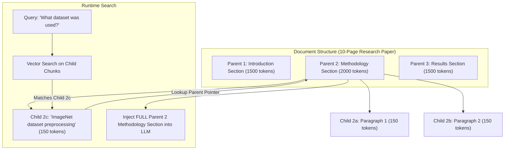

### 💻 Code Example: Parent Document Retriever (JavaScript / TypeScript)
```typescript
import { ParentDocumentRetriever } from "langchain/retrievers/parent_document";
import { MemoryVectorStore } from "langchain/vectorstores/memory";
import { InMemoryStore } from "@langchain/core/stores";
import { RecursiveCharacterTextSplitter } from "@langchain/textsplitters";
import { OpenAIEmbeddings } from "@langchain/openai";
import { Document } from "@langchain/core/documents";

// 1. Define parent (large context) and child (small vector search) splitters
const parentSplitter = new RecursiveCharacterTextSplitter({
  chunkSize: 1000,
  chunkOverlap: 50
});

const childSplitter = new RecursiveCharacterTextSplitter({
  chunkSize: 200,
  chunkOverlap: 20
});

// 2. Setup Child VectorStore + Parent DocStore
const vectorstore = new MemoryVectorStore(
  new OpenAIEmbeddings({ model: "text-embedding-3-small" })
);
const docstore = new InMemoryStore();

const retriever = new ParentDocumentRetriever({
  vectorstore,
  docstore,
  childSplitter,
  parentSplitter
});

// 3. Ingest full parent documents
await retriever.addDocuments([
  new Document({
    pageContent: `Large multi-page technical report... Section 2: Methodology using ImageNet dataset preprocessing with 256x256 resizing...`,
    metadata: { source: "research_paper_v1.pdf" }
  })
]);

// 4. Query: Search matches child 200t chunk -> Returns FULL 1000t parent section to LLM!
const retrievedDocs = await retriever.getRelevantDocuments("What dataset preprocessing was used?");
console.log("Retrieved Full Parent Context:", retrievedDocs[0].pageContent);
```

### 🎤 Interview Perspective & Golden Takeaway
> 💬 **Simple Answer to Give:**
> *"Small chunks are great for pinpoint search accuracy, but they don't give the LLM enough context to write a good answer. Large chunks give great context, but are hard to search accurately. **Parent-Child chunking fixes this:** we search tiny chunks (~150 words), but when we find a match, we pass the entire parent section (~1000 words) to the LLM so it has the complete picture."*

---

## Q15. What is Multi-Index RAG and when do you use it?

### 📌 Short Answer
**Multi-Index RAG** maintains multiple distinct, specialized indexes tailored to different content structures and query modalities, using an intelligent **Query Router** (LLM or classifier) to direct each question to the optimal data store.

### 🎯 The 4 Standard Indexes
1. **Text Chunk Index:** Granular 512-token chunks for specific policy/detail questions.
2. **Summary Index:** Document-level summaries for broad, high-level thematic queries.
3. **Table / SQL Index:** Structured financial spreadsheets, matrices, and relational tables.
4. **Knowledge Graph (KG) Index:** Entity-relationship triples for dependency and multi-hop queries.

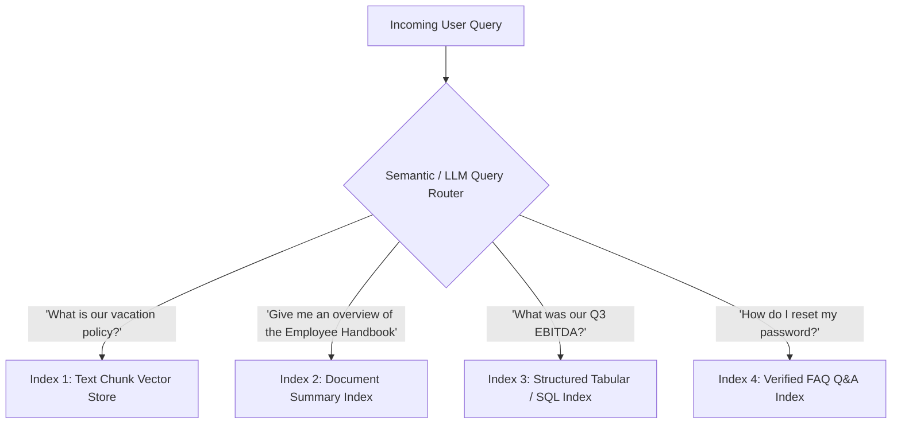

### 🎤 Interview Perspective & Golden Takeaway
> 💬 **Simple Answer to Give:**
> *"Different questions need different data sources. Instead of throwing everything into one giant vector bucket, I create separate indexes (one for document text, one for high-level summaries, and one SQL database for numbers) and use a router to send each question to the right place."*

---

# ■ Section 6: Reranking & Post-Retrieval

---

## Q16. What is Reranking and why is it a game-changer for RAG quality?

### 📌 Short Answer
**Reranking** is a post-retrieval refinement step where a specialized **Cross-Encoder model** evaluates the user query and each candidate chunk **together simultaneously**, computing full token-level bidirectional cross-attention to output a precise relevance score ($0.0 \text{ to } 1.0$).
- **The Two-Stage Pattern:** Broad initial retrieval (retrieve 20–50 chunks fast with bi-encoder vector search) $\rightarrow$ Deep Reranking (rerank down to top 3–5 with cross-encoder) $\rightarrow$ Inject into LLM.
- **Top Models:** Cohere Rerank v3, BGE-Reranker-Large, Jina Reranker v2, Sentence-Transformers Cross-Encoders.

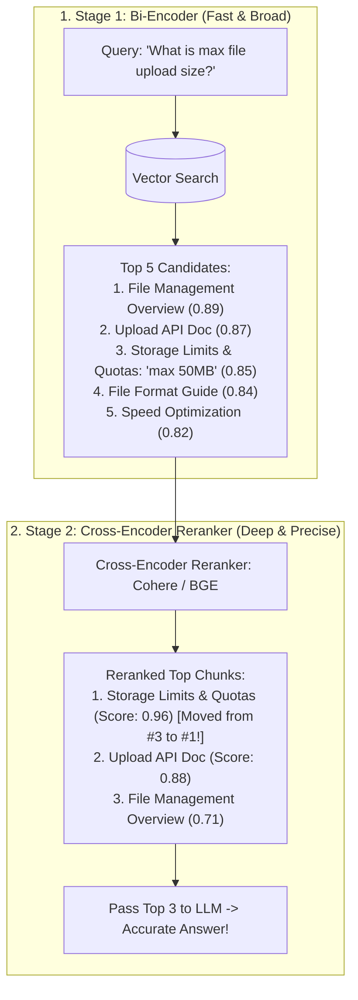

### 💻 Production Reranking Code (JavaScript / TypeScript with Cohere)
```typescript
import { CohereClient } from "cohere-ai";

const cohere = new CohereClient({ token: process.env.COHERE_API_KEY });

interface CandidateChunk {
  id: string;
  text: string;
}

// 1. Step 1: Broad Vector Search returns Top 20 Candidates (Bi-Encoder)
const candidateChunks: CandidateChunk[] = [
  { id: "chunk_1", text: "File management overview and directory upload setup..." },
  { id: "chunk_2", text: "API endpoint specifications for multipart file streaming..." },
  { id: "chunk_3", text: "Storage Limits & Quotas: The maximum file upload size is strictly 50MB for free accounts and 200MB for enterprise." },
  { id: "chunk_4", text: "Performance tuning tips for chunked HTTP POST transfers..." }
];

const query = "What is the maximum file upload size?";

// 2. Step 2: Cross-Encoder Reranker computes full bidirectional cross-attention
const rerankResponse = await cohere.rerank({
  model: "rerank-english-v3.0",
  query: query,
  documents: candidateChunks.map((c) => c.text),
  topN: 3
});

// 3. Step 3: Map reranked scores and select Top Chunks for LLM context
const top3Context = rerankResponse.results.map((result) => ({
  chunk: candidateChunks[result.index],
  relevanceScore: result.relevanceScore
}));

console.log("Reranked Top Chunks:", top3Context);
// Chunk 3 (Storage Limits: 50MB) is promoted to Rank #1 with highest relevance score (e.g. 0.98)!
```

### 🎤 Interview Perspective & Golden Takeaway
> 💬 **Simple Answer to Give:**
> *"Vector search is fast but rough—it gives you the top 20 candidate snippets. A **cross-encoder reranker** then carefully reads the user's question and each snippet side-by-side to score their true relevance, pulling the best answer straight to #1 before passing it to the LLM. It's the easiest way to instantly boost answer quality."*

---

## Q17. What is Contextual Compression and how does it help RAG?

### 📌 Short Answer
Even after retrieval and reranking, chunks often contain **50% to 80% irrelevant filler text**. **Contextual Compression** extracts only the specific sentences or data points directly answering the query, discarding the surrounding noise before prompt construction.
- **Key Benefits:**
  1. **Saves Tokens:** Reduces prompt token consumption by 60% to 80%, directly cutting LLM API costs.
  2. **Reduces Noise:** Prevents distractors from triggering hallucinations.
  3. **Fits More Chunks:** Allows packing facts from 10 different documents into the prompt within standard context limits.
- **Implementations:** Small extractor models (`LLMChainExtractor`), embeddings filters (`EmbeddingsFilter`), or prompt compression libraries (`LLMLingua`).

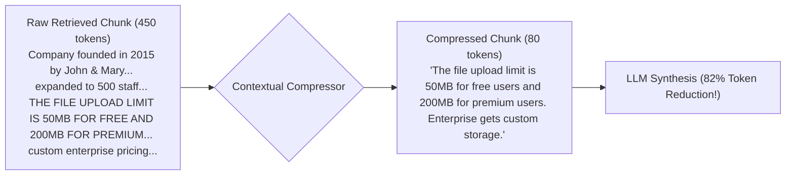

### 🎤 Interview Perspective & Golden Takeaway
> 💬 **Simple Answer to Give:**
> *"Retrieved chunks usually contain 60–80% useless background text. Contextual compression cuts away the filler and keeps only the 2 or 3 sentences that directly answer the question. This saves token costs, speeds up the LLM, and stops the model from getting distracted by irrelevant details."*

---

## Q18. How do you handle metadata filtering in RAG retrieval?

### 📌 Short Answer
**Metadata Filtering** applies structured attribute constraints (e.g., `version='2026'`, `department='HR'`, `country='India'`, `access_level='public'`) **BEFORE** vector similarity search runs.
- **How It Works:** Rather than searching across all 500,000 chunks, the database pre-filters down to the 500 relevant policy chunks and searches vectors only within that filtered subset.
- **Why It's Essential:** Eliminates version conflicts (e.g. accidentally retrieving a 2023 policy for a 2026 query) and enforces **Role-Based Access Control (RBAC)** security.

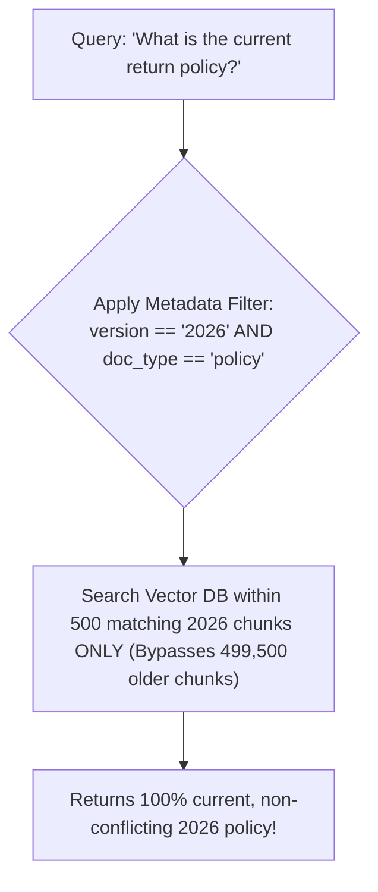

### 💡 Example Metadata Payload Schema
```json
{
  "text": "Returns accepted within 14 days with original receipt...",
  "metadata": {
    "doc_type": "policy",
    "department": "customer_service",
    "version": "2026",
    "last_updated": "2026-01-15",
    "access_level": "public"
  }
}
```

### 🎤 Interview Perspective & Golden Takeaway
> 💬 **Simple Answer to Give:**
> *"Instead of searching across all 100,000 documents, metadata filtering narrows the search first—for example, looking only inside `department = 'HR'` and `year = '2026'`. This prevents the system from pulling old 2022 policies and makes sure users only see documents they have permission to access."*

---

# ■ Section 7: RAG Evaluation

---

## Q19. How do you evaluate a RAG system? What metrics do you use?

### 📌 Short Answer
Evaluating RAG requires decoupling the assessment into two independent dimensions: **Retrieval Quality** and **Generation Quality**.
1. **Retrieval Metrics (Information Retrieval):**
   - **Hit Rate / Recall@K:** Does the ground-truth document appear in the top $K$ results?
   - **MRR (Mean Reciprocal Rank):** How close to Rank #1 was the correct chunk placed?
   - **NDCG (Normalized Discounted Cumulative Gain):** Measures graded relevance ranking quality.
2. **Generation Metrics (Groundedness & Fidelity):**
   - **Faithfulness:** Are all claims in the answer strictly supported by the retrieved context? (No hallucinations).
   - **Answer Relevancy:** Did the model answer the user's specific question?
   - **Context Relevancy:** Are the retrieved chunks free from distracting noise?
   - **Context Utilization:** Did the answer utilize all relevant information provided in context?

```mermaid
flowchart TD
    Eval[RAG System Evaluation] --> R[1. Retrieval Quality]
    Eval --> G[2. Generation Quality]

    R --> R1[Hit Rate @ 5 e.g. 87%]
    R --> R2[MRR e.g. 0.72]
    R --> R3[Context Relevancy e.g. 79%]

    G --> G1[Faithfulness e.g. 91%]
    G --> G2[Answer Relevancy e.g. 88%]
    G --> G3[Citation Precision e.g. 95%]
```

### 💡 Diagnostic Example
- *Test Set:* 200 questions evaluated on a customer support bot.
- *Results:* Hit Rate@5 = 87%, Faithfulness = 91%, Context Relevancy = 79%.
- *Diagnosis:* Faithfulness is strong (LLM grounds well), but context relevancy is low (21% noise in retrieved chunks).
- *Action Item:* Add a Cohere Cross-Encoder reranker to push context relevancy above 90%.

### 🎤 Interview Perspective & Golden Takeaway
> 💬 **Simple Answer to Give:**
> *"I test RAG in two separate steps:
> 1. **Retrieval Check:** Did we actually find the right document in the top 3 results?
> 2. **Answer Check:** Did the LLM stick 100% to the retrieved facts without making things up (**Faithfulness**), and did it actually answer what the user asked (**Answer Relevancy**)? Split testing makes it easy to find where bugs happen."*

---

## Q20. What is RAGAS and how does it work?

### 📌 Short Answer
**RAGAS (Retrieval Augmented Generation Assessment)** is an open-source evaluation framework that uses **LLM-as-a-Judge** to evaluate RAG pipelines automatically without requiring human-labeled ground truth for every test query.

### 🎯 The 4 Core RAGAS Metrics
1. **Faithfulness (Score 0–1):** Decomposes the generated response into atomic claims and verifies if each claim is logically entailed by the retrieved context. (Measures hallucination rate).
2. **Answer Relevancy (Score 0–1):** Generates hypothetical questions from the output and computes semantic similarity against the original user query. (Measures topic drift).
3. **Context Precision (Score 0–1):** Evaluates if signal-bearing chunks are ranked higher than irrelevant noise chunks.
4. **Context Recall (Score 0–1):** Checks if the retrieved context contains all facts required to match the ground truth.

```mermaid
flowchart TD
    subgraph Inputs
        Q[User Question]
        C[Retrieved Context]
        A[Generated Answer]
    end

    C & A -->|Checks Entailment| M1[1. Faithfulness Metric]
    Q & A -->|Checks Query Match| M2[2. Answer Relevancy Metric]
    Q & C -->|Checks Ranking Quality| M3[3. Context Precision Metric]
    C & GT[Ground Truth] -->|Checks Coverage| M4[4. Context Recall Metric]
```

### 💻 JavaScript / TypeScript Automated Evaluation (LLM-as-a-Judge with LangChain.js & Zod)
```typescript
import { ChatOpenAI } from "@langchain/openai";
import { z } from "zod";

const judgeLLM = new ChatOpenAI({
  model: "gpt-4o",
  temperature: 0.0
});

// Define structured evaluation schema using Zod
const evaluationSchema = z.object({
  faithfulnessScore: z.number().min(0).max(1).describe("1.0 if all claims are fully supported by context, 0.0 if hallucinated"),
  answerRelevancyScore: z.number().min(0).max(1).describe("1.0 if answer directly addresses the user query"),
  unsupportedClaims: z.array(z.string()).describe("List of claims made in answer that were NOT in context"),
  reasoning: z.string().describe("Step-by-step evaluation breakdown")
});

const structuredJudge = judgeLLM.withStructuredOutput(evaluationSchema);

// Run evaluation on RAG output
async function evaluateRagResponse(question: string, context: string, generatedAnswer: string) {
  const evalPrompt = `You are an expert impartial RAG evaluation judge.
Evaluate the following generated answer against the retrieved context and user question.

Question: ${question}
Retrieved Context: ${context}
Generated Answer: ${generatedAnswer}`;

  const score = await structuredJudge.invoke(evalPrompt);
  return score;
}

// Example evaluation execution
const evalResult = await evaluateRagResponse(
  "What is our refund policy window?",
  "Items can be returned within 14 calendar days of delivery in original packaging.",
  "You can return items within 14 days of delivery."
);

console.log("RAG Evaluation Result:", evalResult);
// Output: { faithfulnessScore: 1.0, answerRelevancyScore: 1.0, unsupportedClaims: [], reasoning: "Answer directly entails the 14-day policy stated in context." }
```

### 🎤 Interview Perspective & Golden Takeaway
> 💬 **Simple Answer to Give:**
> *"Instead of manually grading hundreds of test answers by hand, RAGAS uses a smart LLM to grade your system automatically on four key scores: Did it hallucinate? Did it answer the question? Did it find the right documents? And did it filter out noise? We run this automated test whenever we change chunk sizes or prompts."*

---

## Q21. How do you create a test set for RAG evaluation?

### 📌 Short Answer
Creating a reliable golden evaluation test set involves **3 complementary approaches**:
1. **Synthetic Generation (Fast & Scalable):** Use an LLM (via RAGAS test generator or LlamaIndex) to read documents and automatically generate 100+ diverse QA pairs (simple factual, multi-hop reasoning, complex).
2. **Manual SME Creation (Gold Standard):** Domain experts (lawyers, HR managers, engineers) write 50–100 tricky questions reflecting real-world nuances.
3. **Production Log Mining (Realistic):** Harvest real user queries, chat logs, and thumbs up/down feedback telemetry.

```mermaid
flowchart LR
    D[Enterprise Docs] --> LLM[LLM Synthetic Generator]
    LLM --> T1[100 Synthetic QA Pairs]
    SME[Domain Experts] --> T2[50 Tricky Edge-Case QA Pairs]
    UN[Adversarial Prompts] --> T3[20 Unanswerable QA Pairs]
    T1 & T2 & T3 --> Golden[(Golden Test Set: 170 Questions)]
```

### 🎯 Must-Have Question Categories in a Test Set
- **Simple Factual:** Direct keyword/concept queries.
- **Multi-Hop Questions:** Requires synthesizing information spread across 2 or more separate chunks.
- **Temporal Questions:** Validates latest policy vs outdated archived policy.
- **Unanswerable / Out-of-Scope Questions:** Crucial for testing if the system correctly responds *"I do not have this information"* instead of hallucinating.

### 🎤 Interview Perspective & Golden Takeaway
> 💬 **Simple Answer to Give:**
> *"To build a solid test set, I combine real questions from user chat logs, 50 tricky questions written by team experts, and automatically generated questions. Most importantly, I always include 10–20% 'trick' questions that cannot be answered from our documents, to verify that the LLM says 'I don't know' instead of making up a fake answer."*

---

# ■ Section 8: Production RAG

---

## Q22. What are the common failure modes of RAG systems in production?

### 📌 Short Answer
Production RAG systems systematically encounter **7 major failure modes**:
1. **Wrong Chunks Retrieved:** Embedding quality is poor, or query vocabulary mismatches chunks. *(Fix: Hybrid search + BM25, better embeddings, HyDE)*.
2. **Right Chunks but Wrong Answer:** LLM ignores or misinterprets the context. *(Fix: Stricter grounding prompts, structured outputs, lower temperature)*.
3. **Outdated Information:** The knowledge base is stale. *(Fix: Automated change detection pipelines, MD5 hashing, version filtering)*.
4. **Missing Information (Ingestion Failure):** Document was never indexed, or OCR failed on scanned tables. *(Fix: Document coverage audits, vision parsers)*.
5. **Context Overflow / Lost in Middle:** Too many distractor chunks stuffed in prompt. *(Fix: Reranking, top-k reduction, contextual compression)*.
6. **Hallucination Despite Context:** LLM injects parametric training data instead of context facts. *(Fix: Faithfulness guardrails, citation enforcement, temperature=0.0)*.
7. **Latency Spikes:** Slow retrieval, heavy embedding models, or unstreamed LLM calls. *(Fix: Redis semantic caching, HNSW indexing, token streaming)*.

```mermaid
flowchart TD
    Fail[RAG Failure Investigation] --> D1{1. Is document indexed?}
    D1 -->|No| Fix1[Ingestion Audit / OCR Fix]
    D1 -->|Yes| D2{2. Was chunk retrieved in Top-K?}
    D2 -->|No| Fix2[Hybrid Search / Query Rewriter]
    D2 -->|Yes| D3{3. Is chunk ranked in Top 3?}
    D3 -->|No| Fix3[Cross-Encoder Reranker]
    D3 -->|Yes| D4{4. Did LLM hallucinate?}
    D4 -->|Yes| Fix4[Set Temp=0.0 / Strict Refusal Prompt]
    D4 -->|No| Fix5[Freshness / Version Metadata Filter]
```

### 💡 Concrete Debugging Scenario: Parental Leave Policy
- *User Question:* "What is our parental leave policy?"
- *RAG Answer:* "Employees get 12 weeks of paid leave." *(WRONG: 2025 policy is 16 weeks)*.
- *Root Cause:* Both 2020 (12 wks) and 2025 (16 wks) PDFs existed in the Vector DB; old version ranked higher because its text was shorter.
- *Fix Applied:* Deleted old policy vector, added metadata pre-filter `version='latest'`, and integrated SHA-256 change detection.

### 🎤 Interview Perspective & Golden Takeaway
> 💬 **Simple Answer to Give:**
> *"When a RAG system gives a wrong answer, I debug it like a pipeline:
> 1. Did the document get ingested into the database properly?
> 2. Did the search actually find the right chunk?
> 3. Was the right chunk placed in the top 3 snippets?
> 4. Did the LLM ignore the context or hallucinate?
> Finding which of these 4 steps failed tells you exactly how to fix it."*

---

## Q23. How do you handle document updates and keep the RAG knowledge base fresh?

### 📌 Short Answer
Document freshness is a critical operational requirement. Maintaining a synchronized knowledge base relies on **6 key strategies**:
1. **Change Detection Pipeline:** Monitor source systems (Google Drive, S3, Confluence) via webhooks and **SHA-256 / MD5 content hashes**. Re-chunk and re-embed only when the hash changes.
2. **Versioned Embeddings:** Attach version numbers and timestamps to chunk metadata (`version: '2026-v2'`). Filter for the latest version at query time while retaining older versions for audit trails.
3. **Incremental Ingestion:** Never re-index the entire database from scratch. Perform atomic operations: `delete(doc_id)` $\rightarrow$ `upsert(new_chunks)`.
4. **Scheduled Refresh:** Run automated nightly/weekly sync jobs for systems without native webhook events.
5. **Time-To-Live (TTL):** Set expiration timestamps on rapidly changing documents, auto-deleting stale vectors.
6. **Source of Truth Validation:** Periodically run automated sampling checks verifying vector DB text against source files.

```mermaid
flowchart TD
    Trigger[Webhook Event / S3 File Upload] --> Download[Download Updated Document]
    Download --> Hash{Compare SHA-256 Hash with Metadata Store}
    Hash -->|Hash Unchanged| Skip[Skip Processing - Zero Cost]
    Hash -->|Hash Changed| Pipe[1. Delete old vectors WHERE doc_id = X]
    Pipe --> Rechunk[2. Re-chunk updated file]
    Rechunk --> Reembed[3. Re-embed new chunks]
    Reembed --> Upsert[4. Atomic Upsert into Vector DB with new version tag]
    Upsert --> Test[5. Run automated RAGAS test suite on 20 sample queries]
```

### 🎤 Interview Perspective & Golden Takeaway
> 💬 **Simple Answer to Give:**
> *"I never re-index the whole database from scratch. Whenever a file changes in Google Drive or S3, we check its hash (SHA-256). If the content changed, we delete only that document's old vectors, chunk and embed the new file, and insert the updated vectors with a new version tag in real time."*

---

## Q24. How do you add citations and source attribution to RAG answers?

### 📌 Short Answer
Citations establish user trust, enable verifiability, and are mandatory in legal, medical, and enterprise deployments.
- **Methods for Source Attribution:**
  1. **Chunk-Level Citation:** Tag every chunk with metadata (`doc_name`, `page_number`, `section`). Append source links at the bottom of the response.
  2. **Inline Citation Prompting:** Instruct the LLM to insert source brackets (`[Source 1]`, `[Source 2]` or `[1]`) immediately after every factual claim.
  3. **Post-Processing Verification:** Run a lightweight secondary LLM pass verifying that claim $X$ is strictly supported by chunk $[X]$.
  4. **Numbered References:** Assign numbered labels `[1], [2], [3]` to context snippets and mandate that the LLM use them throughout the response.

```mermaid
flowchart TD
    Context["Numbered Injected Context:<br/>[1] HR Policy 2026, Page 12: '16 weeks paid parental leave'<br/>[2] Benefits Guide, Page 4: 'Can be split into two blocks'"]
    Context --> LLM["LLM Grounding Prompt with Citation Constraint"]
    LLM --> Answer["Generated Output:<br/>'Employees receive 16 weeks of paid parental leave [1], which can be split into two blocks within 12 months [2].'<br/><br/><b>Sources:</b><br/>[1] HR Policy 2026, Page 12<br/>[2] Benefits Guide, Page 4"]
```

### 💡 Example Prompt for Strict Inline Citations
```text
Answer the question using ONLY the provided numbered context snippets.
After EVERY factual claim, cite the source using [Source N].
If the context does not contain the answer, say "I don't have this information."

Context:
[Source 1] HR Policy v2026: "Employees receive 16 weeks paid parental leave."
[Source 2] Benefits Guide: "Parental leave can be split into two blocks within 12 months."

Generated Answer:
Employees receive 16 weeks of paid parental leave [Source 1]. This leave can be split into two blocks within 12 months of birth [Source 2].
```

### 🎤 Interview Perspective & Golden Takeaway
> 💬 **Simple Answer to Give:**
> *"In the system prompt, I instruct the LLM to add a bracket like `[1]` or `[Doc Name, Page 4]` right after every statement it makes. Then at the bottom of the answer, we list clickable links to those exact source pages so users can verify the answer themselves."*

---

# ■ Section 9: Multimodal & Agentic RAG

---

## Q25. What is Agentic RAG and how is it different from standard RAG?

### 📌 Short Answer
- **Standard RAG (Static Pipeline):** Fixed single-shot flow: `Query -> Embed -> Vector Search Top 5 -> LLM -> Answer`. If retrieved data is insufficient or wrong, the system fails with no recovery.
- **Agentic RAG (Dynamic Decision-Making System):** An autonomous AI agent actively controls the retrieval process through reasoning, tool execution, and reflection loops.
  - **Decides WHEN to retrieve:** Skips retrieval for greetings or pure calculations.
  - **Decides WHAT to search:** Reformulates queries, tries multiple search strategies.
  - **Evaluates results:** Evaluates if retrieved chunks actually answer the question.
  - **Iterates & Self-Corrects:** If initial results are poor, rewrites the query or switches search tools.
  - **Multi-Tool Orchestration:** Dynamically queries Vector DB + SQL databases + Web Search APIs + JavaScript/TypeScript code sandboxes.

```mermaid
flowchart TD
    subgraph Standard_RAG["Standard RAG (Fixed One-Shot)"]
        Q1[Query] --> S1[Vector Search] --> L1[LLM Generation]
    end

    subgraph Agentic_RAG["Agentic RAG (Dynamic Reasoning Loop)"]
        Q2["User: 'What was our revenue growth vs competitors in Q3?'"] --> Agent{Agentic Controller}
        Agent -->|Step 1| T1[Tool 1: Search Internal Financial KB -> Gets $4.2M]
        T1 --> Eval1{Agent Evaluates: Missing competitor numbers!}
        Eval1 -->|Step 2| T2[Tool 2: Web Search for Competitor Q3 Report]
        T2 --> Eval2{Agent Evaluates: Web results are news articles}
        Eval2 -->|Step 3: Reformulate| T3[Tool 3: Search Competitor 10-Q Filing]
        T3 --> Synth[Combine Internal + External Data -> Synthesize Grounded Comparison]
    end
```

### 🎤 Interview Perspective & Golden Takeaway
> 💬 **Simple Answer to Give:**
> *"Standard RAG is a one-way street: it searches once, and if the results are bad, it fails. **Agentic RAG** acts like a smart assistant: it decides if it even needs to search, checks if the retrieved snippets actually answer the question, and if they don't, rewrites the query or tries a different search tool until it finds the right answer."*

---

## Q26. How do you build RAG over tables, charts, and images (Multimodal RAG)?

### 📌 Short Answer
Standard RAG only handles plain text. **Multimodal RAG** extends retrieval to tables, financial matrices, bar charts, and scanned images using **4 specialized strategies**:
1. **Table Extraction & Markdown/CSV Serialization:** Extract tables using tools like `Camelot`, `pdfplumber`, or `Unstructured.io`. Convert rows and columns into clean **Markdown tables** or natural language summary strings before embedding.
2. **Vision-Language Model (VLM) Image/Chart Summarization:** Pass charts, diagrams, and figures to a Vision Model (GPT-4o / Claude 3.5 Sonnet Vision) to generate rich, descriptive text summaries capturing exact numbers, axes, and trends. Embed the text summary while retaining pointers to the raw image.
3. **Structured Multi-Type Layout Parsing:** Use `Unstructured.io` or Azure Document Intelligence to partition documents into distinct element types (`Text`, `Table`, `Figure`), applying dedicated chunking and indexing to each.
4. **ColPali (Direct Visual Page Embedding):** SOTA 2026 approach that embeds entire document page images directly using vision-language models, bypassing text extraction and OCR altogether.

```mermaid
flowchart TD
    Doc[Complex PDF Document] --> Parse{Document Layout Parser}

    Parse -->|Paragraphs| T[Text Chunker & Standard Embedder]
    Parse -->|Tables| TAB[Table Parser -> Markdown Serialization]
    Parse -->|Charts / Images| VLM[Vision Model: GPT-4o / Claude Vision]

    VLM -->|Generate Detailed Descriptions| VSUM[Embed Chart Text Description]
    TAB -->|Embed Table Markdown| TDB[(Unified Vector Database)]
    T --> TDB
    VSUM --> TDB
```

### 💡 Example: Financial Report with Revenue Table and Growth Chart
- **Page 5 (Revenue Table):** Serialized to Markdown $\rightarrow$ `| Region | Q1 | Q2 | Q3 |` $\rightarrow$ Embedded into table vector store.
- **Page 8 (Bar Chart):** GPT-4o Vision generates: *"Bar chart showing revenue growth from \$3M in Q1 to \$6M in Q3 (100% increase). NA region exhibits steepest growth."* $\rightarrow$ Embedded as text, linked to image asset.
- **User Query:** *"How did NA revenue change?"* $\rightarrow$ Retrieves both table numbers and chart trend description for a comprehensive multimodal answer.

### 🎤 Interview Perspective & Golden Takeaway
> 💬 **Simple Answer to Give:**
> *"Vector search is bad at raw images and spreadsheet tables. For tables, I convert them into clean Markdown format (`| Col 1 | Col 2 |`) before embedding. For charts and diagrams, I send the image to a vision model (like GPT-4o Vision) to write a detailed text description of the numbers and trends, and embed that description."*

---

## Q27. What is Graph RAG and when would you use it over standard RAG?

### 📌 Short Answer
**Graph RAG** combines vector search with a **Knowledge Graph (KG)** consisting of **Entities (nodes)** and **Relationships (edges)**.
- **Standard RAG:** Retrieves isolated text chunks based on semantic word proximity. It cannot connect disparate facts across documents.
- **Graph RAG:** Traverses interconnected entity relationships across hundreds of documents.
- **When to Use Graph RAG:**
  1. **Relationship Queries:** *"Who reports to the VP of Engineering across our subsidiaries?"*
  2. **Multi-Hop Reasoning:** *"What products does the parent company of our contracted supplier make?"*
  3. **Entity-Centric Queries:** *"Tell me everything about Client X across all emails, contracts, and tickets."*
  4. **Global Corpus Summarization:** *"What are the overarching themes and strategic risks across all 1,000 project reports?"* (Uses Microsoft GraphRAG hierarchical community detection).

```mermaid
flowchart TD
    subgraph Standard_Vector_Miss["❌ Standard Vector Search (Isolated Chunks)"]
        Q1["'Which customers are affected by the Acme Corp supply chain disruption?'"]
        Q1 --> V["Searches 'Acme Corp supply chain disruption' -> Finds only chip manufacturing delay chunk (Incomplete!)"]
    end

    subgraph Graph_RAG_Traversal["✅ Graph RAG (Knowledge Graph Traversal)"]
        N1[Node: Acme Corp] -->|supplies_to| N2[Node: WidgetCo]
        N1 -->|supplies_to| N3[Node: TechInc]
        N2 -->|sells_to| N4[Node: Customer A]
        N2 -->|sells_to| N5[Node: Customer B]
        N3 -->|sells_to| N6[Node: Customer C]
        NoteG["Traverses graph edges to discover that Customers A, B, and C are all impacted!"]
    end
```

### 🎤 Interview Perspective & Golden Takeaway
> 💬 **Simple Answer to Give:**
> *"Standard vector search finds isolated paragraphs based on similar words. **Graph RAG** connects people, companies, and concepts together into a network of relationships. If a user asks a complex question connecting multiple documents—like 'Which clients are affected if Company X delays shipments?'—Graph RAG follows the relationship links across files to find the complete answer."*

---

# ■ Section 10: RAG Troubleshooting & Optimization

---

## Q28. Your RAG system is hallucinating despite having the right documents. How do you fix it?

### 📌 Short Answer
When hallucinations occur despite retrieving the correct context, the failure lies in the **Generation Stage**. Follow this systematic 7-step debugging playbook:
1. **Verify Retrieval First:** Confirm that the correct chunk is indeed in the top 3 results.
2. **Check Chunk Contents:** Verify that the answer is explicitly stated in the chunk text without ambiguity.
3. **Strict System Prompt Engineering:** Add explicit negative constraints: *"Answer ONLY based on the provided context. If the context does not contain the answer, state 'I do not have this information'. Never extrapolate or modify numbers."*
4. **Reduce Distracting Context:** Lower top-$k$ from 10 to 3, apply cross-encoder reranking, and compress chunks.
5. **Enforce Structured Output & Direct Quotes:** Require the LLM to output a JSON object containing a mandatory `quote_from_context` field.
6. **Add a Post-Generation Faithfulness Check:** Use a fast secondary LLM call to verify that every generated sentence is entailed by the context snippet.
7. **Set Temperature to 0.0:** Eliminates non-deterministic token sampling.

```mermaid
flowchart TD
    Symptom["Symptom: User asks 'What is our SLA?' -> RAG returns 99.99% (Actual SLA is 99.9%)"]
    Symptom --> Step1[Step 1: Verify correct SLA chunk IS in Top 3 -> Retrieval is OK]
    Step1 --> Step2[Step 2: Inspect chunk text -> Chunk states '99.9% uptime SLA']
    Step2 --> Step3[Step 3: Root Cause: LLM pre-training bias favored common '99.99%' SLA pattern]
    Step3 --> Fixes["Fixes Applied:<br/>1. Prompt: 'Use EXACT numbers. Never round or modify values.'<br/>2. Structured Output: Must include direct source quote.<br/>3. Context Compression: Stripped out distracting text.<br/>4. Post-generation faithfulness check."]
    Fixes --> Result["Result: Hallucination rate dropped from 8% to 1.2%!"]
```

### 🎤 Interview Perspective & Golden Takeaway
> 💬 **Simple Answer to Give:**
> *"If the right documents are present but the LLM still hallucinates, I do 4 quick fixes:
> 1. Set temperature to `0.0` so it doesn't take random creative guesses.
> 2. Add strict prompt rules: 'Answer ONLY using the provided text. If missing, say you don't know.'
> 3. Reduce the number of snippets to top 3 so the model doesn't get overwhelmed with noise.
> 4. Require the LLM to quote the exact sentence from the source before writing its answer."*

---

## Q29. How do you optimize RAG latency for real-time applications?

### 📌 Short Answer
End-to-end RAG latency is the sum of **Embedding Latency** + **Retrieval Latency** + **Generation Latency**. Optimize each component using **6 production techniques**:
1. **Embedding Optimization:** Use lightweight models (384 dims like `MiniLM` or truncated Matryoshka dims). Cache frequent query embeddings.
2. **Retrieval Optimization:** Use **HNSW indexing** (sub-10ms). Apply metadata pre-filtering before vector search. Tune `ef_search` parameters.
3. **Reranking Optimization:** Use fast rerankers (Cohere Rerank API) or skip reranking for simple high-confidence vector matches.
4. **Generation Optimization:** Implement **Token Streaming (Server-Sent Events)** so users see the first token in $<300\text{ms}$. Use fast models (`GPT-4o-mini`, `Claude 3.5 Haiku`) for standard queries.
5. **Semantic Caching:** Deploy a semantic cache (Redis / GPTCache). If a semantically identical query was asked previously, return the cached answer in $<10\text{ms}$, eliminating 30–50% of LLM calls.
6. **Async Parallel Retrieval:** Run Dense vector search and Sparse BM25 keyword search concurrently via `asyncio.gather()`.

```mermaid
flowchart LR
    UQ[User Query] --> Cache{Semantic Cache<br/>Redis}
    Cache -->|Hit 40% of queries < 10ms| QuickAns[Instant Cached Response]
    Cache -->|Miss| Parallel[Parallel Async Retrieval]

    subgraph Parallel_Ops["Parallel Async Operations"]
        Parallel --> E[Embed Query: 30ms]
        Parallel --> BM[BM25 Keyword Search: 10ms]
    end

    E --> HNSW[HNSW Vector Search: 20ms]
    HNSW & BM --> Rerank[Fast Reranker Top 10 -> 3: 80ms]
    Rerank --> Stream[Stream LLM Tokens via SSE: First Token @ 300ms]
```

### 💡 Latency Profiling Benchmark
- **Before Optimization:** Embed query (100ms) + Vector search (50ms) + Rerank (200ms) + LLM full block generation (2000ms) = **2,350 ms** *(too slow for chat)*.
- **After Optimization:** Cached embed (30ms) + HNSW pre-filter (20ms) + Light rerank (80ms) + Streamed GPT-4o-mini (800ms) + 40% Semantic Cache hits (0ms) = **~600 ms Average Total**. *(4x faster!)*

### 🎤 Interview Perspective & Golden Takeaway
> 💬 **Simple Answer to Give:**
> *"To make RAG feel fast (under 1 second total):
> 1. **Stream tokens** so the user sees text start typing in under 300ms.
> 2. Use a **cache (Redis)** so common questions return instant answers in 10ms.
> 3. Run vector search and keyword search in parallel.
> 4. Use fast, lightweight models like `gpt-4o-mini` for standard lookups."*

---

## Q30. How do you handle multi-turn conversations in RAG?

### 📌 Short Answer
In conversational chat, user follow-up questions rely heavily on previous context (e.g., asking *"What about the middle one?"* is meaningless without knowing Turn 1 discussed pricing plans). Manage multi-turn state using **5 key strategies**:
1. **Conversation-Aware Query Rewriting:** Use a fast LLM to rewrite the latest user message into an autonomous, standalone search query before retrieval.
2. **Chat History in Context:** Include the last 3–5 dialogue turns in the prompt context alongside retrieved chunks.
3. **Conversation Summarization:** Keep the last 2 turns verbatim and summarize older history to conserve context window tokens.
4. **Session-Based Retrieval Buffer:** Maintain a per-session cache of previously retrieved chunks. If the new query is on the same topic, reuse prior chunks without re-querying the database.
5. **Coreference Resolution:** Resolve pronouns (*"it"*, *"that"*, *"the second option"*) into explicit entity names prior to embedding.

```mermaid
sequenceDiagram
    autonumber
    actor User
    participant App as RAG Engine
    participant Rewriter as Fast LLM (Query Rewriter)
    participant VectorDB as Vector Store
    participant Generator as LLM Generator

    User->>App: Turn 1: "What pricing plans do you offer?"
    App->>VectorDB: Search "pricing plans"
    VectorDB-->>App: Return Pricing Doc
    App->>Generator: Generate Response
    Generator-->>User: "We offer Free, Pro ($29/mo), and Enterprise."

    User->>App: Turn 2: "What about the middle one?"
    Note over App,Rewriter: Without history, searching 'the middle one' retrieves garbage!
    App->>Rewriter: Rewrite using History + "What about the middle one?"
    Rewriter-->>App: Standalone Query: "What are the features and details of the Pro plan at $29/mo?"
    App->>VectorDB: Search Standalone Query
    VectorDB-->>App: Return Pro Plan Chunks
    App->>Generator: Generate Grounded Answer
    Generator-->>User: "The Pro plan ($29/mo) includes unlimited projects, team collaboration..."
```

### 🎤 Interview Perspective & Golden Takeaway
> 💬 **Simple Answer to Give:**
> *"If a user asks 'What are your plans?' and then follows up with 'How much is the second one?', searching for 'the second one' in your vector database will return useless results. I use a fast LLM to look at the conversation history and rewrite the follow-up into a complete standalone search query (like 'Price and features of the Pro plan') before searching."*

---

## 🏁 Summary Checklist: 30 RAG Interview Questions

```mermaid
mindmap
  root((30 RAG Questions))
    Fundamentals
      Q1: What & Why
      Q2: Complete Pipeline
      Q3: 6 Key Components
    Chunking
      Q4: Importance & Sizes
      Q5: 5 Chunking Methods
      Q6: Chunk Overlap 10-20%
    Embeddings & Vector DBs
      Q7: Choosing Embedding Model
      Q8: Vector DB Comparison
      Q9: HNSW vs IVF vs Flat
    Retrieval
      Q10: Hybrid Search & BM25
      Q11: Lost in the Middle
      Q12: Query Transformation & HyDE
    Advanced Patterns
      Q13: Naive vs Advanced vs Modular
      Q14: Parent-Child Chunking
      Q15: Multi-Index RAG
    Reranking & Context
      Q16: Cross-Encoder Reranking
      Q17: Contextual Compression
      Q18: Metadata Filtering
    Evaluation
      Q19: Retrieval & Generation Metrics
      Q20: RAGAS Framework
      Q21: Test Set Creation
    Production
      Q22: 7 Failure Modes
      Q23: Knowledge Freshness
      Q24: Citations & Attribution
    Multimodal & Agentic
      Q25: Agentic RAG
      Q26: Tables, Charts & Images
      Q27: Graph RAG
    Troubleshooting & Optimization
      Q28: Fixing Hallucinations
      Q29: Latency Optimization
      Q30: Multi-Turn Conversations
```

---
*Created as part of the Comprehensive AI & RAG Masterclass Knowledge Base.*
