# 🤖 30 RAG Interview Questions & Comprehensive Learning Notes

> **A Complete Masterclass from Beginner Fundamentals to Production & Agentic Systems**
> Based on in-depth curriculum covering RAG Architecture, Chunking, Embeddings, Vector Databases, Indexing, Hybrid Search, Reranking, Evaluation (RAGAS), Production Failure Modes, Multimodal RAG, Graph RAG, and Agentic Workflows.

---

## 📑 Table of Contents

- [Part 1: Core Fundamentals & Architecture](#part-1-core-fundamentals--architecture)
  - [Q1: What is RAG (Retrieval-Augmented Generation) and why was it introduced?](#q1-what-is-rag-retrieval-augmented-generation-and-why-was-it-introduced)
  - [Q2: How does RAG compare to Fine-Tuning and Prompt Engineering, and when should you choose RAG?](#q2-how-does-rag-compare-to-fine-tuning-and-prompt-engineering-and-when-should-you-choose-rag)
  - [Q3: What is the complete end-to-end RAG pipeline (Ingestion to Generation)?](#q3-what-is-the-complete-end-to-end-rag-pipeline-ingestion-to-generation)
  - [Q4: What are the core architectural components of a RAG system?](#q4-what-are-the-core-architectural-components-of-a-rag-system)
- [Part 2: Document Ingestion, Chunking & Embeddings](#part-2-document-ingestion-chunking--embeddings)
  - [Q5: What is Chunking in RAG, why is it critical, and how does chunk size affect retrieval quality?](#q5-what-is-chunking-in-rag-why-is-it-critical-and-how-does-chunk-size-affect-retrieval-quality)
  - [Q6: What are the different Chunking Strategies (Fixed-size, Recursive, Sentence-level, Semantic, Structure-aware) and their trade-offs?](#q6-what-are-the-different-chunking-strategies-fixed-size-recursive-sentence-level-semantic-structure-aware-and-their-trade-offs)
  - [Q7: What is Chunk Overlap and why is it necessary to prevent boundary context loss?](#q7-what-is-chunk-overlap-and-why-is-it-necessary-to-prevent-boundary-context-loss)
  - [Q8: How do you choose the right Embedding Model and evaluate vector dimensions, cost, and domain suitability?](#q8-how-do-you-choose-the-right-embedding-model-and-evaluate-vector-dimensions-cost-and-domain-suitability)
- [Part 3: Vector Databases, Indexing & Retrieval Strategies](#part-3-vector-databases-indexing--retrieval-strategies)
  - [Q9: How do major Vector Databases (Pinecone, Weaviate, Qdrant, ChromaDB, PGVector, Milvus) compare?](#q9-how-do-major-vector-databases-pinecone-weaviate-qdrant-chromadb-pgvector-milvus-compare)
  - [Q10: What is the difference between Flat (Brute-Force), IVF, and HNSW Vector Indexing algorithms?](#q10-what-is-the-difference-between-flat-brute-force-ivf-and-hnsw-vector-indexing-algorithms)
  - [Q11: What is the difference between Dense Search and Sparse Search, and how does Hybrid Search (BM25 + Dense + RRF) work?](#q11-what-is-the-difference-between-dense-search-and-sparse-search-and-how-does-hybrid-search-bm25--dense--rrf-work)
  - [Q12: What is the "Lost-in-the-Middle" problem in LLM context windows and how do you resolve it?](#q12-what-is-the-lost-in-the-middle-problem-in-llm-context-windows-and-how-do-you-resolve-it)
- [Part 4: Query Transformation & Advanced Retrieval Patterns](#part-4-query-transformation--advanced-retrieval-patterns)
  - [Q13: What is Query Transformation (Query Rewriting, HyDE, Sub-Query Decomposition, Step-Back Prompting)?](#q13-what-is-query-transformation-query-rewriting-hyde-sub-query-decomposition-step-back-prompting)
  - [Q14: What is the evolutionary difference between Naive RAG, Advanced RAG, and Modular RAG?](#q14-what-is-the-evolutionary-difference-between-naive-rag-advanced-rag-and-modular-rag)
  - [Q15: What is Parent-Child (Hierarchical) Chunking and Retrieval, and how does it balance specificity with context?](#q15-what-is-parent-child-hierarchical-chunking-and-retrieval-and-how-does-it-balance-specificity-with-context)
  - [Q16: What is Multi-Index RAG and how does Query Routing handle diverse data sources?](#q16-what-is-multi-index-rag-and-how-does-query-routing-handle-diverse-data-sources)
- [Part 5: Post-Retrieval, Reranking & Context Optimization](#part-5-post-retrieval-reranking--context-optimization)
  - [Q17: What is Reranking (Cross-Encoders) and why is it a game-changer for retrieval accuracy?](#q17-what-is-reranking-cross-encoders-and-why-is-it-a-game-changer-for-retrieval-accuracy)
  - [Q18: What is Contextual Compression and how does it optimize LLM token usage and reduce noise?](#q18-what-is-contextual-compression-and-how-does-it-optimize-llm-token-usage-and-reduce-noise)
  - [Q19: What is Metadata Filtering (Pre-filtering vs Post-filtering) and how does it enhance precision and security?](#q19-what-is-metadata-filtering-pre-filtering-vs-post-filtering-and-how-does-it-enhance-precision-and-security)
- [Part 6: Evaluation, Testing & Quality Assurance](#part-6-evaluation-testing--quality-assurance)
  - [Q20: How do you evaluate a RAG system across Retrieval, Generation, and End-to-End levels?](#q20-how-do-you-evaluate-a-rag-system-across-retrieval-generation-and-end-to-end-levels)
  - [Q21: What is the RAGAS framework and how do its core metrics (Faithfulness, Answer Relevance, Context Precision, Context Recall) work?](#q21-what-is-the-ragas-framework-and-how-do-its-core-metrics-faithfulness-answer-relevance-context-precision-context-recall-work)
  - [Q22: How do you generate Golden Test Datasets for RAG (Manual vs Synthetic vs Production Logs)?](#q22-how-do-you-generate-golden-test-datasets-for-rag-manual-vs-synthetic-vs-production-logs)
- [Part 7: Production Operations, Maintenance & Failure Modes](#part-7-production-operations-maintenance--failure-modes)
  - [Q23: What are the common failure modes of production RAG systems and how do you debug them?](#q23-what-are-the-common-failure-modes-of-production-rag-systems-and-how-do-you-debug-them)
  - [Q24: How do you handle knowledge base updates, freshness, and incremental document synchronization?](#q24-how-do-you-handle-knowledge-base-updates-freshness-and-incremental-document-synchronization)
  - [Q25: How do you implement reliable Source Attribution and Citations (Chunk-level vs Inline)?](#q25-how-do-you-implement-reliable-source-attribution-and-citations-chunk-level-vs-inline)
- [Part 8: Advanced Paradigms: Agentic, Multimodal & Graph RAG](#part-8-advanced-paradigms-agentic-multimodal--graph-rag)
  - [Q26: What is Agentic RAG and how does an autonomous agent improve multi-step retrieval and planning?](#q26-what-is-agentic-rag-and-how-does-an-autonomous-agent-improve-multi-step-retrieval-and-planning)
  - [Q27: How do you build Multimodal RAG for documents with tables, charts, and images (OCR, VLMs, Table Parsers)?](#q27-how-do-you-build-multimodal-rag-for-documents-with-tables-charts-and-images-ocr-vlms-table-parsers)
  - [Q28: What is Graph RAG and how does Knowledge Graph traversal solve multi-hop reasoning queries?](#q28-what-is-graph-rag-and-how-does-knowledge-graph-traversal-solve-multi-hop-reasoning-queries)
- [Part 9: Production Optimization & Conversational Systems](#part-9-production-optimization--conversational-systems)
  - [Q29: How do you diagnose and eliminate hallucinations when the correct context document is already retrieved?](#q29-how-do-you-diagnose-and-eliminate-hallucinations-when-the-correct-context-document-is-already-retrieved)
  - [Q30: How do you optimize latency and manage multi-turn conversational memory in production RAG systems?](#q30-how-do-you-optimize-latency-and-manage-multi-turn-conversational-memory-in-production-rag-systems)

---

# Part 1: Core Fundamentals & Architecture

---

## Q1: What is RAG (Retrieval-Augmented Generation) and why was it introduced?

### Short Answer
**RAG (Retrieval-Augmented Generation)** is an AI architectural pattern that provides Large Language Models (LLMs) with relevant, up-to-date, and private information retrieved from an external knowledge base before generating a response. It solves the core LLM limitations of **knowledge cutoff**, **hallucinations**, **inability to access proprietary enterprise data**, and **costly retraining**.

### Detailed Explanation
When you ask a standard, off-the-shelf LLM (such as GPT-4, Claude, or Llama) a question like *"What is our company's refund policy?"*, the model cannot answer truthfully. It was trained on public internet data up to a fixed point in time and has never seen your private corporate policies. 

Faced with this query, a standard LLM will attempt to predict the most plausible-sounding text based on generic statistical patterns—resulting in a **hallucination** (e.g., guessing *"Refunds are allowed within 30 days"* when your actual policy allows 14 days).

RAG acts like an **open-book exam** for the LLM:
1. **Without RAG (Closed-Book Exam):** The student (LLM) must rely strictly on memorization from previous training. If they don't know the exact answer, they guess.
2. **With RAG (Open-Book Exam):** When asked a question, the student first searches the authoritative reference manual, retrieves the exact paragraph, reads it, and then writes a precise, grounded answer with citations.

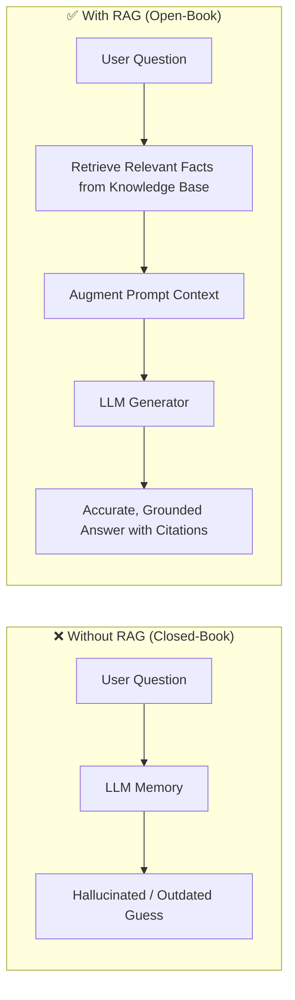

### Why RAG was Introduced: The 4 Core Problems It Solves

| Problem | Explanation | How RAG Solves It |
| :--- | :--- | :--- |
| **1. Knowledge Cutoff** | LLMs freeze their knowledge when training completes. They know nothing about recent events or newly uploaded company files. | RAG fetches live, real-time data at query execution time. |
| **2. Hallucinations** | LLMs generate statistically likely words even when facts are missing. | RAG grounds the LLM in retrieved source facts and instructs it strictly not to fabricate. |
| **3. Private Enterprise Data** | Companies cannot share confidential documents (HR policies, financial ledgers, clinical trials) to train public foundation models. | Proprietary documents stay in a secure internal database and are retrieved securely on-demand. |
| **4. Expensive Model Retraining** | Updating model weights every time a single policy changes costs thousands of dollars in compute and hours of training. | Updating knowledge in RAG is as simple as inserting or updating a document vector in a database. |

### Practical Example
- **Scenario:** An employee asks an HR bot: *"What is our company's maternity leave policy?"*
- **Without RAG:** Generic LLM guesses: *"Most tech companies offer 12 to 16 weeks of standard leave."* (Misleads employee).
- **With RAG:** The retriever searches the internal HR handbook, extracts Section 4.2 (*"Amazon provides 20 weeks of fully paid maternity leave..."*), injects it into the prompt, and the LLM responds: *"According to Section 4.2 of the Employee Handbook, you are eligible for 20 weeks of fully paid maternity leave."*

### Interview Takeaway
> *"RAG decouples **reasoning** from **memory**. It treats the LLM as a powerful comprehension and generation engine while keeping the factual knowledge base external, dynamic, private, and verifiable."*

---

## Q2: How does RAG compare to Fine-Tuning and Prompt Engineering, and when should you choose RAG?

### Short Answer
- **Prompt Engineering** optimizes inputs using existing model knowledge and zero/few-shot context.
- **Fine-Tuning** permanently adapts the model's weights to learn a specific **style, format, or specialized task**.
- **RAG** injects **dynamic, external, factual knowledge** into the prompt context at inference time without modifying model weights.

### Detailed Explanation & Comparison

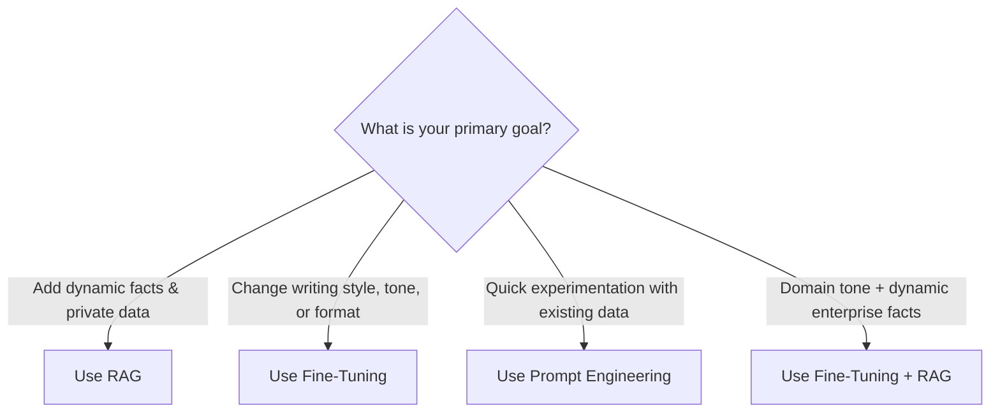

### In-Depth Comparison Matrix

| Dimension | Prompt Engineering | Fine-Tuning | RAG (Retrieval-Augmented Generation) |
| :--- | :--- | :--- | :--- |
| **Mechanism** | Crafting system prompts, few-shot examples | Backpropagation updating model weights ($\Delta W$) | Vector/hybrid retrieval + dynamic context injection |
| **Knowledge Dynamicism** | Low (bounded by prompt size) | Static (frozen until next training run) | **High (instantly updated in vector DB)** |
| **Hallucination Risk** | High for unseen facts | Moderate (can memorize false associations) | **Lowest (strictly grounded in retrieved text)** |
| **Cost & Compute** | Extremely Low (API inference cost only) | Very High (requires GPU clusters, labeled data) | Moderate (Vector DB storage + retrieval latency) |
| **Auditability & Citations** | Difficult | Impossible (black-box weights) | **Native (links to exact page/paragraph)** |
| **Data Privacy** | Context sent via API | Training data baked into model weights | Role-based Access Control (RBAC) at retrieval stage |
| **Primary Use Case** | Formatting, general instruction following | Style adaptation, dialect, specialized syntax/JSON | **Document QA, customer support, enterprise search** |

### Code Analogy: When to Use Which
```python
# 1. Prompt Engineering: Guiding the LLM with formatting rules
prompt = "Translate the following user input into a SQL query. Return JSON only."

# 2. Fine-Tuning: Modifying the LLM's intrinsic behavior (e.g. learning medical shorthand)
# Requires a curated dataset of 10,000+ (prompt, completion) pairs trained on GPUs.

# 3. RAG: Supplying facts at runtime
retrieved_context = vector_db.search("Q3 enterprise revenue", top_k=3)
augmented_prompt = f"""
Answer the user's question STRICTLY using the context below:
Context: {retrieved_context}
Question: What was our Q3 enterprise revenue?
"""
```

### Interview Takeaway
> *"Rule of thumb: **Fine-tune for form, style, and syntax; use RAG for facts, freshness, and private knowledge.** If your data changes weekly, fine-tuning is financially unviable and prone to catastrophic forgetting, whereas RAG updates instantly by modifying database rows."*

---

## Q3: What is the complete end-to-end RAG pipeline (Ingestion to Generation)?

### Short Answer
The complete RAG pipeline consists of two distinct operational phases:
1. **Offline Data Ingestion Pipeline:** Loading unstructured documents, cleaning text, splitting into chunks, generating vector embeddings, and storing them in a Vector Database with metadata.
2. **Online Query & Retrieval Pipeline:** Taking a user query, generating a query embedding, executing similarity/hybrid search, reranking results, building an augmented prompt, and invoking the LLM to generate an answer with citations.

### Complete Architecture Diagram

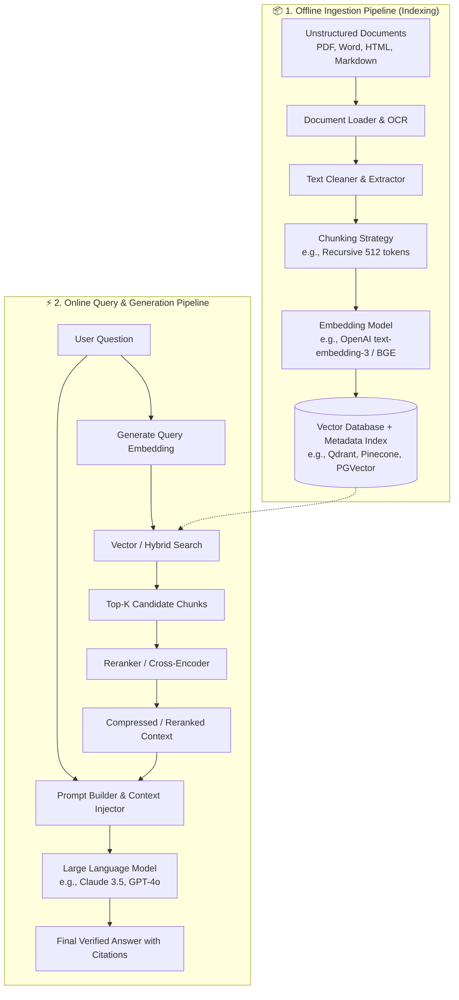

### Step-by-Step Breakdown

#### Phase 1: Offline Data Ingestion (One-Time / Scheduled)
1. **Document Loading:** Ingest raw files (PDFs, DOCX, Notion, SQL dumps, Confluence) using specialized loaders.
2. **Preprocessing & Text Extraction:** Clean unwanted artifacts (headers, footers, HTML tags, base64 images) and run OCR on scanned pages.
3. **Chunking:** Break large continuous text into smaller, semantically coherent segments (e.g., 512 tokens with 50-token overlap).
4. **Vector Embedding:** Pass each chunk through an embedding model to convert semantic meaning into dense high-dimensional vectors ($\mathbb{R}^d$).
5. **Vector Indexing & Storage:** Upsert vector embeddings alongside payload metadata (filename, page number, timestamp, ACL permissions) into a Vector DB index (HNSW / IVF).

#### Phase 2: Online Query & Retrieval (Runtime execution per user query)
1. **User Query Input:** The user submits a natural language question.
2. **Query Embedding:** The query string is transformed into an embedding vector using the **exact same** embedding model used during ingestion.
3. **Similarity / Hybrid Search:** The Vector DB finds the nearest neighboring vectors using similarity metrics (Cosine similarity, Dot product) combined with keyword search (BM25).
4. **Post-Retrieval Reranking:** Top-$k$ candidate chunks (e.g., 20) are re-evaluated by a Cross-Encoder reranking model to select the top 3–5 most relevant chunks.
5. **Prompt Augmentation:** The top chunks are injected into a structured system prompt template containing strict grounding instructions.
6. **LLM Generation:** The LLM reads the context and streams a grounded answer back to the user, referencing source citations.

### Interview Takeaway
> *"RAG is an ETL pipeline coupled with an online retrieval service. Offline ingestion converts raw text into an indexed semantic vector space; online retrieval matches the user's intent to candidate vectors, augments the LLM prompt, and yields a hallucination-free response."*

---

## Q4: What are the core architectural components of a RAG system?

### Short Answer
A production-grade RAG architecture is built upon **six core components**:
1. **Document Loader & Extractor:** Converts raw, unstructured multi-format files into clean text.
2. **Chunker / Text Splitter:** Decomposes documents into manageable, semantically self-contained units.
3. **Embedding Model:** Transforms textual chunks and queries into dense vector coordinates.
4. **Vector Database / Indexer:** Stores high-dimensional vectors and provides sub-millisecond approximate nearest neighbor (ANN) retrieval.
5. **Retriever & Reranker:** Executes multi-stage retrieval (Hybrid search + Cross-Encoder reranking) to select high-relevance chunks.
6. **Generator (LLM):** Synthesizes the final natural language answer grounded exclusively in the retrieved context.

### Component Deep-Dive & Tooling Ecosystem

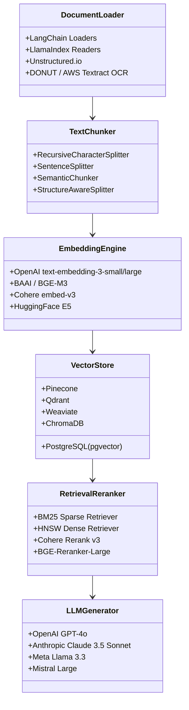

### Component Breakdown Table

| Component | Role in Architecture | Popular Tools & Libraries | Key Configuration Parameters |
| :--- | :--- | :--- | :--- |
| **1. Document Loader** | Parsing PDFs, spreadsheets, Word, Markdown, OCR on images. | `PyPDF`, `Unstructured.io`, `pdfplumber`, `AWS Textract` | OCR language, table extraction mode |
| **2. Text Chunker** | Partitioning documents preserving structural boundaries. | `RecursiveCharacterTextSplitter`, `SemanticChunker` | `chunk_size` (e.g. 512), `chunk_overlap` (e.g. 50) |
| **3. Embedding Model** | Converting tokens to dense semantic representation vectors. | `text-embedding-3-small` (OpenAI), `BGE-M3`, `E5-large` | Dimensions (384, 768, 1536, 3072), normalization |
| **4. Vector Database** | Persisting embeddings, fast ANN lookup, metadata storage. | `Qdrant`, `Pinecone`, `Weaviate`, `ChromaDB`, `pgvector` | Index type (HNSW, IVF), distance metric (Cosine, L2) |
| **5. Retriever / Reranker** | Dual-stage scoring: candidate generation + precision rerank. | `BM25Okapi`, `Cohere Rerank`, `bge-reranker-large` | `top_k_retrieval` (20), `top_n_reranked` (5), $\alpha$ weight |
| **6. LLM Generator** | Reasoning over injected context to produce final output. | `GPT-4o`, `Claude 3.5 Sonnet`, `Llama-3-70B` | Temperature (0.0 for deterministic facts), Top-P |

### Minimal Production Code Skeleton (TypeScript / Node.js)
```typescript
import { OpenAIEmbeddings } from "@langchain/openai";
import { QdrantVectorStore } from "@langchain/community/vectorstores/qdrant";
import { ChatOpenAI } from "@langchain/openai";

// 1. Initialize Embedding Model
const embeddings = new OpenAIEmbeddings({
  model: "text-embedding-3-small",
  dimensions: 1536
});

// 2. Connect to Vector Database
const vectorStore = await QdrantVectorStore.fromExistingCollection(embeddings, {
  url: process.env.QDRANT_URL,
  collectionName: "enterprise_docs"
});

// 3. Retrieve Relevant Chunks
const query = "What is the policy for medical leave?";
const candidateDocs = await vectorStore.similaritySearch(query, 5);

// 4. Generate Answer with LLM
const model = new ChatOpenAI({ model: "gpt-4o", temperature: 0.0 });
const context = candidateDocs.map(d => d.pageContent).join("\n---\n");
const prompt = `Use the following context to answer the question:\n${context}\n\nQuestion: ${query}`;

const response = await model.invoke(prompt);
console.log(response.content);
```

### Interview Takeaway
> *"A complete RAG architecture is a chain of specialized components. If document loading or chunking fails, the downstream embeddings will be noisy; if embeddings are noisy, retrieval will return irrelevant context; and if context is irrelevant, the generator will hallucinate. Every component directly impacts end-to-end precision."*

---

# Part 2: Document Ingestion, Chunking & Embeddings

---

## Q5: What is Chunking in RAG, why is it critical, and how does chunk size affect retrieval quality?

### Short Answer
**Chunking** is the process of breaking large, monolithic documents into smaller, discrete segments of text prior to embedding and indexing. It is critical because **embedding models and LLMs have finite input limits**, and vector search performs best when each vector represents a **single, cohesive semantic concept** rather than a mixture of unrelated topics.

### Why Chunking is Critical
1. **Embedding Semantic Sharpness:** An embedding vector represents an average of the meanings across an entire chunk. If a chunk covers 10 different topics, its vector coordinates become generic and "washed out", matching poorly against specific questions.
2. **Context Window Economy:** LLMs charge per input token and have context limits. Chunking ensures only relevant paragraphs consume tokens.
3. **Retrieval Precision:** Small, focused chunks allow vector search to pinpoint the exact sentence or paragraph answering the user's query.

### The Chunk Size Trade-Off Dilemma

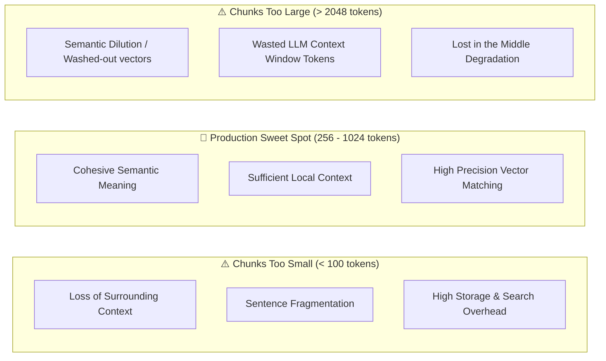

### Detailed Trade-Off Matrix

| Metric / Dimension | Small Chunks (50–150 tokens) | Sweet Spot (256–1024 tokens) | Large Chunks (2000+ tokens) |
| :--- | :--- | :--- | :--- |
| **Vector Similarity Precision** | Very High (matches exact words) | **Optimal** | Low (mixed themes wash out vector) |
| **Context Completeness** | Poor (misses context from prior lines) | **High (full paragraph intact)** | Complete (entire section included) |
| **Vector DB Storage Footprint** | Extremely Large (millions of vectors) | Balanced | Very Small |
| **Risk of Context Fragmentation** | High (answer spans multiple chunks) | Low | None |
| **Cost per Query** | Low token usage, high vector lookup | Balanced | High token usage in LLM prompt |

### Practical Scenario: Return Policy
- **Entire Document as 1 Chunk:** The vector represents shipping, refunds, careers, warranty, and company history. When user asks *"How many days do I have to return an item?"*, the vector similarity score is low because refund details make up only 3% of the chunk vector.
- **Single Sentence as Chunk:** Chunk = *"Returns must be initiated within 14 days."* The retrieval is accurate, but the LLM doesn't know *which* products this applies to, because the exception list was in the preceding sentence.
- **Paragraph Level (512 tokens):** Contains the return timeframe, eligible categories, and warranty exceptions together. Perfect retrieval and complete context.

### Interview Takeaway
> *"Chunk size dictates retrieval resolution. If chunks are too large, vector representations suffer from **semantic dilution**; if chunks are too small, they suffer from **context fragmentation**. 512 tokens with a 10–20% overlap is the industry standard starting baseline."*

---

## Q6: What are the different Chunking Strategies (Fixed-size, Recursive, Sentence-level, Semantic, Structure-aware) and their trade-offs?

### Short Answer
The five primary chunking strategies are:
1. **Fixed-Size Chunking:** Splits strictly by token/character count (fast, but cuts words/sentences midway).
2. **Recursive Character Chunking:** Recursively splits on structural delimiters (`\n\n`, `\n`, ` `, `""`) to keep paragraphs and sentences whole (industry default).
3. **Sentence-Level Chunking:** Splits at sentence boundaries using NLP tokenizers.
4. **Semantic Chunking:** Calculates embedding distances between consecutive sentences and splits where semantic similarity drops significantly.
5. **Structure-Aware Chunking:** Respects document hierarchy (Markdown headers, HTML tags, PDF sections, tables).

### Visualizing Chunking Strategies

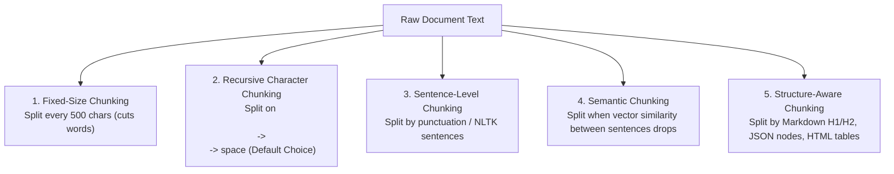

### Strategy Comparison & Recommendations

| Chunking Strategy | How It Works | Best Use Cases | Disadvantages |
| :--- | :--- | :--- | :--- |
| **Fixed-Size** | Counts $N$ characters/tokens and slices strictly at index $N$. | Server logs, raw numeric streams, uniform plain text. | Frequently cuts sentences and words in half, destroying meaning. |
| **Recursive Character** | Attempts to split by double newline (`\n\n`). If chunk is still $> \text{size}$, splits by `\n`, then by space. | **Default choice for general documents, articles, PDFs.** | May produce variable-sized chunks depending on whitespace. |
| **Sentence-Level** | Uses NLP sentence boundary detection (`spaCy` / `nltk`). | FAQ datasets, conversational transcripts, single-fact QA. | Misses multi-sentence contextual relationships. |
| **Semantic Chunking** | Measures cosine similarity between sentence embeddings. Inserts a split boundary where similarity drops below a threshold. | Dense multi-topic documents, research papers, legal briefs. | Requires embedding model computation during ingestion (slow & expensive). |
| **Structure-Aware** | Uses document AST (Markdown headers `#`, `##`, HTML `<section>`, table rows). | Technical manuals, legal contracts, API docs, financial reports. | Requires clean source formatting and custom parsers. |

### Practical Code Example: Recursive vs Semantic Chunking (Python)
```python
# 1. Recursive Character Text Splitter (Standard Baseline)
from langchain.text_splitter import RecursiveCharacterTextSplitter

text = "RAG improves LLMs.\n\nIt retrieves relevant chunks from vector databases.\nThen it augments prompts."
recursive_splitter = RecursiveCharacterTextSplitter(
    chunk_size=100,
    chunk_overlap=20,
    separators=["\n\n", "\n", " ", ""]
)
chunks = recursive_splitter.split_text(text)

# 2. Semantic Chunking (Embedding-Based Boundary Detection)
from langchain_experimental.text_splitter import SemanticChunker
from langchain_openai.embeddings import OpenAIEmbeddings

semantic_splitter = SemanticChunker(
    OpenAIEmbeddings(),
    breakpoint_threshold_type="percentile" # Splits where distance is in 95th percentile
)
semantic_chunks = semantic_splitter.create_documents([text])
```

### Interview Takeaway
> *"Always start with **Recursive Character Chunking** (512 tokens) as the baseline. Switch to **Structure-Aware Chunking** for Markdown/legal contracts with clear headings, or **Semantic Chunking** when text has arbitrary paragraph lengths discussing multiple shifting themes."*

---

## Q7: What is Chunk Overlap and why is it necessary to prevent boundary context loss?

### Short Answer
**Chunk Overlap** is the intentional repetition of a configurable percentage of text (typically 10% to 20%) from the end of one chunk into the beginning of the subsequent chunk. It ensures that **semantic context spanning chunk boundaries is not severed**, preventing critical contextual cues or qualifying conditions from being lost.

### Why Boundary Loss Happens Without Overlap

Suppose a document contains this critical passage:
> *"The automated trading algorithm achieved a 94% win rate across standard market regimes. However, during flash crashes and extreme liquidity dry-ups, the maximum drawdown exceeded 68% and required immediate human kill-switch intervention."*

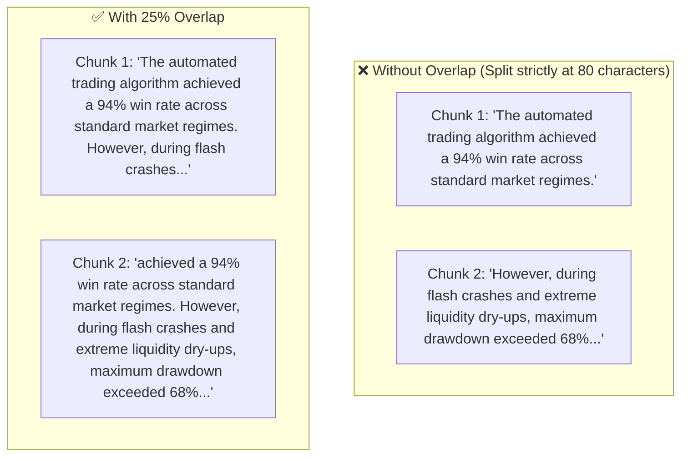

- **Query:** *"Is the trading algorithm safe during flash crashes?"*
- **Without Overlap:** Vector search for "flash crash safety" matches Chunk 2. But Chunk 2 starts with *"However, during flash crashes..."* without identifying *which* algorithm it refers to. The LLM lacks the subject and produces a vague or ungrounded response.
- **With Overlap:** Chunk 2 includes the preceding context mentioning the automated trading algorithm. The LLM accurately answers the question with full context.

### Recommended Overlap Rules of Thumb

| Chunk Size | Typical Overlap (Tokens) | Overlap Percentage | Trade-off Consideration |
| :--- | :--- | :--- | :--- |
| **256 tokens** | 25–50 tokens | 10–20% | Ideal for conversational FAQ retrieval. |
| **512 tokens** | 50–100 tokens | 10–20% | **Standard enterprise sweet spot.** |
| **1024 tokens** | 100–150 tokens | 10–15% | High context preservation, slightly larger storage. |

### Pitfalls of Extreme Overlap
1. **Overlap Too Low (< 5%):** Boundary loss still occurs for multi-clause sentences.
2. **Overlap Too High (> 35%):** Duplicates substantial data in the vector database, wasting storage and causing top-$k$ search to retrieve near-identical chunks that crowd out other relevant information.

### Interview Takeaway
> *"Chunk overlap acts as a **semantic safety bridge**. A 10–20% overlap eliminates boundary cliffhangers, ensuring pronouns, qualifying clauses ('However', 'Except when'), and entity definitions remain connected to their dependent facts."*

---

## Q8: How do you choose the right Embedding Model and evaluate vector dimensions, cost, and domain suitability?

### Short Answer
Choosing an embedding model requires balancing **retrieval quality (MTEB leaderboard score)**, **vector dimensionality (storage and search speed)**, **latency/cost constraints (cloud API vs self-hosted)**, **context window size**, and **domain specificity (multilingual, medical, legal, code)**.

### Key Selection Criteria

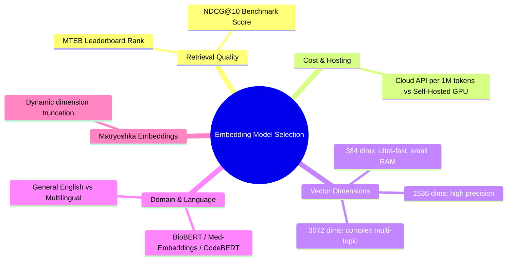

### Comparative Model Analysis

| Model Name | Provider / Type | Dimensions | Max Tokens | MTEB Rank / Quality | Cost per 1M Tokens | Best Fit |
| :--- | :--- | :--- | :--- | :--- | :--- | :--- |
| `text-embedding-3-small` | OpenAI (Cloud API) | 1536 (or 512 via MRL) | 8191 | High | \$0.02 | General enterprise production |
| `text-embedding-3-large` | OpenAI (Cloud API) | 3072 (or 256–1536) | 8191 | Very High | \$0.13 | High-precision legal/financial search |
| `bge-m3` | BAAI (Open Source) | 1024 | 8192 | Excellent | Free (Self-host) | **Multilingual + Hybrid dense/sparse/multi-vector** |
| `bge-large-en-v1.5` | BAAI (Open Source) | 1024 | 512 | Very High | Free (Self-host) | English-only low-latency applications |
| `all-MiniLM-L6-v2` | HuggingFace (Open Source) | 384 | 256 | Moderate | Free (CPU friendly) | Edge devices, fast local prototypes |
| `cohere-embed-v3` | Cohere (Cloud API) | 1024 | 512 | Very High | \$0.10 | Search with integrated compression |

### Understanding Vector Dimensions & Matryoshka Representation Learning (MRL)
- **Higher Dimensions ($3072$):** Retain nuanced, granular semantic relationships, but consume $8\times$ more memory and slow down cosine similarity calculations compared to 384 dimensions.
- **Matryoshka Embeddings (MRL):** Advanced models (like OpenAI `text-embedding-3`) allow you to truncate the vector from 1536 down to 512 dimensions with less than a 2% drop in retrieval accuracy, saving 66% on vector storage and accelerating index traversal.

```python
# Truncating OpenAI Embeddings using Matryoshka Embeddings (Python)
from openai import OpenAI
client = OpenAI()

response = client.embeddings.create(
    model="text-embedding-3-small",
    input="Company maternity leave policy",
    dimensions=512  # Truncates native 1536 to 512 without losing relative similarity!
)
embedding = response.data[0].embedding
print(len(embedding))  # Outputs: 512
```

### Domain-Specific Embedding Caveat
If your corpus is heavily domain-specific (e.g., ICD-10 medical coding or semiconductor schematics), generic models fail because their training vocabulary lacks domain associations. Use domain fine-tuned embeddings (e.g., BioLinkBERT, Clinical-BERT, or custom contrastive fine-tuned BGE).

### Interview Takeaway
> *"Never pick an embedding model blindly. Check the **MTEB (Massive Text Embedding Benchmark)** leaderboard for your task. For startups, OpenAI `text-embedding-3-small` (truncated to 512 dims) is the best price-to-performance ratio; for on-premise or multilingual requirements, `bge-m3` is the gold standard."*

---

# Part 3: Vector Databases, Indexing & Retrieval Strategies

---

## Q9: How do major Vector Databases (Pinecone, Weaviate, Qdrant, ChromaDB, PGVector, Milvus) compare?

### Short Answer
Vector databases store and query high-dimensional embeddings efficiently using Approximate Nearest Neighbor (ANN) indexes.
- **Pinecone:** Fully managed, cloud-only, serverless, zero-ops.
- **Qdrant:** High-performance, open-source, written in Rust, exceptional payload metadata filtering.
- **Weaviate:** Open-source, modular, built-in vectorization pipelines and hybrid search.
- **Milvus:** Distributed, horizontally scalable, engineered for enterprise workloads with billions of vectors.
- **PGVector:** PostgreSQL extension; ideal for teams already using Postgres who want relational data and vectors unified.
- **ChromaDB:** Lightweight, in-memory, embedded Python DB; perfect for prototyping and local dev.

### Comparative Vector DB Matrix

| Database | Architecture | Hosting / Deployment | Hybrid Search | Metadata Filtering | Scalability | Typical Best Use Case |
| :--- | :--- | :--- | :--- | :--- | :--- | :--- |
| **Pinecone** | Proprietary Cloud | Fully Managed Serverless | Yes (Sparse-Dense) | Post & Pre-filtering | Very High | Teams wanting Zero-Ops and instant production scaling. |
| **Qdrant** | Rust Engine | Self-hosted / Cloud | Yes (Native BM42/Dense) | **Best-in-class (Pre-filtering)** | High | Production RAG needing complex filtering on document payloads. |
| **Weaviate** | Go Engine | Self-hosted / Cloud | Yes (Native BM25 + Vector) | High | High | Enterprise RAG requiring native graph-like schemas & auto-vectorization. |
| **Milvus / Zilliz** | Distributed C++ / Go | Kubernetes / Cloud | Yes | High | **Massive (Billions of vectors)** | Multi-tenant platforms with massive enterprise data. |
| **PGVector** | PostgreSQL Extension | Self-hosted / RDS / Supabase | Yes (Postgres FTS + Vector) | Unified via standard SQL | Moderate ($< 5\text{M}$ vectors) | Existing Postgres stacks; eliminates maintaining a separate DB. |
| **ChromaDB** | Python / SQLite | Local Embedded | Basic | Basic | Low (Prototyping) | Local Jupyter notebooks, POCs, hackathons. |

### Architectural Decision Tree
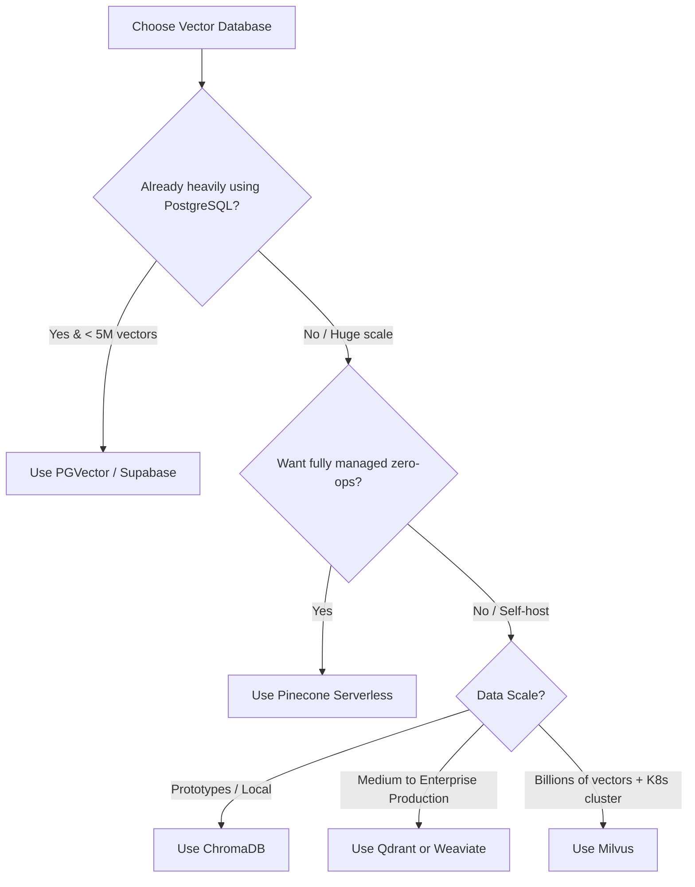

### Interview Takeaway
> *"For rapid prototypes, use **ChromaDB**; for production stacks already anchored on Postgres, use **pgvector**; for dedicated production vector infrastructure with high-speed metadata filtering, use **Qdrant**; for managed zero-ops, choose **Pinecone**."*

---

## Q10: What is the difference between Flat (Brute-Force), IVF, and HNSW Vector Indexing algorithms?

### Short Answer
- **Flat (IndexFlatL2 / Exact Search):** Brute-force $O(N)$ exhaustive comparison. 100% recall accuracy, but becomes unacceptably slow at scale.
- **IVF (Inverted File Index):** Clusters vectors into Voronoi cells using $k$-means; only searches the closest $n$-probe clusters. Speeds up search significantly, with minor recall loss.
- **HNSW (Hierarchical Navigable Small World):** Constructs a multi-layer geometric graph structure (similar to skip-lists). Delivers logarithmic $O(\log N)$ search time with $>98\%$ recall. **The industry standard for production vector search.**

### How the Three Indexing Algorithms Work

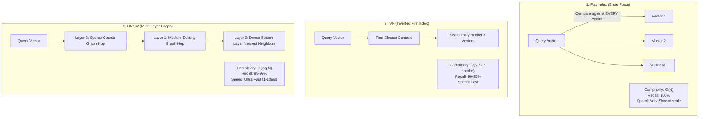

### Quantitative Comparison on 10 Million Vectors

| Feature | Flat (Exhaustive Scan) | IVF (Inverted File) | HNSW (Hierarchical Graph) |
| :--- | :--- | :--- | :--- |
| **Search Time (Latency)** | ~5,000 ms (Unusable in API) | ~40–60 ms | **~5–10 ms (Sub-millisecond possible)** |
| **Recall (Accuracy)** | **100% (Ground Truth)** | ~92–95% | **~98–99.5%** |
| **Index Build Time** | Instant ($O(1)$) | Fast ($k$-means clustering) | Slow (Graph construction) |
| **Memory (RAM) Usage** | Low (Raw vectors only) | Low to Medium | **High (Stores graph edges + vectors)** |
| **Production Suitability** | Only for testing $<10\text{k}$ items | Good for memory-constrained systems | **Default industry standard for RAG** |

### How HNSW Navigates Graphs (The Skip-List Analogy)
Think of an expressway vs local streets:
1. **Top Layer:** Sparse graph. The search takes giant leaps across the vector space to quickly enter the right neighborhood.
2. **Intermediate Layers:** Denser graph connections hone in on the exact cluster.
3. **Bottom Layer (Layer 0):** Full nearest-neighbor graph. Finds the exact top-$k$ nearest neighbors in sub-10 milliseconds.

### Interview Takeaway
> *"Flat search is exhaustive $O(N)$ brute force. IVF clusters vectors into buckets to limit comparisons. **HNSW is a multi-layer graph skip-list** that enables $O(\log N)$ approximate nearest neighbor search with ~99% recall and 5ms latency, making it the universally preferred index for production RAG."*

---

## Q11: What is the difference between Dense Search and Sparse Search, and how does Hybrid Search (BM25 + Dense + RRF) work?

### Short Answer
- **Dense Search (Vector Search):** Uses neural embeddings to capture **semantic meaning, synonyms, and intent** (e.g., *"automobile"* matches *"car"*). It fails on exact keyword codes, SKUs, and unique IDs.
- **Sparse Search (Keyword Search / BM25):** Matches **exact keywords, acronyms, product IDs, and rare tokens** based on Term Frequency-Inverse Document Frequency. It fails to understand synonyms or broad context.
- **Hybrid Search:** Executes both Dense and Sparse searches simultaneously, merging their ranked result lists using **Reciprocal Rank Fusion (RRF)**. It provides the best of both worlds and is the production gold standard.

### Dense vs Sparse vs Hybrid Example

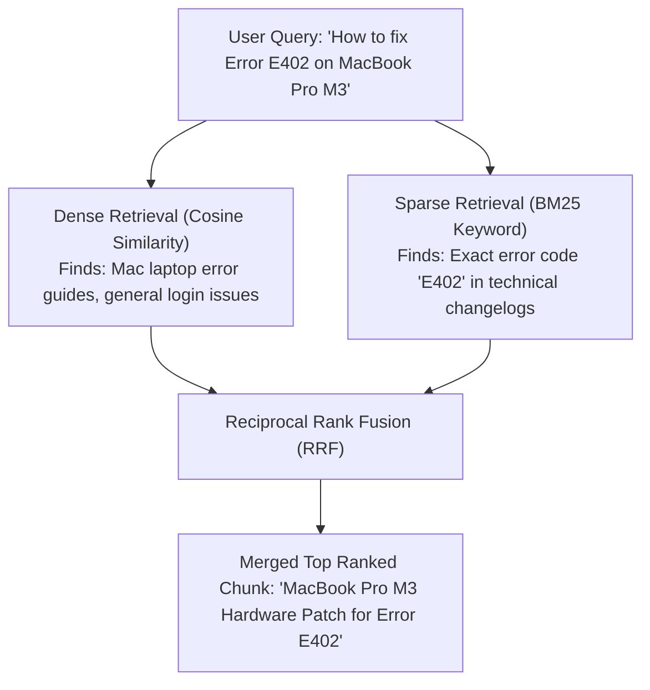

### Why Pure Vector Search Fails in Production
- **Scenario:** A customer searches: *"Troubleshoot error code `ERR_AUTH_0x442B` in API gateway."*
- **Dense Vector Search:** The embedding model averages the meaning into "authentication issues" and retrieves generic login guides, completely missing the documentation containing the exact string `ERR_AUTH_0x442B`.
- **BM25 Sparse Search:** Hits the exact document containing `ERR_AUTH_0x442B` instantly.

### How Reciprocal Rank Fusion (RRF) Calculates Scores
RRF combines ranked lists without needing score normalization (which is difficult because BM25 scores are unbounded $[0, \infty)$ while cosine similarity is $[-1, 1]$):

$$\text{RRF\_Score}(d) = \sum_{m \in M} \frac{1}{k + r_m(d)}$$

Where:
- $M$ = set of retrieval systems (Dense and Sparse).
- $r_m(d)$ = rank position of document $d$ in system $m$ (1-indexed).
- $k$ = smoothing constant (standard default = $60$).

### Python Implementation of Reciprocal Rank Fusion
```python
def reciprocal_rank_fusion(dense_results: list[str], sparse_results: list[str], k: int = 60) -> list[tuple[str, float]]:
    """Combines dense and sparse ranked lists using Reciprocal Rank Fusion."""
    scores = {}

    for rank, doc_id in enumerate(dense_results, start=1):
        scores[doc_id] = scores.get(doc_id, 0.0) + (1.0 / (k + rank))

    for rank, doc_id in enumerate(sparse_results, start=1):
        scores[doc_id] = scores.get(doc_id, 0.0) + (1.0 / (k + rank))

    # Sort documents by combined RRF score descending
    reranked = sorted(scores.items(), key=lambda item: item[1], reverse=True)
    return reranked

# Example usage
dense_hits = ["doc_A", "doc_B", "doc_C"]
sparse_hits = ["doc_C", "doc_A", "doc_D"]
print(reciprocal_rank_fusion(dense_hits, sparse_hits))
# doc_A and doc_C get boosted to top because they appeared in both lists!
```

### Interview Takeaway
> *"Pure vector search is insufficient for production because it struggles with exact identifiers, part numbers, and acronyms. **Hybrid search pairs Dense (semantic intent) with Sparse BM25 (exact lexical match)** and fuses them with Reciprocal Rank Fusion (RRF), achieving near-perfect retrieval recall across all query types."*

---

## Q12: What is the "Lost-in-the-Middle" problem in LLM context windows and how do you resolve it?

### Short Answer
The **"Lost-in-the-Middle" problem** is an empirical phenomenon where LLMs recall information positioned at the **very beginning** or **very end** of their prompt context window with high accuracy, but frequently ignore, overlook, or fail to extract relevant facts placed in the **middle** of long contexts.

### Visualizing the U-Shaped Attention Curve

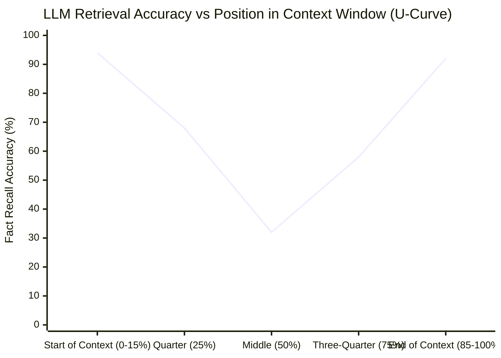

### Why Does This Happen?
Due to the architecture of Transformer self-attention mechanisms and pre-training data biases:
1. **Primacy Bias:** The system instructions and opening sentences establish the initial attention state.
2. **Recency Bias:** The end of the prompt is immediately adjacent to where token generation begins, giving those tokens high attention weights.
3. **Middle Attention Decay:** When 10–20 chunks are stuffed into the prompt, the intermediate tokens experience diluted attention softmax scores.

### 4 Production Solutions to Fix "Lost-in-the-Middle"

| Solution Strategy | How It Works | Impact |
| :--- | :--- | :--- |
| **1. Cross-Encoder Reranking** | Reorder retrieved candidate chunks and place the highest-scoring chunk at the **top** of the context. | Ensures the most critical answer chunk sits at the maximum attention point (index 0). |
| **2. Top-$k$ Pruning** | Reduce injected chunks from 15 down to 3–5 highly relevant chunks. | Eliminates prompt bloat and prevents the context from reaching the degraded attention zone. |
| **3. Contextual Compression** | Summarize or extract only the exact answering sentences from chunks before injecting them into the prompt. | Squeezes out 70% of extraneous filler tokens. |
| **4. Edge Positioning (Sandwich Context)** | Place the retrieved context *after* the question or restate the core question at the bottom right before `Answer:`. | Enforces strong attention binding between question and context. |

### Practical Prompt Architecture Example
```text
[SYSTEM INSTRUCTION]
You are a precise enterprise assistant. Answer the user question using ONLY the provided context.

[RETRIEVED CONTEXT - RERANKED #1 BEST CHUNK PLACED HERE]
Source Handbook (Section 4): Employees are entitled to 20 weeks of paid maternity leave...

[RETRIEVED CONTEXT - CHUNK #2 & #3]
...

[FINAL REMINDER REPEATING QUERY AT THE END]
Question: What is our maternity leave duration?
Answer based strictly on the context above:
```

### Interview Takeaway
> *"Transformers suffer from a U-shaped attention curve where facts placed in the center of long prompts are often skipped. We solve this by **reranking the best chunk to the very top**, reducing top-$k$ to high-precision chunks, using contextual compression, and restating the query at the prompt's conclusion."*

---

# Part 4: Query Transformation & Advanced Retrieval Patterns

---

## Q13: What is Query Transformation (Query Rewriting, HyDE, Sub-Query Decomposition, Step-Back Prompting)?

### Short Answer
**Query Transformation** is a pre-retrieval optimization technique where a raw, ambiguous, conversational, or multi-part user query is algorithmically rewritten, expanded, or decomposed by an LLM into optimized search queries before vector lookup occurs.

### The 4 Major Query Transformation Techniques

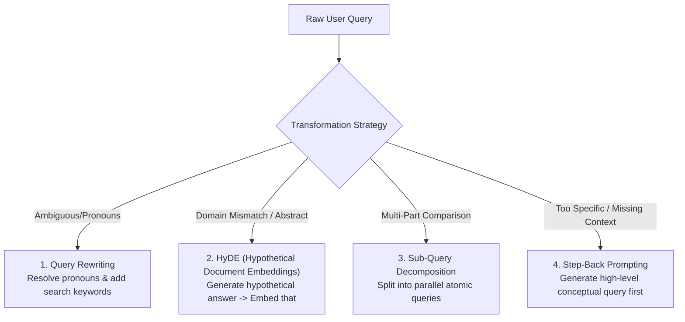

### Detailed Breakdown of Techniques

#### 1. Query Rewriting (Contextual Disambiguation)
- **Problem:** User asks: *"It stopped working after the update. How do I fix it?"*
- **Solution:** An LLM reads conversation history and rewrites the query: *"Troubleshoot PostgreSQL connection timeout failure after v16.2 upgrade."*

#### 2. HyDE (Hypothetical Document Embeddings)
- **Problem:** Questions and answers live in different vector semantic spaces (a question asks a short query; a document contains an explanatory paragraph).
- **Solution:** Ask the LLM to generate a *hypothetical, imaginary answer*. Even if the generated answer contains factual hallucinations, its **semantic structure and vocabulary** match real answer documents far closer than the raw query does. Then embed that hypothetical answer to search the Vector DB.

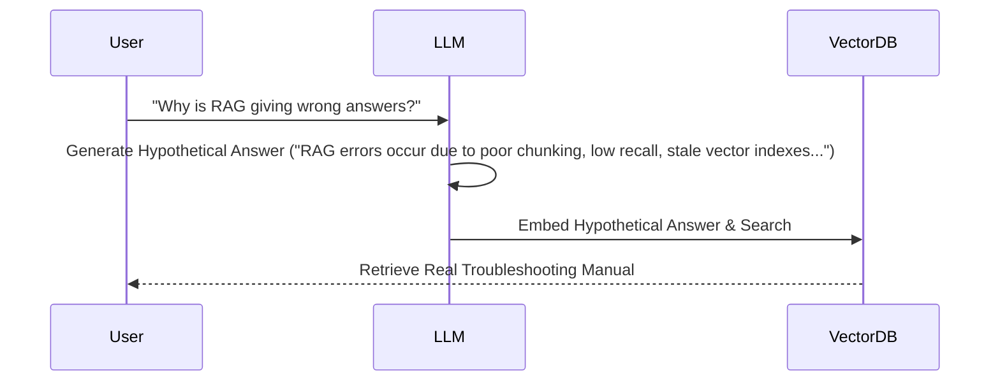

#### 3. Sub-Query Decomposition (Divide and Conquer)
- **Problem:** User asks a complex comparative query: *"Compare our Q3 revenue growth against Microsoft and Google."*
- **Solution:** Decompose into 3 parallel sub-queries:
  - *Query 1:* "Internal company Q3 revenue growth financial report"
  - *Query 2:* "Microsoft Q3 earnings report revenue growth"
  - *Query 3:* "Google Alphabet Q3 earnings report revenue growth"
  - Execute all 3 in parallel, aggregate the retrieved contexts, and pass them to the final LLM.

#### 4. Step-Back Prompting (Abstraction)
- **Problem:** User asks a highly specific edge-case coding/legal question that returns zero direct vector hits.
- **Solution:** Generate a high-level "step-back" query retrieving the foundational principle or protocol, providing the LLM with the prerequisite rules to derive the specific answer.

### Interview Takeaway
> *"Raw user questions are notoriously poor search queries. **Query transformation optimizes the retrieval interface** by using LLMs to rewrite conversational ambiguity, generate hypothetical answer embeddings (HyDE), or break complex comparisons into parallel atomic sub-queries."*

---

## Q14: What is the evolutionary difference between Naive RAG, Advanced RAG, and Modular RAG?

### Short Answer
- **Naive RAG:** Linear, rigid pipeline (Chunk $\rightarrow$ Embed $\rightarrow$ Vector Search $\rightarrow$ LLM). Prone to low recall, precision errors, and hallucinations.
- **Advanced RAG:** Adds **Pre-Retrieval** (Query rewriting, routing) and **Post-Retrieval** (Reranking, Contextual Compression) optimizations to resolve precision bottlenecks.
- **Modular RAG:** Decoupled, component-based, agentic architecture featuring dynamic routing, iterative retrieval loops, adaptive tool selection, and self-correcting evaluation feedback.

### Architectural Evolution

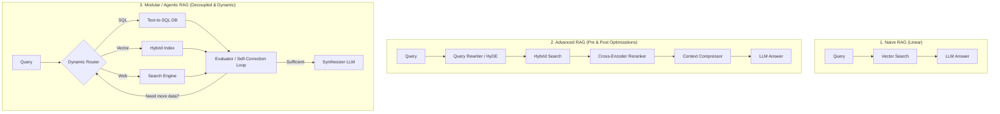

### Comprehensive Comparison

| Paradigm | Architectural Flow | Strengths | Major Weaknesses | Production Readiness |
| :--- | :--- | :--- | :--- | :--- |
| **Naive RAG** | Fixed single-pass linear pipe. | Simple to build in $<50$ lines of code; low latency. | High hallucination rate, low precision, fails on multi-step logic. | ❌ Demo / Prototype Only |
| **Advanced RAG** | Linear pipe with pre/post enhancement modules (Reranking, HyDE, BM25). | High retrieval precision, eliminates Lost-in-the-Middle errors. | Still follows a static linear path regardless of query complexity. | ✅ Standard Production Systems |
| **Modular RAG** | Graph-based / Agentic network of pluggable services. | Dynamic query routing, self-correction, multi-modal, handles multi-hop logic. | Higher architectural complexity, increased latency per query. | 🚀 Enterprise & SOTA Agentic Systems |

### Interview Takeaway
> *"The industry has shifted from **Naive RAG** (fixed chunk-and-search) to **Advanced RAG** (hybrid search + cross-encoder reranking). Today's enterprise standard is **Modular RAG**, where interchangeable micro-modules and agentic routers dynamically select indices, rewrite queries, and self-correct retrieval loops on-the-fly."*

---

## Q15: What is Parent-Child (Hierarchical) Chunking and Retrieval, and how does it balance specificity with context?

### Short Answer
**Parent-Child (Hierarchical) Chunking** decouples the chunk used for **vector retrieval** from the chunk passed to the **LLM for answer generation**. Small "child" chunks (e.g., 128 tokens) are embedded and indexed for precise vector matching, but when a child chunk matches, the system retrieves and feeds its larger "parent" chunk (e.g., 1024 tokens) or complete document section into the LLM context.

### The Conflict Parent-Child Solves
1. **For Vector Search:** Smaller chunks are better because their vector embeddings are sharp, focused, and unpolluted by adjacent topics.
2. **For LLM Generation:** Larger chunks are better because the LLM needs the full surrounding narrative, definitions, and exceptions to reason accurately.

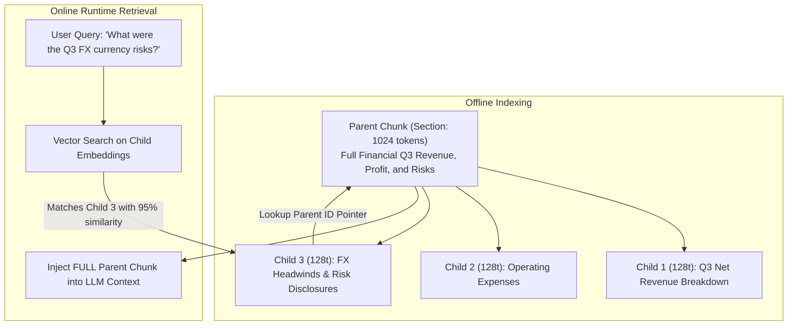

### How to Implement Parent-Child Relationships
1. **Document Hierarchy:** Parse a document into Parent Sections (Headers/Pages).
2. **Child Partitioning:** Split each Parent into 4–8 small Child chunks.
3. **Metadata Linkage:** Store each Child embedding in the Vector DB with a metadata attribute `parent_id: "parent_doc_1024_uuid"`. Store the Parent text in a high-speed key-value store (e.g., Redis, MongoDB, or S3).
4. **Lookup:** When a query hits `Child 3`, fetch `parent_id` from Redis and send the entire parent block to the LLM.

### Code Example: Parent Document Retriever (Python)
```python
from langchain.retrievers import ParentDocumentRetriever
from langchain.storage import InMemoryStore
from langchain.text_splitter import RecursiveCharacterTextSplitter
from langchain_community.vectorstores import Chroma
from langchain_openai import OpenAIEmbeddings

# 1. Define child and parent splitters
parent_splitter = RecursiveCharacterTextSplitter(chunk_size=1000)
child_splitter = RecursiveCharacterTextSplitter(chunk_size=200)

# 2. Vectorstore for child embeddings + Docstore for full parent text
vectorstore = Chroma(collection_name="split_parents", embedding_function=OpenAIEmbeddings())
docstore = InMemoryStore()

retriever = ParentDocumentRetriever(
    vectorstore=vectorstore,
    docstore=docstore,
    child_splitter=child_splitter,
    parent_splitter=parent_splitter,
)
```

### Interview Takeaway
> *"Parent-Child chunking solves the core RAG dilemma: **Small chunks for accurate search; large chunks for comprehensive reasoning.** We search against high-precision child embeddings, but inject the rich parent context into the LLM."*

---

## Q16: What is Multi-Index RAG and how does Query Routing handle diverse data sources?

### Short Answer
**Multi-Index RAG** maintains multiple dedicated, specialized vector or structured indexes (e.g., Summary Index, Granular Chunk Index, SQL Relational Index, Knowledge Graph Index) rather than dumping all enterprise files into a single vector collection. A **Query Router** analyzes incoming user intent and directs the query to the optimal index.

### Architecture of Multi-Index Routing

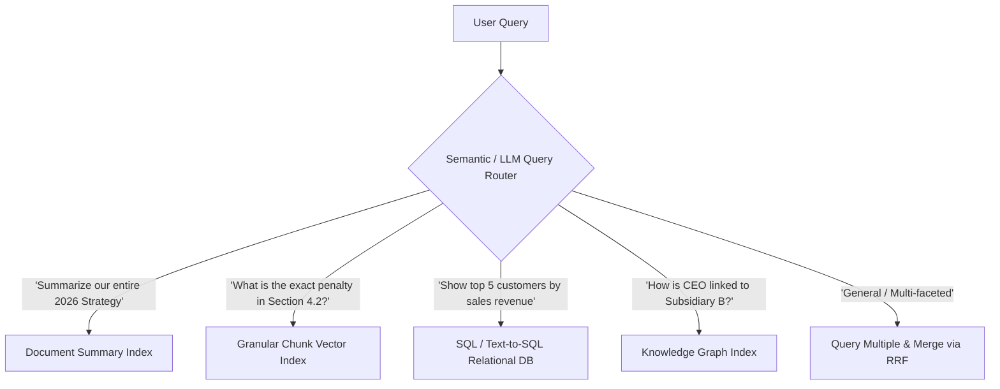

### The 4 Standard Indexes in Enterprise Multi-Index RAG

| Index Type | What It Stores | Example Query Handled |
| :--- | :--- | :--- |
| **1. Summary Index** | High-level 200-word summaries of entire documents or books. | *"Give me an executive overview of the merger contract."* |
| **2. Chunk Index** | Granular 256-token text chunks with HNSW vector index. | *"What is the warranty period for replacement batteries?"* |
| **3. Structured / SQL Index** | Relational tables, numerical columns, metrics, dates. | *"How many refund requests exceeded \$1,000 in Q3?"* |
| **4. Knowledge Graph Index** | Entities (people, companies, products) and relationships. | *"Which subsidiary suppliers are affected by the shipping strike?"* |

### How Query Routers Work
1. **LLM Function Calling Router:** The prompt describes the available tools/indexes as tools; the LLM selects the correct index tool based on schema descriptions.
2. **Semantic Vector Router:** User queries are embedded and compared against small vector descriptions of each index (ultra-fast, $<15\text{ms}$ routing latency without full LLM invocation).

### Interview Takeaway
> *"Dumping PDFs, SQL tables, and executive summaries into one single vector database ruins retrieval precision. **Multi-Index RAG uses an intelligent router** to send numerical queries to SQL, high-level queries to summary indices, and granular questions to chunk vectors."*

---

# Part 5: Post-Retrieval, Reranking & Context Optimization

---

## Q17: What is Reranking (Cross-Encoders) and why is it a game-changer for RAG retrieval quality?

### Short Answer
**Reranking** is a post-retrieval refinement step where a specialized **Cross-Encoder model** computes full bidirectional cross-attention across the `(Query, Chunk)` pair simultaneously to output an accurate relevance score ($0.0 \text{ to } 1.0$). It reorders the top-$k$ candidates (e.g., top 20) retrieved by initial vector search, promoting the truly relevant chunks to the very top.

### Bi-Encoder (Vector Search) vs Cross-Encoder (Reranker)

```mermaid
flowchart TD
    subgraph Bi_Encoder["1. Bi-Encoder (Fast Vector Search)"]
        Q1[Query] --> E1[Embedding Model] --> V1[Query Vector]
        D1[Document] --> E2[Embedding Model] --> V2[Doc Vector]
        V1 & V2 --> DOT[Cosine / Dot Product]
        Note1["Fast O(1) Index Lookup, but NO interaction between query & doc words during encoding!"]
    end

    subgraph Cross_Encoder["2. Cross-Encoder (Deep Reranking)"]
        QD[Joint Input: '[CLS] Query [SEP] Document Chunk'] --> BERT[Full Transformer Cross-Attention Layer]
        BERT --> SCORE[Relevance Score: 0.984]
        Note2["Slow for millions of docs, but PERFECT for top 20 candidates because every query word attends to every doc word!"]
    end
```

### Why Reranking is a Game-Changer
1. **Resolves Vector Search Deficiencies:** Vector models (Bi-Encoders) encode query and text into isolated vectors separately, losing subtle contextual nuances. Cross-encoders examine the exact token-level interplay between query and chunk.
2. **Drastic Reduction in Noise:** You can retrieve a wide candidate net ($k=30$) via cheap vector/BM25 search, and let the Cross-Encoder filter down to the top $3$ ultra-pure chunks.
3. **Directly Fixes Lost-in-the-Middle:** Guarantees that the absolute best context chunk is placed at Index 0 in the prompt.

### Popular Production Rerankers
- **Cohere Rerank v3:** Enterprise-grade cloud API; supports multi-lingual, code, and semi-structured data.
- **BGE-Reranker-Large (BAAI):** SOTA open-source Cross-Encoder; easily self-hosted on a single GPU.
- **Jina Reranker v2:** Lightweight, high-throughput model supporting 8k context lengths.

### Production Pipeline with Reranking (Python)
```python
from sentence_transformers import CrossEncoder

# 1. Step 1: Broad Vector Search retrieves Top 20 Candidates
candidate_chunks = vector_db.search("How to reset corporate laptop password?", top_k=20)

# 2. Step 2: Cross-Encoder scores (Query, Chunk) pairs jointly
reranker = CrossEncoder("BAAI/bge-reranker-large")
query = "How to reset corporate laptop password?"
pairs = [[query, chunk.text] for chunk in candidate_chunks]

scores = reranker.predict(pairs)

# 3. Step 3: Sort chunks by score and slice Top 3 for LLM
ranked_results = [chunk for _, chunk in sorted(zip(scores, candidate_chunks), reverse=True)]
top_3_chunks = ranked_results[:3]
```

### Interview Takeaway
> *"Vector search is a high-speed, low-precision filter (**Bi-Encoder**); Reranking is a slower, high-precision ranker (**Cross-Encoder**). Implementing a reranker over top-20 vector hits routinely improves RAG accuracy by 25–40%."*

---

## Q18: What is Contextual Compression and how does it optimize LLM token usage and reduce noise?

### Short Answer
**Contextual Compression** inspects retrieved chunks and strips away all sentences, headers, and boilerplate text that are irrelevant to the specific user query, passing only the condensed, information-dense nuggets to the LLM. It reduces token costs, shrinks latency, and prevents distractors from degrading generation accuracy.

### Contextual Compression Pipeline

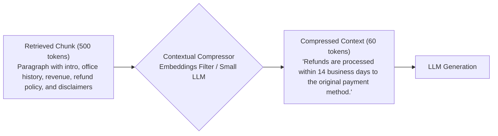

### Compression Techniques

| Method | Mechanism | Latency Impact | Compression Ratio |
| :--- | :--- | :--- | :--- |
| **1. Sentence-Level Embedding Filter** | Splits chunk into sentences; drops any sentence whose similarity to query is $< \text{threshold}$. | Very Fast ($<5\text{ms}$) | ~40–60% token reduction |
| **2. Small LLM Extractor (e.g. GPT-4o-mini)** | Small model extracts exact answering quotes from the chunk before passing to master LLM. | Moderate (~100ms) | ~70–85% token reduction |
| **3. LLMLingua (Prompt Compression)** | Uses small language model perplexity calculations to remove non-essential tokens/words without losing syntactic meaning. | Fast (~20ms) | Up to 80% token reduction |

### Interview Takeaway
> *"Retrieved chunks are 80% noise and 20% signal. **Contextual compression acts as a semantic sieve**, stripping out irrelevant sentences before prompt injection—cutting token costs and boosting LLM answer fidelity."*

---

## Q19: What is Metadata Filtering (Pre-filtering vs Post-filtering) and how does it enhance precision and security?

### Short Answer
**Metadata Filtering** applies structured boolean filters (e.g., `department == 'HR'`, `year == 2026`, `user_role IN ['Admin', 'Manager']`) alongside similarity search.
- **Pre-filtering:** Filters the dataset *before* vector index traversal. (Fast, 100% accurate, industry standard).
- **Post-filtering:** Performs top-$k$ vector search first, then discards non-matching chunks. (Flawed: can return zero results if all top-$k$ items fail the filter).

### Pre-Filtering vs Post-Filtering Failure Mode

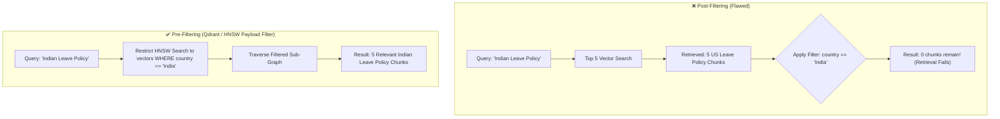

### Essential Metadata Payload Attributes for Enterprise RAG
```json
{
  "document_id": "doc_hr_policy_2026",
  "filename": "Employee_Handbook_2026.pdf",
  "page_number": 14,
  "chunk_index": 3,
  "department": "Human Resources",
  "country": "India",
  "version": "2.4",
  "effective_date": "2026-01-01",
  "access_control_list": ["employee", "manager", "hr_admin"]
}
```

### Implementing Role-Based Access Control (RBAC)
When an employee with role `intern` queries the system, the application automatically appends an invisible security filter:
`filter={"access_control_list": {"$contains": "intern"}}`
This ensures confidential executive compensation and legal documents are physically impossible to retrieve, regardless of semantic similarity.

### Interview Takeaway
> *"Always use **vector database pre-filtering** over post-filtering. Metadata filtering is mandatory in enterprise RAG to enforce **Role-Based Access Control (RBAC)** and eliminate cross-departmental noise (e.g., mixing US and Indian labor policies)."*

---

# Part 6: Evaluation, Testing & Quality Assurance

---

## Q20: How do you evaluate a RAG system across Retrieval, Generation, and End-to-End levels?

### Short Answer
A RAG system cannot be evaluated as a single black box. Robust evaluation requires measuring three decoupled layers:
1. **Retrieval Layer Evaluation:** Did the retriever fetch the correct chunks? (Metrics: Hit Rate, MRR, NDCG).
2. **Generation Layer Evaluation:** Did the LLM answer truthfully and stay grounded in the retrieved text? (Metrics: Faithfulness, Answer Relevancy).
3. **End-to-End & Production Monitoring:** User feedback thumbs up/down, latency, token spend, and drift over time.

### The 3-Tier Evaluation Architecture

```mermaid
flowchart TD
    subgraph L1["1. Retrieval Evaluation (IR Metrics)"]
        R1[Hit Rate @ K]
        R2[Mean Reciprocal Rank - MRR]
        R3[Context Recall & Precision]
    end

    subgraph L2["2. Generation Evaluation (LLM-as-a-Judge)"]
        G1[Faithfulness / Groundedness]
        G2[Answer Relevance]
        G3[Hallucination Rate]
    end

    subgraph L3["3. End-to-End & Ops Evaluation"]
        E1[Golden Dataset Benchmark Score]
        E2[Latency P50 / P95 / P99]
        E3[User Thumbs Up / Down Telemetry]
    end
```

### Evaluation Metrics Breakdown

| Level | Metric Name | What It Measures | Target Production Value |
| :--- | :--- | :--- | :--- |
| **Retrieval** | **Hit Rate @ $k$** | Percentage of queries where the ground-truth document was present in top-$k$ retrieved chunks. | $> 90\%$ |
| **Retrieval** | **MRR (Mean Reciprocal Rank)** | How close to the #1 position the correct chunk was placed ($1 / \text{rank}$). | $> 0.80$ |
| **Generation** | **Faithfulness** | Are all claims in the generated response directly supported by the context? | $> 0.95$ (Near 1.0) |
| **Generation** | **Answer Relevancy** | Did the LLM actually address the user's specific question without wandering off? | $> 0.90$ |
| **End-to-End** | **ROUGE-L / BLEU / BERTScore** | Lexical/semantic overlap against human ground-truth answers (for reference sets). | Baseline validation |

### Interview Takeaway
> *"RAG evaluation must decouple **retrieval quality** (did we find the right data?) from **generation quality** (did the LLM use the data faithfully?). If retrieval score is low, fix chunking and embeddings; if faithfulness is low, fix prompt templates and model temperatures."*

---

## Q21: What is the RAGAS framework and how do its core metrics (Faithfulness, Answer Relevance, Context Precision, Context Recall) work?

### Short Answer
**RAGAS (Retrieval Augmented Generation Assessment)** is the industry-standard automated evaluation framework that uses **LLM-as-a-Judge** to evaluate RAG pipelines without requiring human-labeled ground truth for every test query.

### The RAGAS Evaluation Matrix

```mermaid
flowchart TD
    subgraph Inputs["RAG Artifacts"]
        Q[User Query]
        C[Retrieved Context]
        A[Generated Answer]
        GT[Ground Truth - Optional]
    end

    subgraph RAGAS_Metrics["RAGAS Core Metrics"]
        C & A -->|Measures Groundedness| F[1. Faithfulness]
        Q & A -->|Measures Query Fit| AR[2. Answer Relevance]
        Q & C & GT -->|Measures Ranking Quality| CP[3. Context Precision]
        C & GT -->|Measures Information Coverage| CR[4. Context Recall]
    end
```

### The 4 Core RAGAS Metrics Explained

#### 1. Faithfulness (Groundedness / Anti-Hallucination)
- **Question:** *Are all claims in the generated answer derived strictly from the context?*
- **Computation:** The Judge LLM breaks the answer into atomic factual statements ($S_1, S_2, ... S_n$) and checks if each statement is logically entailed by the retrieved context.
- $\text{Faithfulness} = \frac{\text{Number of claims supported by context}}{\text{Total number of claims in generated answer}}$

#### 2. Answer Relevance
- **Question:** *Did the model answer what was asked, or did it generate evasive/redundant fluff?*
- **Computation:** The Judge LLM reverse-engineers hypothetical questions from the generated answer and computes vector similarity against the original user query.

#### 3. Context Precision
- **Question:** *Are the relevant chunks ranked at the top of the retrieved context list?*
- **Computation:** Evaluates whether signal-bearing chunks appear before noise chunks (equivalent to Mean Average Precision).

#### 4. Context Recall
- **Question:** *Did the retriever fetch all the necessary facts needed to answer the question?*
- **Computation:** Compares retrieved context sentences against the reference ground-truth answer.

### Python Code: Running RAGAS Evaluation
```python
from datasets import Dataset
from ragas import evaluate
from ragas.metrics import faithfulness, answer_relevancy, context_precision, context_recall

# Prepare evaluation data structure
data = {
    "question": ["What is our refund policy window?"],
    "contexts": [["Items can be returned within 14 calendar days of delivery in original packaging."]],
    "answer": ["You can return items within 14 days of delivery."],
    "ground_truth": ["Customers have a 14-day window from the delivery date to initiate refunds."]
}
dataset = Dataset.from_dict(data)

# Run automated LLM-as-a-Judge evaluation
results = evaluate(
    dataset,
    metrics=[faithfulness, answer_relevancy, context_precision, context_recall]
)
print(results)
# Output: {'faithfulness': 1.000, 'answer_relevancy': 0.985, 'context_precision': 1.000, 'context_recall': 1.000}
```

### Interview Takeaway
> *"RAGAS automates RAG benchmarking using **LLM-as-a-Judge**. The core diagnostic formula is: **Faithfulness** detects hallucinations, **Answer Relevance** detects evasion, **Context Precision** evaluates reranking, and **Context Recall** checks retriever coverage."*

---

## Q22: How do you generate Golden Test Datasets for RAG (Manual vs Synthetic vs Production Logs)?

### Short Answer
A **Golden Dataset** consists of verified `(Question, Ground-Truth Context, Reference Answer)` triplets used to benchmark pipeline improvements. Teams construct them using a hybrid of three methods:
1. **Manual Curation by Domain Experts (Gold Standard, Slow):** 50–200 high-complexity test cases.
2. **Synthetic Dataset Generation (Fast, Scalable):** Using LLMs (Ragas / LlamaIndex TestGen) to generate QA pairs directly from document chunks.
3. **Production Query Mining & Telemetry (Realistic):** Harvesting real user questions, error tickets, and upvoted/downvoted chat sessions.

### Comparison of Golden Dataset Approaches

| Approach | Scalability | Cost & Speed | Realism / Difficulty | Primary Purpose |
| :--- | :--- | :--- | :--- | :--- |
| **1. Manual Expert Creation** | Low ($<200$ QA pairs) | Expensive, weeks of SME time | High (captures subtle edge cases & tricky jargon) | Release gatekeeper benchmark for staging deployments. |
| **2. Synthetic LLM Generation** | **Very High ($1,000+$ pairs)** | Extremely cheap, generated in minutes | Moderate (can lack real-world messiness) | Hyperparameter tuning (testing chunk sizes, embeddings, $k$). |
| **3. Production Log Mining** | High | Low ongoing cost | **Highest (actual user phrasing & typos)** | Continuous regression testing & drift monitoring. |

### The Synthetic Generation Pipeline
```mermaid
flowchart LR
    Docs[Enterprise Documents] --> Split[Split into Chunks]
    Split --> LLM_Gen{LLM Test Generator}
    LLM_Gen --> Q1[Simple Direct QA]
    LLM_Gen --> Q2[Multi-hop Comparative QA]
    LLM_Gen --> Q3[Adversarial / Unanswerable QA]
    Q1 & Q2 & Q3 --> Filter[Filter by Confidence & Quality]
    Filter --> GoldenDB[(Golden Evaluation Dataset)]
```

### Interview Takeaway
> *"Bootstrap with **Synthetic Test Generation** (via Ragas/LlamaIndex) to generate hundreds of test vectors for hyperparameter tuning. Pair this with a core set of **50–100 expert-crafted golden questions** to guard against regressions before pushing pipeline changes to production."*

---

# Part 7: Production Operations, Maintenance & Failure Modes

---

## Q23: What are the common failure modes of production RAG systems and how do you debug them?

### Short Answer
Production RAG systems typically fail in one of **six distinct failure modes**:
1. **Missing Content / Ingestion Failure:** Document was never indexed or was corrupted during OCR.
2. **Retriever Miss (Low Recall):** The right chunk exists, but vector similarity failed to return it in top-$k$.
3. **Lost in the Middle / Context Overflow:** The chunk was retrieved, but buried in a noisy prompt and ignored by the LLM.
4. **LLM Hallucination / Over-Reasoning:** The context was provided, but the LLM hallucinated external facts due to high temperature or weak system prompts.
5. **Stale Knowledge Base:** The vector index contains outdated versions of updated documents.
6. **Formatting / Parsing Failures:** The LLM failed to adhere to required JSON schemas or extraction rules.

### Diagnostic Flowchart for RAG Failures

```mermaid
flowchart TD
    Fail[RAG System Returns Incorrect Answer] --> D1{Is the correct chunk in the Vector DB?}
    D1 -->|No| Fix1[Fix Document Loader / Ingestion / OCR Pipeline]
    D1 -->|Yes| D2{Was the correct chunk retrieved in Top-K?}
    D2 -->|No| Fix2[Fix Embeddings / Add Hybrid BM25 Search / Adjust Chunking]
    D2 -->|Yes| D3{Was the chunk ranked in the Top 3?}
    D3 -->|No| Fix3[Add Cross-Encoder Reranker / Lower K]
    D3 -->|Yes| D4{Did the LLM ignore the context?}
    D4 -->|Yes| Fix4[Set Temperature=0.0 / Enforce Strict System Prompt Guardrails]
    D4 -->|No| Fix5[Fix Contextual Compression / Formatting instructions]
```

### The 6 Failure Modes & Their Engineering Fixes

| Failure Mode | Root Cause | Engineering Solution |
| :--- | :--- | :--- |
| **1. Empty / Bad Retrieval** | Query vocabulary mismatch; chunk boundary split key terms. | Switch to **Hybrid Search (Dense + BM25)** and increase chunk overlap to 20%. |
| **2. Low-Ranked Relevant Chunk** | Cosine similarity unable to differentiate nuanced context. | Introduce a **Cross-Encoder Reranker (Cohere / BGE)**. |
| **3. Stale Data Conflict** | Old policy vectors co-existing with newly uploaded 2026 vectors. | Implement **MD5 content hashing and atomic document replacement**. |
| **4. Hallucination Despite Correct Context** | LLM relies on pre-trained parametric memory instead of context. | Strict system prompt: *"Answer ONLY from context. If not present, state 'I do not know'"*. |
| **5. Multi-Hop Miss** | Answer requires joining facts across 3 separate files. | Implement **Agentic RAG / Query Decomposition / Graph RAG**. |
| **6. Scanned PDF Garbage Text** | Ingestion extracted raw un-OCR'd bytes. | Use specialized vision document parsers (AWS Textract, DONUT, Unstructured). |

### Interview Takeaway
> *"Debugging a broken RAG query requires systematic isolation: **Check DB $\rightarrow$ Check Retriever $\rightarrow$ Check Reranker $\rightarrow$ Check LLM Prompt**. 90% of RAG failures are data ingestion, chunking, or ranking issues, not LLM reasoning flaws."*

---

## Q24: How do you handle knowledge base updates, freshness, and incremental document synchronization?

### Short Answer
Keeping a RAG vector database fresh requires an **Incremental Ingestion Pipeline with Content Hashing**. Instead of dropping and re-embedding millions of documents, track changes at the file and chunk level using **MD5 / SHA-256 hashes**, performing atomic upserts for modified files and deletions for removed files.

### Incremental Synchronization Architecture

```mermaid
flowchart TD
    Source[Enterprise Storage<br/>Google Drive, S3, SharePoint] --> Event[Webhook / Change Detection Event]
    Event --> HashCheck{Compute SHA-256 Hash vs Metadata Store}
    
    HashCheck -->|Hash Unchanged| Skip[Skip File - Zero Cost]
    HashCheck -->|New File| Ingest[Chunk -> Embed -> Upsert into Vector DB]
    HashCheck -->|Modified File| Update[1. Delete old vectors WHERE doc_id = X<br/>2. Re-chunk & Re-embed<br/>3. Upsert new vectors with updated version tag]
    HashCheck -->|Deleted File| Delete[Delete vectors WHERE doc_id = X from Vector DB]
```

### Core Strategies for Knowledge Base Freshness
1. **Document-Level Hashing:** Store `sha256(file_bytes)` in PostgreSQL. When a nightly sync runs, compare hashes. If identical, skip processing completely.
2. **Atomic Document Replacement:** In vector databases, never leave orphaned chunks. When updating `Handbook_v2.pdf`, execute a transactional batch:
   `vector_db.delete(filter={"document_id": "handbook_v1"})`
   `vector_db.upsert(new_chunks, document_id="handbook_v2")`
3. **Time-To-Live (TTL) & Expiration Metadata:** For ephemeral documents (e.g. daily news or price lists), set an expiration date field in payload metadata and filter out expired chunks during retrieval:
   `filter={"expires_at": {"$gt": current_timestamp}}`
4. **CDC (Change Data Capture):** For SQL/NoSQL databases, attach Kafka or Debezium streaming events to trigger vector upserts in real-time as database rows update.

### Interview Takeaway
> *"Never re-index the entire vector database from scratch. Use **content-hash change detection, atomic document ID deletions, and metadata versioning** to enable seamless, sub-second incremental synchronization."*

---

## Q25: How do you implement reliable Source Attribution and Citations (Chunk-level vs Inline)?

### Short Answer
**Source Attribution** provides auditability and builds user trust by linking LLM claims directly back to authoritative source documents. It is implemented at two levels:
1. **Chunk-Level Attribution:** Attaching source document titles, URLs, and page numbers at the bottom of the response.
2. **Inline / Sentence-Level Citation:** Instructing the LLM to place numeric brackets (e.g., `[1]`, `[2]`) after every specific claim, mapping directly to numbered context chunks.

### Chunk-Level vs Inline Citations

```mermaid
flowchart TD
    subgraph Chunk_Attribution["1. Chunk-Level Attribution"]
        A1["Answer: Employees get 20 weeks maternity leave and 4 weeks paternity leave.<br/><br/><b>Sources:</b><br/>- Employee Handbook 2026, Page 14<br/>- Benefits Guide, Page 2"]
    end

    subgraph Inline_Attribution["2. Inline Claim Attribution (Gold Standard)"]
        A2["Answer: Employees receive 20 weeks of fully paid maternity leave [1]. Paternity leave is granted up to 4 weeks upon manager approval [2].<br/><br/><b>Citations:</b><br/>[1] Employee Handbook 2026 (Page 14, Section 4.2)<br/>[2] Benefits Guide (Page 2, Section 1.1)"]
    end
```

### Prompt Engineering Pattern for Strict Inline Citations
```text
[SYSTEM PROMPT]
You are a verified corporate research assistant.
Answer the user query using ONLY the numbered context snippets below.
For EVERY claim you state, you MUST append the corresponding citation bracket, e.g., [1] or [2].
If different sentences come from different sources, cite them individually.
Do NOT combine facts without citations.

[CONTEXT]
[1] Document: HR_Policy_2026.pdf | Page: 12
"Full-time employees receive 20 days of paid vacation per calendar year."

[2] Document: Travel_Policy.pdf | Page: 4
"Daily meal per diem for domestic travel is capped at $75."

[USER QUESTION]
What is our vacation allowance and meal budget?

[OUTPUT FORMAT]
Full-time employees are entitled to 20 days of paid annual vacation [1]. When traveling domestically, the daily meal allowance is capped at $75 [2].
```

### Post-Processing Verification (LLM-as-a-Verifier)
In mission-critical legal or medical RAG, pass the generated answer through a second verification pass:
- An independent lightweight LLM verifies if the statement preceding citation `[1]` is strictly supported by the text in Chunk `[1]`. If unverified, the citation is flagged or stripped before display.

### Interview Takeaway
> *"Source attribution transforms an LLM from an unverified black box into an auditable enterprise tool. We achieve this by **injecting numbered context identifiers into the prompt** and enforcing inline bracketed citations (`[1]`) mapped to document page metadata."*

---

# Part 8: Advanced Paradigms: Agentic, Multimodal & Graph RAG

---

## Q26: What is Agentic RAG and how does an autonomous agent improve multi-step retrieval and planning?

### Short Answer
**Agentic RAG** transforms the passive, hardcoded, single-step RAG pipeline into an **active, autonomous, decision-making AI agent**. The agent evaluates user intent, formulates a multi-step plan, calls multiple search tools dynamically (Vector DB, SQL, Web Search, APIs), critiques intermediate retrieved data, and iterates until it gathers sufficient evidence to answer complex queries.

### Standard RAG vs Agentic RAG

```mermaid
flowchart TD
    subgraph Standard_RAG["Standard RAG (Static Single-Shot)"]
        Q1[User Query] --> R1[Single Vector Search] --> LLM1[Generate Answer]
    end

    subgraph Agentic_RAG["Agentic RAG (Dynamic Reasoning Loop)"]
        Q2[User Query] --> Agent{Agentic Controller / Planner}
        Agent -->|Step 1: Check Internal DB| Tool1[Vector DB: Q3 Financials]
        Tool1 --> Eval1{Evaluate: Is data sufficient?}
        Eval1 -->|Need competitor data| Tool2[Web Search Tool: Competitor Q3]
        Tool2 --> Eval2{Evaluate: Need numerical check?}
        Eval2 -->|Calculate Delta| Tool3[Python Code Interpreter]
        Tool3 --> Final[Synthesize Comprehensive Final Answer]
    end
```

### Core Capabilities of Agentic RAG Systems

| Agentic Capability | How It Works in RAG | Practical Example |
| :--- | :--- | :--- |
| **1. Dynamic Retrieval Decision** | Decides *whether* retrieval is even needed (bypasses search for *"Hi, how are you?"* or pure math). | Saves API costs and eliminates search latency for trivial conversation. |
| **2. Query Planning & Routing** | Breaks multi-hop questions into dependent sub-tasks. | *"Compare our Q3 margins against Tesla"* $\rightarrow$ Task 1: Internal ERP $\rightarrow$ Task 2: Web Search $\rightarrow$ Task 3: Compare. |
| **3. Self-Correction & Reflection** | Evaluates if retrieved chunks actually answer the prompt. If retrieval is poor, rewrites the query and searches again. | If search for *"Widget 400"* returns zero results, agent automatically rewrites query to *"Model W-400 specs"*. |
| **4. Multi-Tool Orchestration** | Dynamically calls SQL queries, vector stores, REST APIs, and Python sandboxes. | Executes a SQL query for exact revenue numbers, then queries Vector DB for executive commentary. |

### Frameworks for Building Agentic RAG
- **LangGraph:** Graph-based state machine framework; provides cycles, conditional branching, human-in-the-loop, and robust persistence.
- **LlamaIndex Workflows:** Event-driven multi-agent orchestration for advanced retrieval topologies.
- **CrewAI / AutoGen:** Multi-agent role-playing systems (e.g. Researcher Agent + Critic Agent + Writer Agent).

### Interview Takeaway
> *"Standard RAG is a **dumb pipe** that searches once and hopes for the best. **Agentic RAG is an intelligent loop** where an LLM agent plans, executes tool calls across multiple sources, evaluates result quality, and self-corrects until it has sufficient facts to generate an accurate answer."*

---

## Q27: How do you build Multimodal RAG for documents with tables, charts, and images (OCR, VLMs, Table Parsers)?

### Short Answer
Enterprise documents (PDFs, earnings reports, slide decks) contain critical information locked in **tables, bar charts, diagrams, and scanned images**. **Multimodal RAG** extracts and indexes these diverse visual structures using Vision-Language Models (VLMs like GPT-4o / Claude 3.5 Sonnet), specialized table parsers, and multi-vector representations.

### Multimodal Ingestion Architecture

```mermaid
flowchart TD
    Doc[Complex PDF Document] --> Parser{Document Layout Parser<br/>Unstructured / Marker / Azure Form Recognizer}

    Parser -->|Raw Paragraphs| T[Text Chunker & Embedder]
    Parser -->|Tables| TAB[Table Parser<br/>Convert to Markdown / HTML / JSON]
    Parser -->|Charts & Diagrams| VLM[Vision-Language Model<br/>GPT-4o / ColPali]

    VLM -->|Generate Detailed Textual Summary| VSUM[Embed Summary -> Store in Vector DB]
    VLM -->|Extract Direct Numerical Data| VNUM[Store in Structured Store]
    TAB -->|Embed Table Markdown| TDB[(Unified Vector DB)]
    TSUM[Embed Text] --> TDB
    VSUM --> TDB
```

### The 3 Core Multimodal Ingestion Strategies

#### Strategy 1: Vision Model Summarization (Text-Representation Approach)
1. Crop images and charts from document pages.
2. Pass each image to a Vision Model (GPT-4o) with prompt: *"Describe this chart in deep technical detail, extracting all axes, data points, trends, and conclusions."*
3. Embed and index the generated textual description into your standard Vector DB, storing a link to the original raw image in metadata.
4. When retrieved, pass both the text summary and raw image URL to the final multimodal LLM.

#### Strategy 2: Table HTML/Markdown Serialization
- Standard chunking destroys tables because splitting by newline severs row-column relationships.
- Use tools like `pdfplumber`, `Camelot`, or `Unstructured` to convert tables into clean **Markdown tables** or **HTML tables** (`<table><tr><td>...</td></tr></table>`). Embedding models represent Markdown table semantics with high fidelity.

#### Strategy 3: End-to-End Vision Retrieval (ColPali / Multi-Vector VLM)
- SOTA approach bypassing OCR entirely: Pass entire document page images directly into a vision model (e.g., **ColPali**) that produces multi-vector patch embeddings of the visual page layout, retrieving exact visual pages directly.

### Interview Takeaway
> *"Standard RAG fails on tables and charts because flat text extraction destroys structural geometry. **Multimodal RAG parses tables into clean Markdown/HTML and uses Vision Models (VLMs) to generate searchable text summaries of complex charts and diagrams.**"*

---

## Q28: What is Graph RAG and how does Knowledge Graph traversal solve multi-hop reasoning queries?

### Short Answer
**Graph RAG** combines traditional vector search with a **Knowledge Graph (KG)** consisting of **Entities (nodes)** and **Relationships (edges)** represented as triples `(Subject, Predicate, Object)`. It excels at **multi-hop reasoning**, interconnected dependency mapping, and global thematic summarization where standard vector proximity fails.

### Vector Search vs Graph RAG for Multi-Hop Queries

```mermaid
flowchart TD
    subgraph Vector_Limitation["❌ Vector Search Limitation (Isolated Chunks)"]
        Q1["Query: 'Which suppliers of our Subsidiary B are affected by the German energy embargo?'"]
        Q1 --> VLookup[Finds Chunks containing exact words 'Subsidiary B' or 'German energy']
        VLookup --> Miss[Fails to link: Subsidiary B -> owned by Corp C -> supplied by Vendor X -> based in Germany!]
    end

    subgraph Graph_Traversal["✅ Graph RAG (Knowledge Graph Multi-Hop Traversal)"]
        N1[Node: Subsidiary B] -->|SubsidiaryOf| N2[Node: Corp C]
        N2 -->|ContractedSupplier| N3[Node: Vendor X]
        N3 -->|LocatedIn| N4[Node: Germany]
        N4 -->|ImpactedBy| N5[Node: Energy Embargo]
        NoteGraph["Graph traversal traverses edges across 4 hops, assembling the complete chain of truth!"]
    end
```

### Key Differences: Vector RAG vs Graph RAG

| Dimension | Vector RAG | Graph RAG (e.g. Microsoft GraphRAG) |
| :--- | :--- | :--- |
| **Data Representation** | Independent, isolated text chunks in high-dimensional vector space. | Graph of interconnected Entities (Nodes) and Relationships (Edges). |
| **Query Strengths** | Specific fact lookups (*"What is the return window?"*). | **Multi-hop reasoning & global theme synthesis** (*"How does Project X connect to Company Y?"*). |
| **Global Corpus Understanding** | Poor (cannot summarize themes across 10,000 PDFs without stuffing context). | **High (uses hierarchical community clustering Leiden algorithm)**. |
| **Index Construction Cost** | Fast & cheap (embedding generation only). | Slower & computationally expensive (requires LLM to extract entities and build graph). |
| **Underlying Database** | Qdrant, Pinecone, Milvus, pgvector. | Neo4j, Amazon Neptune, Memgraph, NetworkX. |

### How Microsoft GraphRAG Works
1. **Entity-Relation Extraction:** An LLM reads every chunk and extracts all entities (`Alice`, `Project Apollo`, `Acme Corp`) and relationships (`Alice MANAGES Project Apollo`).
2. **Community Detection:** Algorithms (e.g. Leiden) cluster densely connected sub-graphs into semantic communities.
3. **Hierarchical Summarization:** LLMs write pre-computed summaries for every community level.
4. **Global Query Execution:** Queries summarize across community reports rather than searching individual chunks.

### Interview Takeaway
> *"Vector search finds isolated pieces of text based on keyword proximity; **Graph RAG traverses structural relationships between entities across multiple documents**. It is the premier solution for multi-hop reasoning, supply chain mapping, and global corpus summarization."*

---

# Part 9: Production Optimization & Conversational Systems

---

## Q29: How do you diagnose and eliminate hallucinations when the correct context document is already retrieved?

### Short Answer
When a RAG system hallucinates despite having the correct context chunk present in its prompt, the failure is located in the **Generation Stage**. It is resolved by **lowering LLM temperature to 0.0**, enforcing **strict negative constraints in system prompts**, **pruning distracting context noise**, and implementing a **deterministic hallucination guardrail**.

### Diagnostic Checklist for Generation Hallucinations

```mermaid
flowchart TD
    H[Hallucination Detected Despite Correct Retrieval] --> C1{Is Temperature > 0.0?}
    C1 -->|Yes| Fix1[Set Temperature = 0.0 / Top_P = 1.0]
    C1 -->|No| C2{Are too many noisy chunks stuffed in prompt?}
    C2 -->|Yes| Fix2[Reduce Top-K from 10 to 3 / Apply Contextual Compression]
    C2 -->|No| C3{Does system prompt allow external assumptions?}
    C3 -->|Yes| Fix3[Add Strict Negative Prompt Guardrails]
    C3 -->|No| C4{Is answer split across two conflicting documents?}
    C4 -->|Yes| Fix4[Add Metadata Date Filter to select only latest version]
```

### 5 Battle-Tested Production Fixes

#### 1. Deterministic System Prompt Guardrail
Force the model to operate strictly as an extractive synthesizer rather than an open-ended conversationalist:
```text
[SYSTEM PROMPT]
You are a strict, factual information extractor.
Your task is to answer the user's question based EXCLUSIVELY on the provided Context below.

CRITICAL RULES:
1. Do NOT use any prior knowledge or external assumptions.
2. If the answer cannot be directly deduced from the Context, you MUST respond EXACTLY with:
   "I am sorry, but the provided documentation does not contain sufficient information to answer this question."
3. Every factual statement must cite the exact Context source.
```

#### 2. Temperature and Hyperparameter Tuning
- **Temperature = 0.0:** Eliminates randomness in next-token selection (greedy decoding), ensuring reproducible, deterministic factual output.
- **Presence / Frequency Penalty = 0.0:** High penalties can cause the LLM to avoid repeating exact technical terms from the context, forcing it to invent synonyms that lead to hallucinations.

#### 3. Eliminate Contextual Distractors
If you inject 10 chunks where only 1 chunk has the answer and 9 are irrelevant noise, the LLM may become confused. Reduce top-$k$ to the top 3 reranked chunks.

#### 4. Automated Post-Generation Hallucination Guardrails (NeMo Guardrails / Guardrails AI)
Run an automated verification rule: Check if named entities and numbers in the LLM response exist in the source context. If novel entities appear, intercept the response.

### Interview Takeaway
> *"When retrieval succeeds but generation hallucinates, the culprit is prompt leakage or non-zero temperature. **Set temperature to 0.0, reduce context noise to the top-3 reranked chunks, and enforce strict negative refusal constraints** ('If not directly mentioned, state you do not know')."*

---

## Q30: How do you optimize latency and manage multi-turn conversational memory in production RAG systems?

### Short Answer
Production RAG systems must maintain high responsiveness while handling conversational context across multiple turns.
- **Latency Optimization:** Implemented via **semantic caching (Redis)**, **fast/quantized embedding models**, **HNSW indexing**, **parallelized async retrieval**, and **LLM response token streaming**.
- **Multi-Turn Conversational Memory:** Implemented via **Conversational Query Condensing (Query Rewriting)**, which condenses chat history and follow-up queries into self-contained standalone search queries before vector lookup.

### Conversational Query Rewriting Workflow

```mermaid
sequenceDiagram
    autonumber
    actor User
    participant App as RAG Orchestrator
    participant Rewriter as Fast LLM (Query Condenser)
    participant VectorDB as Vector Database
    participant Generator as Master LLM

    User->>App: Turn 1: "What is our leave policy?"
    App->>VectorDB: Search "leave policy"
    VectorDB-->>App: Return HR Policy
    App->>Generator: Generate Turn 1 Answer
    Generator-->>User: "We offer 20 days annual leave and 20 weeks maternity leave."

    User->>App: Turn 2: "What about paternity?" (Vague follow-up)
    Note over App,Rewriter: Without history, searching 'paternity' fails or returns generic text
    App->>Rewriter: Rewrite Query using Chat History + "What about paternity?"
    Rewriter-->>App: Standalone Query: "What is the corporate paternity leave policy?"
    App->>VectorDB: Search rewritten standalone query
    VectorDB-->>App: Return Paternity Section 4.3
    App->>Generator: Generate Grounded Answer
    Generator-->>User: "Paternity leave is 4 weeks of fully paid leave..."
```

### Latency Optimization Blueprint for Production

```mermaid
flowchart LR
    UQ[User Query] --> Cache{Semantic Cache<br/>Redis / GPTCache}
    Cache -->|Cache Hit < 10ms| QuickAns[Return Cached Answer]
    Cache -->|Cache Miss| Parallel[Parallel Execution]
    
    subgraph Parallel_Async["Parallel Async Lookup"]
        Parallel --> E[Fast Embedding Model < 20ms]
        Parallel --> BM[BM25 Keyword Search < 10ms]
    end
    
    E --> HNSW[HNSW Vector Index Search < 15ms]
    HNSW & BM --> Rerank[Cross-Encoder Reranker < 40ms]
    Rerank --> Stream[Stream LLM Tokens to Client via SSE / WebSocket]
```

### Production Latency Optimization Techniques Table

| Optimization Area | Technique | Latency Reduction |
| :--- | :--- | :--- |
| **1. Caching Layer** | **Semantic Cache (Redis / GPTCache):** If a semantically similar query was answered recently, return cached response immediately. | Bypasses entire pipeline ($<10\text{ms}$ vs $2,000\text{ms}$). |
| **2. Vector Search** | **HNSW Index + Matryoshka Dimension Truncation:** Truncate 1536 dims to 512 dims. | Cuts vector comparison time by 60%. |
| **3. Concurrent Retrieval** | Run BM25 sparse search and dense embedding generation concurrently via `asyncio.gather()`. | Saves 30–50ms on candidate generation. |
| **4. User Perception** | **Time-to-First-Token (TTFT) Streaming:** Stream LLM response tokens via Server-Sent Events (SSE) immediately. | User sees output in 300ms instead of waiting 3s for full block. |
| **5. Model Selection** | Use a fast, small model (GPT-4o-mini / Claude 3.5 Haiku) for query rewriting, reserving frontier models for final synthesis. | Reduces query transformation step from 800ms to 150ms. |

### Conversational Query Condensing Prompt Pattern
```python
CONDENSE_QUESTION_PROMPT = """
Given the following conversation history and a follow-up question, rephrase the follow-up question
to be a standalone question that contains all necessary context from the history.
Do NOT answer the question, only rewrite it.

Chat History:
User: What are the eligibility rules for medical insurance?
Assistant: Employees working 30+ hours per week are eligible after 90 days of employment.

Follow-up Question: Does it cover dental and vision too?
Standalone Rewritten Question: Does the employee medical insurance plan for full-time employees cover dental and vision care?
"""
```

### Interview Takeaway
> *"In conversational RAG, never pass raw follow-up queries (`'What about paternity?'`) directly to vector search. **Use a fast LLM to condense chat history into a standalone search query.** For low latency, combine **Redis semantic caching, async parallel retrieval, and token streaming** to keep Time-to-First-Token under 400ms."*

---

## 🎯 Final Architectural Summary & Master Revision Checklist

```mermaid
flowchart TD
    subgraph INGESTION["1. Ingestion & Indexing"]
        A[Raw Multi-Format Docs] --> B[Clean & OCR]
        B --> C[Recursive / Semantic Chunking]
        C --> D[Embeddings: MRL 512-1536 dims]
        D --> E[(HNSW Vector DB + Pre-Filtering Metadata)]
    end

    subgraph RETRIEVAL["2. Hybrid Retrieval & Rerank"]
        Q[User Query] --> TR[Query Rewriter / HyDE]
        TR --> HYB[Dense HNSW + Sparse BM25]
        E -.-> HYB
        HYB --> RRF[Reciprocal Rank Fusion]
        RRF --> RERANK[Cross-Encoder Reranker]
        RERANK --> COMP[Contextual Compression]
    end

    subgraph GENERATION["3. Grounded Synthesis & Eval"]
        COMP --> PROMPT[Strict Grounding Prompt + Citations]
        PROMPT --> LLM[LLM Generator: Temp = 0.0]
        LLM --> STREAM[Streamed Answer with Citations]
        STREAM --> EVAL[RAGAS Continuous Telemetry]
    end
```

---
*Created as part of the Comprehensive AI & RAG Masterclass Knowledge Base.*
