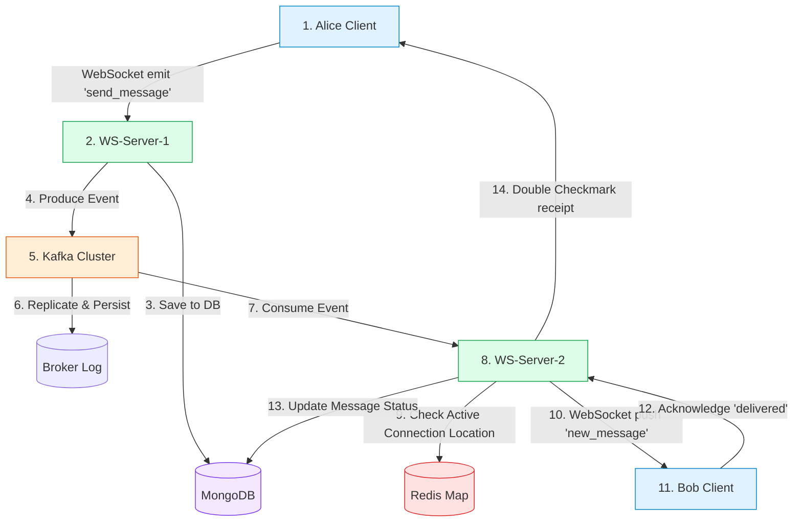
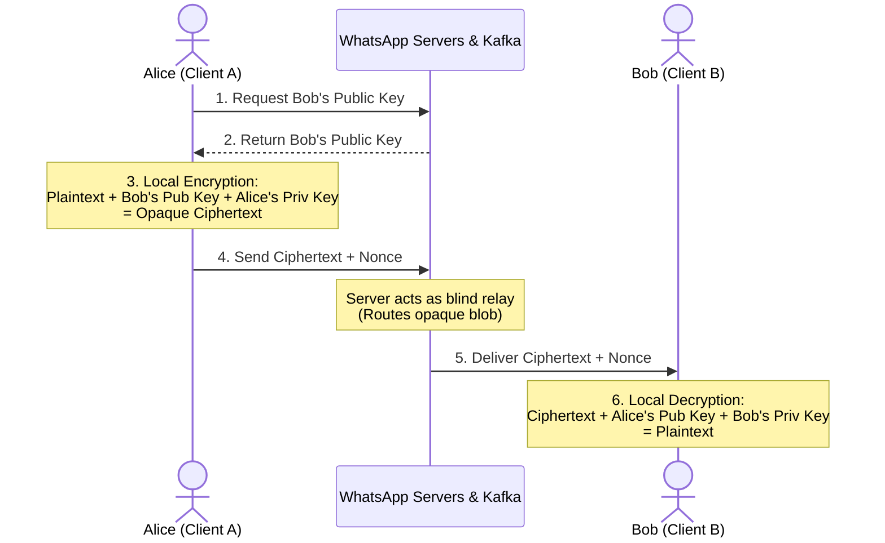

# 🏗️ Case Study: WhatsApp (Messaging System)

## 📋 Requirements

**Functional:**
- 1:1 real-time messaging
- Group chats (up to 1,024 members)
- Message delivery status (sent ✓, delivered ✓✓, read ✓✓ in blue)
- Media sharing (photos, videos, documents, voice notes)
- End-to-end encryption
- Message history (even after offline)
- Online/last seen status

**Non-Functional:**
- 2 billion users, 100 million DAU
- 65 billion messages per day
- Message delivered in < 100ms (when online)
- 99.999% availability
- End-to-end encrypted
- Offline messages stored and delivered when user comes back online

---

## 📊 Capacity Estimation

```
Messages/day: 65B
Messages/sec: 750,000
Active connections: 100M simultaneous WebSocket connections!

Message size: 100 bytes (text avg)
65B × 100 bytes = 6.5TB message data per day

Media: ~30% messages have media
20B media messages × 1MB avg = 20PB/day media → Store in S3!

Storage: 
  Last 1 year: 6.5TB × 365 = ~2.4PB messages
  + 20PB/day × 365 days media (huge!)
  WhatsApp: Doesn't store messages server-side after delivery (E2E encrypted)
```

---

## 🏗️ High Level Architecture

```
[Client A: React Native / Web]
          |
          | WebSocket (persistent connection)
          |
[AWS API Gateway WebSocket / Node.js + Socket.IO]
          |
     [Message Broker] ← Apache Kafka (Unified Backbone)
          |
[AWS API Gateway WebSocket / Node.js + Socket.IO]
          |
[Client B: React Native / Web]

For offline delivery:
  Message → Kafka Commit Log (Persistent Retention) → Delivered when B reconnects

Storage:
  MongoDB (messages) + Redis (presence status) + S3 (media)
```

---

## 🔌 WebSockets vs. Socket.IO

Before implementing real-time messaging, it is crucial to understand the technology choices for the communication layer.

### What is WebSocket?
A standardized network protocol (built on TCP) enabling bidirectional, full-duplex communication channels between a browser and a server. It starts with an HTTP handshake upgrading to `ws://` or `wss://` protocols.

### What is Socket.IO?
A JavaScript library built on top of WebSockets that provides high-level abstractions, connection reliability features, and automatic fallbacks.

### Comparison Table

| Feature | WebSocket Protocol (Native) | Socket.IO (Library) |
| :--- | :--- | :--- |
| **Category** | Core network protocol (HTML5). | JS library wrapper on top of WebSockets. |
| **Fallbacks** | None (fails if ports/websockets are blocked). | **Auto fallback** to HTTP long-polling. |
| **Reconnection** | Must be coded manually. | **Built-in** automatic reconnection rules. |
| **Rooms/Groups** | Must be implemented manually in DB/RAM. | **Built-in rooms** and namespaces. |
| **Offline Buffering**| Lost during network drops. | Buffers packets and releases on reconnect. |
| **Performance** | **Extremely high** (raw stream, low memory). | Slightly higher overhead due to wrappers. |

### Pros and Cons

#### Native WebSockets
* **Pros:**
  * **Zero Dependency Overhead**: Native browser support (no extra client/server package installs).
  * **Minimal Resource Consumption**: Lightweight memory/CPU footprint, optimal for scaling to high concurrency (e.g., 100K+ sockets per Node.js instance).
  * **Language-Agnostic Standard**: Seamless integration with microservices written in Go, Rust, Python, etc.
* **Pros/Cons (Neutral)**: Works strictly as a raw pipe; you must serialize and structure all payload formats yourself.
* **Cons:**
  * **Fragile Connection Stability**: No built-in reconnection; you must write custom logic for heartbeats, pings, and retry-backoffs.
  * **No Network Fallback**: Fails instantly if firewalls, corporate VPNs, or proxy servers block port-upgrades or long-running sockets.

#### Socket.IO
* **Pros:**
  * **High Reliability**: Auto-reconnection, offline packet buffering, and state recovery occur automatically.
  * **Universal Compatibility**: Falls back to HTTP long-polling transparently if WebSocket handshakes fail.
  * **Advanced Abstractions**: Offers structured event listeners, channel broadcasting, rooms, and callback confirmations.
* **Cons:**
  * **Resource Overhead**: Custom connection states and fallback polling consumes more RAM and CPU cycles per client socket.
  * **Library Lock-In**: The client-side must load the specific Socket.IO client bundle; native browser WebSocket connections will be rejected.

### Why Socket.IO was chosen for this MERN/Kafka setup:
1. **Network Resilience**: Mobile messaging clients frequently switch networks (Wi-Fi/Cellular). Socket.IO's automatic reconnection and packet buffering ensure messages are not dropped mid-transit.
2. **Built-in Grouping (Rooms)**: The library manages conversation socket grouping out of the box, facilitating partition-based dispatching without complex custom registry tables.

---

## 💬 Core Messaging Implementation

```javascript
// server.js — Socket.IO & Apache Kafka based real-time messaging

const express = require('express');
const { createServer } = require('http');
const { Server } = require('socket.io');
const { Kafka } = require('kafkajs');
const Redis = require('ioredis'); // Used for presence and user-to-server session mapping

const app = express();
const httpServer = createServer(app);
const io = new Server(httpServer, {
  cors: { origin: process.env.FRONTEND_URL },
  transports: ['websocket', 'polling']
});

// Setup Kafka Client
const kafka = new Kafka({
  clientId: 'whatsapp-server',
  brokers: [process.env.KAFKA_BROKERS || 'localhost:9092']
});
const producer = kafka.producer();
const consumer = kafka.consumer({ groupId: `ws-server-${process.env.SERVER_ID || '1'}` });

// Redis client for mapping active connections to servers
const redis = new Redis(process.env.REDIS_URL);
const SERVER_ID = process.env.SERVER_ID || 'node-server-1';

// MongoDB for message persistence
const Message = mongoose.model('Message', new mongoose.Schema({
  _id: { type: String, default: () => uuidv4() },
  conversationId: { type: String, index: true },
  senderId: { type: String, required: true },
  type: { type: String, enum: ['text', 'image', 'video', 'audio', 'document'], default: 'text' },
  content: String,
  mediaUrl: String,
  status: { type: String, enum: ['sent', 'delivered', 'read'], default: 'sent' },
  replyTo: String,
  deletedFor: [String],
  createdAt: { type: Date, default: Date.now }
}));

// Initialize Kafka Pub/Sub consumer loop
async function initKafka() {
  await producer.connect();
  await consumer.connect();
  await consumer.subscribe({ topic: 'chat-messages', fromBeginning: false });

  await consumer.run({
    eachMessage: async ({ topic, partition, message }) => {
      const { conversationId, senderId, messageId, content, type, status, recipientIds } = JSON.parse(message.value.toString());
      
      // Loop through recipients and check if they are connected to THIS specific server
      for (const recipientId of recipientIds) {
        const activeServer = await redis.get(`user:server:${recipientId}`);
        if (activeServer === SERVER_ID) {
          const socketId = await redis.hget('user:sockets', recipientId);
          if (socketId) {
            io.to(socketId).emit('new_message', {
              _id: messageId,
              conversationId,
              senderId,
              content,
              type,
              status
            });
            // Update status to delivered
            await Message.updateOne({ _id: messageId }, { $set: { status: 'delivered' } });
            
            // Send delivery receipt back via socket/broker
            socket.to(`conv:${conversationId}`).emit('message_delivered', { messageId, deliveredTo: [recipientId] });
          }
        }
      }
    }
  });
}

initKafka().catch(console.error);

// Connection handling
io.use(async (socket, next) => {
  const token = socket.handshake.auth.token;
  try {
    const user = jwt.verify(token, process.env.JWT_SECRET);
    socket.userId = user.userId;
    next();
  } catch (e) {
    next(new Error('Authentication failed'));
  }
});

io.on('connection', async (socket) => {
  const userId = socket.userId;
  
  console.log(`User ${userId} connected to ${SERVER_ID}`);
  
  // Join user's individual push room
  socket.join(`user:${userId}`);
  
  // 1. Join all user's conversation rooms
  const conversations = await getUserConversations(userId);
  conversations.forEach(conv => socket.join(`conv:${conv._id}`));
  
  // 2. Map userId to local socket & server instance in Redis
  await redis.hset('user:sockets', userId, socket.id);
  await redis.set(`user:server:${userId}`, SERVER_ID);
  await redis.setex(`presence:${userId}`, 300, JSON.stringify({ status: 'online', lastSeen: new Date() }));
  
  // 3. Deliver missed offline messages
  await deliverOfflineMessages(userId, socket);
  
  // 4. Notify contacts user is online
  const contacts = await getContacts(userId);
  contacts.forEach(contactId => {
    io.to(`user:${contactId}`).emit('presence_update', { userId, status: 'online' });
  });
  
  // --- Message Events ---
  
  socket.on('send_message', async (data, callback) => {
    const { conversationId, content, type = 'text', mediaUrl, replyTo } = data;
    
    try {
      const conversation = await getConversation(conversationId);
      if (!conversation.participants.includes(userId)) {
        return callback({ error: 'Not authorized' });
      }
      
      // Save directly to MongoDB
      const message = new Message({
        conversationId,
        senderId: userId,
        type,
        content,
        mediaUrl,
        replyTo,
        status: 'sent'
      });
      
      await message.save();
      
      // Acknowledge to sender
      callback({ success: true, messageId: message._id, timestamp: message.createdAt });
      
      // Publish event to Kafka for cross-instance propagation
      const recipientIds = conversation.participants.filter(p => p !== userId);
      await producer.send({
        topic: 'chat-messages',
        messages: [{
          key: conversationId,
          value: JSON.stringify({
            messageId: message._id,
            conversationId,
            senderId: userId,
            content,
            type,
            status: 'sent',
            recipientIds
          })
        }]
      });
      
    } catch (error) {
      callback({ error: 'Message send failed' });
    }
  });
  
  // Message read receipt
  socket.on('messages_read', async ({ conversationId, upToMessageId }) => {
    await Message.updateMany(
      {
        conversationId,
        senderId: { $ne: userId },
        status: { $ne: 'read' },
        _id: { $lte: upToMessageId }
      },
      { $set: { status: 'read' } }
    );
    
    socket.to(`conv:${conversationId}`).emit('messages_read', {
      readBy: userId,
      conversationId,
      upToMessageId
    });
  });
  
  // Typing indicator
  socket.on('typing', ({ conversationId, isTyping }) => {
    socket.to(`conv:${conversationId}`).emit('typing_indicator', {
      userId,
      conversationId,
      isTyping
    });
  });
  
  // Disconnection
  socket.on('disconnect', async () => {
    await redis.hdel('user:sockets', userId);
    await redis.del(`user:server:${userId}`);
    
    const lastSeen = new Date();
    await redis.setex(`presence:${userId}`, 7 * 24 * 60 * 60, JSON.stringify({ status: 'offline', lastSeen }));
    
    const contacts = await getContacts(userId);
    contacts.forEach(contactId => {
      io.to(`user:${contactId}`).emit('presence_update', { userId, status: 'offline', lastSeen });
    });
    
    console.log(`User ${userId} disconnected`);
  });
});
```

### Offline Message Delivery

```javascript
// Deliver missed offline messages from persistent storage (MongoDB / Kafka cursor pointer)
async function deliverOfflineMessages(userId, socket) {
  const conversations = await getUserConversations(userId);
  const conversationIds = conversations.map(c => c._id);
  
  // Fetch messages created since the user was offline that aren't marked as 'read' or 'delivered' to them
  const missedMessages = await Message.find({
    conversationId: { $in: conversationIds },
    senderId: { $ne: userId },
    status: 'sent'
  }).sort({ createdAt: 1 });
  
  if (missedMessages.length === 0) return;
  
  // Send them directly over active socket connection
  socket.emit('offline_messages', missedMessages);
  
  // Mark as delivered
  const messageIds = missedMessages.map(m => m._id);
  await Message.updateMany(
    { _id: { $in: messageIds } },
    { $set: { status: 'delivered' } }
  );
}
```

---

## 🔄 Message Flow Lifecycle (Alice to Bob)

When Alice sends a message to Bob, the backend orchestrates a multi-step delivery flow using WebSockets, Redis, Kafka, and MongoDB.



### Phase 1: Client to Gateway (Alice's Action)
1. **The Event Dispatch**: Alice types `"Hello"` (encrypted locally to ciphertext). Her client transmits a WebSocket frame:
   ```javascript
   socket.emit('send_message', { conversationId, content: "8f3b2a9e...", recipientIds: ["Bob"] });
   ```
2. **Ingress Route**: The WebSocket frame is routed through the Nginx Ingress Controller to the specific server instance Alice is connected to (e.g., **WS-Server-1**).

### Phase 2: Server Processing & Event Buffering (WS-Server-1)
3. **Database Write**: WS-Server-1 immediately writes the message record to **MongoDB** with `status: "sent"` (visualized as a **single checkmark ✓** on Alice's client).
4. **Publish to Kafka**: WS-Server-1 connects as a **Kafka Producer** and publishes the event to the `chat-messages` topic with `conversationId` as the partition key. (Keying by conversation guarantees in-order message delivery).
5. **Acknowledge Sender**: WS-Server-1 returns a callback status to Alice.

### Phase 3: Message Routing (Kafka & Redis)
6. **Kafka Storage**: The Kafka leader broker appends the message to its log and replicates it to other brokers.
7. **Consumer Distribution**: Every WS-Server instance runs a **Kafka Consumer**. Kafka broadcasts the message to the consumer pool.
8. **Redis Server Lookup**: The server instance that consumes the event checks where Bob is currently connected by running a **Redis** lookup:
   ```javascript
   const activeServer = await redis.get("user:server:Bob"); 
   ```
   * *Scenario:* Bob is connected to **WS-Server-2**, so the query returns `"node-server-2"`.

### Phase 4: Delivery to Recipient (WS-Server-2)
9. **Target Socket Retrieval**: The consumer on **WS-Server-2** matches the routing check and fetches Bob's socket ID from Redis:
   ```javascript
   const socketId = await redis.hget("user:sockets", "Bob");
   ```
10. **WebSocket Push**: WS-Server-2 delivers the message payload directly to Bob:
    ```javascript
    io.to(socketId).emit('new_message', payload);
    ```
11. **Receipt Acknowledgment**: Bob’s device decrypts the payload, renders `"Hello"`, and sends back a `message_delivered` socket event.
12. **Status Update**: The server updates MongoDB's status to `delivered` (visualized as a **double checkmark ✓✓** on Alice's screen).

### Fallback: What if Bob is Offline?
1. In **Phase 3**, the Redis lookup for Bob (`user:server:Bob`) returns `null` (since Bob is offline).
2. The message status remains `"sent"` in MongoDB (Alice sees a single checkmark).
3. The moment Bob reconnects (establishing a connection to **WS-Server-3**):
   * WS-Server-3 updates Bob's status to online in Redis.
   * WS-Server-3 invokes `deliverOfflineMessages()`, fetching all messages in Bob's chats with a status of `"sent"` from MongoDB.
   * WS-Server-3 streams those messages, marks them as `"delivered"` in MongoDB, and triggers double checkmarks back to Alice.

---

## 📸 Media Sharing

```javascript
// Media Service for WhatsApp-style sharing

app.post('/api/media/upload', authenticate, upload.single('media'), async (req, res) => {
  const { conversationId } = req.body;
  
  // Validate file
  const allowedTypes = {
    'image/jpeg': { maxSize: 16 * 1024 * 1024 },  // 16MB
    'image/png': { maxSize: 16 * 1024 * 1024 },
    'video/mp4': { maxSize: 100 * 1024 * 1024 },   // 100MB
    'audio/ogg': { maxSize: 16 * 1024 * 1024 },    // Voice notes
    'application/pdf': { maxSize: 100 * 1024 * 1024 }
  };
  
  const fileType = allowedTypes[req.file.mimetype];
  if (!fileType) return res.status(400).json({ error: 'File type not allowed' });
  if (req.file.size > fileType.maxSize) return res.status(400).json({ error: 'File too large' });
  
  const mediaId = uuidv4();
  const key = `whatsapp/media/${conversationId}/${mediaId}`;
  
  // Upload to S3 (private — only accessible via signed URL or CDN)
  await s3.putObject({
    Bucket: process.env.S3_BUCKET,
    Key: key,
    Body: req.file.buffer,
    ContentType: req.file.mimetype,
    ServerSideEncryption: 'aws:kms', // Encrypt with KMS key
    Metadata: {
      'conversation-id': conversationId,
      'uploader-id': req.user.id
    }
  }).promise();
  
  // For images: Generate thumbnail
  let thumbnailUrl = null;
  if (req.file.mimetype.startsWith('image/')) {
    const thumbnail = await sharp(req.file.buffer).resize(200, 200, { fit: 'cover' }).jpeg({ quality: 60 }).toBuffer();
    const thumbKey = `whatsapp/thumbs/${mediaId}.jpg`;
    await s3.putObject({ Bucket: process.env.S3_BUCKET, Key: thumbKey, Body: thumbnail }).promise();
    thumbnailUrl = `${process.env.CDN_URL}/${thumbKey}`;
  }
  
  // Return signed URL (7 day expiry)
  const mediaUrl = s3.getSignedUrl('getObject', { Bucket: process.env.S3_BUCKET, Key: key, Expires: 604800 });
  
  res.json({ mediaId, mediaUrl, thumbnailUrl, type: req.file.mimetype });
});
```

---

## 👁️ Presence System

```javascript
// Online/Last Seen with Redis TTL

// Update presence (called every 30 seconds while connected)
async function updatePresence(userId, status = 'online') {
  await redis.setex(
    `presence:${userId}`,
    60, // Expires in 60 seconds (heartbeat every 30s)
    JSON.stringify({ status, lastSeen: new Date().toISOString() })
  );
}

// Get presence
async function getPresence(userId) {
  const data = await redis.get(`presence:${userId}`);
  if (!data) return { status: 'offline', lastSeen: null };
  return JSON.parse(data);
}

// Get presence for multiple users
async function getBatchPresence(userIds) {
  const pipeline = redis.pipeline();
  userIds.forEach(id => pipeline.get(`presence:${id}`));
  const results = await pipeline.exec();
  
  return userIds.reduce((acc, id, i) => {
    acc[id] = results[i][1] ? JSON.parse(results[i][1]) : { status: 'offline' };
    return acc;
  }, {});
}

// API
app.get('/api/presence/:userId', authenticate, async (req, res) => {
  // Check if user allows last seen
  const targetUser = await db.getUser(req.params.userId);
  if (!targetUser.showLastSeen && !isContact(req.user.id, targetUser.id)) {
    return res.json({ status: 'unknown' });
  }
  res.json(await getPresence(req.params.userId));
});
```

---

## 🔐 End-to-End Encryption

In an E2E encrypted messaging system (such as WhatsApp using the **Signal Protocol**), the core requirement is that **only the sender and recipient can read the message content**. Intermediate servers, databases, and event brokers (like Kafka) function strictly as "blind transit nodes" and never have access to cleartext message payloads.

### How the Flow Works:
1. **Key Registration (Onboarding)**:
   * During client registration, the device generates a local **Public/Private Key Pair** (using Curve25519 or Diffie-Hellman algorithms).
   * The **Public Key** is uploaded to the server directory.
   * The **Private Key** is stored securely on the local device's hardware keychain (e.g., iOS Keychain / Android Keystore) and is **never** sent over the network.
2. **Local Session Negotiation**:
   * When Alice initiates a chat with Bob, Alice's client requests Bob's Public Key from the server directory.
   * Alice's client uses Bob's Public Key + Alice's local Private Key to generate a secure shared session key using Diffie-Hellman mathematics.
3. **Local Encryption**:
   * Alice writes `"Hello Bob"`. The client application encrypts this string locally using the shared session key to output **Ciphertext** and a cryptographic **Nonce** (number used once to prevent replay attacks).
4. **Opaque Transit**:
   * Alice sends the payload over WebSockets to the backend server.
   * The server, database (MongoDB), and message broker (Kafka) process this event. Since none of these services have the private keys, they see only an opaque, unreadable hexadecimal string.
5. **Decryption on Arrival**:
   * The server delivers the encrypted payload to Bob's device.
   * Bob's client uses Bob's local Private Key + Alice's Public Key to reconstruct the identical shared session key and decrypt the ciphertext back into plain text.



### Simplified Client-Side Encryption Code

```javascript
// WhatsApp uses Signal Protocol. Here's a simplified version:
// In a real implementation, E2E encryption happens on the CLIENT side

// Client-side encryption (browser/React Native):
const sodium = require('libsodium-wrappers');
await sodium.ready;

class E2EEncryption {
  // Generate key pair for a user (done once, stored locally)
  static generateKeyPair() {
    const keyPair = sodium.crypto_box_keypair();
    return {
      publicKey: sodium.to_hex(keyPair.publicKey),
      privateKey: sodium.to_hex(keyPair.privateKey)  // NEVER send to server!
    };
  }
  
  // Upload public key to server (so others can encrypt messages to you)
  static async uploadPublicKey(publicKey) {
    await fetch('/api/keys', {
      method: 'POST',
      body: JSON.stringify({ publicKey })
    });
  }
  
  // Encrypt message for recipient (using their public key)
  static encryptMessage(message, recipientPublicKey, senderPrivateKey) {
    const nonce = sodium.randombytes_buf(sodium.crypto_box_NONCEBYTES);
    const messageBytes = sodium.from_string(message);
    const recipientPKBytes = sodium.from_hex(recipientPublicKey);
    const senderSKBytes = sodium.from_hex(senderPrivateKey);
    
    const ciphertext = sodium.crypto_box_easy(messageBytes, nonce, recipientPKBytes, senderSKBytes);
    
    return {
      ciphertext: sodium.to_hex(ciphertext),
      nonce: sodium.to_hex(nonce)
    };
  }
  
  // Decrypt message (using own private key)
  static decryptMessage(encryptedData, senderPublicKey, recipientPrivateKey) {
    const ciphertext = sodium.from_hex(encryptedData.ciphertext);
    const nonce = sodium.from_hex(encryptedData.nonce);
    const senderPKBytes = sodium.from_hex(senderPublicKey);
    const recipientSKBytes = sodium.from_hex(recipientPrivateKey);
    
    const decrypted = sodium.crypto_box_open_easy(ciphertext, nonce, senderPKBytes, recipientSKBytes);
    return sodium.to_string(decrypted);
  }
}

// Server stores only encrypted messages — can't read content!
// Server stores public keys but NEVER private keys
```

---

## 🗄️ Database Schema

```javascript
// MongoDB Schemas (flexible document store for messages)

const conversationSchema = new mongoose.Schema({
  _id: String,
  type: { type: String, enum: ['direct', 'group'] },
  participants: [String],  // User IDs
  
  // Group only fields
  name: String,
  description: String,
  groupAvatarUrl: String,
  admins: [String],
  
  lastMessage: {
    content: String,
    senderId: String,
    at: Date
  },
  
  createdAt: { type: Date, default: Date.now },
  lastActivity: { type: Date, default: Date.now }
});

conversationSchema.index({ participants: 1, lastActivity: -1 });

const messageSchema = new mongoose.Schema({
  _id: String,
  conversationId: { type: String, index: true },
  senderId: String,
  type: { type: String, enum: ['text', 'image', 'video', 'audio', 'document'] },
  content: String,      // Encrypted on client, opaque blob to server
  mediaUrl: String,
  status: { type: String, enum: ['sent', 'delivered', 'read'] },
  readBy: [{ userId: String, at: Date }],
  replyTo: String,
  reactions: [{ userId: String, emoji: String }],
  deletedFor: [String],
  createdAt: { type: Date, default: Date.now }
});

messageSchema.index({ conversationId: 1, createdAt: -1 });
```

---

## 🎯 Interview Discussion Points

### Key Design Decisions

1. **WebSocket Architecture:** Socket.IO integrated with Apache Kafka. When a user sends a message, it is published to a global Kafka topic (`chat-messages`) partitioned by `conversationId`. All Node.js server nodes subscribe to this topic, routing messages to local active WebSocket connections.

2. **Message Storage:** MongoDB for flexibility (messages have varying schemas). Partition by conversationId for efficient queries.

3. **Offline Delivery:** Relies on Kafka's persistent commit log and MongoDB. Instead of using separate SQS/Redis queues, when an offline user reconnects, the system pulls missed messages from the database (persisted from the Kafka event stream) using the user's last-received message status pointer.

4. **Presence System:** Redis with TTL (60 seconds). Client sends heartbeat every 30 seconds. No heartbeat → key expires → user appears offline. Much cheaper than maintaining persistent connections.

5. **E2E Encryption:** Server never sees message content. Public keys stored on server. Private keys ONLY on client device. Server is a "dumb" relay.

6. **Media:** Upload to S3 directly (bypass your servers for large files). Generate signed URLs for access. CDN for fast delivery globally.

### Scaling Challenges

```
100M Concurrent Connections:
  Each WebSocket needs ~10KB memory
  100M × 10KB = 1TB RAM needed!
  
  Solution: Use AWS API Gateway WebSocket (fully managed, infinite scale)
  Or: Many Node.js servers, each handles ~50K connections
  
Message Fanout for Large Groups:
  Group has 1,024 members
  1 message → 1,024 deliveries
  10,000 active groups → 10.24M deliveries/message
  
  Solution: Kafka for group message fanout
  Each server subscribes to Kafka topics for conversations
  Message → Kafka → All servers → Each delivers to their connected clients
  
Global Scale:
  Users in India and USA in same group → high latency!
  Solution: Regional deployments (AWS Mumbai + US-East)
  Route users to nearest region
  Cross-region message relay via Kafka/SNS
```

---

### Navigation
**Prev:** [02_Design_Instagram.md](02_Design_Instagram.md) | **Index:** [00_Index.md](00_Index.md) | **Next:** [04_Design_Uber.md](04_Design_Uber.md)
