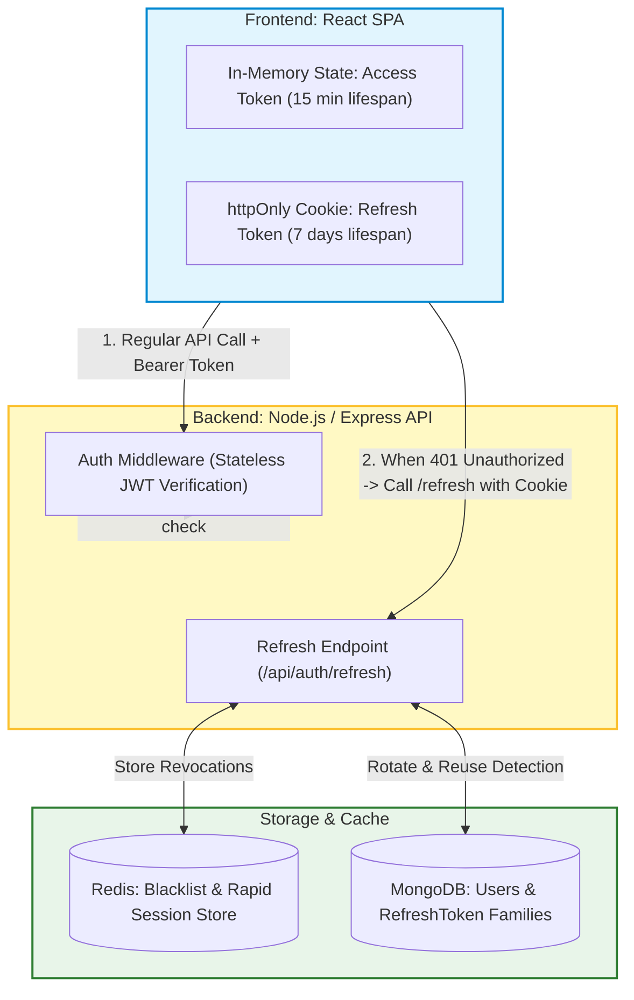
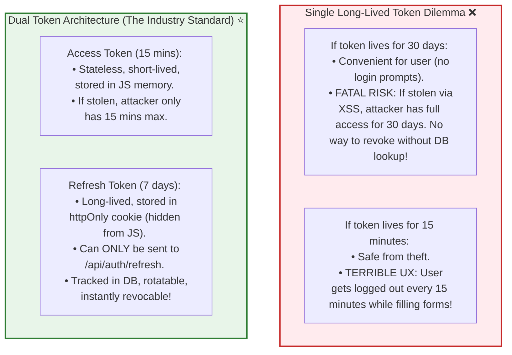
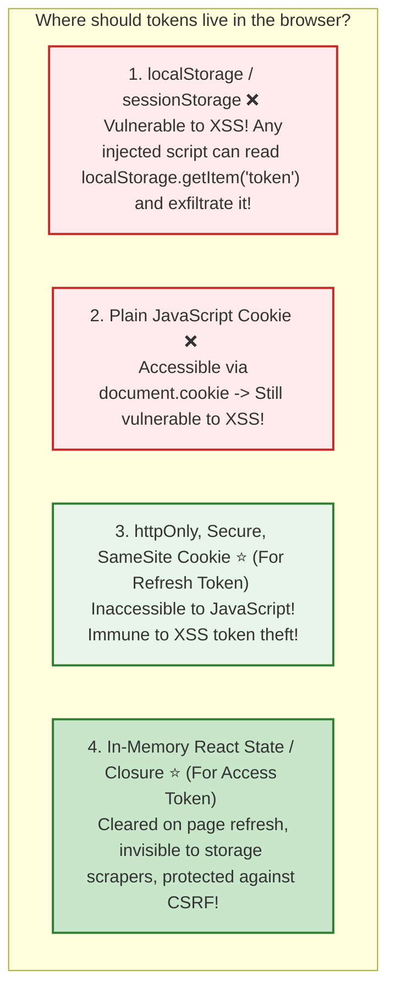
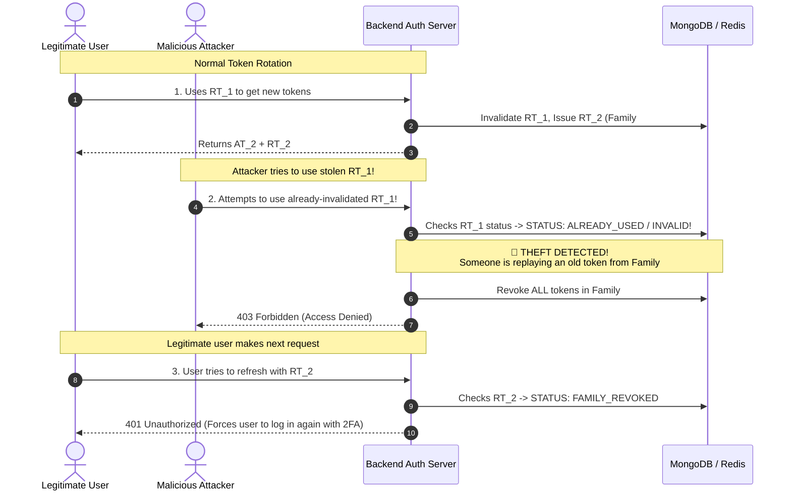
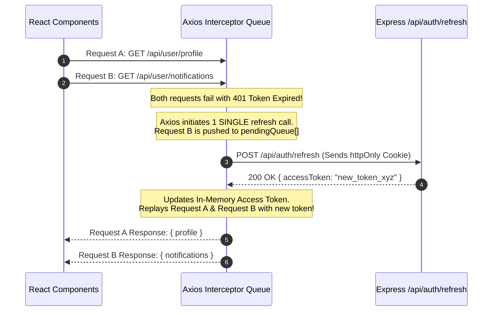
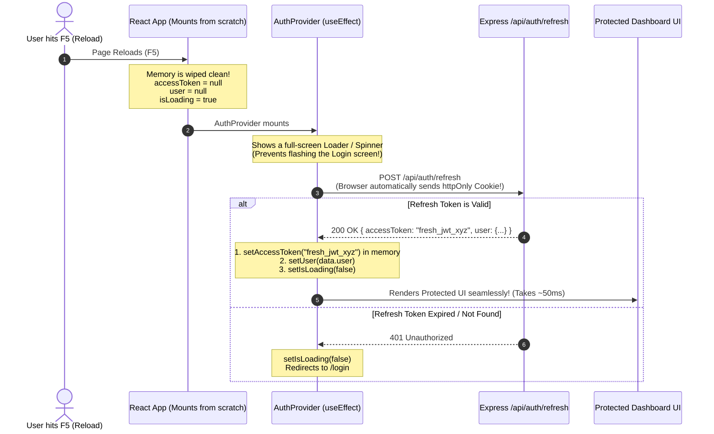

# 🏗️ Case Study: Access Token & Refresh Token Authentication System (MERN Stack)

## 📌 Overview

Authentication is the security backbone of modern web applications. 

In traditional monolithic web apps, authentication was handled using **Stateful Server Sessions** (storing session IDs in server memory/database and sending a session cookie). However, as applications scale horizontally across multiple server instances and microservices, stateful sessions create synchronization bottlenecks and high database load.

To solve this, modern applications use a **Hybrid Token-Based Architecture**:
1. **Access Token (Short-Lived & Stateless)**: A JSON Web Token (JWT) sent in the HTTP `Authorization` header to authenticate API requests with zero database lookups (< 1ms verification).
2. **Refresh Token (Long-Lived & Stateful / Rotated)**: Stored in a secure `httpOnly`, `Secure`, `SameSite=Strict` cookie, used exclusively to request a new Access Token when the old one expires.

In this deep-dive system design guide, we will design and implement a production-grade **Access Token & Refresh Token authentication system using the MERN stack** (MongoDB, Express.js, React, Node.js + Redis), covering **Refresh Token Rotation (RTR)**, **Reuse Detection (Theft Alert)**, **Silent Refresh with Axios Interceptors**, and **Instant Revocation**.



---

## 📋 Requirements

### Functional Requirements
1. **User Registration & Login**: Authenticate user credentials (email/password with `bcrypt`), returning an Access Token and setting a Refresh Token cookie.
2. **Stateless API Authentication**: Protect endpoints using short-lived Access Tokens (`Authorization: Bearer <token>`) verified cryptographically without database queries.
3. **Silent Token Refresh**: When the Access Token expires, the client transparently exchanges the Refresh Token for a new token pair without interrupting the user.
4. **Refresh Token Rotation (RTR)**: Every time a Refresh Token is used, it is invalidated and replaced with a brand-new Refresh Token.
5. **Token Reuse Detection (Theft Defense)**: If an old/compromised Refresh Token is used again, the backend detects a breach, invalidates the entire token family, and forces logout across all sessions.
6. **Single & Multi-Device Logout**:
   - Single Logout: Invalidate current device session.
   - Global Logout: Invalidate all active sessions for the user across all devices (e.g. after password reset).

### Non-Functional Requirements
1. **Ultra-Low Latency**: Access token verification must execute in $< 2\text{ms}$ in-process using public-key cryptography / HMAC.
2. **High Security & OWASP Compliance**: Immune to **XSS (Cross-Site Scripting)** and **CSRF (Cross-Site Request Forgery)** attacks.
3. **Horizontal Scalability**: Stateless verification allows 100+ backend instances to authenticate requests without centralized session lock contention.
4. **High Availability (99.99%)**: Refresh and authentication endpoints must be resilient to high peak login traffic.

---

## 📊 Capacity Estimation & Scale

Let's estimate for an enterprise web platform:
- **Total Registered Users**: 10 Million
- **Daily Active Users (DAU)**: 1 Million
- **Average API Requests per DAU**: 50 requests/day

```text
1. Traffic Estimation:
   - Total API Requests/Day = 1,000,000 * 50 = 50,000,000 req/day
   - Average QPS = 50,000,000 / 86,400 ≈ ~580 requests/sec
   - Peak QPS (3x average) = ~1,740 requests/sec

2. Token Generation & Refresh Load:
   - Access Token lifespan = 15 minutes
   - Active user session = 2 hours/day
   - Number of token refreshes per user session = 2 hours / 15 min = 8 refreshes/day
   - Total Refresh Requests/Day = 1,000,000 * 8 = 8,000,000 refresh req/day (~92 refresh QPS)

3. Storage Calculations (MongoDB & Redis):
   - Refresh Token Document Size:
     - userId (ObjectId): 12 bytes
     - tokenHash (SHA-256): 64 bytes
     - familyId (UUID): 36 bytes
     - userAgent & IP: ~150 bytes
     - dates & flags: ~30 bytes
     - Total record size ≈ ~300 bytes
   - 1M active users with avg 2 devices = 2,000,000 active refresh tokens
   - Active Storage = 2,000,000 * 300 bytes = ~600 MB (Easily fits in MongoDB memory!)
   - Redis Blacklist cache for revoked tokens: ~50 MB RAM
```

---

## 🧠 Core Concept: Access Token vs. Refresh Token

Why do we need two separate tokens instead of one?



### Detailed Token Comparison

| Property | Access Token | Refresh Token |
|---|---|---|
| **Lifespan** | 10 to 15 minutes | 7 to 30 days |
| **Storage Location** | Frontend In-Memory (React state / Axios variable) | `httpOnly`, `Secure`, `SameSite=Strict` Cookie |
| **Verification Method** | Stateless cryptographic signature check | Stateful check in Database / Redis + Cryptographic check |
| **Sent In** | HTTP Header (`Authorization: Bearer <token>`) | HTTP Cookie (`Cookie: refreshToken=...`) |
| **Payload Content** | User ID, Email, Role, Token Version | Token ID (`jti`), Family ID, User ID |
| **Scope of Access** | All protected resource APIs (`/api/orders`, `/api/profile`) | Exclusively the `/api/auth/refresh` & `/api/auth/logout` routes |

---

## 🛡️ Security Deep Dive: Where to Store Tokens?

One of the most debated topics in web development is **token storage on the client**:



### The Gold Standard Storage Strategy:
1. **Access Token** $\to$ Stored in **React Memory** (JavaScript variable inside an Auth Context / Axios closure).
   - *Why*: JavaScript in memory cannot be accessed via CSRF. If an attacker injects XSS, the access token is only valid for 15 minutes max.
2. **Refresh Token** $\to$ Stored in an **`httpOnly`, `Secure`, `SameSite=Strict` (or `Lax`) Cookie**.
   - *`httpOnly`*: `document.cookie` cannot read or modify the token in JavaScript.
   - *`Secure`*: Transmitted only over encrypted HTTPS connections.
   - *`SameSite=Strict`*: Browser will NOT attach the cookie to cross-origin requests, completely neutralizing **CSRF**!

---

## 🔄 Refresh Token Rotation (RTR) & Reuse Detection

### What is Refresh Token Rotation?
Every time the client calls `/api/auth/refresh`:
1. The server consumes and **invalidates** the current Refresh Token ($RT_1$).
2. The server generates a **brand-new token pair** ($AT_2$ + $RT_2$).
3. The server sends $RT_2$ in the `Set-Cookie` header.

### The Problem: Token Theft & The Solution: Reuse Detection
What if an attacker manages to intercept $RT_1$?



---

## 🏗️ System Architecture & Workflow Diagrams

### 1. Complete Login Flow

```mermaid
sequenceDiagram
    autonumber
    actor Client as React Web App
    participant API as Express.js Auth Server
    participant DB as MongoDB
    
    Client->>API: POST /api/auth/login { email, password }
    API->>DB: Find User by email
    API->>API: Verify password with bcrypt.compare()
    API->>API: Generate Access Token (15m, HMAC SHA-256)
    API->>API: Generate Refresh Token & Family ID (UUID)
    API->>DB: Save hashed Refresh Token (Family ID, expiresAt, device info)
    API-->>Client: HTTP 200 OK <br> Body: { accessToken, user } <br> Set-Cookie: refreshToken=...; HttpOnly; Secure; SameSite=Strict
    Client->>Client: Stores accessToken in React Memory State
```

---

### 2. Protected Resource Request Flow

```mermaid
sequenceDiagram
    autonumber
    actor Client as React Web App
    participant Middleware as Express verifyToken Middleware
    participant Controller as Protected Controller (/api/orders)
    
    Client->>Middleware: GET /api/orders <br> Headers: Authorization: Bearer <accessToken>
    Note over Middleware: 1. jwt.verify(token, ACCESS_SECRET) <br> 2. Check expiration & signature (In-Memory < 1ms)
    alt Token Valid
        Middleware->>Controller: req.user = decodedToken; next()
        Controller-->>Client: 200 OK { orders: [...] }
    else Token Expired (15 mins passed)
        Middleware-->>Client: 401 Unauthorized { code: "TOKEN_EXPIRED" }
    end
```

---

### 3. Silent Refresh with Concurrency Queue Flow (Axios Interceptor)

When multiple API requests trigger simultaneously on a page while the Access Token is expired, we must avoid firing 5 separate refresh requests. We queue subsequent requests and resolve them once the single refresh completes:



---

## 🗄️ Database Schema Design (MongoDB & Mongoose)

### 1. `User.model.ts`
```typescript
import mongoose, { Schema, Document } from "mongoose";

export interface IUser extends Document {
  email: string;
  passwordHash: string;
  name: string;
  role: "user" | "admin" | "manager";
  tokenVersion: number; // Incrementing this invalidates all tokens globally!
  createdAt: Date;
  updatedAt: Date;
}

const UserSchema = new Schema<IUser>(
  {
    email: { type: String, required: true, unique: true, lowercase: true, trim: true, index: true },
    passwordHash: { type: String, required: true },
    name: { type: String, required: true },
    role: { type: String, enum: ["user", "admin", "manager"], default: "user" },
    tokenVersion: { type: Number, default: 0 }, // Global invalidation counter
  },
  { timestamps: true }
);

export const User = mongoose.model<IUser>("User", UserSchema);
```

### 2. `RefreshToken.model.ts`
```typescript
import mongoose, { Schema, Document } from "mongoose";

export interface IRefreshToken extends Document {
  userId: mongoose.Types.ObjectId;
  tokenHash: string; // SHA-256 hash of refresh token (never store raw tokens!)
  familyId: string; // UUID grouping rotated tokens together for reuse detection
  isRevoked: boolean;
  userAgent?: string;
  ipAddress?: string;
  expiresAt: Date;
  createdAt: Date;
}

const RefreshTokenSchema = new Schema<IRefreshToken>(
  {
    userId: { type: Schema.Types.ObjectId, ref: "User", required: true, index: true },
    tokenHash: { type: String, required: true, index: true },
    familyId: { type: String, required: true, index: true }, // Groups token rotation chain
    isRevoked: { type: Boolean, default: false },
    userAgent: { type: String },
    ipAddress: { type: String },
    expiresAt: { type: Date, required: true, index: { expires: 0 } }, // MongoDB TTL Index: auto-deletes expired docs!
  },
  { timestamps: true }
);

// Compound index for lightning-fast token lookup
RefreshTokenSchema.index({ tokenHash: 1, isRevoked: 1 });

export const RefreshToken = mongoose.model<IRefreshToken>("RefreshToken", RefreshTokenSchema);
```

---

## 💻 Full Backend Implementation (Node.js & Express)

### 1. Token Generation Utility (`jwt.utils.ts`)

```typescript
import jwt from "jsonwebtoken";
import crypto from "crypto";

const ACCESS_TOKEN_SECRET = process.env.ACCESS_TOKEN_SECRET || "access_secret_super_secure_key_123";
const REFRESH_TOKEN_SECRET = process.env.REFRESH_TOKEN_SECRET || "refresh_secret_super_secure_key_456";

export interface AccessTokenPayload {
  userId: string;
  email: string;
  role: string;
  tokenVersion: number;
}

export interface RefreshTokenPayload {
  userId: string;
  familyId: string;
  jti: string; // Unique JWT Token ID
}

// Generate Short-Lived Access Token (15 Minutes)
export function signAccessToken(payload: AccessTokenPayload): string {
  return jwt.sign(payload, ACCESS_TOKEN_SECRET, {
    expiresIn: "15m",
    algorithm: "HS256",
  });
}

// Generate Long-Lived Refresh Token (7 Days)
export function signRefreshToken(payload: RefreshTokenPayload): string {
  return jwt.sign(payload, REFRESH_TOKEN_SECRET, {
    expiresIn: "7d",
    algorithm: "HS256",
  });
}

// Verify Access Token
export function verifyAccessToken(token: string): AccessTokenPayload {
  return jwt.verify(token, ACCESS_TOKEN_SECRET) as AccessTokenPayload;
}

// Verify Refresh Token
export function verifyRefreshToken(token: string): RefreshTokenPayload {
  return jwt.verify(token, REFRESH_TOKEN_SECRET) as RefreshTokenPayload;
}

// SHA-256 Hash helper (for storing hashed refresh tokens in MongoDB)
export function hashToken(token: string): string {
  return crypto.createHash("sha256").update(token).digest("hex");
}
```

---

### 2. Authentication Controller with Rotation & Reuse Detection (`auth.controller.ts`)

```typescript
import { Request, Response } from "express";
import bcrypt from "bcrypt";
import crypto from "crypto";
import { User } from "./User.model";
import { RefreshToken } from "./RefreshToken.model";
import {
  signAccessToken,
  signRefreshToken,
  verifyRefreshToken,
  hashToken,
} from "./jwt.utils";

const COOKIE_NAME = "refreshToken";

// Helper to set secure httpOnly cookie
function setRefreshTokenCookie(res: Response, token: string) {
  res.cookie(COOKIE_NAME, token, {
    httpOnly: true, // Prevents XSS access
    secure: process.env.NODE_ENV === "production", // HTTPS only in production
    sameSite: "strict", // Strict CSRF defense
    maxAge: 7 * 24 * 60 * 60 * 1000, // 7 days in milliseconds
    path: "/api/auth", // Restricted only to auth endpoints!
  });
}

// 1. User Registration
export async function register(req: Request, res: Response) {
  const { email, password, name } = req.body;
  
  const existing = await User.findOne({ email });
  if (existing) {
    return res.status(409).json({ error: "Email already registered." });
  }

  const salt = await bcrypt.genSalt(12);
  const passwordHash = await bcrypt.hash(password, salt);

  const user = await User.create({ email, passwordHash, name });
  return res.status(201).json({ message: "User registered successfully", userId: user._id });
}

// 2. User Login
export async function login(req: Request, res: Response) {
  const { email, password } = req.body;
  const user = await User.findOne({ email });

  if (!user || !(await bcrypt.compare(password, user.passwordHash))) {
    return res.status(401).json({ error: "Invalid email or password." });
  }

  // Create Family ID for this login session
  const familyId = crypto.randomUUID();
  const jti = crypto.randomUUID();

  // Generate tokens
  const accessToken = signAccessToken({
    userId: user._id.toString(),
    email: user.email,
    role: user.role,
    tokenVersion: user.tokenVersion,
  });

  const refreshToken = signRefreshToken({
    userId: user._id.toString(),
    familyId,
    jti,
  });

  // Save hashed Refresh Token to DB
  await RefreshToken.create({
    userId: user._id,
    tokenHash: hashToken(refreshToken),
    familyId,
    isRevoked: false,
    userAgent: req.headers["user-agent"],
    ipAddress: req.ip,
    expiresAt: new Date(Date.now() + 7 * 24 * 60 * 60 * 1000),
  });

  // Send tokens
  setRefreshTokenCookie(res, refreshToken);
  return res.json({
    accessToken,
    user: { id: user._id, email: user.email, name: user.name, role: user.role },
  });
}

// 3. Token Refresh with Rotation and Reuse Detection (THE CRITICAL ENGINE)
export async function refreshTokens(req: Request, res: Response) {
  const incomingRefreshToken = req.cookies[COOKIE_NAME];

  if (!incomingRefreshToken) {
    return res.status(401).json({ error: "No refresh token provided." });
  }

  let decoded;
  try {
    decoded = verifyRefreshToken(incomingRefreshToken);
  } catch (err) {
    return res.status(401).json({ error: "Invalid or expired refresh token." });
  }

  const incomingHash = hashToken(incomingRefreshToken);
  const tokenDoc = await RefreshToken.findOne({ tokenHash: incomingHash });

  // 🚨 REUSE DETECTION CHECK:
  // If the token is not found OR it has already been marked as revoked/used:
  if (!tokenDoc || tokenDoc.isRevoked) {
    console.warn(`🚨 [SECURITY ALERT] Refresh token reuse detected for Family ID: ${decoded.familyId}`);
    
    // Compromise detected! Revoke ALL tokens in this family immediately!
    await RefreshToken.updateMany({ familyId: decoded.familyId }, { isRevoked: true });
    
    res.clearCookie(COOKIE_NAME, { path: "/api/auth" });
    return res.status(403).json({ error: "Security breach detected. All sessions terminated. Please log in again." });
  }

  // Token is valid! Invalidate the old token (Rotate)
  tokenDoc.isRevoked = true;
  await tokenDoc.save();

  // Check if User tokenVersion matches (handles global invalidation)
  const user = await User.findById(decoded.userId);
  if (!user) {
    return res.status(401).json({ error: "User no longer exists." });
  }

  // Generate NEW Token Pair (Preserving the same familyId)
  const newJti = crypto.randomUUID();
  const newAccessToken = signAccessToken({
    userId: user._id.toString(),
    email: user.email,
    role: user.role,
    tokenVersion: user.tokenVersion,
  });

  const newRefreshToken = signRefreshToken({
    userId: user._id.toString(),
    familyId: decoded.familyId, // Same family chain
    jti: newJti,
  });

  // Save new rotated token in database
  await RefreshToken.create({
    userId: user._id,
    tokenHash: hashToken(newRefreshToken),
    familyId: decoded.familyId,
    isRevoked: false,
    userAgent: req.headers["user-agent"],
    ipAddress: req.ip,
    expiresAt: new Date(Date.now() + 7 * 24 * 60 * 60 * 1000),
  });

  setRefreshTokenCookie(res, newRefreshToken);
  return res.json({ accessToken: newAccessToken });
}

// 4. Logout (Current Device)
export async function logout(req: Request, res: Response) {
  const incomingRefreshToken = req.cookies[COOKIE_NAME];
  if (incomingRefreshToken) {
    const incomingHash = hashToken(incomingRefreshToken);
    await RefreshToken.updateOne({ tokenHash: incomingHash }, { isRevoked: true });
  }
  res.clearCookie(COOKIE_NAME, { path: "/api/auth" });
  return res.json({ message: "Logged out successfully." });
}

// 5. Global Logout (All Devices - e.g. after password reset)
export async function logoutAllDevices(req: Request, res: Response) {
  const userId = (req as any).user.userId;

  // Increment user tokenVersion -> immediately invalidates all active Access Tokens
  await User.findByIdAndUpdate(userId, { $inc: { tokenVersion: 1 } });

  // Revoke all refresh tokens in DB
  await RefreshToken.updateMany({ userId }, { isRevoked: true });

  res.clearCookie(COOKIE_NAME, { path: "/api/auth" });
  return res.json({ message: "Logged out from all devices successfully." });
}
```

---

### 3. Authentication Middleware (`auth.middleware.ts`)

```typescript
import { Request, Response, NextFunction } from "express";
import { verifyAccessToken } from "./jwt.utils";

export interface AuthenticatedRequest extends Request {
  user?: {
    userId: string;
    email: string;
    role: string;
    tokenVersion: number;
  };
}

export function requireAuth(req: AuthenticatedRequest, res: Response, next: NextFunction) {
  const authHeader = req.headers.authorization;

  if (!authHeader || !authHeader.startsWith("Bearer ")) {
    return res.status(401).json({ error: "Access token missing or malformed." });
  }

  const token = authHeader.split(" ")[1];

  try {
    // ⚡ Stateless in-memory signature & expiration verification (< 1ms)
    const payload = verifyAccessToken(token);
    req.user = payload;
    return next();
  } catch (err: any) {
    if (err.name === "TokenExpiredError") {
      return res.status(401).json({ error: "TOKEN_EXPIRED", message: "Access token expired. Refresh required." });
    }
    return res.status(403).json({ error: "Invalid access token." });
  }
}
```

---

## 💻 Full Frontend Implementation (React & Axios)

### 1. Axios Instance with Silent Refresh Queue Interceptor (`apiClient.ts`)

This is the most critical frontend piece: handling 401 errors seamlessly and queuing concurrent requests during refresh without logging the user out.

```typescript
import axios, { AxiosError, InternalAxiosRequestConfig } from "axios";

let inMemoryAccessToken: string | null = null;

// Getter and Setter for In-Memory Token
export const setAccessToken = (token: string | null) => {
  inMemoryAccessToken = token;
};

export const getAccessToken = () => inMemoryAccessToken;

export const apiClient = axios.create({
  baseURL: "http://localhost:5000/api",
  withCredentials: true, // Crucial: enables sending httpOnly cookies!
});

// 1. Request Interceptor: Attach in-memory token to outgoing requests
apiClient.interceptors.request.use((config: InternalAxiosRequestConfig) => {
  if (inMemoryAccessToken && config.headers) {
    config.headers.Authorization = `Bearer ${inMemoryAccessToken}`;
  }
  return config;
});

// State for Queueing concurrent requests during token refresh
let isRefreshing = false;
let failedQueue: Array<{
  resolve: (token: string) => void;
  reject: (error: any) => void;
}> = [];

const processQueue = (error: any, token: string | null = null) => {
  failedQueue.forEach((prom) => {
    if (error) {
      prom.reject(error);
    } else if (token) {
      prom.resolve(token);
    }
  });
  failedQueue = [];
};

// 2. Response Interceptor: Catch 401s and trigger silent refresh
apiClient.interceptors.response.use(
  (response) => response,
  async (error: AxiosError) => {
    const originalRequest = error.config as InternalAxiosRequestConfig & { _retry?: boolean };

    // If error is not 401 or request was already retried, fail immediately
    if (error.response?.status !== 401 || originalRequest._retry) {
      return Promise.reject(error);
    }

    // If a refresh is already in progress, queue this request!
    if (isRefreshing) {
      return new Promise<string>((resolve, reject) => {
        failedQueue.push({ resolve, reject });
      })
        .then((token) => {
          originalRequest.headers.Authorization = `Bearer ${token}`;
          return apiClient(originalRequest);
        })
        .catch((err) => Promise.reject(err));
    }

    originalRequest._retry = true;
    isRefreshing = true;

    try {
      // Call refresh endpoint (browser automatically attaches httpOnly cookie)
      const { data } = await axios.post(
        "http://localhost:5000/api/auth/refresh",
        {},
        { withCredentials: true }
      );

      const newAccessToken = data.accessToken;
      setAccessToken(newAccessToken);

      // Resolve all queued requests with the new token
      processQueue(null, newAccessToken);

      // Re-run original failed request with new token
      originalRequest.headers.Authorization = `Bearer ${newAccessToken}`;
      return apiClient(originalRequest);
    } catch (refreshError) {
      processQueue(refreshError, null);
      setAccessToken(null);
      // Redirect to login or emit logout event
      window.location.href = "/login";
      return Promise.reject(refreshError);
    } finally {
      isRefreshing = false;
    }
  }
);
```

---

### 2. React Authentication Context (`AuthContext.tsx`)

```tsx
import React, { createContext, useContext, useState, useEffect } from "react";
import { apiClient, setAccessToken } from "./apiClient";

interface User {
  id: string;
  email: string;
  name: string;
  role: string;
}

interface AuthContextType {
  user: User | null;
  login: (email: string, password: string) => Promise<void>;
  logout: () => Promise<void>;
  isLoading: boolean;
}

const AuthContext = createContext<AuthContextType | null>(null);

export const AuthProvider: React.FC<{ children: React.ReactNode }> = ({ children }) => {
  const [user, setUser] = useState<User | null>(null);
  const [isLoading, setIsLoading] = useState(true);

  // On initial page load: attempt silent refresh to restore session
  useEffect(() => {
    const initializeAuth = async () => {
      try {
        const { data } = await apiClient.post("/auth/refresh");
        setAccessToken(data.accessToken);
        // Fetch current user profile
        const profileRes = await apiClient.get("/user/me");
        setUser(profileRes.data.user);
      } catch (err) {
        setAccessToken(null);
        setUser(null);
      } finally {
        setIsLoading(false);
      }
    };

    initializeAuth();
  }, []);

  const login = async (email: string, password: string) => {
    const { data } = await apiClient.post("/auth/login", { email, password });
    setAccessToken(data.accessToken);
    setUser(data.user);
  };

  const logout = async () => {
    try {
      await apiClient.post("/auth/logout");
    } finally {
      setAccessToken(null);
      setUser(null);
      window.location.href = "/login";
    }
  };

  return (
    <AuthContext.Provider value={{ user, login, logout, isLoading }}>
      {children}
    </AuthContext.Provider>
  );
};

export const useAuth = () => {
  const context = useContext(AuthContext);
  if (!context) throw new Error("useAuth must be used within an AuthProvider");
  return context;
};
```

---

## ⚡ Production Edge Cases & Solutions

### 1. The Concurrency Race Condition during Page Load
- **Scenario**: When a user opens a dashboard page, React makes 6 parallel API requests (`/profile`, `/orders`, `/notifications`, `/stats`). If the access token is expired, all 6 requests return `401`.
- **Bug without Queue**: The client fires 6 parallel `/refresh` calls. Because of Token Rotation, the 1st refresh invalidates the token, and calls 2–6 are treated as **Token Reuse Attacks**, logging the user out!
- **Solution**: The **Axios Failed Queue** pattern (implemented above) ensures that only the 1st request initiates `/refresh`, while requests 2–6 wait in an in-memory Promise queue and replay once the single new token arrives.

### 2. Immediate Token Invalidation (Instant Blacklisting with Redis)
- **Problem**: Access Tokens are stateless. If an admin bans a malicious user or changes permissions, their Access Token is still valid for up to 15 minutes!
- **Solution 1 (Fast & Simple)**: Increment `user.tokenVersion` in database on ban. When access tokens are issued, include `tokenVersion`. Middleware periodically checks `tokenVersion` or checks on high-risk operations (e.g. changing passwords or making wire transfers).
- **Solution 2 (Instant Redis Blacklist)**: When logging out or banning, store the token's `jti` (JWT ID) in Redis with a TTL equal to the token's remaining lifespan (`EX = 900s`). Auth middleware checks `redis.exists("blacklist:" + jti)` in < 1ms.

```typescript
// Instant Revocation via Redis Blacklist
export async function revokeAccessToken(jti: string, remainingSeconds: number) {
  await redis.set(`bl:${jti}`, "1", "EX", remainingSeconds);
}

// In Auth Middleware:
const isBlacklisted = await redis.exists(`bl:${decoded.jti}`);
if (isBlacklisted) {
  return res.status(401).json({ error: "Token has been revoked." });
}
```

---

### 3. What Happens on Page Reload (F5)? (Silent Session Bootstrap)

When a user refreshes the page (F5), the entire browser JavaScript memory is cleared. All in-memory variables (`useState()`, Redux, and Axios closures) reset to their initial state:
- `inMemoryAccessToken = null`
- `user = null`
- `isLoading = true`

#### ❓ Why doesn't the user get logged out?
Because the **Refresh Token is NOT stored in JavaScript memory**—it is safely preserved in the browser's **`httpOnly` Cookie**, which survives page reloads, tab closes, and browser restarts.

#### The Page Reload Lifecycle:



#### Storage Strategy Comparison:

| Scenario / Attack | Stored in `localStorage` | Stored in React Memory + `httpOnly` Cookie ⭐ |
|---|---|---|
| **Page Reload (F5)** | Instant (reads string from disk). | Takes ~50ms via silent `/refresh` call (seamless with a spinner). |
| **XSS Attack (Malicious Script)** | 🚨 **CRITICAL VULNERABILITY**: `localStorage.getItem('token')` steals the 30-day token instantly. | 🛡️ **SAFE**: Injected scripts cannot touch the `httpOnly` cookie; access token in memory expires in 15 mins. |
| **CSRF Attack (Cross-Site Request)** | Immune (unless script reads it). | 🛡️ **SAFE**: `SameSite=Strict` prevents the cookie from being sent on cross-origin requests. |
| **Token Revocability** | Cannot revoke stateless token. | Fully revocable on server during the next silent refresh call. |

---

## 🎤 Interview Perspective & High-Yield Questions

### Q1: Why is storing JWTs in `localStorage` considered a security vulnerability?
- **Answer**: `localStorage` is completely accessible to any JavaScript running on the page. If your application has a Cross-Site Scripting (XSS) vulnerability (via a third-party npm package, user comment injection, or unsanitized DOM rendering), an attacker can execute `localStorage.getItem("token")` and exfiltrate the token to their server. Storing the refresh token in an `httpOnly` cookie makes it invisible to JavaScript.

### Q2: How does Refresh Token Rotation (RTR) protect against token theft?
- **Answer**: In RTR, every refresh token can only be used once. When a token is used, it is invalidated and replaced. If an attacker steals a refresh token and uses it *after* the legitimate user has already refreshed, the server detects that an already-used token was submitted. The server flags this as a theft event, invalidates the entire token family, and terminates all active sessions for that user.

### Q3: What is the trade-off between Symmetric (HS256) and Asymmetric (RS256) JWT signing in Microservices?
- **Answer**:
  - **HS256 (Symmetric)**: Uses the exact same secret key to sign and verify tokens. It is faster to compute, but every microservice that needs to verify tokens must possess the secret key. If one service is compromised, the attacker can forge tokens for all services.
  - **RS256 (Asymmetric)**: The Auth Service signs tokens using a **Private Key**, while all downstream microservices verify tokens using the public key (e.g. via a JWKS endpoint). Microservices can verify tokens without having the ability to forge them.

---

## 🏁 Summary Checklist

- [x] **Access Token**: Short-lived (15 min), stateless, stored in React memory.
- [x] **Refresh Token**: Long-lived (7 days), stateful, stored in `httpOnly`, `Secure`, `SameSite=Strict` cookie.
- [x] **Rotation (RTR)**: Each refresh generates a new token pair and invalidates the previous token.
- [x] **Reuse Detection**: Detects replayed tokens, invalidates the entire token family, and forces re-authentication.
- [x] **Concurrency Queue**: Axios response interceptor prevents duplicate refresh calls on parallel 401s.
- [x] **Global Revocation**: `tokenVersion` counter in MongoDB or Redis JTI Blacklist allows instant global logout.

### Navigation
**Prev:** [08_Design_Google_Drive.md](08_Design_Google_Drive.md) | **Index:** [00_Index.md](00_Index.md) | **Next:** [10_Design_Role_Based_Access_Control_RBAC.md](10_Design_Role_Based_Access_Control_RBAC.md)
