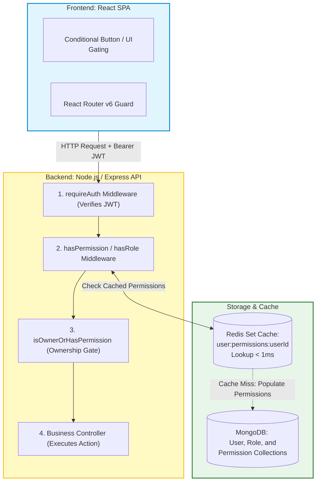
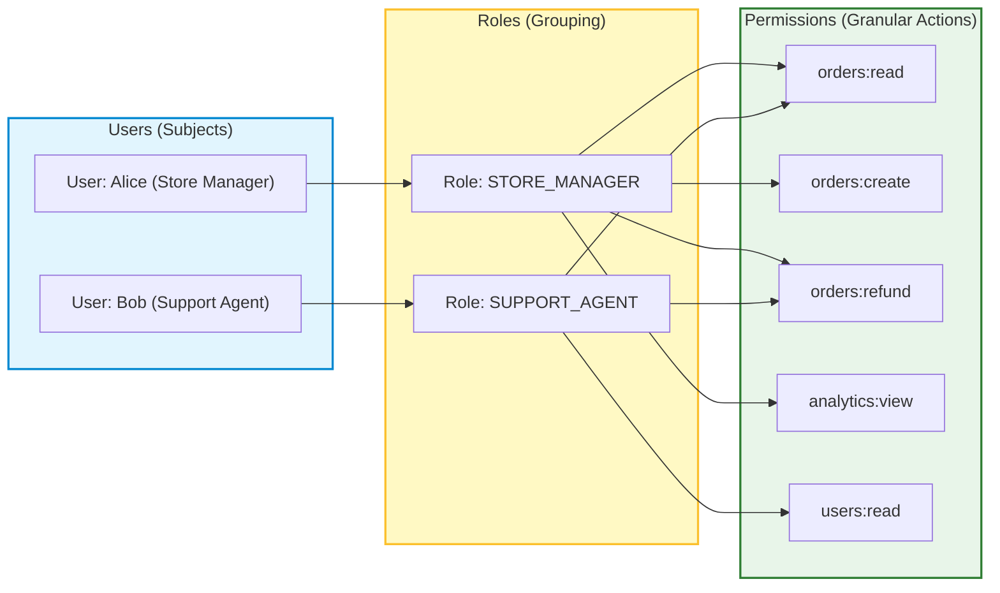
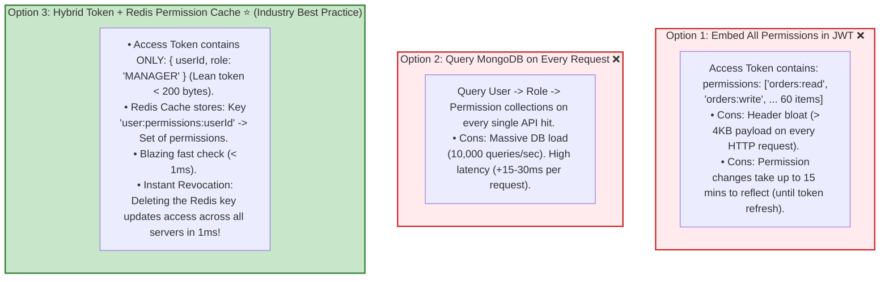

# 🏗️ Case Study: Role-Based Access Control (RBAC) & Permissions System (MERN Stack)

## 📌 Overview

While **Authentication (AuthN)** answers *"Who are you?"*, **Authorization (AuthZ)** answers *"What are you allowed to do?"*.

In modern web applications, authorization must be **granular, scalable, dynamic, and enforceable at both the backend API and frontend UI levels**. 

A naive authorization model hardcodes roles directly in the code (e.g. `if (user.role === 'admin')`). As an application grows, this approach breaks down when business requirements demand custom roles (e.g., `SUPPORT_TIER_2`, `BILLING_ADMIN`, `CONTENT_MODERATOR`, `REGIONAL_MANAGER`).

In this deep-dive system design guide, we will design and implement a production-grade **Role-Based Access Control (RBAC) and Granular Permission System using the MERN stack** (MongoDB, Express.js, React, Node.js + Redis), featuring:
1. **Dynamic Roles & Granular Permissions** stored in MongoDB.
2. **Sub-millisecond Authorization** via a **Redis Permission Cache**.
3. **Instant Permission Invalidation** on role updates.
4. **Attribute-Based Access Control (ABAC) Ownership Policies** (e.g., *“Users can edit their own profile OR an admin can edit any profile”*).
5. **Declarative Frontend Gating** using React `<Can>`, `<ProtectedRoute>`, and `useCan()` hooks.



---

## 📋 Requirements

### Functional Requirements
1. **Granular Permissions (Actions)**: Define specific system capabilities (e.g. `users:read`, `users:write`, `orders:refund`, `billing:export`, `settings:manage`).
2. **Dynamic Roles**: Create and manage roles that group permissions together (e.g. `ADMIN`, `STORE_MANAGER`, `SUPPORT_AGENT`, `AUDITOR`).
3. **Multi-Role Assignment**: Users can be assigned one or multiple roles.
4. **Instant Revocation**: If an admin removes a permission from a role, all users with that role immediately lose access without waiting for token expiration.
5. **Ownership & ABAC Policies**: Support rules where users can manipulate their own resources without having global administrative privileges.
6. **Declarative UI Gating**: Hide or disable UI elements (buttons, sidebars, forms) and guard routes based on user roles and permissions.

### Non-Functional Requirements
1. **Ultra-Low Latency**: Permission checks in API middleware must execute in $< 2\text{ms}$ (using Redis caching).
2. **Zero Header Bloat**: Keep JWT access tokens lean by avoiding storing 50+ permissions inside the token payload.
3. **Auditability**: All role and permission modifications must be traceable.
4. **Least Privilege Principle**: By default, all endpoints deny access unless explicitly granted.

---

## 🧠 Core Architecture: The RBAC Hierarchy



### Key Terminology

| Component | Definition | Example |
|---|---|---|
| **Subject (User)** | The identity attempting to perform an action. | `userId: "64e9a1b2..."` |
| **Permission** | A discrete capability formatted as `<module>:<action>`. | `orders:refund`, `users:delete` |
| **Role** | A named collection of permissions representing a job function. | `FINANCE_ADMIN`, `SUPPORT_TIER_1` |
| **Resource** | The entity being acted upon. | `Order #1092`, `UserProfile #45` |
| **Policy (ABAC)** | Dynamic conditional rule evaluating context/ownership. | `isOwner || hasPermission('users:write')` |

---

## 🛡️ Architectural Trade-off: Where to Store Permissions?



---

## 🗄️ Database Schema Design (MongoDB & Mongoose)

### 1. `Permission.model.ts`
```typescript
import mongoose, { Schema, Document } from "mongoose";

export interface IPermission extends Document {
  name: string; // Unique action name (e.g., 'orders:refund', 'users:delete')
  description: string;
  module: string; // Grouping (e.g., 'orders', 'users', 'billing')
  createdAt: Date;
}

const PermissionSchema = new Schema<IPermission>(
  {
    name: { type: String, required: true, unique: true, index: true, lowercase: true, trim: true },
    description: { type: String, required: true },
    module: { type: String, required: true, index: true, lowercase: true },
  },
  { timestamps: true }
);

export const Permission = mongoose.model<IPermission>("Permission", PermissionSchema);
```

### 2. `Role.model.ts`
```typescript
import mongoose, { Schema, Document } from "mongoose";

export interface IRole extends Document {
  name: string; // Unique role name (e.g., 'ADMIN', 'STORE_MANAGER')
  description: string;
  permissions: mongoose.Types.ObjectId[];
  isSystemRole: boolean; // Protects built-in roles like SUPER_ADMIN from deletion
  createdAt: Date;
}

const RoleSchema = new Schema<IRole>(
  {
    name: { type: String, required: true, unique: true, uppercase: true, trim: true },
    description: { type: String },
    permissions: [{ type: Schema.Types.ObjectId, ref: "Permission", index: true }],
    isSystemRole: { type: Boolean, default: false },
  },
  { timestamps: true }
);

export const Role = mongoose.model<IRole>("Role", RoleSchema);
```

### 3. `User.model.ts`
```typescript
import mongoose, { Schema, Document } from "mongoose";

export interface IUser extends Document {
  email: string;
  passwordHash: string;
  name: string;
  roles: mongoose.Types.ObjectId[]; // Multi-role support
  tokenVersion: number;
  createdAt: Date;
  updatedAt: Date;
}

const UserSchema = new Schema<IUser>(
  {
    email: { type: String, required: true, unique: true, lowercase: true, trim: true, index: true },
    passwordHash: { type: String, required: true },
    name: { type: String, required: true },
    roles: [{ type: Schema.Types.ObjectId, ref: "Role", index: true }],
    tokenVersion: { type: Number, default: 0 },
  },
  { timestamps: true }
);

export const User = mongoose.model<IUser>("User", UserSchema);
```

---

## 💻 Backend Implementation (Node.js & Express)

### 1. Redis Permission Cache Helper (`rbac.cache.ts`)

```typescript
import { redis } from "./redis"; // ioredis client
import { User } from "./User.model";

const PERM_CACHE_PREFIX = "user:permissions:";
const CACHE_TTL_SECONDS = 3600; // 1 Hour

// 1. Get user permissions from Redis cache (or fallback to MongoDB)
export async function getUserPermissions(userId: string): Promise<string[]> {
  const cacheKey = `${PERM_CACHE_PREFIX}${userId}`;

  // Step A: Fast Redis Set lookup (< 1ms)
  let cachedPermissions = await redis.smembers(cacheKey);
  if (cachedPermissions && cachedPermissions.length > 0) {
    return cachedPermissions;
  }

  // Step B: Cache Miss -> Load from MongoDB with populated roles & permissions
  const user = await User.findById(userId).populate({
    path: "roles",
    populate: { path: "permissions", select: "name" },
  });

  if (!user) return [];

  const permissionsSet = new Set<string>();
  (user as any).roles?.forEach((role: any) => {
    role.permissions?.forEach((perm: any) => {
      if (perm.name) permissionsSet.add(perm.name);
    });
  });

  const permissionsArray = Array.from(permissionsSet);

  // Step C: Save to Redis Set with 1-hour TTL
  if (permissionsArray.length > 0) {
    await redis.sadd(cacheKey, ...permissionsArray);
    await redis.expire(cacheKey, CACHE_TTL_SECONDS);
  }

  return permissionsArray;
}

// 2. Instant Invalidation: Call this whenever a role's permissions or a user's role is updated!
export async function invalidateUserPermissions(userId: string): Promise<void> {
  await redis.del(`${PERM_CACHE_PREFIX}${userId}`);
}

// 3. Invalidate ALL users having a specific role (e.g. after editing 'STORE_MANAGER' role)
export async function invalidateRolePermissions(roleId: string): Promise<void> {
  const usersWithRole = await User.find({ roles: roleId }).select("_id");
  if (usersWithRole.length === 0) return;

  const pipeline = redis.pipeline();
  usersWithRole.forEach((u) => {
    pipeline.del(`${PERM_CACHE_PREFIX}${u._id.toString()}`);
  });
  await pipeline.exec();
}
```

---

### 2. Express Authorization Middlewares (`rbac.middleware.ts`)

```typescript
import { Response, NextFunction } from "express";
import { AuthenticatedRequest } from "./auth.middleware";
import { getUserPermissions } from "./rbac.cache";

// 1. Role-Based Gate (Checks high-level roles)
export function hasRole(...allowedRoles: string[]) {
  return (req: AuthenticatedRequest, res: Response, next: NextFunction) => {
    if (!req.user) {
      return res.status(401).json({ error: "Authentication required." });
    }

    const userRole = (req.user.role || "").toUpperCase();
    if (userRole === "SUPER_ADMIN" || allowedRoles.map((r) => r.toUpperCase()).includes(userRole)) {
      return next();
    }

    return res.status(403).json({
      error: "FORBIDDEN_ROLE",
      message: `Access denied. Requires one of the following roles: [${allowedRoles.join(", ")}]`,
    });
  };
}

// 2. Granular Permission-Based Gate (Sub-millisecond via Redis)
export function hasPermission(...requiredPermissions: string[]) {
  return async (req: AuthenticatedRequest, res: Response, next: NextFunction) => {
    if (!req.user) {
      return res.status(401).json({ error: "Authentication required." });
    }

    // Super Admin bypasses all checks
    if (req.user.role === "SUPER_ADMIN") {
      return next();
    }

    try {
      const userPermissions = await getUserPermissions(req.user.userId);

      // Check if user has ALL required permissions
      const hasAll = requiredPermissions.every((p) => userPermissions.includes(p));

      if (!hasAll) {
        return res.status(403).json({
          error: "INSUFFICIENT_PERMISSIONS",
          message: `Access denied. Missing required permissions: [${requiredPermissions.join(", ")}]`,
        });
      }

      req.user.permissions = userPermissions;
      return next();
    } catch (err) {
      console.error("RBAC Middleware Error:", err);
      return res.status(500).json({ error: "Authorization service error." });
    }
  };
}

// 3. Attribute-Based / Ownership Authorization (ABAC Policy Gate)
// Example: A user can edit their own profile, OR an admin with 'users:write' can edit any profile
export function isOwnerOrHasPermission(
  resourceOwnerIdGetter: (req: AuthenticatedRequest) => string,
  fallbackPermission: string
) {
  return async (req: AuthenticatedRequest, res: Response, next: NextFunction) => {
    if (!req.user) {
      return res.status(401).json({ error: "Authentication required." });
    }

    const ownerId = resourceOwnerIdGetter(req);

    // Rule 1: The user is the owner of the resource
    if (req.user.userId === ownerId) {
      return next();
    }

    // Rule 2: Fallback to checking granular admin permission
    return hasPermission(fallbackPermission)(req, res, next);
  };
}
```

---

### 3. Route Protection in Express (`order.routes.ts`)

```typescript
import { Router } from "express";
import { requireAuth } from "./auth.middleware";
import { hasRole, hasPermission, isOwnerOrHasPermission } from "./rbac.middleware";
import {
  getMyOrders,
  createOrder,
  refundOrder,
  deleteOrder,
  updateUserProfile,
} from "./order.controller";

const router = Router();

// 1. Any logged-in user can view their own orders
router.get("/orders/my", requireAuth, getMyOrders);

// 2. Requires granular 'orders:create' permission
router.post("/orders", requireAuth, hasPermission("orders:create"), createOrder);

// 3. Requires 'SUPPORT' role AND 'orders:refund' permission
router.post(
  "/orders/:id/refund",
  requireAuth,
  hasRole("SUPPORT", "ADMIN"),
  hasPermission("orders:refund"),
  refundOrder
);

// 4. Requires 'SUPER_ADMIN' role
router.delete("/orders/:id", requireAuth, hasRole("SUPER_ADMIN"), deleteOrder);

// 5. ABAC Ownership Gate: User can edit their own profile, OR admin with 'users:write' can edit any profile
router.put(
  "/users/:userId/profile",
  requireAuth,
  isOwnerOrHasPermission((req) => req.params.userId, "users:write"),
  updateUserProfile
);

export default router;
```

---

## 💻 Frontend Implementation (React & React Router)

### 1. React RBAC Gating Component & Custom Hooks (`RBAC.tsx`)

```tsx
import React from "react";
import { Navigate, Outlet } from "react-router-dom";
import { useAuth } from "./AuthContext";

// Hook 1: Check Role
export const useRole = (allowedRoles: string[]): boolean => {
  const { user } = useAuth();
  if (!user) return false;
  if (user.role === "SUPER_ADMIN") return true;
  return allowedRoles.map((r) => r.toUpperCase()).includes(user.role.toUpperCase());
};

// Hook 2: Check Granular Permission
export const useCan = (requiredPermission: string): boolean => {
  const { user } = useAuth();
  if (!user) return false;
  if (user.role === "SUPER_ADMIN") return true;
  return (user as any).permissions?.includes(requiredPermission) || false;
};

// 1. Component-Level Declarative Gate: <Can do="orders:refund"> <RefundButton /> </Can>
interface CanProps {
  do: string;
  children: React.ReactNode;
  fallback?: React.ReactNode;
}

export const Can: React.FC<CanProps> = ({ do: permission, children, fallback = null }) => {
  const isAllowed = useCan(permission);
  return isAllowed ? <>{children}</> : <>{fallback}</>;
};

// 2. Route-Level Guard for React Router v6
interface ProtectedRouteProps {
  allowedRoles?: string[];
  requiredPermission?: string;
  redirectTo?: string;
}

export const ProtectedRoute: React.FC<ProtectedRouteProps> = ({
  allowedRoles,
  requiredPermission,
  redirectTo = "/unauthorized",
}) => {
  const { user, isLoading } = useAuth();

  if (isLoading) {
    return <div className="spinner">Verifying permissions...</div>;
  }

  if (!user) {
    return <Navigate to="/login" replace />;
  }

  // Role Gate check
  if (allowedRoles && !allowedRoles.includes(user.role.toUpperCase()) && user.role !== "SUPER_ADMIN") {
    return <Navigate to={redirectTo} replace />;
  }

  // Permission Gate check
  if (requiredPermission) {
    const hasPerm = user.role === "SUPER_ADMIN" || (user as any).permissions?.includes(requiredPermission);
    if (!hasPerm) {
      return <Navigate to={redirectTo} replace />;
    }
  }

  return <Outlet />;
};
```

---

### 2. React Router Setup Example (`App.tsx`)

```tsx
import React from "react";
import { BrowserRouter, Routes, Route } from "react-router-dom";
import { ProtectedRoute, Can } from "./RBAC";
import { OrderDashboard } from "./pages/OrderDashboard";
import { AdminSettings } from "./pages/AdminSettings";
import { UnauthorizedPage } from "./pages/UnauthorizedPage";

export const App = () => {
  return (
    <BrowserRouter>
      <Routes>
        <Route path="/unauthorized" element={<UnauthorizedPage />} />

        {/* Routes accessible to STORE_MANAGER or ADMIN */}
        <Route element={<ProtectedRoute allowedRoles={["STORE_MANAGER", "ADMIN"]} />}>
          <Route path="/dashboard/orders" element={<OrderDashboard />} />
        </Route>

        {/* Routes requiring 'settings:manage' permission */}
        <Route element={<ProtectedRoute requiredPermission="settings:manage" />}>
          <Route path="/admin/settings" element={<AdminSettings />} />
        </Route>
      </Routes>
    </BrowserRouter>
  );
};

// Inside OrderDashboard component:
export const OrderActionButtons = ({ orderId }: { orderId: string }) => {
  return (
    <div className="flex gap-2">
      <button>View Details</button>

      {/* Button conditionally rendered based on permissions */}
      <Can do="orders:refund">
        <button className="btn-danger">Issue Refund</button>
      </Can>

      <Can do="orders:delete">
        <button className="btn-black">Delete Order</button>
      </Can>
    </div>
  );
};
```

---

## ⚡ Production Considerations & Best Practices

1. **Hierarchy & Role Inheritance**:
   - Instead of duplicating permissions across `MANAGER` and `SUPER_ADMIN`, implement Role Inheritance (e.g. `SUPER_ADMIN` inherits all permissions of `MANAGER`, which inherits `VIEWER`).
2. **Instant Invalidation on Admin Updates**:
   - Whenever an admin modifies a role's permissions in the UI, trigger `invalidateRolePermissions(roleId)` to wipe Redis keys. Users will receive updated permissions on their next HTTP request within 5ms.
3. **Database Indexing**:
   - Ensure `Permission.name` and `Role.name` have unique indexes.
   - Use compound indexing on `User.roles` and `Role.permissions` for rapid aggregation lookups.

---

## 🎤 Interview Perspective & High-Yield Questions

### Q1: What is the difference between RBAC, ABAC, and ReBAC?
- **Answer**:
  - **RBAC (Role-Based Access Control)**: Permissions are assigned to Roles (e.g. `EDITOR`), and roles are assigned to Users. Simple, easy to audit, covers 85%+ of SaaS use cases.
  - **ABAC (Attribute-Based Access Control)**: Permissions are evaluated dynamically using policies based on subject, resource, and environment attributes (e.g. "Allow edit if `user.department === resource.department` AND `time < 5 PM`"). Highly flexible but computationally heavier.
  - **ReBAC (Relationship-Based Access Control)**: Popularized by Google Zanzibar (used in Google Drive, Notion). Permissions are determined by graph relationships (e.g. "User is editor of Folder A $\to$ Folder A contains Doc B $\to$ User can edit Doc B").

### Q2: Why shouldn't all user permissions be embedded inside the JWT Access Token?
- **Answer**: Embedding 50+ granular permissions inside the JWT payload expands the token size from ~200 bytes to over 4KB. Because the browser sends this token in the `Authorization` header on every single HTTP request, it wastes massive network bandwidth and can exceed web server header size limits (e.g. Nginx 8KB limit). Furthermore, embedded permissions cannot be revoked until the token expires (15 min). Using a Redis permission cache keeps tokens lean and allows instant sub-1ms revocation.

### Q3: How do you prevent Privilege Escalation attacks in RBAC?
- **Answer**: 
  1. Never allow users to submit their own `role` or `permissions` in registration or profile update payloads.
  2. Implement strict validation on role assignment endpoints (only users with `roles:assign` can assign roles equal to or lower than their own hierarchy).
  3. Mark built-in roles (`SUPER_ADMIN`) with `isSystemRole: true` to prevent accidental deletion or modification.

---

## 🏁 Summary Checklist

- [x] **Granular Permissions**: Defined as `<module>:<action>` in MongoDB.
- [x] **Dynamic Roles**: Configurable grouping of permissions.
- [x] **Redis Permission Cache**: Sub-1ms authorization lookups with 1-hour TTL.
- [x] **Instant Invalidation**: Pipeline deletion of Redis keys on role updates.
- [x] **Express Middlewares**: `hasRole`, `hasPermission`, and `isOwnerOrHasPermission` (ABAC).
- [x] **React UI Gating**: Declarative `<Can>` component, `<ProtectedRoute>` route guard, and `useCan()` hook.

### Navigation
**Prev:** [09_Design_Auth_Access_Refresh_Token.md](09_Design_Auth_Access_Refresh_Token.md) | **Index:** [00_Index.md](00_Index.md)
