# 🛡️ Case Study: Multi-Factor Authentication (MFA) System Design for a MERN E-Commerce Platform

## 📌 Executive Summary & Interview Framing

In a modern e-commerce platform, user accounts protect high-value assets: saved credit cards, billing and shipping addresses, order histories, store credit, loyalty points, and personal identity data (PII). Relying solely on a static password creates a single point of failure that is continuously exploited via **credential stuffing, phishing, password reuse, and brute-force attacks**.

**Multi-Factor Authentication (MFA)** hardens account security by requiring two or more independent authentication factors from different categories:
1. **Something you know** (Password, PIN)
2. **Something you have** (Time-based One-Time Password [TOTP] app, SMS/Email OTP, Hardware Security Key, FIDO2/WebAuthn Passkey)
3. **Something you are** (Biometrics: FaceID, Fingerprint via WebAuthn)

> **In an interview, I would frame the problem like this:**
> *"MFA is not merely a UI screen that asks for a 6-digit code. Architecturally, MFA is an **asymmetric, multi-stage state machine** that coordinates temporary authentication proofs, cryptographic verification, rate limiting, and risk assessment before promoting an unverified session into an elevated, fully-authenticated session. In an e-commerce context, we must balance airtight security against checkout friction, implementing both **Login MFA** and **Step-Up Authentication** for high-risk financial and identity operations."*

---

## 1. 🚨 The Problem: Why Passwords Alone Fail

### Common Account Takeover (ATO) Attack Vectors
1. **Credential Stuffing**: Attackers take millions of breached username/password pairs from third-party database leaks and use automated botnets to test them against our login endpoint. Because over 65% of users reuse passwords, credential stuffing has a 0.1% to 2% success rate without MFA.
2. **Phishing & Reverse Proxy Attacks**: Attackers set up spoofed e-commerce login pages (e.g., via Evilginx) to capture credentials. Standard passwords and SMS OTPs can be intercepted in real time, whereas FIDO2/WebAuthn passkeys are cryptographically bound to the domain and immune to phishing.
3. **Password Spraying & Brute Force**: Automated tools attempt common passwords (`Password123!`, `Winter2025!`) across thousands of accounts to evade single-account lockout policies.
4. **SIM Swapping & SMS Interception**: Attackers socially engineer mobile telecom carriers to port a victim's phone number to an attacker-controlled SIM card, intercepting SMS OTPs. In addition, SS7 cellular protocol vulnerabilities allow state-level and sophisticated attackers to intercept SMS messages over the wire.
5. **Session Hijacking / Token Theft**: Cross-Site Scripting (XSS) or malware steals stored session tokens or cookies, allowing an attacker to impersonate an authenticated user.
6. **Social Engineering Customer Support**: Attackers call e-commerce support pretending to be a locked-out customer and trick support reps into resetting passwords or disabling security features.

### Why E-Commerce Platforms Are High-Value Targets
If an attacker gains access to an e-commerce account without MFA, they can:
- **Drain Stored Value**: Use stored gift cards, promotional vouchers, and reward points.
- **Card-Not-Present Fraud**: Use tokenized saved credit cards to place orders to drop-shipping addresses.
- **Identity & Address Harvesting**: Export saved physical addresses, phone numbers, and full names for further identity theft.
- **Account Takeover Ransom / Extortion**: Change the email address and password, permanently locking out the legitimate customer.

**How MFA Mitigates This Risk**: Even if an attacker obtains the raw plaintext password through a breach or phishing campaign, they cannot complete the login without the second factor (TOTP secret, hardware key, or physical device access).

---

## 2. 📋 Requirements Analysis

### Functional Requirements
1. **User Registration & Password Auth**: Secure password hashing (Argon2id/bcrypt) and initial account provisioning.
2. **MFA Enrollment & Setup**:
   - Support **TOTP (RFC 6238)** via Google Authenticator, Authy, 1Password, etc.
   - Support **SMS & Email OTP** as fallback channels.
   - Support **WebAuthn / Passkeys (FIDO2)** for biometric & phishing-resistant login.
   - Enforce mandatory verification before activating MFA on an account.
3. **MFA Verification & Challenge State Machine**:
   - Issue temporary, short-lived `challengeId` upon successful password validation.
   - Verify OTP/TOTP within a strict time window (e.g., 3-5 minutes).
4. **Backup & Recovery Codes**:
   - Generate 8–10 cryptographically random, single-use recovery codes upon MFA activation.
   - Securely store recovery codes as one-way cryptographic hashes (never plaintext).
5. **Trusted Devices (Remember This Device)**:
   - Allow users to mark a browser as "trusted" for 30 days via a cryptographically secure, rotated device token.
   - Skip secondary MFA on trusted devices while retaining step-up checks for sensitive actions.
6. **Step-Up Authentication (Elevated Privilege Gates)**:
   - Require re-verification (MFA challenge) before sensitive actions: updating password/email, changing shipping addresses, viewing full credit card tokens, disabling MFA, or placing orders over a dynamic risk threshold ($500+).
7. **Account Recovery & Fallback**:
   - Secure workflow when a user loses their phone and recovery codes, including identity verification cooldowns and session revocation.
8. **Security & Admin Controls**:
   - Audit logging of all auth events, device revocation, instant global session logout, and suspicious login notifications.

### Non-Functional Requirements
1. **Security (Highest Priority)**:
   - Zero plaintext storage of secrets (TOTP seeds encrypted with AES-256-GCM / AWS KMS; recovery codes hashed).
   - Immune to timing attacks, replay attacks, and brute-force enumeration.
   - **Fail-Closed Security**: If Redis, SMS providers, or the MFA service fails, the system must deny access rather than bypass MFA.
2. **Reliability & Availability (99.99%)**:
   - Authentication is the gateway to the entire e-commerce funnel. If auth goes down, revenue drops to zero. Multi-AZ database clustering and cache redundancy are required.
3. **Low Latency**:
   - Password check + MFA challenge generation $< 100\text{ms}$.
   - TOTP verification $< 10\text{ms}$ (in-memory crypto + Redis state check).
4. **Scalability**:
   - Support 50 Million registered users, 5 Million Daily Active Users (DAU), and peak traffic surges (Black Friday / Flash Sales) of up to 10,000 login requests/sec.
5. **Rate Limiting & Abuse Prevention**:
   - Multi-tier rate limiting (by IP, User ID, Device, and Challenge ID) to prevent OTP brute-force and SMS toll fraud.
6. **Auditability & Observability**:
   - Structured JSON logs for all auth attempts, Prometheus metrics for latency/error rates, and distributed tracing via OpenTelemetry.
   - **Zero Secret Leakage**: Passwords, OTPs, TOTP secrets, recovery codes, and JWT tokens must NEVER appear in logs.

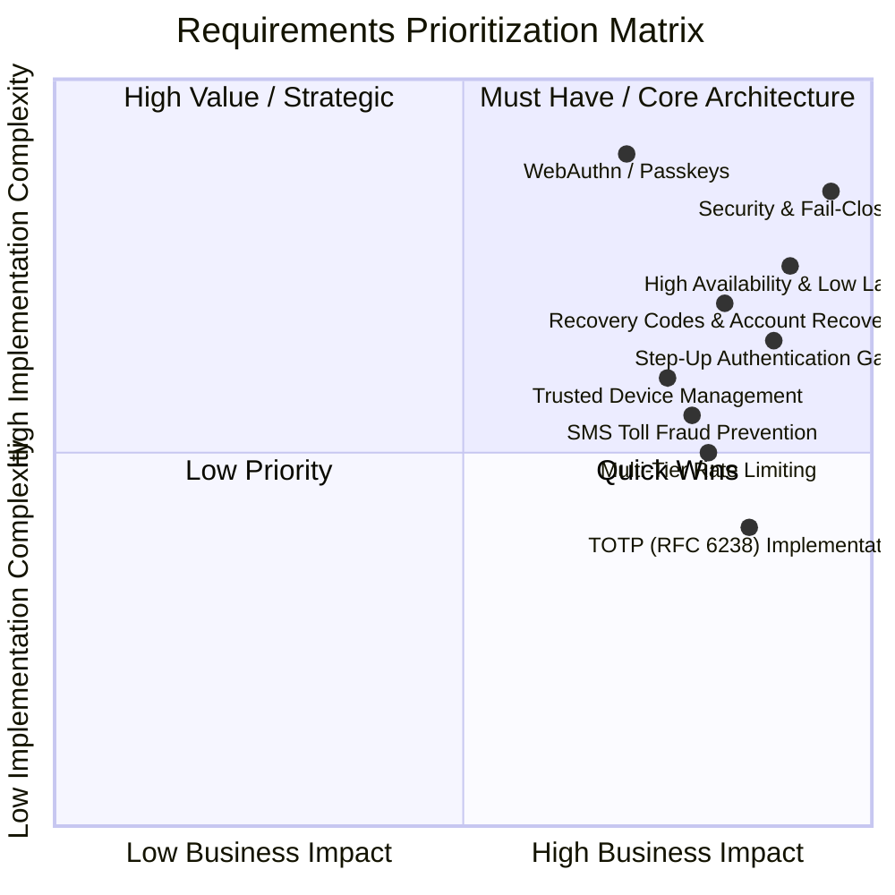

---

## 3. 🎯 Clarifying Requirements Like a Senior Engineer

> **In an interview, I would ask the interviewer:**
> 1. *"What is the expected user scale and geographic distribution? Are we designing for a single region or global active-active traffic?"*
> 2. *"Which MFA methods are mandatory for MVP? (e.g., Software TOTP, SMS/Email OTP, or FIDO2/WebAuthn?)"*
> 3. *"What is the compliance mandate? Are we subject to PCI-DSS 4.0, GDPR, or PSD2 Strong Customer Authentication (SCA) for payments?"*
> 4. *"Do we support 'Remember this device' (trusted devices)? If so, what is the policy duration (e.g., 30 days), and how does step-up authentication override it?"*
> 5. *"What are our recovery policies for users who lose their second factor? Is self-serve recovery with backup codes sufficient, or do we need customer-support escalation flows with fraud cooldowns?"*
> 6. *"What are our SLAs for authentication latency and SMS/Email delivery times?"*

### Critical vs. Deferrable Clarifications
- **Critical (Must nail down immediately)**: Primary MFA factors (TOTP vs. SMS), session mechanism (JWT vs. Stateful Redis Session), consistency model, and fail-closed posture.
- **Deferrable (Can address in deep dive)**: Biometric WebAuthn passkey registration edge cases, SMS aggregator multi-vendor fallback routing algorithms, and customer support manual KYC verification tooling.

---

## 4. 📊 Capacity Estimation & Scale Math

Let us establish realistic production parameters for a top-tier e-commerce platform:

### Baseline Scale Assumptions
- **Total Registered Users**: $50,000,000$
- **Daily Active Users (DAU)**: $5,000,000$ ($10\%$ of registered base)
- **MFA Adoption Rate**: $40\%$ enrolled in MFA ($2,000,000$ MFA-enabled DAU)
- **Total Login Attempts / Day**: $10,000,000$ (including mobile, web, and repeat sessions)
- **Traffic Pattern**: $80\%$ of traffic occurs in a 12-hour window; Peak-to-Average Ratio = $3\times$.

```text
================================================================================
1. THROUGHPUT & RPS CALCULATIONS
================================================================================
Total Logins per day = 10,000,000 attempts/day
Average Login RPS    = 10,000,000 / 86,400 s ≈ 116 req/sec
Peak Login RPS       = 116 * 3 ≈ 350 req/sec

MFA Verification Traffic:
- 40% of logins trigger MFA = 4,000,000 MFA verifications/day
- Average MFA RPS   = 4,000,000 / 86,400 s ≈ 46 req/sec
- Peak MFA RPS      = 46 * 3 ≈ 140 req/sec

Flash Sale / Black Friday Spike (10x Baseline Surge):
- Peak Flash Sale Login RPS = 3,500 req/sec
- Peak Flash Sale MFA RPS   = 1,400 req/sec

================================================================================
2. REDIS STORAGE & MEMORY SIZING (EPHEMERAL MFA STATE)
================================================================================
Each MFA Challenge Record in Redis:
- Key: "mfa:challenge:{uuid}" (~50 bytes)
- Value (JSON/MsgPack):
  {
    "userId": "64b8f1a2c9e77a1b8c001234",  // 24 bytes
    "method": "TOTP",                       // 4 bytes
    "encryptedSecret": "enc_aes_gcm_...",   // 64 bytes
    "attemptCount": 1,                      // 4 bytes
    "createdAt": 1726210000,                // 8 bytes
    "riskScore": 12                         // 4 bytes
  } + Redis overhead ≈ ~350 bytes per active challenge.

TTL = 5 minutes (300 seconds).
Peak Concurrent Active Challenges = Peak MFA RPS * 300 seconds
                                  = 140 * 300 = 42,000 concurrent challenges.
Flash Sale Concurrent Challenges = 1,400 * 300 = 420,000 concurrent challenges.

Memory Footprint for Challenges:
- Normal Peak: 42,000 * 350 bytes ≈ 14.7 MB RAM
- Flash Sale Peak: 420,000 * 350 bytes ≈ 147 MB RAM

Rate Limiter Keys:
- "rl:mfa:user:{userId}" & "rl:mfa:ip:{ip}"
- 1,000,000 active rate-limit keys * 100 bytes ≈ 100 MB RAM

Total Redis RAM Required for MFA State: < 1 GB (A standard 4GB AWS ElastiCache node is more than sufficient).

================================================================================
3. MONGODB PERSISTENT STORAGE SIZING (5 YEARS)
================================================================================
User MFA Settings Record:
- userId, isMfaEnabled, primaryMethod, encryptedTotpSecret, 
  backupPhoneHash, recoveryCodesHashes (10 * 32 bytes), trustedDevices array.
- Average Record Size ≈ 800 bytes.
- 50 Million Users * 800 bytes = 40 GB storage.

Audit Logs (High-Volume Append-Only):
- 10M auth events/day * 500 bytes/event = 5 GB / day
- 1 Year Audit Storage = 5 GB * 365 = 1.825 TB / year (Streamed to S3/Athena for cold storage).
```

---

## 5. 🏛️ High-Level Architecture

The architecture separates concerns into a **Modular Monolith or Microservices pattern** where the **Authentication API** handles identity, the **MFA Service** manages factor challenges and cryptographic verification, and **Redis** maintains ephemeral verification state.

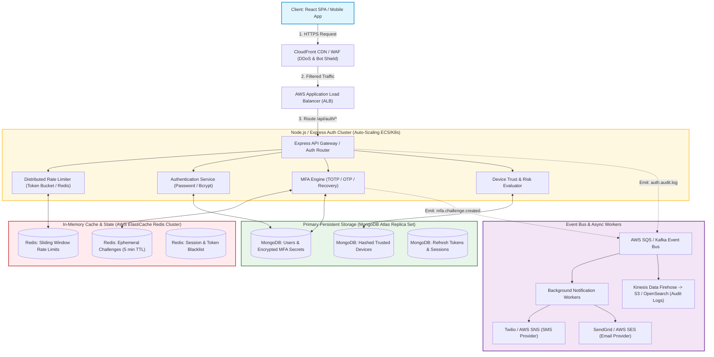

### Monolith vs. Modular Monolith vs. Microservices

| Dimension | Monolith | Modular Monolith (Recommended for MERN) | Microservices |
| :--- | :--- | :--- | :--- |
| **Architecture** | Auth & MFA mixed in all routes | Dedicated `auth` & `mfa` modules inside single deployable | Separate Auth Service, MFA Service, User Service |
| **Latency** | Lowest (in-process calls) | Lowest ($< 1\text{ms}$ in-process memory calls) | Higher ($10\text{-}30\text{ms}$ network hops + gRPC serialization) |
| **Operational Overhead**| Low | Low (Single CI/CD, single container fleet) | High (Service mesh, K8s orchestration, distributed traces)|
| **Failure Isolation** | Poor (One bug crashes all) | Moderate (Isolated module boundaries, circuit breakers) | High (MFA crash does not bring down Catalog) |
| **Recommendation** | Good for early startups ($< 10\text{k}$ DAU) | **Ideal for 95% of MERN enterprise systems** | For massive engineering teams ($500+$ engineers) |

> **In an interview, I would defend this choice:**
> *"For a scalable MERN e-commerce architecture, I recommend a **Modular Monolith** deployed as horizontally scaled, stateless Node.js containers. Authentication and MFA require sub-millisecond execution. Splitting them into separate microservices introduces unnecessary network hops, distributed transaction complexity, and network latency right in the critical path of checkout and login. By enforcing strict domain module boundaries with clean service interfaces in Express, we maintain code isolation while achieving maximum throughput."*

---

## 6. ⚛️ MERN Stack-Specific Implementation Details

### A. React.js Frontend Design
1. **Multi-Stage Authentication State Machine**:
   - `STAGE_CREDENTIALS` $\rightarrow$ User enters Email + Password.
   - `STAGE_MFA_CHALLENGE` $\rightarrow$ Backend returns `{ status: "MFA_REQUIRED", challengeId: "...", method: "TOTP" }`.
   - `STAGE_AUTHENTICATED` $\rightarrow$ User enters 6-digit OTP $\rightarrow$ Tokens stored $\rightarrow$ Redirect to dashboard.
2. **Component Structure**:
   - `<LoginForm />`: Handles credential submission and triggers transition.
   - `<MfaChallengeModal />`: Renders segmented 6-digit numeric input with auto-focus and clipboard paste support (`onPaste` splits 6 digits across inputs).
   - `<TotpSetupWizard />`: Displays Base64 QR code, manual Base32 key copy button, and a mandatory confirmation code input.
   - `<RecoveryCodeDisplay />`: Forces user to click "I have saved these codes" before closing modal; provides one-click PDF download and copy-to-clipboard.
   - `<TrustedDeviceCheckbox />`: "Don't ask again on this device for 30 days".
3. **Preventing Duplicate Submissions**:
   - React state `isSubmitting` disables the "Verify" button.
   - Request debounce + unique `Idempotency-Key` header prevents accidental double verification requests.

### B. Node.js & Express Backend Design
1. **Middleware Architecture**:
   - `rateLimiterMiddleware`: Enforces Redis sliding-window limit per IP and User ID.
   - `requireAuth`: Verifies JWT Access Token (`Authorization: Bearer <token>`).
   - `requireMfaEnrolled`: Verifies user has active MFA enabled.
   - `requireStepUpSession`: Validates short-lived elevated privilege token before executing sensitive routes (e.g., `/api/user/payment-methods`).
2. **Security Headers (Helmet.js)**:
   - `Strict-Transport-Security`: `max-age=63072000; includeSubDomains; preload`
   - `X-Content-Type-Options`: `nosniff`
   - `X-Frame-Options`: `DENY` (Prevents Clickjacking)
   - `Content-Security-Policy`: Restricts scripts and restricts frame ancestors.

### C. Redis Schema & Key Organization

```text
================================================================================
REDIS KEY PATTERNS & DATA STRUCTURES
================================================================================

1. Ephemeral MFA Challenge:
   Key:   mfa:challenge:{challengeId}
   Type:  String (JSON Serialized)
   TTL:   300 seconds (5 minutes)
   Value: {
            "userId": "64e1f82c9e77a1b8c0012345",
            "method": "TOTP",
            "riskScore": 15,
            "ip": "203.0.113.195",
            "userAgent": "Mozilla/5.0..."
          }

2. MFA Attempt Counter (Brute-Force Guard):
   Key:   mfa:attempts:{challengeId}
   Type:  Integer (INCR)
   TTL:   300 seconds
   Value: 3 (Max allowed: 5 before challenge auto-burns)

3. User Verification Rate Limiter:
   Key:   rl:mfa:verify:user:{userId}
   Type:  ZSET (Sliding Window Log)
   TTL:   600 seconds (10 minutes)

4. Step-Up Authorization Grant:
   Key:   auth:stepup:grant:{grantToken}
   Type:  String
   TTL:   600 seconds (10 minutes)
   Value: { "userId": "64e1f82c9e77a1b8c0012345", "scope": "PAYMENT_UPDATE" }

5. Trusted Device Fast-Lookup Cache:
   Key:   device:trusted:{deviceTokenHash}
   Type:  String
   TTL:   2,592,000 seconds (30 days)
   Value: { "userId": "...", "deviceId": "..." }
```

> **What should NEVER be stored in Redis?**
> Plaintext passwords, unencrypted master KMS keys, raw credit card numbers, or permanent user profile records. Redis is an in-memory cache and volatile state coordinator, not a permanent source of truth.

---

## 7. 🔑 Deep Dive: MFA Factor Analysis & Methods

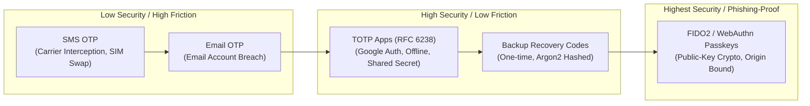

### Method A: SMS-Based OTP
- **Mechanism**: Server generates a 6-digit random number, stores hash in Redis with a 3-minute TTL, and calls an SMS Aggregator (Twilio / AWS SNS) to deliver to the user's phone.
- **Vulnerabilities**:
  - **SIM Swapping**: Attacker impersonates victim to port phone number.
  - **SS7 Protocol Flaws**: Cellular signaling vulnerabilities allow interception.
  - **SMS Phishing (Smishing)**: Attackers proxy the OTP to the real site.
  - **SMS Toll Fraud**: Fraudsters trigger millions of OTPs to premium-rate numbers they own, costing the company thousands of dollars.
- **When Acceptable**: As a fallback for non-tech-savvy users or initial onboarding when no authenticator app is installed.

### Method B: Email-Based OTP
- **Mechanism**: Server sends short-lived OTP to the registered email address.
- **Vulnerabilities**: If the user has a compromised email password or uses the same password for both email and e-commerce, MFA is completely bypassed.
- **When Acceptable**: Low-risk account verification and password reset coordination.

### Method C: Software TOTP (RFC 6238 / RFC 4226) — *Industry Standard*
- **Mechanism**:
  1. Server generates a 160-bit cryptographically secure shared secret (Base32 encoded).
  2. Secret is provisioned to user via QR Code containing URI: `otpauth://totp/AcmeEcommerce:user@example.com?secret=JBSWY3DPEHPK3PXP&issuer=AcmeEcommerce&algorithm=SHA1&digits=6&period=30`.
  3. Both the server and mobile authenticator app independently calculate:
     $$\text{Counter } T = \lfloor \frac{\text{Current Unix Time} - T_0}{X} \rfloor \quad (X = 30\text{ seconds}, T_0 = 0)$$
     $$\text{HMAC-SHA1}(K, T) \rightarrow \text{Dynamic Truncation} \rightarrow 6\text{ digits}$$
  4. **Clock Drift Tolerance**: Server checks $T-1, T, T+1$ ($\pm 30$ seconds window) to account for slight client clock skew.
  5. **Replay Protection**: Once an OTP is verified for time step $T$, that time step is cached in Redis with a 60-second TTL to prevent reuse.
- **Security Storage**: TOTP shared secrets MUST be encrypted at rest using **Envelope Encryption** (AES-256-GCM with keys managed by AWS KMS).

### Method D: Backup / Recovery Codes
- **Mechanism**: When MFA is activated, the server generates 10 cryptographically random 10-character alphanumeric strings (e.g., `a7x9-k2m4-p9q1`).
- **Storage**: Each code is individually hashed with **Argon2id or bcrypt** before persisting in MongoDB.
- **One-Time Invalidation**: When submitted, the server compares the candidate code against the hashed list using constant-time comparison (`crypto.timingSafeEqual`). Upon a match, the matched code is permanently deleted from MongoDB.

### Method E: Trusted Devices ("Remember This Device")
- **Mechanism**: User selects "Remember this device for 30 days".
- **Token Generation**: Server creates a 256-bit cryptographically random device secret, hashes it with SHA-256 for MongoDB storage, and returns the raw secret in a hardened `httpOnly`, `Secure`, `SameSite=Strict` cookie (`__Host-device_token`).
- **Validation**: On subsequent logins, if the device token matches the DB hash and is within the 30-day window, the login bypasses the standard MFA challenge while logging the device IP/User-Agent.

### Method F: WebAuthn / Passkeys (FIDO2) — *The Modern Gold Standard*
- **Mechanism**: Asymmetric Public-Key Cryptography.
  1. **Registration**: Server issues a cryptographic challenge. The user's device (TouchID, FaceID, YubiKey) generates a public/private keypair. The private key remains locked in the device's Secure Enclave; the public key is sent to the server.
  2. **Authentication**: Server sends a random challenge. Device signs challenge with the private key. Server verifies signature using stored public key.
- **Phishing Resistance**: The browser cryptographically binds the signature to the exact HTTP Origin (`https://acme-ecommerce.com`). An attacker on `https://acme-phishing.com` cannot reuse or proxy the credential.

### MFA Methods Comparison Table

| Factor / Method | Security Level | Phishing Resistant? | Setup Friction | Ongoing Cost | Offline Capable? | Attack Vectors |
| :--- | :--- | :--- | :--- | :--- | :--- | :--- |
| **SMS OTP** | 🔴 Low | ❌ No | Low | High ($0.01 - $0.08 / SMS) | ❌ No (Cell network required) | SIM swap, SS7 intercept, Toll fraud |
| **Email OTP** | 🟡 Medium-Low | ❌ No | Lowest | Very Low ($0.0001 / email) | ❌ No (Internet required) | Email compromise, delivery delays |
| **TOTP (RFC 6238)** | 🟢 High | ❌ No | Medium | **Zero ($0.00)** | ✅ **Yes (100% Offline)** | Real-time reverse proxy phishing |
| **Recovery Codes** | 🟢 High | ❌ No | Low | **Zero ($0.00)** | ✅ **Yes (Physical note / print)**| Stolen printout / photo |
| **WebAuthn / Passkeys**| 🛡️ **Maximum**| ✅ **YES** | Lowest (Biometric) | **Zero ($0.00)** | ✅ **Yes** | Device physical theft + PIN compromise |

---

## 8. 🔄 Detailed Step-by-Step Login & Verification Flow

```mermaid
sequenceDiagram
    autonumber
    actor User as User (Browser/App)
    participant UI as React SPA
    participant API as Express Auth API
    participant Redis as Redis Cache
    participant DB as MongoDB Atlas
    participant Worker as SQS / Notification Worker
    participant Provider as SMS/Email Provider

    User->>UI: Enters Email & Password
    UI->>API: POST /api/v1/auth/login { email, password }
    API->>DB: Query User by Email
    DB-->>API: User Record + Password Hash + MFA Status
    API->>API: Verify Password with Argon2id
    
    alt Password Invalid
        API-->>UI: 401 Unauthorized (Generic "Invalid credentials")
    else Password Valid & MFA Disabled
        API->>API: Generate Access Token + Refresh Token
        API-->>UI: 200 OK + Auth Tokens (Direct Login)
    else Password Valid & MFA Enabled
        API->>API: Generate Cryptographic challengeId (UUIDv4)
        API->>Redis: SET mfa:challenge:{id} { userId, method } (TTL=300s)
        
        alt Method is SMS or Email
            API->>Worker: Enqueue SendOTP Job { userId, challengeId }
            Worker->>Provider: Dispatch OTP to Phone/Email
        end
        
        API-->>UI: 200 OK { status: "MFA_REQUIRED", challengeId, method: "TOTP" }
    end

    UI->>UI: Transition to MFA Challenge Screen
    User->>UI: Enters 6-digit Code (e.g. 849201)
    UI->>API: POST /api/v1/auth/mfa/verify { challengeId, code, rememberDevice: true }
    
    API->>Redis: GET mfa:challenge:{challengeId}
    alt Challenge Expired or Not Found
        API-->>UI: 400 Bad Request ("Challenge expired. Please login again.")
    end

    API->>Redis: INCR mfa:attempts:{challengeId}
    alt Attempts > 5
        API->>Redis: DEL mfa:challenge:{challengeId} (Burn Challenge)
        API-->>UI: 429 Too Many Requests ("Too many failed attempts. Locked.")
    end

    API->>DB: Fetch Encrypted Secret / Hashed Recovery Codes
    API->>API: Decrypt Secret with KMS & Validate OTP (RFC 6238)

    alt Code Invalid
        API-->>UI: 401 Unauthorized ("Invalid verification code")
    else Code Valid
        API->>Redis: DEL mfa:challenge:{challengeId} (Single-Use Burn)
        API->>Redis: SET mfa:replay:{userId}:{timeStep} (TTL=60s)
        
        opt Remember Device is Checked
            API->>API: Generate 256-bit deviceToken
            API->>DB: Save SHA-256(deviceToken) in user.trustedDevices
            API->>UI: Set-Cookie: __Host-device_token=...; HttpOnly; Secure; SameSite=Strict
        end

        API->>API: Generate Access Token (JWT) + Refresh Token
        API->>DB: Save Refresh Token Session
        API-->>UI: 200 OK { user, accessToken } + Set-Cookie: refreshToken
    end
```

### Step Explanation
1. **Password Authentication**: The user submits credentials. Express verifies password using `argon2.verify()`.
2. **MFA Status Evaluation**: The server determines if MFA is enabled. If disabled, tokens are issued immediately.
3. **Challenge Creation**: If MFA is enabled, the server generates a cryptographically secure `challengeId` and writes metadata to Redis with a 5-minute TTL. **No Access Token or Refresh Token is generated at this stage.**
4. **Challenge Consumption**: The user submits the 6-digit code. The server verifies attempt counts, checks against clock drift, ensures no replay has occurred, burns the challenge from Redis, and finally issues the authenticated tokens.

---

## 9. 🧩 MFA Challenge State Machine & Redis Key Design

An MFA challenge must act as a strict, one-way state machine. 

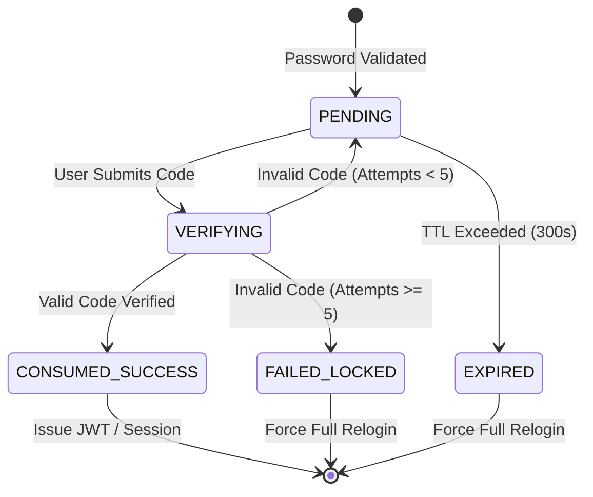

### Challenge Invalidation Rules
1. **Atomic Expiration**: Redis `EXPIRE` enforces a strict 300-second window.
2. **Single-Use Burn**: The challenge key is deleted from Redis immediately upon successful validation or upon exceeding 5 attempts.
3. **Replay Defense**: For TOTP, the time step counter $T = \lfloor \text{time} / 30 \rfloor$ is cached in Redis:
   `SET mfa:used_totp:{userId}:{timeStep} "1" EX 60 NX`
   If `SET ... NX` returns `null`, the code is rejected as a duplicate submission within the same 30-second window.

---

## 10. 🛡️ OTP Cryptography & Generation Deep Dive

### Cryptographically Secure Random Generation
Never use `Math.random()` for security tokens. Use Node.js `crypto.randomInt`:

```javascript
import crypto from 'node:crypto';

/**
 * Generates a cryptographically secure 6-digit numeric OTP.
 * crypto.randomInt is backed by CSPRNG (/dev/urandom or Windows BCryptGenRandom).
 */
export function generateSecureOtp(digits = 6): string {
  const min = 10 ** (digits - 1);
  const max = 10 ** digits;
  const otpNumber = crypto.randomInt(min, max);
  return otpNumber.toString();
}
```

### Plaintext OTP vs. Hashed OTP in Redis

| Storage Approach | Pros | Cons | Recommendation |
| :--- | :--- | :--- | :--- |
| **Plaintext in Redis** | Simple, fast lookups | If Redis snapshot/dump is compromised, active OTPs are exposed | ❌ Avoid in high-security environments |
| **SHA-256 Hash in Redis** | Zero exposure if Redis memory is leaked; attacker cannot view valid OTPs | Microsecond hashing overhead ($< 0.05\text{ms}$) | ✅ **Recommended Production Standard** |

---

## 11. ⏱️ Distributed Rate Limiting & Abuse Prevention

MFA endpoints are prime targets for automated brute-force attacks and SMS toll fraud. We implement a **Multi-Tier Sliding Window Rate Limiter** using Redis Sorted Sets (`ZSET`).

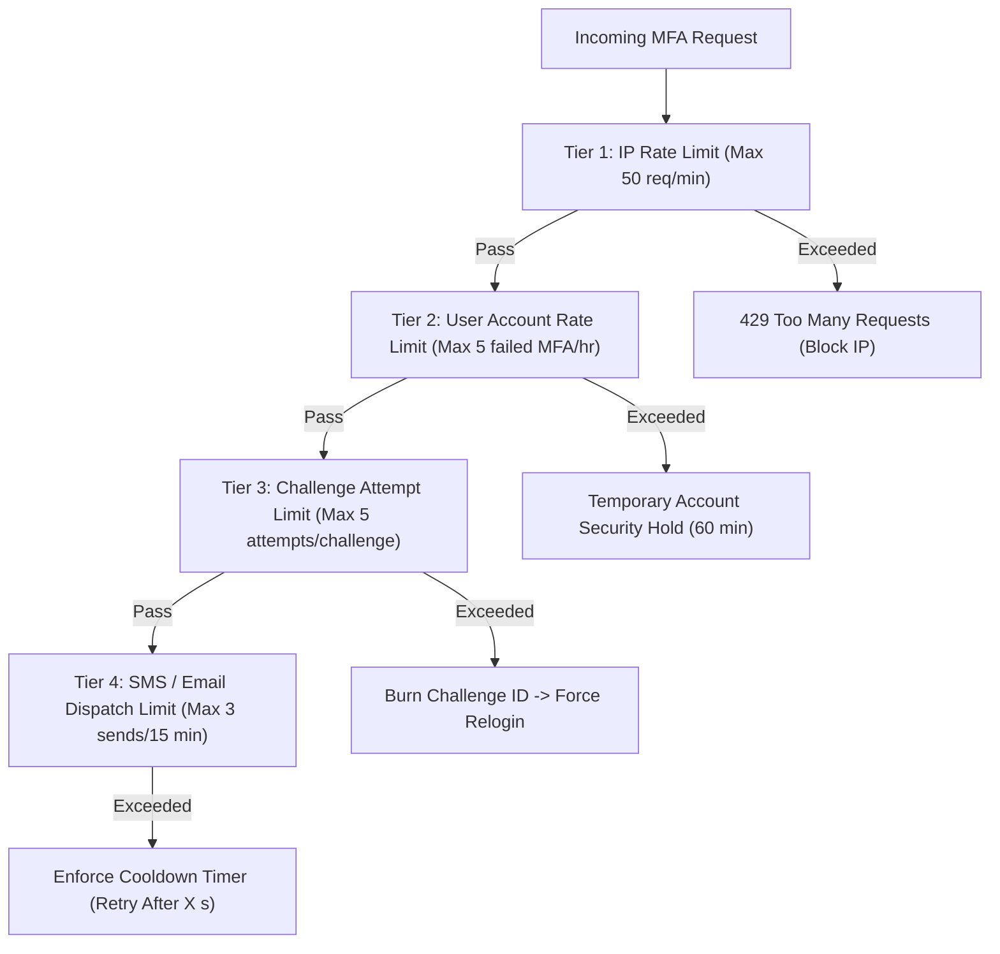

### Redis Sliding Window Lua Script (Atomic Execution)

```lua
-- KEYS[1]: Rate limit key (e.g. "rl:mfa:verify:user:12345")
-- ARGV[1]: Current timestamp (milliseconds)
-- ARGV[2]: Window size (milliseconds, e.g. 60000 for 1 min)
-- ARGV[3]: Max allowed requests in window (e.g. 5)

local key = KEYS[1]
local now = tonumber(ARGV[1])
local window = tonumber(ARGV[2])
local limit = tonumber(ARGV[3])
local clearBefore = now - window

-- 1. Remove timestamps older than window
redis.call('ZREMRANGEBYSCORE', key, 0, clearBefore)

-- 2. Count remaining elements in current window
local currentRequests = redis.call('ZCARD', key)

if currentRequests < limit then
    -- 3. Add current timestamp to sorted set
    redis.call('ZADD', key, now, now)
    redis.call('PEXPIRE', key, window)
    return 1 -- Allowed
else
    return 0 -- Rate Limited
end
```

---

## 12. 🔒 Comprehensive Security Design & Defense-in-Depth

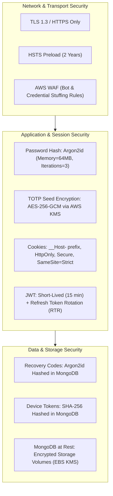

### Security Defenses Applied to MFA
1. **Timing Attack Protection**: When comparing verification codes, tokens, or hashes, always use `crypto.timingSafeEqual()` to ensure comparison execution time is independent of how many initial characters match.
2. **Account Enumeration Prevention**: API responses for unregistered emails vs. wrong passwords return identical generic error messages: `401 Unauthorized: Invalid email or password`.
3. **Envelope Encryption for TOTP Secrets**:
   - Master Key is stored in **AWS KMS** (never in source code or `.env` files).
   - Node.js fetches a unique Data Encryption Key (DEK) via KMS API to encrypt/decrypt secrets locally in memory.
4. **MFA Fatigue / Spamming Mitigation**:
   - Limit push notifications / SMS triggers to a maximum of 3 requests per 15 minutes per account.

---

## 13. 🎟️ JWT vs. Server-Side Sessions for MFA

### Evaluation Matrix

| Metric | Pure Stateless JWT | Pure Stateful Session (Redis/DB) | Hybrid Token Architecture (Recommended) |
| :--- | :--- | :--- | :--- |
| **Scalability** | Extreme (No DB lookup) | Moderate (Redis lookup per request) | **High (Stateless Access + Stateful Refresh)** |
| **Instant Revocation** | ❌ Impossible until TTL expires | ✅ Instant (`DEL session:id`) | ✅ Instant (Blacklist in Redis on Logout) |
| **MFA Elevation Tracking**| Embedded in JWT Claims (`amr`) | Stored in Session Object | **Embedded in JWT Claims with short 15m TTL** |
| **Latency** | $< 0.1\text{ms}$ | $1\text{-}3\text{ms}$ (Network call to Redis) | **$< 0.1\text{ms}$ for regular API calls** |

### Standard MFA JWT Claims (RFC 8176)
When an Access Token is issued post-MFA, it includes standard authentication claims:

```json
{
  "sub": "64b8f1a2c9e77a1b8c001234",
  "email": "customer@example.com",
  "roles": ["customer"],
  "amr": ["pwd", "totp"],
  "acr": "urn:mace:incommon:iap:silver",
  "mfa_verified": true,
  "auth_time": 1726210000,
  "iat": 1726210000,
  "exp": 1726210900
}
```
- `amr` (*Authentication Methods References*): Lists factors verified (`pwd` = password, `totp` = time-based OTP, `fido` = passkey).
- `auth_time`: Exact Unix timestamp when the user completed full authentication (used to verify session freshness for step-up auth).

---

## 14. ⚡ Step-Up Authentication (Elevated Privilege Gates)

In an e-commerce platform, keeping a user logged in for 30 days provides good UX, but allowing high-risk actions on a stale session is dangerous. **Step-Up Authentication** dynamically challenges the user for their second factor before executing critical actions.

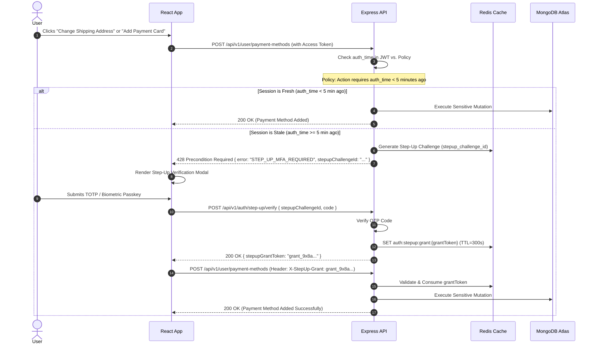

### Sensitive Actions Requiring Step-Up MFA
1. Updating email address or account password.
2. Modifying or deleting saved payment methods / credit cards.
3. Placing an order where shipping address differs from billing address or order total $> \$500$.
4. Disabling MFA or regenerating recovery codes.

---

## 15. 💻 Trusted Device Architecture ("Remember This Device")

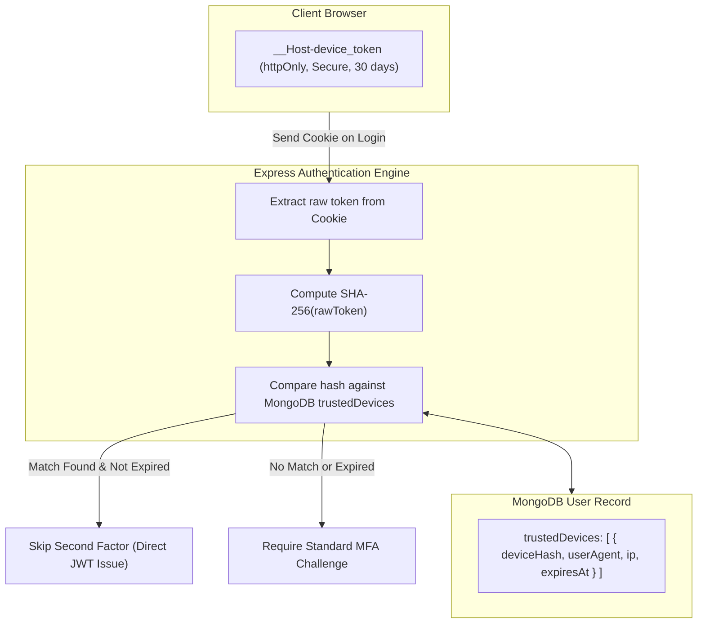

### Why Raw Device Tokens Must Never Be Stored in MongoDB
If an attacker gains read-only access to a database backup, plaintext device tokens would allow them to forge authentication cookies and impersonate any trusted device. By storing only the **SHA-256 hash** of the device token, the database dump is useless to an attacker.

---

## 16. 🆘 Account Recovery: When the Second Factor is Lost

> **In an interview, I would state:**
> *"Account recovery is historically the weakest link in MFA systems. If an attacker cannot break TOTP math, they will target the account recovery flow or customer support agents. A resilient design must balance compassionate user recovery with zero-trust validation."*

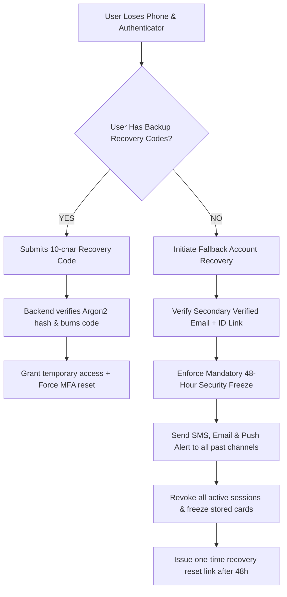

### Customer Support Exploitation Defense
1. Customer support representatives must **NEVER have a one-click button to disable MFA**.
2. Support-initiated recovery requires secondary supervisor approval and triggers an automated 48-hour security delay with multi-channel alerts to the registered user.

---

## 17. 📲 MFA Enrollment Flow (TOTP Setup)

```mermaid
sequenceDiagram
    autonumber
    actor User as User
    participant UI as React SPA
    participant API as Express Auth API
    participant KMS as AWS KMS
    participant DB as MongoDB Atlas

    User->>UI: Navigates to Security Settings -> "Enable Authenticator App"
    UI->>API: POST /api/v1/auth/mfa/totp/setup (with JWT Access Token)
    
    API->>API: Generate 160-bit Base32 Secret Key
    API->>KMS: Encrypt Secret with Master Key
    KMS-->>API: Ciphertext Blob (encryptedSecret)
    
    API->>DB: Update User { tempMfaSecret: encryptedSecret, mfaStatus: "PENDING" }
    API->>API: Generate otpauth:// URI & QR Code Base64
    API-->>UI: 200 OK { qrCodeImage: "data:image/png;base64,...", secretKeyText: "JBSWY3..." }

    UI->>UI: Displays QR Code & Manual Entry Key
    User->>User: Scans QR code with Google Authenticator / 1Password
    User->>UI: Enters first 6-digit TOTP code (e.g. 592810)
    
    UI->>API: POST /api/v1/auth/mfa/totp/verify-setup { code: "592810" }
    API->>DB: Fetch tempMfaSecret
    API->>KMS: Decrypt Secret
    API->>API: Verify Code against Decrypted Secret
    
    alt Code Invalid
        API-->>UI: 400 Bad Request ("Invalid code. Check device time sync.")
    else Code Valid
        API->>API: Generate 10 Cryptographic Recovery Codes
        API->>API: Compute Argon2id Hashes for all 10 codes
        API->>DB: Update User { mfaEnabled: true, mfaSecret: tempMfaSecret, tempMfaSecret: null, recoveryCodes: [hashes] }
        API-->>UI: 200 OK { status: "MFA_ENABLED", recoveryCodes: ["a7x9-k2m4...", "p9q1-m3n5..."] }
    end
```

> [!IMPORTANT]
> **Why MFA must never be enabled upon secret generation:**
> If the server enabled MFA immediately when the QR code was rendered, and the user closed their laptop without scanning the QR code, they would be permanently locked out of their account on next login. MFA status is ONLY flipped to `enabled: true` after the user successfully verifies their first live TOTP code.

---

## 18. 🚫 Secure MFA Disabling Flow

Disabling MFA lowers the security perimeter of an account. It requires strict validation:
1. **Re-Authentication Required**: User must submit their current password AND an active TOTP / Recovery code.
2. **Immediate Token & Session Invalidation**: All refresh tokens, active sessions, and trusted device tokens are deleted from MongoDB and blacklisted in Redis.
3. **Instant Security Alert**: An urgent email and SMS notification is dispatched: *"MFA was disabled on your account. If you did not perform this action, click here immediately to lock your account."*

---

## 19. 🗄️ Database Design (MongoDB Schemas)

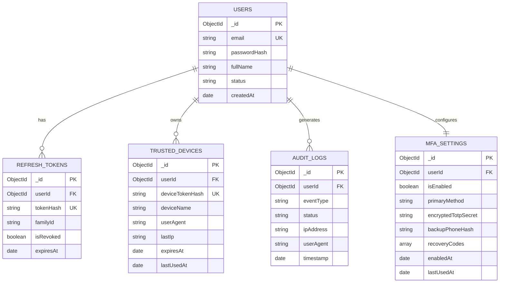

### MongoDB Mongoose Schema Implementation

```javascript
import mongoose from 'mongoose';

// 1. MFA Settings Schema
const MfaSettingSchema = new mongoose.Schema({
  userId: { 
    type: mongoose.Schema.Types.ObjectId, 
    ref: 'User', 
    required: true, 
    unique: true, 
    index: true 
  },
  isEnabled: { type: Boolean, default: false },
  primaryMethod: { 
    type: String, 
    enum: ['TOTP', 'SMS', 'EMAIL', 'WEBAUTHN'], 
    default: 'TOTP' 
  },
  // AES-256-GCM encrypted ciphertext (Base64) + IV + AuthTag
  encryptedTotpSecret: { type: String, default: null },
  tempEncryptedSecret: { type: String, default: null }, // Used during enrollment
  backupPhone: { type: String, default: null }, // E.164 formatted, encrypted
  recoveryCodes: [{
    codeHash: { type: String, required: true }, // Argon2id hash
    isUsed: { type: Boolean, default: false },
    usedAt: { type: Date, default: null }
  }],
  enabledAt: { type: Date, default: null },
  lastVerifiedAt: { type: Date, default: null }
}, { timestamps: true });

// 2. Trusted Devices Schema
const TrustedDeviceSchema = new mongoose.Schema({
  userId: { 
    type: mongoose.Schema.Types.ObjectId, 
    ref: 'User', 
    required: true, 
    index: true 
  },
  deviceTokenHash: { type: String, required: true, unique: true, index: true },
  deviceName: { type: String, required: true }, // e.g., "Chrome on macOS"
  userAgent: { type: String, required: true },
  lastIp: { type: String, required: true },
  expiresAt: { 
    type: Date, 
    required: true, 
    index: { expires: 0 } // TTL Index: MongoDB automatically purges expired records
  },
  lastUsedAt: { type: Date, default: Date.now }
}, { timestamps: true });

// 3. Security Audit Logs Schema
const AuditLogSchema = new mongoose.Schema({
  userId: { type: mongoose.Schema.Types.ObjectId, ref: 'User', index: true },
  eventType: { 
    type: String, 
    required: true, 
    enum: [
      'AUTH_LOGIN_SUCCESS', 'AUTH_LOGIN_FAILED', 
      'MFA_CHALLENGE_CREATED', 'MFA_VERIFY_SUCCESS', 'MFA_VERIFY_FAILED',
      'MFA_ENROLLED', 'MFA_DISABLED', 'RECOVERY_CODE_USED',
      'TRUSTED_DEVICE_ADDED', 'TRUSTED_DEVICE_REVOKED', 'STEP_UP_VERIFIED'
    ],
    index: true 
  },
  status: { type: String, enum: ['SUCCESS', 'FAILURE', 'BLOCKED'], required: true },
  ipAddress: { type: String, required: true, index: true },
  userAgent: { type: String, required: true },
  metadata: { type: mongoose.Schema.Types.Mixed, default: {} },
  createdAt: { 
    type: Date, 
    default: Date.now, 
    index: { expires: '90d' } // Retain hot audit logs for 90 days in MongoDB
  }
});

export const MfaSetting = mongoose.model('MfaSetting', MfaSettingSchema);
export const TrustedDevice = mongoose.model('TrustedDevice', TrustedDeviceSchema);
export const AuditLog = mongoose.model('AuditLog', AuditLogSchema);
```

---

## 20. 🔌 Production-Grade REST API Design

### Endpoint Overview

```text
POST   /api/v1/auth/login                     -> Primary email/password login
POST   /api/v1/auth/mfa/verify                -> Verify MFA challenge (TOTP/OTP)
POST   /api/v1/auth/mfa/recovery/verify       -> Verify backup recovery code
POST   /api/v1/auth/mfa/totp/setup            -> Initialize TOTP enrollment & return QR
POST   /api/v1/auth/mfa/totp/verify-setup     -> Confirm enrollment with live code
POST   /api/v1/auth/mfa/disable               -> Disable MFA (Requires re-auth)
POST   /api/v1/auth/mfa/recovery/regenerate   -> Regenerate new recovery codes
GET    /api/v1/auth/mfa/status                -> Check MFA status for current user
GET    /api/v1/auth/devices                   -> List active trusted devices
DELETE /api/v1/auth/devices/:deviceId         -> Revoke specific trusted device
POST   /api/v1/auth/step-up/challenge         -> Request step-up MFA challenge
POST   /api/v1/auth/step-up/verify            -> Verify step-up & receive grant token
```

### API Payloads & Status Codes

#### 1. Primary Login Endpoint (`POST /api/v1/auth/login`)
- **Request Body**:
```json
{
  "email": "alex.developer@example.com",
  "password": "SuperSecretPassword123!"
}
```
- **Response (When MFA Required — Status `200 OK`)**:
```json
{
  "success": true,
  "status": "MFA_REQUIRED",
  "data": {
    "challengeId": "ch_8f9a2b1c-4d3e-4f5a-9b8c-1a2b3c4d5e6f",
    "method": "TOTP",
    "expiresIn": 300
  }
}
```

#### 2. Verify MFA Endpoint (`POST /api/v1/auth/mfa/verify`)
- **Request Body**:
```json
{
  "challengeId": "ch_8f9a2b1c-4d3e-4f5a-9b8c-1a2b3c4d5e6f",
  "code": "482019",
  "rememberDevice": true
}
```
- **Response (Status `200 OK`)**:
```json
{
  "success": true,
  "status": "AUTHENTICATED",
  "data": {
    "accessToken": "eyJhbGciOiJIUzI1NiIsInR5cCI6IkpXVCJ9...",
    "expiresIn": 900,
    "user": {
      "id": "64b8f1a2c9e77a1b8c001234",
      "email": "alex.developer@example.com",
      "fullName": "Alex Developer"
    }
  }
}
```
*(Sets `Set-Cookie: __Host-refresh_token=...; HttpOnly; Secure; SameSite=Strict` and `Set-Cookie: __Host-device_token=...`)*

#### 3. Error Response (Preventing Enumeration — Status `401 Unauthorized`)
```json
{
  "success": false,
  "error": {
    "code": "INVALID_MFA_CODE",
    "message": "The verification code entered is incorrect or expired.",
    "attemptsRemaining": 2
  }
}
```

---

## 21. 📊 Complete Sequence Diagrams

### 1. Normal Login with TOTP Verification

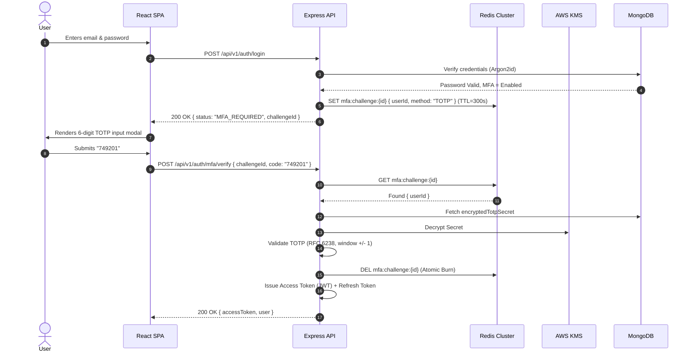
*Summary: Password verified $\rightarrow$ Ephemeral challenge created in Redis $\rightarrow$ User submits TOTP $\rightarrow$ Server decrypts secret via KMS $\rightarrow$ Code verified $\rightarrow$ Challenge burned $\rightarrow$ Auth tokens issued.*

---

### 2. SMS OTP Login Flow

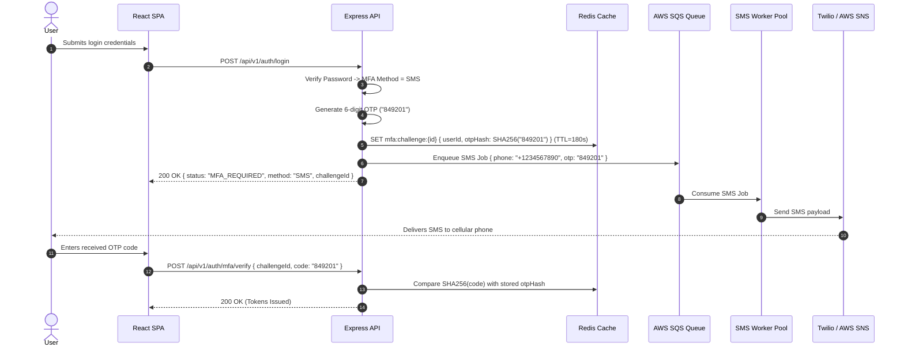
*Summary: OTP generated $\rightarrow$ SHA-256 hash stored in Redis $\rightarrow$ Dispatched asynchronously via SQS/Twilio $\rightarrow$ User inputs code $\rightarrow$ Server hashes input and compares.*

---

### 3. Step-Up Authentication Flow

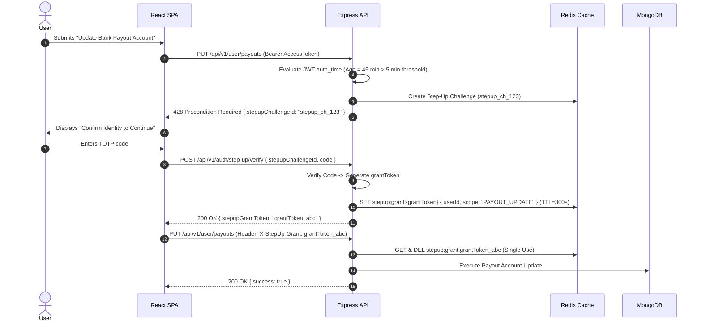
*Summary: Stale session detected $\rightarrow$ 428 status returned $\rightarrow$ Step-up challenge verified $\rightarrow$ Short-lived grant ticket issued $\rightarrow$ Sensitive mutation executed and ticket consumed.*

---

### 4. Trusted Device Login Flow

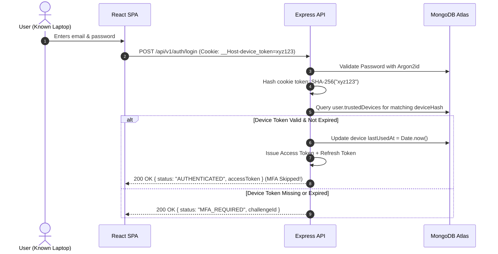
*Summary: Client sends device cookie $\rightarrow$ Server hashes token $\rightarrow$ Matches MongoDB record within 30-day window $\rightarrow$ MFA skipped for smooth UX.*

---

### 5. Logout from All Devices (Global Session Revocation)

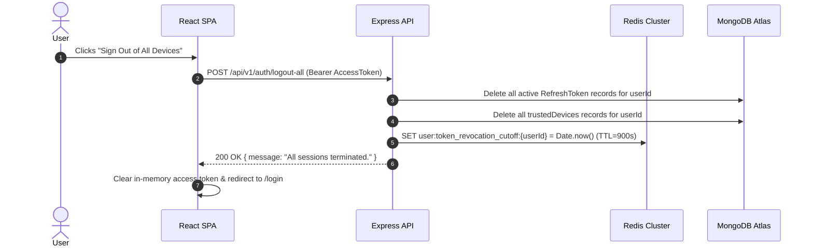
*Summary: All DB refresh tokens deleted $\rightarrow$ All trusted devices purged $\rightarrow$ Revocation cutoff timestamp set in Redis so currently circulating short-lived JWTs are rejected.*

---

## 22. 💥 Failure Scenarios: Fail-Open vs. Fail-Closed

```mermaid
flowchart TD
    Failure["Infrastructure Component Failure"] --> CompType{"Which Component Failed?"}
    
    CompType -->|Redis Cache Down| RedisFail["Fail-Closed for Auth / Read Replica for Session"]
    CompType -->|MongoDB Down| DBFail["Fail-Closed (Total Auth Freeze)"]
    CompType -->|SMS Gateway (Twilio) Down| SMSFail["Fallback to Email OTP / Authenticator"]
    CompType -->|Node.js Instance Crash| NodeFail["ALB Health Check drops node, routes to peers"]

    RedisFail --> DenyUnverified["Deny unverified logins; log P1 outage alert"]
    DBFail --> Return503["Return 503 Service Unavailable (Preserve Data Integrity)"]
    SMSFail --> AutoSwitch["Circuit Breaker trips -> Switch to AWS SNS or Email"]
    NodeFail --> ZeroImpact["Zero user impact via stateless redundancy"]
```

### Comprehensive Failure Matrix

| Failure Event | System Impact | Detection Mechanism | Recovery / Mitigation | Security Posture |
| :--- | :--- | :--- | :--- | :--- |
| **Redis Cluster Crash** | Cannot read/write MFA challenges | Redis Sentinel / CloudWatch Health Alarm | Multi-AZ Redis failover ($< 15\text{s}$). Fail-Closed: deny active challenge completion until restored. | **Fail-Closed (Secure)** |
| **MongoDB Primary Node Down** | Cannot read users or write sessions | MongoDB Atlas Automated Replica Election | Primary election takes 2-5 seconds. Read replicas serve read-only profile data. | **Fail-Closed** |
| **SMS Provider Outage (Twilio)** | SMS OTPs delayed or dropped | Circuit Breaker (Opossum) detects $> 5\%$ error rate | Automatically failover to secondary provider (AWS SNS / MessageBird) or prompt user for Email/TOTP. | **Degraded Mode** |
| **Network Partition / Latency** | OTP arrives after 5-minute TTL | Client submits expired challenge | Server returns explicit code `CHALLENGE_EXPIRED`; prompts 1-click resend. | **Fail-Closed** |
| **Race Condition: Double Verify Click** | Duplicate requests hitting different Node instances | Redis atomic `DEL mfa:challenge:{id}` | First request consumes challenge; second request gets `null` from Redis and returns `400 Invalid`. | **Safe / Idempotent** |
| **Clock Drift on User Phone** | TOTP calculation off by 45 seconds | Server checks $T \pm 1$ time steps | Server allows $\pm 1$ window (30s buffer); displays guidance if failed: "Check device system time". | **Safe Window** |

> **Why MFA must ALWAYS Fail-Closed:**
> If an authentication system fails open when Redis or the database is unreachable, an attacker could launch a targeted Denial of Service (DoS) attack against Redis specifically to bypass the MFA gate and log in with stolen passwords alone. **Failing closed guarantees security integrity at all times.**

---

## 23. 📈 Scalability: Scaling from 10K to 50M+ Users

```mermaid
flowchart LR
    subgraph Phase1["Phase 1: 10K Users"]
        P1_App["Single Express Instance"]
        P1_DB["Single MongoDB Replica Set"]
        P1_Redis["Single Redis Node"]
    end

    subgraph Phase2["Phase 2: 1M Users"]
        P2_ALB["Application Load Balancer"]
        P2_App["Horizontal Express Fleet (Auto-scaled)"]
        P2_Redis["Redis Master-Replica + Sentinel"]
        P2_DB["MongoDB 3-Node Replica Set (Read Replicas)"]
    end

    subgraph Phase3["Phase 3: 50M+ Users"]
        P3_CloudFront["Global CloudFront CDN + WAF"]
        P3_ALB["Multi-Region ALBs"]
        P3_App["K8s Pods across 3 Availability Zones"]
        P3_Redis["Redis Cluster (Sharded + In-Memory Replication)"]
        P3_DB["MongoDB Atlas Sharded Cluster (Hashed Sharding on userId)"]
        P3_Queue["AWS SQS / Kafka Async Event Pipelines"]
    end

    Phase1 --> Phase2 --> Phase3
```

### Architectural Evolution Table

| Architectural Component | 10K Users (Startup) | 1M Users (Mid-Market) | 50M+ Users (Enterprise E-Commerce) |
| :--- | :--- | :--- | :--- |
| **Node.js Compute** | 1–2 EC2 instances running PM2 | ECS Fargate containers ($5\text{-}15$ pods) | Kubernetes (EKS) Auto-scaling ($50\text{-}200$ pods) with HPA |
| **Redis Caching** | Single Redis instance ($1\text{GB}$) | AWS ElastiCache Primary + Read Replica | AWS ElastiCache Cluster (6 Shards, Multi-AZ with Auto-Failover) |
| **MongoDB** | MongoDB Atlas M10 Replica Set | MongoDB Atlas M40 (Primary + 2 Read Replicas) | Sharded MongoDB Cluster (`shardKey: { userId: "hashed" }`) |
| **Notification Dispatch** | Synchronous API calls in route | Background job queue (BullMQ + Redis) | Distributed event streaming (AWS SQS FIFO + Lambda Workers) |
| **Static Assets / QR** | Generated on server CPU | Server-side generation with SVG stream | Edge-rendered or client-generated via WebAssembly QR library |

---

## 24. 🌐 Multi-Region Architecture & Global Replication

For a global e-commerce platform with users in North America, Europe, and Asia-Pacific, routing all MFA verifications to a single central database creates unacceptable cross-continental latency ($200\text{ms}+$ round-trip).

```mermaid
flowchart TD
    subgraph Global_DNS["Route 53 Geolocation / Anycast Routing"]
        R53["AWS Route 53 Latency-Based Routing"]
    end

    subgraph Region_US["Region 1: US-East (Primary Write)"]
        ALB_US["ALB US"]
        Node_US["Node.js Auth Fleet"]
        Redis_US[("Local Redis Cluster (Ephemeral Challenges)")]
        Mongo_US_Primary[("MongoDB Atlas Primary (Writes)")]
    end

    subgraph Region_EU["Region 2: EU-Central (Read Replica)"]
        ALB_EU["ALB EU"]
        Node_EU["Node.js Auth Fleet"]
        Redis_EU[("Local Redis Cluster (Ephemeral Challenges)")]
        Mongo_EU_Secondary[("MongoDB Atlas Secondary (Low-Latency Reads)")]
    end

    R53 -->|US Users| ALB_US
    R53 -->|EU Users| ALB_EU

    ALB_US --> Node_US
    Node_US <--> Redis_US
    Node_US <--> Mongo_US_Primary

    ALB_EU --> Node_EU
    Node_EU <--> Redis_EU
    Node_EU -->|Read MFA Secret| Mongo_EU_Secondary
    Node_EU -.->|Write Session (Cross-Region)| Mongo_US_Primary

    Mongo_US_Primary -.->|Async Replication (< 100ms)| Mongo_EU_Secondary
```

### Multi-Region Design Decisions
1. **Regional Ephemeral Redis**: MFA challenges (`mfa:challenge:{id}`) are strictly regional. A user logging in via EU creates their challenge in EU Redis and verifies against EU Redis ($< 2\text{ms}$ latency).
2. **Clock Synchronization (NTP)**: All AWS EC2/ECS instances synchronize with **Amazon Time Sync Service** via chrony NTP to ensure time drift across regions is $< 1\text{ms}$, preventing TOTP validation discrepancies.
3. **MongoDB Atlas Global Clusters**: User profile data and encrypted MFA secrets are replicated globally to local read secondaries.

---

## 25. 📨 Event-Driven Architecture & Async Processing

Authentication must remain fast and synchronous, while side-effects (auditing, notification dispatch, risk calculation) are offloaded asynchronously.

```mermaid
flowchart LR
    Express["Express Auth Endpoint"] -->|1. Synchronous Return 200 OK| User["End User"]
    Express -->|2. Asynchronous Emit| SQS["AWS SQS Event Bus"]
    
    subgraph Event_Consumers["Independent Worker Consumers"]
        SQS --> Worker_SMS["SMS / Email Notification Worker"]
        SQS --> Worker_Audit["Audit Log Ingestion Pipeline"]
        SQS --> Worker_Risk["Real-time Fraud & Risk Scoring Engine"]
        SQS --> Worker_Analytics["Data Warehouse (Snowflake / Redshift)"]
    end

    Worker_SMS --> Twilio["Twilio / SES"]
    Worker_Audit --> S3["S3 Long-Term Cold Storage"]
```

### Core Domain Events Emitted
- `auth.login.success`
- `auth.login.failed`
- `mfa.challenge.created`
- `mfa.challenge.verified`
- `mfa.challenge.failed`
- `mfa.enrolled`
- `mfa.disabled`
- `device.trusted.added`
- `device.trusted.revoked`
- `account.recovery.triggered`

---

## 26. 🔭 Observability: Metrics, Logging, and Tracing

```mermaid
flowchart TD
    App["Node.js MFA Service"] -->|Metrics (Prometheus format)| Prom["Prometheus / Datadog"]
    App -->|Structured JSON Logs| CloudWatch["CloudWatch Logs / OpenSearch"]
    App -->|Distributed Traces| XRay["AWS X-Ray / OpenTelemetry"]

    Prom --> Grafana["Grafana Dashboards & PagerDuty Alerts"]
```

### Critical Security & Performance Metrics
1. `mfa_challenge_created_total{method="totp|sms"}`: Rate of challenge generation.
2. `mfa_verify_success_total`: Rate of successful 2FA verifications.
3. `mfa_verify_failed_total{reason="expired|wrong_code|locked"}`: Spikes indicate brute-force attempts.
4. `auth_latency_seconds_bucket{endpoint="/verify"}`: $P_{95}$ and $P_{99}$ latency tracking.
5. `sms_delivery_failure_rate`: Alert if $> 2\%$ of SMS messages fail over 5 minutes.

### 🚫 STRICT REDACTION LIST: What Must NEVER Be Logged
- Raw Passwords
- Plaintext OTPs / Verification Codes
- Base32 TOTP Shared Secrets
- Backup Recovery Codes
- JWT Access Tokens / Refresh Tokens
- Full Credit Card Numbers / CVVs

---

## 27. 🕵️ Threat Modeling & Attack Tree (STRIDE)

| Threat Category | Attack Vector | System Vulnerability | Mitigation in Our Design |
| :--- | :--- | :--- | :--- |
| **Spoofing** | Credential Stuffing | Password reused from third-party leak | Mandatory MFA stops 99.9% of automated ATOs. |
| **Tampering** | Modifying `challengeId` payload | Unsigned client request parameters | Challenge state is kept strictly server-side in Redis. |
| **Repudiation** | User denies disabling MFA | Lack of non-repudiable audit trail | Immutable audit logs stored in append-only S3 bucket with signed hashes. |
| **Information Disclosure** | Secret leakage in DB dump | Plaintext TOTP secret stored in DB | Envelope encryption (AES-256-GCM + AWS KMS). |
| **Denial of Service** | SMS Toll Fraud Spam | Unauthenticated OTP trigger endpoint | Multi-tier sliding-window rate limiting + WAF bot mitigation. |
| **Elevation of Privilege** | Stolen Session performing Admin Action | Single login valid for all actions | Step-Up Authentication gates all high-risk mutations. |

---

## 28. ⚖️ Senior Architectural Trade-Offs

### 1. SMS OTP vs. Software TOTP vs. WebAuthn Passkeys

```text
Trade-off Analysis:
--------------------------------------------------------------------------------
Option A: SMS OTP
  + Pros: Universal accessibility, zero user education required.
  - Cons: Vulnerable to SIM swap, cellular delays, high recurring carrier costs ($0.01-$0.08/SMS).
Option B: Software TOTP (RFC 6238)
  + Pros: Free, 100% offline, immune to SIM swapping.
  - Cons: Requires app install, clock-drift issues, manual secret backup.
Option C: WebAuthn / Passkeys (FIDO2)
  + Pros: Cryptographically immune to phishing, instant biometric UX.
  - Cons: Complex cross-device sync edge cases, older browser compatibility.

SENIOR RECOMMENDATION:
Default to Software TOTP & Passkeys as primary recommended factors. Offer SMS OTP only as a secondary fallback channel while enforcing strict SMS rate limits to contain toll fraud costs.
```

### 2. Ephemeral Challenge Storage: Redis vs. MongoDB

```text
Trade-off Analysis:
--------------------------------------------------------------------------------
Option A: MongoDB for Challenges
  + Pros: Single database technology, no Redis dependency.
  - Cons: High write volume causes disk I/O churn; TTL index sweep runs only once every 60s (imprecise expiration).
Option B: Redis for Challenges
  + Pros: In-memory sub-millisecond latency, exact-second TTL eviction, native atomic operations (INCR, DEL).
  - Cons: Volatile RAM storage; requires Redis cluster management.

SENIOR RECOMMENDATION:
Use Redis. Ephemeral, 5-minute authentication states generate high-frequency write/delete spikes that belong in memory.
```

---

## 29. 💰 Cost Optimization Analysis

### The Hidden Cost of SMS Authentication at Scale

```text
Scale: 2,000,000 MFA logins per month using SMS
- Average cost per SMS (US/Canada): $0.0079
- Average cost per SMS (International): $0.065
- Monthly SMS Bill (assuming 80% US, 20% Int'l):
  (1,600,000 * $0.0079) + (400,000 * $0.065) = $12,640 + $26,000 = $38,640 / month ($463,680 / year!)

By nudging 80% of users to TOTP Authenticator Apps / Passkeys:
- New Monthly SMS Cost: ~$7,700 / month
- ANNUAL COST SAVINGS: ~$371,000 / year (Direct to company bottom line!)
```

---

## 30. 🛡️ Regulatory Compliance (GDPR, PCI-DSS 4.0, SOC 2)

1. **PCI-DSS 4.0 Requirement 8.3**: Mandates multi-factor authentication for all personnel accessing the Cardholder Data Environment (CDE) and strong authentication controls for customer accounts accessing stored payment tokens.
2. **GDPR Data Minimization**: Phone numbers collected exclusively for SMS MFA must not be shared with marketing/analytics engines without explicit opt-in consent.
3. **Right to Be Forgotten**: When a user requests account deletion, all associated `mfa_settings`, recovery code hashes, and trusted device tokens must be permanently purged from MongoDB and secondary backups.

---

## 31. 🧪 Edge Cases & Race Condition Handling

```mermaid
flowchart TD
    EdgeCase{"Edge Case Scenario"}
    
    EdgeCase -->|1. User requests 3 OTPs in 10s| E1["Latest OTP invalidates previous; previous challengeId burned in Redis"]
    EdgeCase -->|2. OTP arrives 6 minutes late| E2["Redis TTL has purged key -> Return 400 'Code Expired'"]
    EdgeCase -->|3. Rapid multi-clicks on 'Verify'| E3["Atomic Redis DEL on first request -> Second request receives null and exits safely"]
    EdgeCase -->|4. Password reset while MFA on| E4["Password reset requires MFA verification OR burns MFA and enters 48h lock"]
    EdgeCase -->|5. Device clock out of sync| E5["Server checks +/- 1 time step window (30s drift allowance)"]
```

---

## 32. 📂 Production Node.js Project Structure (Clean Architecture)

```text
src/
├── app.ts                        # Express application initialization & middleware
├── server.ts                     # HTTP server startup & graceful shutdown handlers
├── config/
│   ├── env.ts                    # Zod-validated environment variables
│   ├── redis.ts                  # ioredis cluster connection & retry strategy
│   ├── database.ts               # Mongoose MongoDB connection pool
│   └── kms.ts                    # AWS KMS client configuration
├── modules/
│   ├── auth/
│   │   ├── auth.controller.ts    # Request handlers (/login, /register, /refresh)
│   │   ├── auth.service.ts       # Business logic (Argon2 verify, token issue)
│   │   ├── auth.routes.ts        # Express route definitions
│   │   └── auth.validation.ts    # Zod schemas for request validation
│   ├── mfa/
│   │   ├── mfa.controller.ts     # Handlers (/verify, /totp/setup, /step-up)
│   │   ├── mfa.service.ts        # TOTP crypto, recovery code hashing, KMS
│   │   ├── mfa.challenge.ts      # Redis challenge state machine
│   │   ├── mfa.routes.ts         # MFA endpoint routes
│   │   └── totp.util.ts          # RFC 6238 mathematical calculation utilities
│   ├── devices/
│   │   ├── device.service.ts     # Trusted device hashing, validation, rotation
│   │   └── device.controller.ts  # Device listing and revocation handlers
│   └── audit/
│       ├── audit.service.ts      # Structured audit logging & SQS dispatcher
│       └── audit.model.ts        # MongoDB audit log Mongoose schema
├── middleware/
│   ├── rateLimiter.ts            # Redis sliding-window rate limit middleware
│   ├── requireAuth.ts            # JWT Access Token verification
│   ├── requireStepUp.ts          # Step-Up grant token validator
│   └── errorHandler.ts           # Centralized security-safe error handler
└── utils/
    ├── crypto.ts                 # CSPRNG, constant-time comparison helpers
    └── logger.ts                 # Winston/Pino JSON structured logger
```

---

## 33. 🧪 Testing Strategy (Unit, Integration, Security, Load)

```mermaid
flowchart LR
    Unit["Unit Tests (Jest)<br/>- RFC 6238 Math<br/>- CSPRNG OTP<br/>- Token Rotation"] --> Integration["Integration Tests (Supertest)<br/>- Login -> Challenge -> Verify<br/>- Step-Up Gates<br/>- Device Trust"]
    Integration --> Security["Security Tests (OWASP ZAP)<br/>- Timing Attacks<br/>- Brute-Force Rate Limits<br/>- Replay Injection"]
    Security --> Load["Load Tests (k6 / Artillery)<br/>- 5,000 Login RPS Surge<br/>- Redis Cluster Contention"]
```

---

## 34. 🚀 CI/CD & Secret Management

```mermaid
flowchart LR
    Dev["Developer Git Push"] --> CI["GitHub Actions CI Pipeline"]
    CI --> SecurityScan["Trivy / Snyk Container & Secret Scan"]
    SecurityScan --> Build["Docker Multi-Stage Build (Non-root user)"]
    Build --> Deploy["AWS EKS / ECS Rolling Deployment"]
    
    subgraph Secret_Runtime["Runtime Secret Injection"]
        KMS["AWS KMS"] --> AWS_Secrets["AWS Secrets Manager"]
        AWS_Secrets --> App_Pod["Container Memory (Zero secrets on disk)"]
    end
```

---

## 35. 📋 Production Security Checklist

- [x] **Password Security**: Passwords hashed with Argon2id (Memory: 64MB, Iterations: 3, Parallelism: 1).
- [x] **TOTP Secret Protection**: Shared secrets encrypted at rest via AES-256-GCM using AWS KMS.
- [x] **Ephemeral State**: MFA challenges stored in Redis with 5-minute TTL and atomic single-use burn.
- [x] **Replay Protection**: Verified time steps recorded in Redis for 60s to prevent token reuse.
- [x] **Brute-Force Defense**: Max 5 attempts per challenge; multi-tier sliding-window rate limiting.
- [x] **Recovery Code Security**: Stored as individual Argon2id hashes; deleted immediately upon consumption.
- [x] **Trusted Devices**: Tokens stored as SHA-256 hashes; delivered in `__Host-` prefixed `httpOnly` cookies.
- [x] **Fail-Closed Architecture**: Any failure in Redis, KMS, or DB denies authentication.
- [x] **Zero Secret Logging**: PII, passwords, OTPs, and tokens are strictly excluded from logs.

---

## 36. ⏱️ How to Deliver This in a 45-Minute Interview

```mermaid
gantt
    title 45-Minute System Design Interview Breakdown
    dateFormat  m
    axisFormat %M min
    section Structure
    Clarify Requirements & Scope       :0, 5m
    Capacity Math & Scale Estimates    :5, 5m
    High-Level Architecture & MERN Map :10, 10m
    Deep Dive: MFA Challenge & State   :20, 10m
    Security, KMS & Step-Up Auth       :30, 5m
    Failures, HA & Scalability         :35, 5m
    Trade-offs, Edge Cases & Wrap-up   :40, 5m
```

### Interview Strategy Tips
- **If Interrupted on Scale**: Pivot immediately to Redis cluster sharding and MongoDB hashed shard keys on `userId`.
- **If Interrupted on Security**: Emphasize envelope encryption with AWS KMS and fail-closed design.
- **If Interrupted on UX**: Discuss trusted devices (30-day token rotation) and step-up auth gates.

---

## 37. ❓ Top 30 Difficult Interview Follow-Up Questions & Answers

### Q1: Why use Redis for MFA challenges instead of MongoDB?
> **Short Answer**: Sub-millisecond in-memory speed, native atomic operations (`INCR`, `DEL`), and automatic second-level TTL expiration without database write overhead.
> **Deep Dive**: MongoDB writes to disk (WiredTiger journal/oplog) creating unnecessary I/O churn for short-lived 5-minute states. Furthermore, MongoDB's TTL index background thread runs only once every 60 seconds, which is too imprecise for a strict 300-second security window.
> **Staff Follow-Up**: Redis allows atomic Lua scripts to verify attempts and delete keys in a single round-trip, eliminating distributed race conditions.

### Q2: Why store the TOTP secret encrypted rather than plaintext?
> **Short Answer**: Defense-in-depth against database leaks.
> **Deep Dive**: If an attacker executes an SQL/NoSQL injection or steals a MongoDB backup snapshot, plaintext TOTP secrets allow them to generate valid OTPs forever.
> **Staff Follow-Up**: We use envelope encryption with AWS KMS; the master key never leaves the hardware security module (HSM).

### Q3: Why is SMS OTP considered insecure by NIST?
> **Short Answer**: Vulnerable to SIM swapping, cellular SS7 interception, and phishing.
> **Deep Dive**: NIST Special Publication 800-63B deprecates SMS as a "restricted" authenticator because phone numbers are routing identifiers, not secure secrets.
> **Staff Follow-Up**: Attackers easily trick cellular retail employees into transferring phone numbers to new SIM cards.

### Q4: How does TOTP work when the user's phone has no internet connection?
> **Short Answer**: TOTP is 100% mathematical and time-synchronized; it requires zero network communication.
> **Deep Dive**: Both the server and phone know the shared secret $K$ and Unix time $T$. Both compute $\text{HMAC-SHA1}(K, \lfloor \text{time}/30 \rfloor)$ independently.
> **Staff Follow-Up**: Because the math is purely local, authenticator apps work seamlessly in airplane mode.

### Q5: How do you prevent OTP replay attacks?
> **Short Answer**: Cache the verified time step counter in Redis for 60 seconds.
> **Deep Dive**: When OTP for time step $T$ is verified, execute `SET mfa:used:{userId}:{T} "1" EX 60 NX`. If the key exists, reject the request.
> **Staff Follow-Up**: This ensures that even if an attacker sniffs an OTP over local Wi-Fi, it cannot be submitted a second time within the same 30-second window.

### Q6: Why should we not generate the JWT access token before MFA verification?
> **Short Answer**: Issuing a valid token before factor verification completely bypasses MFA security.
> **Deep Dive**: The client must only hold a volatile `challengeId` representing an unauthenticated state machine.
> **Staff Follow-Up**: If a token is issued with `mfa_pending: true`, any poorly configured downstream microservice that forgets to check that claim will treat the user as logged in.

### Q7: What happens if Redis crashes during an active login attempt?
> **Short Answer**: The system fails closed and denies the login.
> **Deep Dive**: The client receives a `500/503 Service Unavailable` error and must retry once the multi-AZ Redis replica is promoted.
> **Staff Follow-Up**: Failing open would allow an attacker to DoS Redis to bypass MFA entirely.

### Q8: What if the SMS provider (Twilio) experiences an outage?
> **Short Answer**: Automated circuit breaker trips and fails over to a secondary provider (AWS SNS) or prompts for Email/TOTP.
> **Deep Dive**: Using the Opossum circuit breaker library in Node.js, when Twilio API error rates exceed 5%, traffic reroutes automatically to backup providers.
> **Staff Follow-Up**: We also surface a prompt in React allowing users to switch verification methods.

### Q9: Why store recovery codes as hashes rather than plaintext?
> **Short Answer**: Recovery codes are equivalent to static passwords; storing them in plaintext violates basic cryptographic hygiene.
> **Deep Dive**: We hash each recovery code using Argon2id. When submitted, we compare against stored hashes in constant time.
> **Staff Follow-Up**: Once matched, the hash is deleted from the array to guarantee one-time use.

### Q10: How do trusted devices work securely without storing raw tokens in the database?
> **Short Answer**: The client receives a random token; MongoDB stores only its SHA-256 hash.
> **Deep Dive**: Similar to password storage, storing `SHA-256(deviceToken)` prevents compromised database backups from yielding valid device cookies.
> **Staff Follow-Up**: The cookie is scoped with `__Host-` prefix, `HttpOnly`, `Secure`, and `SameSite=Strict`.

### Q11: How do you handle clock drift between the user's phone and the server?
> **Short Answer**: Verify the current time step $T$ along with $T-1$ and $T+1$ ($\pm 30$ seconds).
> **Deep Dive**: This gives a 90-second validity window, accommodating slight client clock skews while maintaining tight security.
> **Staff Follow-Up**: Server clocks are synchronized to $< 1\text{ms}$ accuracy using AWS Chrony NTP.

### Q12: How do you prevent an attacker from brute-forcing a 6-digit TOTP?
> **Short Answer**: Maximum 5 attempts per challenge, coupled with IP and User sliding-window rate limiting.
> **Deep Dive**: With 1,000,000 possible 6-digit combinations, allowing only 5 attempts yields a $0.0005\%$ chance of guessing correctly.
> **Staff Follow-Up**: After 5 failed attempts, the challenge is burned from Redis, requiring a full password re-entry.

### Q13: What is Step-Up Authentication and why is it necessary?
> **Short Answer**: Dynamically demanding a fresh MFA verification before high-risk mutations on an existing session.
> **Deep Dive**: If a user's laptop is left unlocked in a coffee shop, an attacker cannot change the password or drain payment cards without completing a step-up challenge.
> **Staff Follow-Up**: The verified step-up grant issues a single-use ticket valid for 5 minutes.

### Q14: How does WebAuthn / Passkeys prevent phishing attacks?
> **Short Answer**: Cryptographic origin binding.
> **Deep Dive**: The browser injects the exact domain (`https://acme.com`) into the cryptographic challenge signed by the device's Secure Enclave.
> **Staff Follow-Up**: If the user is on `https://phishing-acme.com`, the signature verification on the real server fails.

### Q15: How would you scale this system to 100 Million users?
> **Short Answer**: Sharded MongoDB on `userId`, Redis Cluster with 12+ shards, and stateless Express pods autoscaled on Kubernetes.
> **Deep Dive**: User records and MFA settings partition cleanly by `userId`. Ephemeral challenge keys partition across Redis shards via CRC16 hashing.
> **Staff Follow-Up**: Notification delivery is fully offloaded to AWS SQS and Lambda workers.

### Q16: How do you revoke a trusted device remotely?
> **Short Answer**: Delete the device record from the user's `trustedDevices` array in MongoDB.
> **Deep Dive**: On the next login, the hash lookup fails, forcing the user to complete a standard MFA challenge.
> **Staff Follow-Up**: Users can view all active devices with IP, browser name, and last active timestamp in their account settings.

### Q17: What is the risk of allowing users to disable MFA with password only?
> **Short Answer**: Attackers with a compromised password could disable MFA and take over the account permanently.
> **Deep Dive**: Disabling MFA MUST require an active second factor (or recovery code) in addition to password re-entry.
> **Staff Follow-Up**: Disabling MFA triggers immediate session revocation and multi-channel email/SMS alerts.

### Q18: What is SMS Toll Fraud and how do we prevent it?
> **Short Answer**: Fraudsters triggering millions of automated OTPs to premium-rate foreign phone numbers they own.
> **Deep Dive**: We enforce strict IP rate limiting on the `/login` endpoint, block high-risk country codes, and require CAPTCHA on repeated requests.
> **Staff Follow-Up**: We use AWS WAF bot control to stop automated credential stuffing before requests hit Express.

### Q19: How do you handle the "User lost phone AND recovery codes" scenario?
> **Short Answer**: A formal identity verification flow with a mandatory 48-hour security cooldown.
> **Deep Dive**: User verifies via secondary email; system sends alerts to all registered channels and freezes payment methods for 48 hours before issuing a reset link.
> **Staff Follow-Up**: This cooldown window allows the legitimate owner time to dispute and block fraudulent recovery attempts.

### Q20: Why should error messages not distinguish between "Wrong Password" and "User Not Found"?
> **Short Answer**: To prevent user enumeration attacks.
> **Deep Dive**: If the API returns "User not found", attackers know that email is not registered and can build a database of valid site customers.
> **Staff Follow-Up**: Return a generic `401 Unauthorized: Invalid credentials` for both cases.

### Q21: What is the AMR claim in a JWT?
> **Short Answer**: Authentication Methods References (RFC 8176).
> **Deep Dive**: An array indicating the factors used during authentication (e.g., `["pwd", "totp"]`).
> **Staff Follow-Up**: Microservices inspect the `amr` claim to ensure sensitive endpoints are only accessed by sessions with 2FA verification.

### Q22: How do you secure the TOTP QR Code delivery in React?
> **Short Answer**: Serve over TLS 1.3 with `Cache-Control: no-store` headers and render directly as a Base64 data URL.
> **Deep Dive**: Preventing browser/proxy caching ensures the QR code cannot be retrieved from browser history or disk cache.
> **Staff Follow-Up**: The temporary secret expires after 10 minutes if unverified.

### Q23: Why use Argon2id over bcrypt for password and recovery code hashing?
> **Short Answer**: Argon2id provides memory-hardness, making it immune to GPU and ASIC brute-force hardware cracking.
> **Deep Dive**: Bcrypt is CPU-bound; attackers with modern GPU clusters can test billions of hashes per second. Argon2id forces high memory allocation (64MB+ per hash).
> **Staff Follow-Up**: Argon2 won the Password Hashing Competition (PHC) and is the current IETF recommendation.

### Q24: How does multi-region replication affect TOTP verification?
> **Short Answer**: It has zero negative impact because TOTP relies on local server time, not database synchronization.
> **Deep Dive**: As long as server clocks are NTP-synchronized, any regional Node.js instance can verify the TOTP code against the decrypted secret.
> **Staff Follow-Up**: MFA challenge state remains strictly in regional Redis.

### Q25: How do you prevent session fixation during the MFA login flow?
> **Short Answer**: Completely regenerate the session ID / refresh token family upon successful MFA verification.
> **Deep Dive**: Any pre-authentication cookie or challenge ID is permanently destroyed when promoting the connection to fully authenticated.
> **Staff Follow-Up**: This ensures pre-auth tracking cookies cannot be hijacked by an attacker.

### Q26: What is the difference between WebAuthn and U2F?
> **Short Answer**: WebAuthn is the modern W3C standard API that supersedes U2F (FIDO1), supporting platform biometrics (TouchID, FaceID) as well as physical keys.
> **Deep Dive**: WebAuthn allows passwordless and multi-factor authentication natively in all modern web browsers.
> **Staff Follow-Up**: U2F was restricted primarily to USB security keys.

### Q27: How do you test the MFA system under heavy load?
> **Short Answer**: Use k6 or Artillery to simulate 10,000 concurrent virtual users hitting the `/login` and `/verify` endpoints.
> **Deep Dive**: Test Redis cluster latency, MongoDB connection pool saturation, and SQS queue depth during traffic surges.
> **Staff Follow-Up**: Mock external SMS/Email APIs to isolate internal system performance from third-party vendor limits.

### Q28: How do you detect credential stuffing attacks targeting MFA?
> **Short Answer**: Monitor for high volumes of failed password attempts followed by sudden bursts of MFA challenge creations across distinct IPs.
> **Deep Dive**: A sudden drop in MFA completion rate (e.g., from 95% to 20%) indicates attackers possess valid passwords from a breach but lack second factors.
> **Staff Follow-Up**: Automatically trigger Cloudflare/AWS WAF managed bot defense upon anomaly detection.

### Q29: What should you do if a user reports their account was accessed from an unknown location?
> **Short Answer**: Execute global session revocation, revoke all trusted devices, and trigger mandatory password + MFA reset.
> **Deep Dive**: Atomic update in MongoDB purges all active refresh tokens and resets security credentials.
> **Staff Follow-Up**: System logs the event with IP and geolocation to the security audit stream for forensic analysis.

### Q30: What is the single most critical architectural principle for MFA?
> **Short Answer**: **Fail Closed, Zero Plaintext Secrets, and Ephemeral Server-Side State.**
> **Deep Dive**: Treat the client as completely untrusted, keep temporary state in memory, encrypt persistent secrets with KMS, and never trade security for uptime.
> **Staff Follow-Up**: This guarantees that even in the face of infrastructure outages, credential leaks, or MITM attacks, the account perimeter remains uncompromised.

---

## 38. ❌ Common System Design Interview Mistakes to Avoid

1. **Jumping into UI / Schemas without clarifying scale and factors**: Always clarify DAU, peak QPS, and supported MFA methods first.
2. **Generating JWT Tokens before MFA verification**: Never issue an access/refresh token until the second factor is verified.
3. **Storing Plaintext TOTP Secrets or Recovery Codes**: Storing raw secrets in MongoDB will immediately fail a senior-level interview.
4. **Using MongoDB for 5-Minute Challenge State**: Ephemeral, high-frequency state belongs in Redis.
5. **Ignoring Clock Drift in TOTP**: Failing to mention $\pm 1$ time-window tolerance shows a lack of real-world production experience.
6. **Forgetting Fail-Closed Posture**: Stating that the system should "fail open" if Redis dies is a catastrophic security anti-pattern.
7. **Neglecting Account Recovery**: Focusing only on the happy path and ignoring lost-phone scenarios demonstrates a junior mindset.

---

## 39. 🏛️ Complete End-to-End Final Architecture

```mermaid
flowchart TD
    Client["Client Layer: React SPA / Mobile App"]
    WAF["AWS WAF + CloudFront CDN (DDoS, Bot Defense & Rate Limiting)"]
    ALB["AWS Application Load Balancer (Multi-AZ SSL Termination)"]
    
    subgraph Compute_Fleet["Node.js / Express Auth Cluster (Kubernetes EKS / Multi-AZ)"]
        AuthRouter["Express API Gateway & Security Headers (Helmet)"]
        RateLimitMod["Sliding-Window Rate Limiter (Lua Scripts)"]
        AuthModule["Auth Service (Argon2 Password Verifier)"]
        MFAModule["MFA Service (TOTP Engine & Challenge Coordinator)"]
        StepUpModule["Step-Up Privilege Evaluator"]
        DeviceModule["Trusted Device Service (SHA-256 Hasher)"]
    end

    subgraph Memory_Layer["AWS ElastiCache Redis Cluster (Multi-AZ with Auto-Failover)"]
        RedisChallenges[("MFA Challenges (5 min TTL)")]
        RedisRateLimit[("Rate Limit Sliding Windows")]
        RedisBlacklist[("Revoked Session Blacklist")]
    end

    subgraph KMS_Layer["Cryptographic Key Management"]
        AWS_KMS["AWS Key Management Service (Envelope Encryption Master Key)"]
    end

    subgraph Data_Layer["Primary Storage: MongoDB Atlas Replica Set"]
        MongoUsers[("User Credentials & Profile")]
        MongoMFA[("Encrypted MFA Secrets & Hashed Recovery Codes")]
        MongoDevices[("Hashed Trusted Devices (TTL Index)")]
        MongoSessions[("Refresh Token Sessions")]
    end

    subgraph Async_Event_System["Async Notification & Event Pipeline"]
        SQS["AWS SQS FIFO Queue"]
        WorkerFleet["Notification Workers (Node.js)"]
        TwilioGateway["Twilio SMS Gateway"]
        SESGateway["AWS SES Email Service"]
        AuditPipeline["Kinesis Firehose -> S3 Cold Archive & OpenSearch"]
    end

    Client -->|1. HTTPS / TLS 1.3| WAF
    WAF --> ALB
    ALB --> AuthRouter
    
    AuthRouter --> RateLimitMod
    RateLimitMod <--> RedisRateLimit
    
    AuthRouter --> AuthModule
    AuthRouter --> MFAModule
    AuthRouter --> StepUpModule
    AuthRouter --> DeviceModule

    MFAModule <--> RedisChallenges
    MFAModule <--> AWS_KMS
    
    AuthModule <--> MongoUsers
    MFAModule <--> MongoMFA
    DeviceModule <--> MongoDevices
    AuthModule <--> MongoSessions
    
    AuthRouter -.->|Emit Domain Events| SQS
    SQS --> WorkerFleet
    SQS --> AuditPipeline
    WorkerFleet --> TwilioGateway
    WorkerFleet --> SESGateway

    style Client fill:#e1f5fe,stroke:#0288d1,stroke-width:2px
    style Compute_Fleet fill:#fff8e1,stroke:#fbc02d,stroke-width:2px
    style Memory_Layer fill:#ffebee,stroke:#c62828,stroke-width:2px
    style Data_Layer fill:#e8f5e9,stroke:#2e7d32,stroke-width:2px
    style Async_Event_System fill:#f3e5f5,stroke:#6a1b9a,stroke-width:2px
```

---

## 40. 🎙️ The 2-Minute Senior Interview Elevator Pitch

> *"To design an enterprise-grade MFA system for a MERN e-commerce platform, I structure the architecture as an **asymmetric, multi-stage state machine** separating credential validation from factor verification.*
>
> *When a user submits their email and password, our stateless Express service verifies the hash using **Argon2id**. If MFA is enabled, we **do not generate a JWT**. Instead, we create an ephemeral, cryptographically secure `challengeId` stored in **Redis with a 5-minute TTL** and return an `MFA_REQUIRED` status to React.*
>
> *For the second factor, we prioritize **Software TOTP (RFC 6238)** and **FIDO2/WebAuthn Passkeys** over SMS to eliminate SIM-swapping vulnerabilities and carrier costs. TOTP secrets are encrypted at rest using **AES-256-GCM with AWS KMS envelope encryption**. When the user enters their 6-digit code, the server verifies it across a $\pm 1$ time-step window, checks for replay attacks in Redis, burns the challenge atomically, and issues a short-lived Access Token containing standard `amr` and `auth_time` claims along with an `httpOnly` Refresh Token.*
>
> *To balance security with UX, we support **Trusted Devices** for 30 days by hashing device tokens with SHA-256 in MongoDB. However, for sensitive operations like updating shipping addresses or payment methods, we enforce **Step-Up Authentication**, requiring a fresh factor challenge if the session's `auth_time` exceeds 5 minutes.*
>
> *The entire system follows a **fail-closed security posture**, incorporates multi-tier sliding-window rate limiting in Redis to prevent brute-force attacks, and offloads audit logging and notifications asynchronously via AWS SQS. This design guarantees sub-10ms verification latency, scales horizontally to 50M+ users, and remains compliant with PCI-DSS 4.0 and GDPR."*

---

## 41. 🧠 What Makes This a Senior/Staff-Level Design?

1. **MFA is a State Machine, Not an OTP Box**: Treating authentication as an explicit multi-stage workflow guarantees no tokens are leaked before verification.
2. **Zero Plaintext Persistence**: Enforcing envelope encryption with AWS KMS for TOTP seeds, SHA-256 hashing for device tokens, and Argon2id for recovery codes ensures total data security.
3. **Fail-Closed by Design**: Recognizing that authentication availability must never compromise security integrity.
4. **Step-Up Privilege Boundaries**: Protecting high-value e-commerce checkout and profile mutations dynamically rather than relying on a single login gate.
5. **Cost & Risk Engineering**: Demonstrating how steering users from SMS to TOTP saves hundreds of thousands of dollars annually while eliminating SIM swap risks.
6. **Strict Observability Boundaries**: Ensuring zero sensitive cryptographic credentials ever leak into logs, traces, or metrics.
