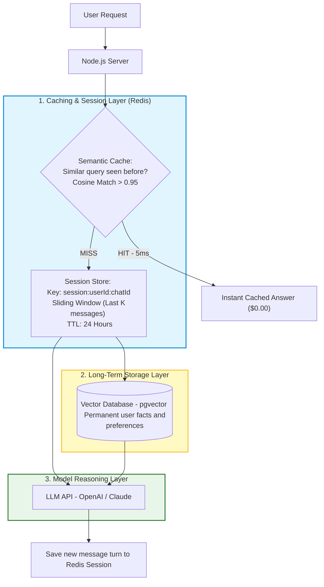

# Tools, Memory, and Planning

---

### What
These are the three core components that upgrade an AI Model into a powerful AI Agent:
1. **Tools:** External functions the AI can use (e.g., Search Internet, Query DB, Send Email).
2. **Memory:** How the AI remembers what happened.
   - *Short-term Memory:* The current conversation context.
   - *Long-term Memory:* Remembering facts from days or weeks ago (usually stored in Vector Databases).
3. **Planning & Reasoning:** The ability of the LLM to break a massive task into step 1, step 2, and step 3 before attempting execution.

---

### Why
Without tools, an AI is trapped in its training data (which is outdated the moment it's created). Without memory, it feels like dealing with an amnesiac who forgets your name every 5 minutes. Without planning, the AI will wildly attempt a complex task in a single step and fail completely.

---

### How
- **Tools:** You define a coding function (e.g., `sendEmail()`). You tell the LLM, "If you need to send an email, output the JSON `{action: sendEmail}`."
- **Memory:** On every request, you pass the previous chat logs alongside the new prompt.
- **Planning:** You use a Prompt Engineering technique like **Chain of Thought** ("Think step-by-step before answering").

---

### Implementation

Let's look at managing Short-Term Memory in TypeScript. Memory is literally just an array of message objects!

```typescript
// Define the structure of a chat message
interface Message {
  role: "user" | "ai" | "system";
  content: string;
}

class AgentMemory {
  // This array IS the agent's short-term memory
  history: Message[] = [];

  constructor() {
    // Setting up the system personality
    this.history.push({ 
      role: "system", 
      content: "You are a helpful assistant. Keep answers short." 
    });
  }

  // Add the user's new message to memory
  addUserInput(text: string) {
    this.history.push({ role: "user", content: text });
  }

  // Add the AI's response to memory
  addAIResponse(text: string) {
    this.history.push({ role: "ai", content: text });
  }

  // Get the entire conversation block to send to the LLM API
  getConversationContext(): Message[] {
    return this.history;
  }
}

// Usage
const memory = new AgentMemory();
memory.addUserInput("Hi, my name is Nishant.");
memory.addAIResponse("Hello Nishant! How can I help?");
memory.addUserInput("What is my name?"); 

// Now, if you send `memory.getConversationContext()` to the API, 
// the AI will successfully answer "Nishant" because the memory was passed!
```

---

### Steps
1. **Planning:** Write a system prompt forcing the AI to list out its steps before providing the final answer.
2. **Memory Context Window:** Keep an eye on your short-term memory array. If a conversation gets too long, it might exceed the model's token limit. You may need to delete older messages from the array.
3. **Tools Definition:** Give the AI exact data formats (JSON schemas) for how it should trigger a tool.

---

### Memory & Cache System Design (Short & Descriptive)

In real-world production, storing memory in an in-memory JS array resets whenever the server restarts and blows up token limits. 

Here is the **Tiered Memory & Cache Architecture**:



#### The 3 Memory Storage Tiers:
1. **Semantic Response Cache (Redis Vector)**:
   - Caches prompt embeddings $\to$ LLM answers.
   - If similarity $> 0.95$, returns the cached answer in **5ms for $0.00** (cuts API bills by 40–70%).
2. **Session Memory (Redis Key-Value + Sliding Window)**:
   - Stores chat history under `session:{userId}:{chatId}` with a 24h TTL.
   - **Sliding Window Buffer**: Only sends the last $K$ turns (e.g., last 6 messages) to keep token costs constant and predictable.
3. **Long-Term Memory (PostgreSQL `pgvector` / Pinecone)**:
   - Stores permanent user preferences, bio facts, and uploaded docs.
   - Retrieved via semantic search (RAG) when relevant to the query.

#### Quick Implementation (Redis Sliding Window Session Cache):

```typescript
// Production Session Memory with Redis & Sliding Window (Max K messages)
class RedisSessionMemory {
  private redis: any; // Redis client (ioredis)
  private maxTurns: number;

  constructor(redisClient: any, maxTurns = 6) {
    this.redis = redisClient;
    this.maxTurns = maxTurns;
  }

  // 1. Save message with sliding window pruning and 24h TTL
  async appendMessage(sessionId: string, message: { role: string; content: string }) {
    const key = `session:${sessionId}:history`;
    await this.redis.rpush(key, JSON.stringify(message));
    // Keep only last N messages (Sliding Window)
    await this.redis.ltrim(key, -this.maxTurns, -1);
    await this.redis.expire(key, 86400); // 24 hours TTL
  }

  // 2. Fetch context to pass to LLM
  async getContext(sessionId: string): Promise<Array<{ role: string; content: string }>> {
    const raw = await this.redis.lrange(`session:${sessionId}:history`, 0, -1);
    return raw.map((item: string) => JSON.parse(item));
  }
}
```

---

### Integration

* **React:** Manage Short-Term Memory in React State (`useState()`). Render the array of messages as a chat interface.
* **Next.js:** Next.js can receive the entire history array, pass it to the OpenAI API, and return the latest AI message.
* **Node.js backend:** For Long-Term memory, Node.js will take the user's text, turn it into an embedding, and save it permanently into a Vector Database.

---

### Impact
Combining these three aspects allows for things like AI Software Engineers (Devin) which can read a git issue (Memory), figure out which files need to be edited (Planning), search the codebase, edit code, and push to GitHub (Tools).

---

### Interview Questions
1. **What is "Chain of Thought" reasoning?**
   *Answer: A technique where you prompt the LLM to explain its reasoning step-by-step before arriving at the final answer. It significantly improves the model's logic.*
2. **How does an AI model "remember" a conversation?**
   *Answer: Models natively have no memory at all. Memory is purely achieved by the developer passing the entire history of the conversation back to the API on every new request.*
3. **What is Long-Term Memory in the context of AI Agents?**
   *Answer: Storing past interactions permanently outside of the immediate conversation window, usually in a Vector Database, to be retrieved dynamically later using semantic search.*

---

### Summary
* Natively, AI Models are blind, amnesic, and impulsive. 
* Tools give them vision and hands in the real world.
* Memory arrays give them context.
* Step-by-step planning gives them logical structure.

---
Prev : [08_agent_types_and_lifecycle.md](./08_agent_types_and_lifecycle.md) | Next : [10_function_calling_and_rag.md](./10_function_calling_and_rag.md)
