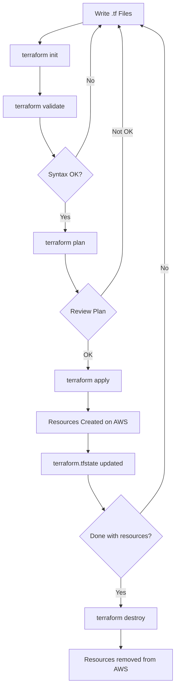

# 43 – Terraform Day 2: IaC Commands, Code Structure & AWS Workflow

> **Batch:** 43 | **Date:** 2026-05-19 | **Topic:** Terraform – Infrastructure as Code (Day 2)

---

## Table of Contents

1. [Terraform vs Ansible – What's the Difference?](#1-terraform-vs-ansible--whats-the-difference)
2. [Terraform Code Structure](#2-terraform-code-structure)
3. [Terraform CLI Commands](#3-terraform-cli-commands)
4. [State File – The Brain of Terraform](#4-state-file--the-brain-of-terraform)
5. [Hands-On: EC2, IAM, S3 via Terraform](#5-hands-on-ec2-iam-s3-via-terraform)
6. [PR Workflow with Terraform](#6-pr-workflow-with-terraform)
7. [What Terraform Does NOT Do](#7-what-terraform-does-not-do)
8. [Visual Diagrams](#8-visual-diagrams)
9. [Scenario-Based Q&A](#9-scenario-based-qa)
10. [Interview Q&A](#10-interview-qa)
11. [Tech Stack Mapping](#11-tech-stack-mapping)
12. [Code / Practical Examples](#12-code--practical-examples)

---

## 1. Terraform vs Ansible – What's the Difference?

### What

| Feature | Terraform | Ansible |
|---|---|---|
| **Category** | Infrastructure Provisioning (IaC) | Configuration Management |
| **Language** | HCL (HashiCorp Configuration Language) | YAML |
| **State file** | Yes – tracks what it created | No state file |
| **Providers** | 6,500+ (AWS, Azure, GCP, etc.) | Modules/roles |
| **Cloud Agnostic** | Yes | Partially |
| **Best for** | Creating servers, networks, buckets | Installing software, config on servers |

### Why

- You need **two different tools** for two different jobs:
  - **Terraform** = *Build the house* (spin up EC2, VPC, RDS)
  - **Ansible** = *Furnish the house* (install Nginx, copy config files, set up users)
- Neither tool does both jobs well.

### How

```
Step 1: Terraform creates the EC2 instance (infra provisioning)
Step 2: Ansible connects to that EC2 and installs Node.js (config management)
```

### Impact

| Situation | Effect |
|---|---|
| Use Terraform alone | Can create infra but can't configure software on it |
| Use Ansible alone | Can configure software but can't create the servers |
| Use both together | Full automation from infra → to running application |

### Cloud-Native Alternatives

| Tool | Best For |
|---|---|
| **Terraform** | Multi-cloud / Hybrid cloud |
| **CloudFormation** | AWS-only environments |
| **ARM Templates** | Azure-only environments |
| **Pulumi** | Developers who want to use Python/Go instead of HCL |

---

## 2. Terraform Code Structure

### What

Terraform code is written in `.tf` files using HCL. A typical project splits code across three files:

```
project/
├── main.tf        ← Resources to create (EC2, S3, IAM, etc.)
├── provider.tf    ← Which cloud provider + region
└── variable.tf    ← Variables (reusable values)
```

### Why Split Into Multiple Files?

- Keeps code **modular** and **readable**
- Makes it easy to change the cloud provider without touching resource definitions
- Variables allow reuse across environments (dev/staging/prod)

### The Three Core Blocks

#### Block 1: `terraform {}` – Version Lock

```hcl
terraform {
  required_version = ">= 0.14"
  required_providers {
    aws = {
      source  = "hashicorp/aws"
      version = "~> 5.0"
    }
  }
}
```

> ⚠️ **Why >= 0.14?** Versions before 0.14 stored your AWS access/secret keys in plain text inside the state file — a huge security risk!

#### Block 2: `provider {}` – Cloud + Region

```hcl
provider "aws" {
  region = "us-east-1"
}
```

This tells Terraform: *"I am talking to AWS, in the N. Virginia region."*

#### Block 3: `resource {}` – What to Create

```hcl
resource "aws_instance" "my_server" {
  ami           = "ami-0c55b159cbfafe1f0"
  instance_type = "t2.micro"

  tags = {
    Name = "MyEC2Instance"
  }
}
```

Format: `resource "PROVIDER_RESOURCE_TYPE" "LOCAL_NAME" { ... }`

### Impact

| Missing Block | Problem |
|---|---|
| No `terraform {}` | Wrong provider version may be downloaded |
| No `provider {}` | Terraform won't know which cloud or region |
| No `resource {}` | Nothing gets created |

---

## 3. Terraform CLI Commands

### What & How (Step-by-Step Lifecycle)

```
terraform init → terraform validate → terraform plan → terraform apply → terraform destroy
```

### Each Command Explained

#### `terraform init`

- **What:** Downloads provider plugins (e.g., AWS plugin)
- **When:** Always run first, or when you add a new provider
- **Creates:** `.terraform/` folder with downloaded plugins

```bash
terraform init
```

#### `terraform validate`

- **What:** Checks if your `.tf` files have correct syntax
- **When:** After writing or editing code, before planning
- **Does NOT:** Check if resources exist in AWS — only checks code correctness

```bash
terraform validate
# Output: Success! The configuration is valid.
```

> ⚠️ You **must** run `terraform init` before `terraform validate` — otherwise the provider plugin isn't available and validation fails.

#### `terraform plan`

- **What:** Shows what Terraform *will* do without actually doing it
- **Output:** A list of resources to add (`+`), change (`~`), or destroy (`-`)
- **Also:** Creates/updates the state file

```bash
terraform plan
# + aws_instance.my_server will be created
```

Think of it like a **dry run** or a shopping cart — you see everything before you checkout.

#### `terraform apply`

- **What:** Actually provisions the resources on AWS
- **Asks:** Confirms before creating (type `yes`)
- **Creates:** Updates the `.tfstate` file with real resource IDs

```bash
terraform apply
# Do you want to perform these actions? yes
```

#### `terraform destroy`

- **What:** Deletes all resources Terraform created
- **VERY IMPORTANT:** Always destroy when done in a learning environment to avoid AWS billing charges!

```bash
terraform destroy
# Do you really want to destroy all resources? yes
```

#### `terraform import`

- **What:** Imports an existing manually-created AWS resource into Terraform's state
- **When:** Someone created an EC2 instance manually (via console), and you want Terraform to manage it

```bash
terraform import aws_instance.my_server i-0abcd1234efgh5678
```

#### `terraform refresh`

- **What:** Syncs the state file with the actual current state of AWS resources
- **When:** Someone manually changed a resource outside Terraform (e.g., changed instance type in AWS console)

```bash
terraform refresh
```

### Command Summary Table

| Command | Purpose | Touches AWS? |
|---|---|---|
| `init` | Download plugins | No |
| `validate` | Check syntax | No |
| `plan` | Preview changes | Read-only |
| `apply` | Create/update resources | Yes ✅ |
| `destroy` | Delete resources | Yes ✅ |
| `import` | Bring manual resource into state | Read + Write state |
| `refresh` | Sync state with real AWS | Read AWS |

---

## 4. State File – The Brain of Terraform

### What

A file called `terraform.tfstate` that Terraform creates automatically. It tracks:
- What resources were created
- Their AWS resource IDs (e.g., instance ID, bucket name)
- Current configuration

### Why

Without the state file, Terraform wouldn't know:
- What it already created
- What needs to be updated vs. recreated

### How It Works

```
terraform apply
    ↓
Provisions EC2 on AWS
    ↓
Writes to terraform.tfstate:
  { "resource": "aws_instance", "id": "i-0abc123", "type": "t2.micro" }
    ↓
Next time terraform plan runs → compares .tf files vs state file → shows diff
```

### Impact

| Situation | Effect |
|---|---|
| State file exists and is correct | `plan` shows only real differences |
| State file is deleted | Terraform thinks nothing exists → tries to create duplicates |
| State file is out of sync | Use `terraform refresh` or `terraform import` to fix |
| State file stored locally | Risky for teams — two people can't work simultaneously |
| State file stored in S3 (remote) | Safe for teams — single source of truth |

---

## 5. Hands-On: EC2, IAM, S3 via Terraform

### EC2 Instance

```hcl
resource "aws_instance" "web" {
  ami           = "ami-0c55b159cbfafe1f0"
  instance_type = "t2.micro"   # Free-tier eligible

  tags = {
    Name        = "WebServer"
    Environment = "Dev"
  }
}
```

> ⚠️ **Class Issue:** Some students got errors because their AWS accounts weren't free-tier eligible for `t2.micro`. Always check your account type before choosing instance types.

### IAM User

```hcl
resource "aws_iam_user" "developer" {
  name = "john-dev"
  path = "/users/"

  tags = {
    Team = "Backend"
  }
}
```

### S3 Bucket

```hcl
resource "aws_s3_bucket" "assets" {
  bucket = "my-project-assets-bucket-2026"

  tags = {
    Name        = "AssetsBucket"
    Environment = "Dev"
  }
}
```

---

## 6. PR Workflow with Terraform

### What

The team practiced a GitHub Pull Request (PR) workflow for Terraform changes — the standard way to review infrastructure changes before they go live.

### Steps

```
1. Fork the repository
       ↓
2. Create a feature branch
       ↓
3. Edit .tf files (add/change resources)
       ↓
4. Commit changes
       ↓
5. Raise a Pull Request (PR)
       ↓
6. Team reviews the PR
       ↓
7. Merge → CI/CD pipeline runs terraform apply
```

### Why This Matters

- No one pushes directly to `main`
- Every infra change is reviewed before provisioning
- Creates an audit trail of what changed, when, and why
- `terraform plan` output can be added to PR comments so reviewers see the impact

---

## 7. What Terraform Does NOT Do

### Auto-Scaling

- Terraform can **create** an Auto Scaling Group (ASG), but it does **not handle** the actual scaling logic
- AWS Auto Scaling Service monitors CPU/memory and adds/removes instances
- Terraform just defines the ASG config; AWS does the real-time scaling

```
Terraform Role:  Define ASG (min=2, max=10, target CPU=70%)
AWS Role:        Actually add/remove EC2 instances based on load
```

---

## 8. Visual Diagrams

### Terraform Lifecycle Flow

```
┌─────────────────────────────────────────────────────────────────┐
│                    TERRAFORM LIFECYCLE                          │
└─────────────────────────────────────────────────────────────────┘

  Write Code          Init            Validate
  ──────────       ──────────       ──────────
  main.tf    ───►  Download   ───►  Syntax
  provider.tf      Plugins          Check
  variable.tf      (.terraform/)
      │                                │
      └────────────────────────────────┘
                         │
                         ▼
                      Plan
                   ──────────
                   Preview what
                   will change
                   (+ add, ~ change, - destroy)
                         │
                         ▼
                      Apply
                   ──────────
                   Provision
                   on AWS
                   Update .tfstate
                         │
                         ▼
                      Destroy
                   ──────────
                   Remove all
                   resources
                   (avoid billing!)
```

### Terraform vs Ansible – Who Does What

```
┌──────────────────────────────────────────────────────────────┐
│                 INFRA PROVISIONING (Terraform)                │
│                                                              │
│   HCL Code  ──►  terraform apply  ──►  AWS Resources        │
│   main.tf                              EC2 Instance          │
│   provider.tf                          S3 Bucket             │
│   variable.tf                          IAM User              │
└──────────────────────────┬───────────────────────────────────┘
                           │
                           │  (resources now exist)
                           │
┌──────────────────────────▼───────────────────────────────────┐
│               CONFIG MANAGEMENT (Ansible)                     │
│                                                              │
│   YAML Playbook  ──►  ansible-playbook  ──►  Configured      │
│   install_node.yml                          Node.js installed │
│   setup_nginx.yml                           Nginx running     │
│   configure_app.yml                         App deployed      │
└──────────────────────────────────────────────────────────────┘
```

### State File Flow

```
  .tf files                State File              AWS
  ─────────                ──────────              ───
  resource "aws_instance"  terraform.tfstate       Real EC2
  { type = "t2.micro" }   { id = "i-0abc123"  }   instance
                          { type = "t2.micro" } }
        │                        │                    │
        └──────── terraform plan ─┘                    │
                  (compare config vs state)            │
                         │                             │
                         └──── terraform refresh ──────┘
                               (sync state with AWS)
```

### Mermaid Diagram – Terraform Command Flow



---

## 9. Scenario-Based Q&A

🔍 **Scenario 1:** Your teammate manually created an EC2 instance in the AWS console to test something. Now you want Terraform to manage it. What do you do?

✅ **Answer:** Use `terraform import` to bring the manually created resource into Terraform's state file. After importing, Terraform will track and manage it like any other resource.

```bash
terraform import aws_instance.test i-0abc123456789
```

---

🔍 **Scenario 2:** You're using Terraform in a team. One teammate runs `terraform apply` and it fails because someone else already applied changes. What's the root cause and fix?

✅ **Answer:** The state file is stored locally, causing conflicts. The fix is to use **remote state** (store `terraform.tfstate` in an S3 bucket with DynamoDB locking). This ensures only one person can apply changes at a time.

---

🔍 **Scenario 3:** You wrote a Terraform file to create an S3 bucket, but when you run `terraform validate`, it says the provider isn't initialized. What did you miss?

✅ **Answer:** You forgot to run `terraform init` first. The validate command needs the AWS provider plugin to be downloaded, which `init` handles.

---

🔍 **Scenario 4:** You applied Terraform and created 5 EC2 instances. At end of day, you forgot to destroy them. What happens?

✅ **Answer:** AWS bills you for every hour those instances run — even overnight. Always run `terraform destroy` at the end of a learning session to avoid unexpected charges.

---

🔍 **Scenario 5:** Your app is under heavy load and needs to scale from 2 to 10 instances. Will Terraform handle this automatically?

✅ **Answer:** No. Terraform can define an Auto Scaling Group configuration, but the **actual scaling** (adding/removing instances based on CPU load) is handled by AWS Auto Scaling Service, not Terraform.

---

🔍 **Scenario 6:** You want to deploy the same infrastructure to both `us-east-1` and `ap-south-1`. How do you avoid repeating code?

✅ **Answer:** Use `variable.tf` to define the region as a variable. Pass different values at runtime using `-var` or `terraform.tfvars` files per environment.

```hcl
variable "aws_region" {
  default = "us-east-1"
}

provider "aws" {
  region = var.aws_region
}
```

---

## 10. Interview Q&A

**Q1. What is Terraform and how is it different from Ansible?**

A: Terraform is an Infrastructure as Code (IaC) tool used to **provision** cloud resources like EC2 instances, S3 buckets, and VPCs using HCL. Ansible is a **configuration management** tool that installs software and manages settings on already-existing servers using YAML playbooks. Terraform creates the infrastructure; Ansible configures it.

---

**Q2. What is a Terraform state file and why is it important?**

A: The state file (`terraform.tfstate`) is Terraform's memory. It records the current state of all resources Terraform manages — including their AWS resource IDs and configurations. Without it, Terraform cannot know what it has already created, leading to duplicate resources or failed updates.

---

**Q3. What is the correct order of Terraform commands and why?**

A: The correct order is `init → validate → plan → apply → destroy`.
- `init` downloads plugins
- `validate` checks syntax (requires plugins from init)
- `plan` previews changes
- `apply` creates resources
- `destroy` removes them

Skipping `init` before `validate` will fail because the provider plugin isn't available yet.

---

**Q4. Why should you use Terraform version >= 0.14?**

A: Versions before 0.14 stored AWS access keys and secret keys in plain text inside the state file, which is a serious security vulnerability. Version 0.14+ marks sensitive values as encrypted/sensitive in the state file.

---

**Q5. What is `terraform import` and when would you use it?**

A: `terraform import` is used to bring an existing manually-created AWS resource under Terraform management. For example, if a developer created an EC2 instance via the AWS console, you'd use `terraform import aws_instance.name <instance-id>` to add it to the state file so Terraform can track and manage it going forward.

---

**Q6. How do you manage Terraform state in a team environment?**

A: Store the state file remotely using an **S3 backend** with **DynamoDB table locking**. This ensures all team members share a single source of truth and prevents two people from running `terraform apply` simultaneously (which would corrupt the state).

```hcl
terraform {
  backend "s3" {
    bucket         = "my-tf-state-bucket"
    key            = "prod/terraform.tfstate"
    region         = "us-east-1"
    dynamodb_table = "terraform-lock"
  }
}
```

---

**Q7. What is the difference between `terraform plan` and `terraform apply`?**

A: `terraform plan` is a dry run — it shows what changes will be made without actually making them. It's safe to run multiple times. `terraform apply` actually provisions, updates, or destroys resources on AWS. Always review the plan output before applying.

---

**Q8. Does Terraform handle auto-scaling?**

A: Terraform can **define** Auto Scaling Group (ASG) configurations (min instances, max instances, scaling policies), but it does not handle the **real-time scaling** logic. AWS Auto Scaling Service monitors metrics (like CPU utilization) and automatically adds or removes EC2 instances based on the defined policy. Terraform just writes the blueprint; AWS does the actual scaling work.

---

**Q9. What is the difference between CloudFormation, ARM Templates, and Terraform?**

A: CloudFormation is AWS-native and only works with AWS. ARM Templates are Azure-native. Terraform is **cloud-agnostic** — the same HCL structure works across AWS, Azure, GCP, and 6,500+ other providers. For multi-cloud or hybrid cloud environments, Terraform is the preferred choice.

---

**Q10. What happens if you delete the `terraform.tfstate` file?**

A: Terraform loses all knowledge of what it created. The next `terraform plan` will think no resources exist and try to create them again — resulting in duplicate resources in AWS (and extra billing costs). Always back up the state file, preferably by storing it remotely in S3.

---

## 11. Tech Stack Mapping

### Tools Used in This Session

| Tool | Role |
|---|---|
| **Terraform** | Infrastructure provisioning (IaC) |
| **AWS EC2** | Compute resource created by Terraform |
| **AWS IAM** | User/access management via Terraform |
| **AWS S3** | Object storage bucket via Terraform |
| **GitHub** | Source control for `.tf` files + PR workflow |
| **HCL** | Language used to write Terraform configs |

### Real-World DevOps Usage

#### Node.js App Deployment Flow

```
Developer writes code
        ↓
Pushes to GitHub (PR raised)
        ↓
CI/CD pipeline triggers (Jenkins / GitHub Actions)
        ↓
terraform plan → output posted to PR
        ↓
PR approved and merged
        ↓
terraform apply → EC2 + RDS + S3 provisioned
        ↓
Ansible / User Data installs Node.js + PM2
        ↓
App running on EC2
```

#### Jenkins + Terraform Integration

```groovy
pipeline {
  agent any
  stages {
    stage('Terraform Init') {
      steps { sh 'terraform init' }
    }
    stage('Terraform Validate') {
      steps { sh 'terraform validate' }
    }
    stage('Terraform Plan') {
      steps { sh 'terraform plan -out=tfplan' }
    }
    stage('Terraform Apply') {
      steps {
        input message: 'Approve Terraform Apply?'
        sh 'terraform apply tfplan'
      }
    }
  }
}
```

#### MongoDB + PostgreSQL on AWS via Terraform

```hcl
# RDS PostgreSQL
resource "aws_db_instance" "postgres" {
  engine            = "postgres"
  instance_class    = "db.t3.micro"
  allocated_storage = 20
  db_name           = "appdb"
  username          = "admin"
  password          = var.db_password
  skip_final_snapshot = true
}

# ElastiCache Redis
resource "aws_elasticache_cluster" "redis" {
  cluster_id        = "app-redis"
  engine            = "redis"
  node_type         = "cache.t3.micro"
  num_cache_nodes   = 1
  port              = 6379
}
```

---

## 12. Code / Practical Examples

### Complete Project Structure

```
terraform-aws-project/
├── main.tf
├── provider.tf
├── variable.tf
├── outputs.tf
└── terraform.tfstate      ← auto-generated, do NOT commit to Git
```

### `provider.tf`

```hcl
terraform {
  required_version = ">= 0.14"
  required_providers {
    aws = {
      source  = "hashicorp/aws"
      version = "~> 5.0"
    }
  }
}

provider "aws" {
  region = var.aws_region
}
```

### `variable.tf`

```hcl
variable "aws_region" {
  description = "AWS Region to deploy resources"
  type        = string
  default     = "us-east-1"
}

variable "instance_type" {
  description = "EC2 instance type"
  type        = string
  default     = "t2.micro"
}

variable "environment" {
  description = "Environment name"
  type        = string
  default     = "dev"
}
```

### `main.tf`

```hcl
# EC2 Instance
resource "aws_instance" "web_server" {
  ami           = "ami-0c55b159cbfafe1f0"
  instance_type = var.instance_type

  tags = {
    Name        = "WebServer-${var.environment}"
    Environment = var.environment
  }
}

# S3 Bucket
resource "aws_s3_bucket" "app_assets" {
  bucket = "my-app-assets-${var.environment}-2026"

  tags = {
    Name        = "AppAssets"
    Environment = var.environment
  }
}

# IAM User
resource "aws_iam_user" "developer" {
  name = "dev-user-${var.environment}"

  tags = {
    Team = "Engineering"
  }
}
```

### `outputs.tf`

```hcl
output "ec2_public_ip" {
  description = "Public IP of EC2 instance"
  value       = aws_instance.web_server.public_ip
}

output "s3_bucket_name" {
  description = "Name of the S3 bucket"
  value       = aws_s3_bucket.app_assets.bucket
}
```

### Deployment Steps

```bash
# Step 1: Initialize Terraform (download AWS provider plugin)
terraform init

# Step 2: Validate syntax
terraform validate

# Step 3: Preview changes
terraform plan

# Step 4: Apply (create resources on AWS)
terraform apply

# To override default variable values:
terraform apply -var="aws_region=ap-south-1" -var="instance_type=t3.micro"

# Step 5: When done (ALWAYS DO THIS to avoid billing!)
terraform destroy
```

### Remote State with S3 (Team Setup)

```hcl
# In provider.tf — add this backend block
terraform {
  backend "s3" {
    bucket         = "company-terraform-state"
    key            = "projects/my-app/terraform.tfstate"
    region         = "us-east-1"
    dynamodb_table = "terraform-state-lock"
    encrypt        = true
  }
}
```

```bash
# Create S3 bucket for state (one-time setup)
aws s3 mb s3://company-terraform-state

# Create DynamoDB table for locking
aws dynamodb create-table \
  --table-name terraform-state-lock \
  --attribute-definitions AttributeName=LockID,AttributeType=S \
  --key-schema AttributeName=LockID,KeyType=HASH \
  --billing-mode PAY_PER_REQUEST
```

### `.gitignore` for Terraform Projects

```gitignore
# Terraform state files — never commit these!
*.tfstate
*.tfstate.backup
.terraform/
.terraform.lock.hcl

# Variable files with secrets
*.tfvars
terraform.tfvars
```


← Previous: [`42_Terraform_&_Infrastructure_as_Code_(IaC).md`](42_Terraform_&_Infrastructure_as_Code_(IaC).md) | Next: [`44_Terraform_Day3_Modules_And_Remote_State.md`](44_Terraform_Day3_Modules_And_Remote_State.md) →