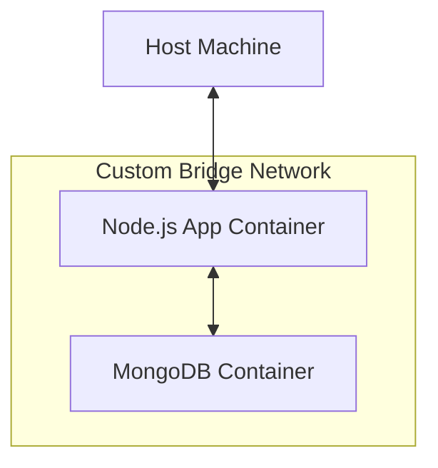

# Docker Networks

## Why This Exists
In a real-world application, your app doesn't live in isolation. Your Node.js backend needs to talk to your MongoDB database, and your React frontend might need to talk to your Node.js backend.

By default, containers cannot talk to each other by name unless they are on the same network. Docker Networks provide the infrastructure for containers to communicate securely and efficiently.

## Real World Analogy
Think of Docker Networks like an **Office LAN (Local Area Network)** or a **Private Phone System**.
- If you have two containers on the default bridge network, it's like two employees in different buildings with no phone connection. They can't talk.
- If you create a custom bridge network and put both containers in it, it's like putting them in the same room with a direct phone line. They can just call each other by name ("Hey Node App", "Hey Mongo DB").

## Core Concepts
- **Bridge Network**: The default network type. Good for containers running on the same host.
- **Host Network**: The container shares the host's networking namespace. No port mapping needed (faster but less secure).
- **Overlay Network**: Used for connecting containers across multiple Docker hosts (Docker Swarm).
- **None Network**: Disables all networking for the container. Maximum security for isolated tasks.

## Architecture / Flow



### Understanding the Flow:
1. **Isolated Network**: Docker creates a virtual software bridge (network). Containers attached to it can talk to each other.
2. **Built-in DNS**: Docker runs a DNS server. When the Node.js app tries to connect to `mongodb://mongo-db:27017`, Docker resolves `mongo-db` to the internal IP of the MongoDB container.
3. **External Access**: The Host Machine can only talk to containers that expose ports (like the Node.js app). The database can remain hidden from the outside world while still being accessible to the app.


## Practical Commands
```bash
# List networks
docker network ls

# Create a custom bridge network
docker network create my-net

# Inspect a network (see connected containers and IPs)
docker network inspect my-net

# Run a container on a specific network
docker run -d --name db --network my-net mongo:latest

# Connect a running container to a network
docker network connect my-net existing-container

# Disconnect a container from a network
docker network disconnect my-net existing-container

# Remove a network
docker network rm my-net
```

## Hands-On Exercise
Let's see how containers can communicate by name.

1. Create a network:
   ```bash
   docker network create app-net
   ```
2. Run a MongoDB container on that network:
   ```bash
   docker run -d --name mongo-db --network app-net mongo:latest
   ```
3. Run a temporary container on the same network and ping MongoDB by name:
   ```bash
   docker run --rm --network app-net alpine ping -c 4 mongo-db
   ```
   *Note: It works! Docker resolves the container name to its internal IP address.*

## Mini Project
**Task**: Connect a Node.js app to a MongoDB database using Docker Networks.

1. Run MongoDB on a custom network:
   ```bash
   docker network create project-net
   docker run -d --name database --network project-net mongo:latest
   ```
2. Run a Node.js container (assume it has code to connect to `mongodb://database:27017`):
   ```bash
   docker run -d --name app --network project-net -p 3000:3000 my-node-app
   ```
   *Note: The app can connect to `database` by name!*

## Real Production Usage
- **Microservices**: In a microservices architecture, services often talk to each other via internal networks while only the API Gateway is exposed to the public internet.
- **Service Discovery**: Docker's built-in DNS server handles name resolution automatically.
- **Security**: By placing your database on a network not exposed to the host, you prevent external access.

## Common Mistakes
- **Using default bridge network**: If you use the default bridge network (by not specifying `--network`), containers cannot resolve each other by name. They must use IP addresses, which change whenever containers restart. Always create custom networks.
- **Exposing database ports unnecessarily**: If your app and database are on the same network, you don't need to expose the DB port to the host (`-p 27017:27017`). Keep it internal.

## Debugging Guide
- **Connection Refused**:
  - Verify both containers are on the same network: `docker network inspect <net_name>`.
  - Verify the target container is actually running.
  - Check the port being used.

## Best Practices
- **Create a network for each app**: Don't put all containers for different projects on one giant network.
- **Don't expose internal ports**: Only expose ports that need to be accessed from outside the host (like your web server port).

## Interview Questions
1. **How do containers communicate with each other in Docker?**
   *Answer*: They communicate by placing them on the same custom network and using container names as hostnames (Docker DNS handles the rest).
2. **Why shouldn't you use the default bridge network in production?**
   *Answer*: Because the default bridge network does not support automatic service discovery (DNS resolution) by container name.

## Summary
Docker Networks enable secure communication between containers. By using custom bridge networks, you get automatic name resolution, which is essential for multi-container applications like web apps with databases.

---
Prev: [04_volumes.md](./04_volumes.md) | Index: [Index](../00_index.md) | Next: [06_ports.md](./06_ports.md)
