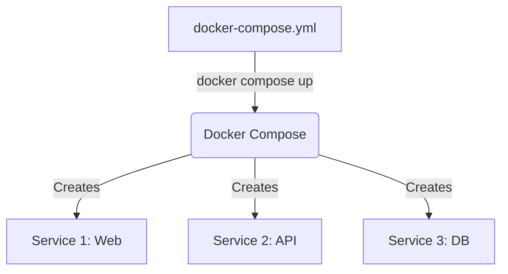

# Docker Compose

## Why This Exists
So far, we've been running individual containers manually. But what if your application requires a Node.js backend, a React frontend, a MongoDB database, and a Redis cache?
Running `docker run` with all the networks, volumes, and environment variables for 4 different containers manually is tedious, error-prone, and hard to share with other developers.

Docker Compose exists to solve this. It allows you to define and run multi-container Docker applications using a single YAML file. With one command, you can create and start all the services your app needs.

## Real World Analogy
Think of Docker Compose like a **Conductor of an Orchestra** or a **Blueprint for a House**.
- Instead of telling the violinist, the cellist, and the drummer individually when to play (running manual `docker run` commands), the conductor coordinates all of them to play together.
- The YAML file is the sheet music that describes exactly what every instrument (container) should do.

## Core Concepts
- **`docker-compose.yml`**: The file where you define your services, networks, and volumes.
- **Services**: The containers that make up your application (e.g., `web`, `db`).
- **Volumes**: Persistent data storage definitions.
- **Networks**: Communication channels between services.

## Architecture / Flow



### How it Works:
1. **The Blueprint**: You define all your services, networks, and volumes in a single `docker-compose.yml` file.
2. **The Execution**: When you run `docker compose up`, the Compose tool reads the file and makes calls to the Docker API to create all the resources in the correct order.
3. **Automatic Networking**: Compose automatically creates a default network for your app and attaches all services to it, enabling them to talk to each other by service name (e.g., `web` can talk to `db`).


## Practical Commands
```bash
# Start all services defined in the file
docker compose up

# Start in detached mode (background)
docker compose up -d

# Stop and remove all containers, networks, and volumes
docker compose down

# View logs for all services
docker compose logs

# View logs for a specific service
docker compose logs web

# List running services
docker compose ps

# Run a command inside a service
docker compose exec web sh
```
*Note: Older versions used `docker-compose` (with a hyphen). Modern Docker uses `docker compose` (with a space).*

## Hands-On Exercise
Let's create a simple multi-container setup with Nginx and Redis.

1. Create a file named `docker-compose.yml`:
   ```yaml
   version: '3.8'

   services:
     web:
       image: nginx:latest
       ports:
         - "8080:80"
       networks:
         - app-net

     cache:
       image: redis:alpine
       networks:
         - app-net

   networks:
     app-net:
       driver: bridge
   ```
2. Run it:
   ```bash
   docker compose up -d
   ```
3. Check status:
   ```bash
   docker compose ps
   ```
4. Stop it:
   ```bash
   docker compose down
   ```

## Mini Project
**Task**: Set up a Node.js app connected to a MongoDB database using Docker Compose.

1. Create a `docker-compose.yml`:
   ```yaml
   version: '3.8'

   services:
     app:
       build: .
       ports:
         - "3000:3000"
       environment:
         - MONGO_URI=mongodb://db:27017/myapp
       depends_on:
         - db
       networks:
         - back-net

     db:
       image: mongo:latest
       volumes:
         - mongo-data:/data/db
       networks:
         - back-net

   volumes:
     mongo-data:

   networks:
     back-net:
   ```
2. This single file sets up the app, the database, a volume for the database, a network for them to talk, and ensures the database starts before the app.

## Real Production Usage
- **Development**: Docker Compose is the king of local development. A new developer can clone the repo and run `docker compose up` to have the entire stack running locally in minutes.
- **Production**: While Compose can be used on a single server in production, usually for production at scale, you move to **Kubernetes** or **AWS ECS**. However, Compose files are often the starting point for creating Kubernetes manifests.

## Common Mistakes
- **Assuming `depends_on` waits for the app to be READY**: `depends_on` only ensures the container *starts* before the other. It doesn't wait for MongoDB to fully initialize and accept connections. Your app code needs to handle connection retries.
- **Forgetting to rebuild**: If you change your code or Dockerfile, `docker compose up` might not rebuild the image. Use `docker compose up --build`.

## Debugging Guide
- **Services not communicating**:
  - Verify they are on the same network in the YAML file.
  - Verify you are using the service name (e.g., `db`) as the hostname in your connection string.
- **View logs**: `docker compose logs -f` is your best friend to see what's happening.

## Best Practices
- **Use specific versions**: Specify `version: '3.8'` or similar at the top.
- **Use volumes for DBs**: Always define volumes for stateful services so data isn't lost on `compose down`.
- **Use `.env` files**: Docker Compose automatically reads a `.env` file in the same directory. Use it for environment variables.

## Interview Questions
1. **What is Docker Compose used for?**
   *Answer*: It is used for defining and running multi-container Docker applications using a single YAML file.
2. **What is the difference between `docker compose up` and `docker compose start`?**
   *Answer*: `up` creates and starts containers (and networks/volumes if needed). `start` only starts existing, stopped containers.

## Summary
Docker Compose is an essential tool for local development. It allows you to describe your entire application stack in a single file and manage it with simple commands. It bridges the gap between single containers and full orchestration.

---
Prev: [07_environment_variables.md](./07_environment_variables.md) | Index: [Index](../00_index.md) | Next: [09_multi_stage_builds.md](./09_multi_stage_builds.md)
