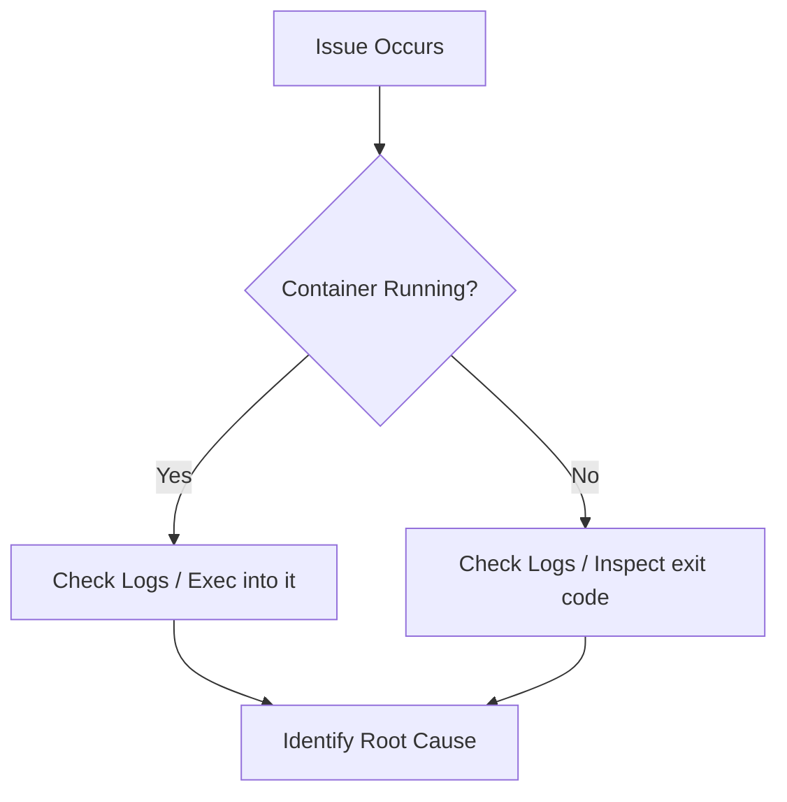

# Container Debugging

## Why This Exists
Things go wrong in production. A container might crash repeatedly (CrashLoopBackOff in K8s), or it might be running but returning 500 errors.
Unlike a traditional server where you can just SSH in and look around, containers are isolated and often lack standard debugging tools (like `curl`, `telnet`, or even a shell in case of distroless images).

Knowing how to debug containers effectively is what separates a junior developer from a senior DevOps engineer.

## Real World Analogy
Think of debugging a container like **Diagnosing a modern car vs an old car**.
- With an old car (traditional server), you can open the hood and see everything moving. You can poke around with simple tools.
- A modern car (container) has a computer cover over the engine. You can't just look at it. You need to plug in a diagnostic tool (Docker commands) to read the error codes (logs) and see what's happening inside.

## Core Concepts
- **Logs**: The stdout and stderr of the main process in the container.
- **Exec**: Running a command inside a running container.
- **Inspect**: Viewing the low-level JSON configuration of a container.
- **Top / Stats**: Monitoring resource usage (CPU, memory) of containers.

## Architecture / Flow



### Debugging Flow Breakdown:
1. **Identify the State**: First, check if the container is still running or has crashed (`docker ps -a`).
2. **If Running**: 
   - Check the logs (`docker logs`) to see application errors.
   - Use `docker exec` to get a shell inside and inspect the environment or test connections.
3. **If Stopped/Crashed**:
   - Check the logs to see the last output before death.
   - Use `docker inspect` to look for the `ExitCode`. An exit code of `0` means it finished its job successfully; anything else usually means a crash.


## Practical Commands
```bash
# View logs (follow mode)
docker logs -f <container_name>

# View the last 100 lines of logs
docker logs --tail 100 <container_name>

# Execute a command inside a running container
docker exec -it <container_name> sh

# Check resource usage
docker stats

# See running processes inside a container
docker top <container_name>

# Get detailed information (IP, mounts, env vars)
docker inspect <container_name>

# Copy files from container to host
docker cp <container_name>:/path/to/file ./local-file
```

## Hands-On Exercise
Let's debug a container that crashes.

1. Run a container that fails immediately:
   ```bash
   docker run --name broken-app alpine sh -c "echo 'Starting...'; sleep 2; exit 1"
   ```
2. Check the logs to see why it stopped:
   ```bash
   docker logs broken-app
   ```
   You should see `Starting...`.
3. Inspect the exit code:
   ```bash
   docker inspect broken-app | grep ExitCode
   ```
   You will see `"ExitCode": 1`. This confirms it crashed with an error.

## Mini Project
**Task**: Debug a Node.js app that cannot connect to a database.

1. Run the app (it expects a DB):
   ```bash
   docker run -d --name my-app -e DB_HOST=localhost -p 3000:3000 my-node-app
   ```
2. The app is not responding on `localhost:3000`.
3. Check logs:
   ```bash
   docker logs my-app
   ```
   You see: `Error: Connection refused at localhost:27017`.
4. **The Fix**: `localhost` inside a container refers to the container itself, not the host machine! You need to connect to the host machine or use a Docker network.
5. Fix by using the host's IP or a network (as covered in the Networks topic).

## Real Production Usage
- **Log Aggregation**: In production, you don't run `docker logs`. You use tools like **Fluentd**, **Logstash**, or **AWS CloudWatch** to collect logs from all containers and send them to a central place (like Elasticsearch or Grafana Loki).
- **Health Checks**: We use Docker health checks or Kubernetes probes to automatically restart containers that become unhealthy.

## Common Mistakes
- **Assuming `localhost` is the host machine**: As seen in the mini-project, `localhost` inside a container means the container itself.
- **Not logging to stdout**: Some legacy apps write logs to files inside the container. Docker cannot see these. Always configure your apps to log to standard output (stdout) and standard error (stderr).

## Debugging Guide
- **Container is slow**:
  - Run `docker stats` to check CPU and Memory usage.
  - Run `docker top <name>` to see if a process is hanging.
- **Cannot connect to service**:
  - Exec into the container and try to ping/curl the target service.
  - If tools are missing, use a temporary container on the same network that has the tools.

## Best Practices
- **Log in JSON format**: Makes it much easier for tools like ELK or Loki to parse and search logs.
- **Don't leave files in containers**: Logs should be streamed, not stored in files inside the container.

## Interview Questions
1. **How do you see the logs of a container that has already stopped?**
   *Answer*: You can still use `docker logs <container_name_or_id>` even if the container is stopped, as long as it hasn't been removed (`docker rm`).
2. **What does `docker exec` do?**
   *Answer*: It runs a new command inside an already running container. Great for debugging by opening a shell.

## Summary
Debugging containers requires understanding that they are isolated environments. Always start with `docker logs` and `docker inspect`. If the container is running, `docker exec` is your best friend to poke around inside.

---
Prev: [10_image_optimization.md](./10_image_optimization.md) | Index: [Index](../00_index.md) | Next: [12_container_security.md](./12_container_security.md)
