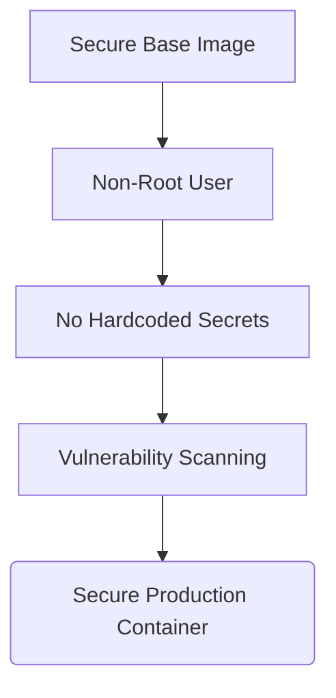

# Container Security

## Why This Exists
Just because your application is in a container doesn't mean it's secure. Containers share the host OS kernel. If a container is compromised and the process is running as root, the attacker might be able to escape the container and take over the entire host server.

Container security is about defense in depth. You need to ensure your images are free of vulnerabilities, your containers run with the least privilege, and secrets are handled securely.

## Real World Analogy
Think of Container Security like **Securing an Apartment in a Building**.
- The building has a main door (Host OS security).
- Your apartment has its own lock (Container isolation).
- Even if someone gets into the building, you don't want them to easily get into your apartment.
- And inside your apartment, you don't leave your diamond necklace (secrets) on the table; you put it in a safe.

Running as root in a container is like leaving your apartment door wide open.

## Core Concepts
- **Least Privilege**: Running applications as a non-root user.
- **Vulnerability Scanning**: Checking images for known security flaws.
- **Secrets Management**: Not hardcoding passwords or keys.
- **Read-Only Filesystem**: Preventing attackers from writing malicious files.

## Architecture / Flow



### Defense in Depth Flow:
1. **Foundation**: Start with a secure, minimal base image (like Alpine) to reduce the number of installed packages (and thus potential vulnerabilities).
2. **Execution**: Switch to a non-root user so that even if the app has a vulnerability (like Remote Code Execution), the attacker cannot easily access system files.
3. **Configuration**: Pass secrets at runtime, ensuring that no sensitive data is baked into the image layers.
4. **Validation**: Scan the image in your CI/CD pipeline to ensure no known vulnerabilities make it to production.


## Practical Commands
```bash
# Scan an image for vulnerabilities (using Docker Scout or Trivy)
docker scout quickview node:18
# or if using Trivy
trivy image node:18

# Run a container as a specific non-root user (UID 1000)
docker run --user 1000 alpine whoami

# Run a container with a read-only filesystem
docker run --read-only alpine touch /tmp/test
# (This will fail because it's read-only)
```

## Hands-On Exercise
Let's see why running as root is the default and how to change it.

1. Run a default container and check the user:
   ```bash
   docker run --rm alpine whoami
   ```
   Output: `root`. This means if the app is hacked, the hacker has root access!
2. Run it as a non-root user:
   ```bash
   docker run --rm --user 1000 alpine whoami
   ```
   Output: `1000` (or fails if user doesn't exist, but shows UID).
3. In your Dockerfile, always create and use a non-root user.

## Mini Project
**Task**: Create a secure Dockerfile for a Node.js application.

```dockerfile
FROM node:22-alpine

# Set working directory
WORKDIR /app

# Copy dependency files
COPY package*.json ./

# Install dependencies
RUN npm ci --only=production

# Copy source code
COPY . .

# Use the 'node' user provided by the official image
# instead of running as root
USER node

# Expose port
EXPOSE 3000

# Start the app
CMD ["node", "app.js"]
```

## Real Production Usage
- **Image Scanning in CI/CD**: In a production pipeline, every image is scanned before being pushed to ECR. If it contains high or critical vulnerabilities, the pipeline fails, and deployment is blocked.
- **Kubernetes Pod Security**: In K8s, we use security contexts to enforce that containers cannot run as root and cannot escalate privileges.

## Common Mistakes
- **Running as root**: This is the #1 mistake.
- **Baking secrets into images**: As mentioned before, putting passwords in the Dockerfile.
- **Using outdated base images**: Not updating your base images means you are running known vulnerabilities.

## Debugging Guide
- **Permission Denied after switching to non-root user**:
  - This happens because the files copied by `COPY` are owned by root by default.
  - Fix by changing ownership in the Dockerfile:
    ```dockerfile
    COPY --chown=node:node . .
    ```

## Best Practices
- **Never run as root** in production.
- **Use official and minimal base images** (Alpine or Distroless).
- **Scan images regularly** for vulnerabilities.
- **Mount secrets at runtime**, never bake them in.
- **Make the filesystem read-only** where possible.

## Interview Questions
1. **Why is it dangerous to run containers as root?**
   *Answer*: Because containers share the host kernel. If an attacker escapes the container, they have root access to the host machine.
2. **How do you scan Docker images for vulnerabilities?**
   *Answer*: Using tools like `docker scout`, `Trivy`, or native scanners in cloud registries like AWS ECR.

## Summary
Container security is about minimizing the attack surface. By running as non-root, using minimal images, and scanning for vulnerabilities, you can make your containerized applications much more secure.

---
Prev: [11_container_debugging.md](./11_container_debugging.md) | Index: [Index](../00_index.md) | Next: [../02_docker_intermediate/00_index.md](../02_docker_intermediate/00_index.md)
