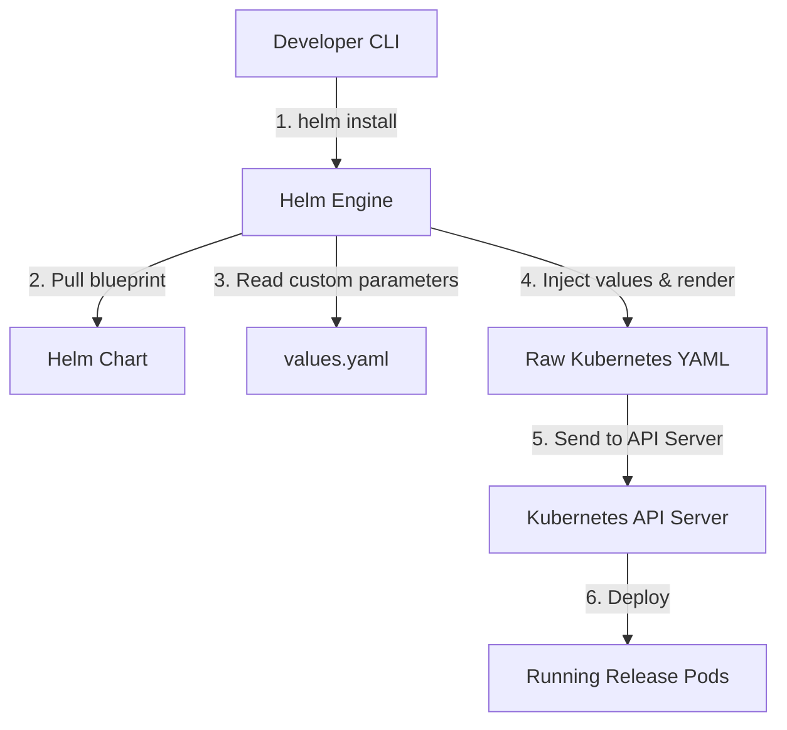
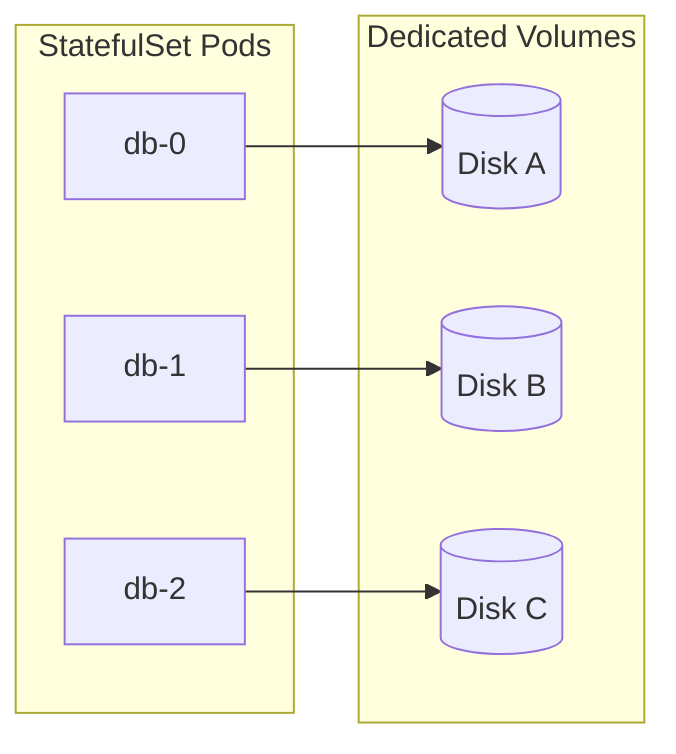
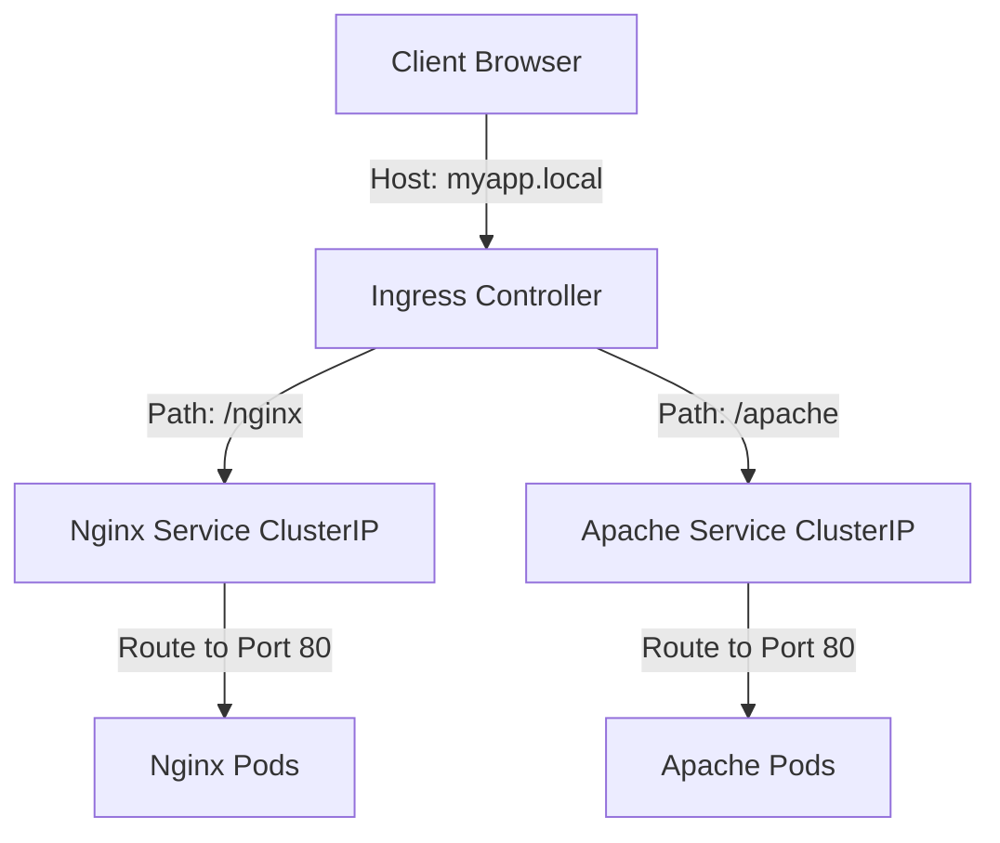
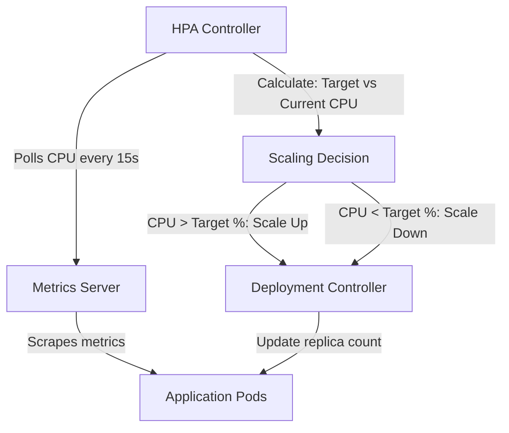
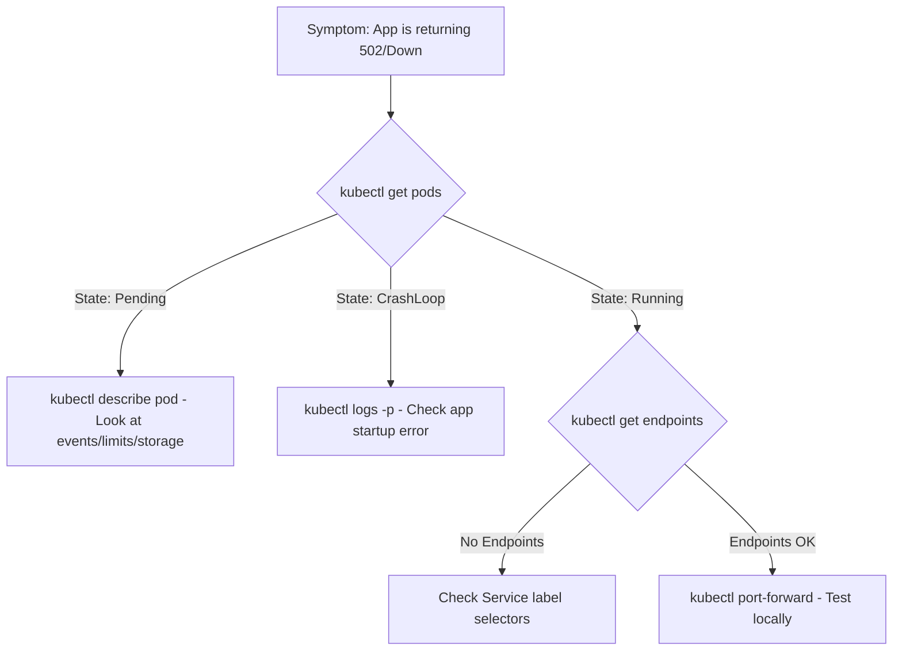

# ☸️ Kubernetes Intermediate – Complete Revision Guide

Welcome to the Kubernetes Intermediate module revision sheet. This document aggregates all key concepts, commands, configurations, YAML files, analogies, production best practices, and interview-prep notes from every topic in this directory, allowing you to perform a complete revision from a single file.

---

## 📌 Module Navigation
- [01. Helm Package Manager](#01-helm-package-manager)
- [02. StatefulSets](#02-statefulsets)
- [03. Jobs & CronJobs](#03-jobs--cronjobs)
- [04. Advanced Networking](#04-advanced-networking)
- [05. Autoscaling (HPA/VPA)](#05-autoscaling-hpavpa)
- [06. Prometheus & Grafana Monitoring](#06-prometheus--grafana-monitoring)
- [07. EFK/Loki Logging](#07-efkloki-logging)
- [08. Production Debugging](#08-production-debugging)

---

## 01. Helm Package Manager
🔗 **Full Lesson:** [01_helm.md](./01_helm.md)

* **Why It Exists**: Writing duplicate raw Kubernetes YAML files for different environments (Dev, Staging, Prod) is tedious and error-prone. Helm templates these files so you can package, parameterize, version, and share them.
* **Real-World Analogy**: **IKEA furniture**. Writing raw Kubernetes YAML is like buying raw wood and screws—you measure and cut everything yourself. Using Helm is like buying from IKEA: you get a pre-packaged box (a **Chart**) with templates, and you just fill out a quick form (**`values.yaml`**) to choose your size/color.
* **Core Concepts**:
  * **Chart**: A bundle of templated Kubernetes manifests organized in a standard directory structure.
  * **Values.yaml**: Your custom settings (e.g., replica count, image tags) injected into templates at runtime.
  * **Release**: An active instance of a Chart running inside your cluster. You can install the same chart multiple times to create separate releases.
  * **Repository**: An online repository (like Artifact Hub) where teams publish and share charts.

### Helm Flow Architecture:


### Helm Chart Directory Structure:
```text
my-chart/
├── Chart.yaml          # Metadata about the chart (name, version, apiVersion)
├── values.yaml         # Default configuration values for templates
└── templates/          # Templated K8s manifests
    ├── deployment.yaml
    ├── service.yaml
    └── _helpers.tpl    # Reusable template snippets (partials)
```

### Key Commands:
```bash
helm create my-chart                                         # Scaffold a new template chart directory
helm search repo nginx                                       # Search online repositories for a package
helm install my-nginx bitnami/nginx -f values.yaml           # Install chart release with custom values
helm upgrade my-nginx bitnami/nginx -f values-prod.yaml      # Apply configuration upgrades to an existing release
helm list                                                    # List all releases in the current namespace
helm rollback my-nginx 1                                     # Instantly roll back a release to revision 1 if updates fail
helm template my-nginx ./my-chart --debug                    # Local dry-run: prints rendered YAML to screen for syntax checks
helm lint ./my-chart                                         # Run diagnostic checks to verify chart standards
```

### Sample Template & Values Config:

**`values.yaml`**:
```yaml
replicaCount: 3
image:
  repository: nginx
  tag: 1.25.1
```

**`templates/deployment.yaml`** (Templated):
```yaml
apiVersion: apps/v1
kind: Deployment
metadata:
  name: {{ .Release.Name }}-deployment
spec:
  replicas: {{ .Values.replicaCount }}
  template:
    spec:
      containers:
      - name: web
        image: "{{ .Values.image.repository }}:{{ .Values.image.tag }}"
```

> [!WARNING]
> **Don't hardcode configurations**: If you write custom environment names directly inside your template files, you defeat the purpose of Helm. Keep your templates clean and generic, exposing all variables through `values.yaml`.

### Interview Questions:
* **Q: What is the difference between a Helm Chart and a Helm Release?**
  * *A: A Chart is the blueprint/package containing templates. A Release is a running instance of that chart deployed in a Kubernetes cluster.*
* **Q: How do you manage Dev vs. Prod environments with Helm?**
  * *A: Keep a single Helm chart, but maintain environment-specific values files (e.g., `values-dev.yaml` and `values-prod.yaml`) and pass them using the `-f` flag.*

---

## 02. StatefulSets
🔗 **Full Lesson:** [02_statefulsets.md](./02_statefulsets.md)

* **Why It Exists**: Stateless Deployments treat pods as interchangeable resources that can be terminated randomly. Stateful workloads (databases, message queues) require unique persistent identities, stable network hostnames, and dedicated disks.
* **Real-World Analogy**: **Board of Directors**. Deployments are like **Fast Food Workers** (fully interchangeable; if one leaves, another replaces them). StatefulSets are like a **Corporate Board (CEO, CFO, CTO)**. Each member has a specific role, stable title (Network Identity), and dedicated filing cabinet (Persistent Storage). If the CFO leaves, the new CFO inherits the exact same title and cabinet.
* **Core Concepts**:
  * **Sticky Identity**: Pods get predictable, sequential names (`db-0`, `db-1`, `db-2`) instead of random hashes.
  - **Ordered Startup/Teardown**: Pods boot up sequentially (`0` -> `1` -> `2`) and shut down in reverse (`2` -> `1` -> `0`).
  - **VolumeClaimTemplates**: Dynamically provisions a separate Persistent Volume (PV) for *each* replica so they don't overwrite each other's data.
  - **Headless Service**: A Service with `clusterIP: None` that creates direct DNS records for individual pods (e.g., `db-0.db-service.default.svc.cluster.local`).

### StatefulSet Storage Architecture:


### StatefulSet Manifest (`statefulset.yaml`):
```yaml
apiVersion: v1
kind: Service
metadata:
  name: mysql-headless
spec:
  clusterIP: None # Defines it as a Headless Service
  selector:
    app: mysql
  ports:
  - port: 3306
    name: mysql
---
apiVersion: apps/v1
kind: StatefulSet
metadata:
  name: mysql
spec:
  serviceName: "mysql-headless" # Pairs with headless service for hostnames
  replicas: 3
  selector:
    matchLabels:
      app: mysql
  template:
    metadata:
      labels:
        app: mysql
    spec:
      containers:
      - name: mysql
        image: mysql:5.7
        ports:
        - containerPort: 3306
          name: mysql
        volumeMounts:
        - name: mysql-data
          mountPath: /var/lib/mysql
  volumeClaimTemplates: # Generates individual PVCs dynamically
  - metadata:
      name: mysql-data
    spec:
      accessModes: [ "ReadWriteOnce" ]
      resources:
        requests:
          storage: 5Gi
```

### Key Commands:
```bash
kubectl get statefulsets (or sts)                             # List all statefulsets
kubectl scale sts mysql --replicas=5                          # Scale up sequentially (db-3 then db-4 start)
kubectl delete sts mysql                                      # Delete pods, but leave PVCs intact (prevents data loss)
```

> [!IMPORTANT]
> **Data Disks Are Left Behind**: Deleting a StatefulSet will *not* delete its PVCs. This is an intentional safety feature of Kubernetes to protect databases. You must delete PVCs manually (`kubectl delete pvc <pvc-name>`) to release underlying cloud disks and stop billing.

### Interview Questions:
* **Q: Why do we pair StatefulSets with a Headless Service?**
  * *A: A standard Service load-balances traffic randomly. A Headless Service (with `clusterIP: None`) returns direct DNS A-records pointing to individual pods (e.g., `db-1.mysql-headless`), which is required for database clustering and synchronization.*

---

## 03. Jobs & CronJobs
🔗 **Full Lesson:** [03_jobs_cronjobs.md](./03_jobs_cronjobs.md)

* **Why It Exists**: Deployments run processes infinitely and attempt to restart them if they exit. Jobs are designed for run-to-completion, short-lived tasks (database migrations, backups, batch report processing) that shut down once they finish successfully.
* **Real-World Analogy**:
  * Deployment = **Store Cashier** (stands there all day waiting for customers).
  * Job = **Plumber** (comes to fix a specific pipe, pack tools, and leaves when finished).
  * CronJob = **Night Security Guard** (arrives exactly at 2:00 AM, walks the route, leaves at 3:00 AM).
* **Core Concepts**:
  * **Run to Completion**: Desired target is exit code `0`.
  * **Parallelism**: The number of pods that can process the work queue concurrently.
  * **Cron Syntax**: Linux standard (`* * * * *`) scheduling definitions.
  * **activeDeadlineSeconds**: Restricts how long a Job can run before K8s kills it.

### Job & CronJob Manifest (`jobs.yaml`):
```yaml
apiVersion: batch/v1
kind: Job
metadata:
  name: database-migrator
spec:
  backoffLimit: 4 # Number of retries before marking the job as failed
  activeDeadlineSeconds: 300 # Kill execution if hung for over 5 minutes
  template:
    spec:
      containers:
      - name: migrator
        image: node:alpine
        command: ["npm", "run", "db:migrate"]
      restartPolicy: OnFailure # Must be OnFailure or Never (Deployments use Always)
---
apiVersion: batch/v1
kind: CronJob
metadata:
  name: nightly-backup
spec:
  schedule: "0 2 * * *" # Every night at 2:00 AM
  jobTemplate:
    spec:
      template:
        spec:
          containers:
          - name: s3-backup
            image: aws-cli:latest
            command: ["sh", "-c", "tar czf - /data | aws s3 cp - s3://my-backups/db.tar.gz"]
          restartPolicy: OnFailure
```

### Key Commands:
```bash
kubectl create job test-run --image=busybox -- echo "Testing"  # Imperatively start a one-off test Job
kubectl get jobs                                              # List all Jobs and completions
kubectl get cronjobs (or cj)                                  # List cron schedules
kubectl create job --from=cronjob/nightly-backup manual-run    # Manually trigger a CronJob run immediately
```

> [!CAUTION]
> **Ensure Idempotency**: If a node crashes while running a Job, Kubernetes will spin up a replacement pod to run the script again. Your scripts must be **idempotent** (safe to run multiple times without corrupting state or double-billing).

### Interview Questions:
* **Q: What happens if a script inside a Job fails (returns exit code 1)?**
  * *A: The Job controller will start a new Pod to try again, up to the value defined in `backoffLimit` (default is 6). If it fails after that, the Job status changes to Failed.*

---

## 04. Advanced Networking
🔗 **Full Lesson:** [04_networking.md](./04_networking.md)

* **Why It Exists**: Pods are dynamic and get assigned new, random IPs whenever they restart. Networking abstractions (Services and Ingress) provide stable IP addresses, discovery endpoints, URL routing, and security boundaries.
* **Real-World Analogy**: **Office Building**.
  * Pods = **Employees** (they move desks, resign, changing direct numbers).
  * Services = **Department Extensions** (dialing 500 always rings HR, regardless of which worker picks up).
  - Ingress = **Front Desk Receptionist** (reads incoming mail labels and routes `/api` to Backend and `/` to Frontend).
* **Core Concepts**:
  * **ClusterIP**: Stable, internal-only IP address (default service type).
  * **NodePort**: Exposes the service on a dedicated port (30000-32767) on all cluster Nodes.
  * **LoadBalancer**: Provisions a cloud provider balancer that routes traffic down to NodePort/ClusterIP.
  * **Ingress**: A layer-7 reverse proxy that routes traffic based on HTTP paths and domain hostnames.
  * **NetworkPolicy**: Core firewalls defining which pods can talk to each other (ingress/egress rules).

### Traffic Routing Architecture:


### Ingress & NetworkPolicy Manifest (`network-setup.yaml`):
```yaml
apiVersion: networking.k8s.io/v1
kind: Ingress
metadata:
  name: app-ingress
  annotations:
    nginx.ingress.kubernetes.io/rewrite-target: /
spec:
  rules:
  - host: myapp.com
    http:
      paths:
      - path: /api
        pathType: Prefix
        backend:
          service:
            name: api-service
            port:
              number: 80
---
apiVersion: networking.k8s.io/v1
kind: NetworkPolicy
metadata:
  name: api-allow-db
spec:
  podSelector:
    matchLabels:
      app: database # Target pods
  policyTypes:
  - Ingress
  ingress:
  - from:
    - podSelector:
        matchLabels:
          app: api-server # Allow traffic only from this app
    ports:
    - protocol: TCP
      port: 5432
```

### Key Commands:
```bash
kubectl get svc                                              # List all services
kubectl get ingress                                          # Show Ingress rules and public IPs
kubectl port-forward svc/postgres-db 5432:5432               # Secure tunnel to direct traffic from localhost to cluster service
```

> [!WARNING]
> **Port vs. TargetPort**:
> * `port` is the port that the Service listens on.
> * `targetPort` is the port your actual application code inside the container runs on.
> Mixing these up is the most common cause of "Connection Refused" issues.

### Interview Questions:
* **Q: What is the benefit of using Ingress over NodePort or LoadBalancer services?**
  * *A: LoadBalancers are expensive (1 service = 1 Cloud Load Balancer). Ingress allows you to buy exactly **one** Cloud Load Balancer pointing to an Ingress Controller, which routes traffic to dozens of services internally based on paths/domains (saving costs and centralizing SSL).*

---

## 05. Autoscaling (HPA/VPA)
🔗 **Full Lesson:** [05_autoscaling.md](./05_autoscaling.md)

* **Why It Exists**: Cloud resource demands fluctuate. Scaling manually is slow. Autoscaling automates container limits and replica counts to ensure performance during spikes and save money at night.
* **Real-World Analogy**: **Grocery Store Checkout**.
  * **HPA (Horizontal Pod Autoscaler)**: The manager sees lines growing, so they open 3 more checkout registers (adding **more Pods**).
  * **VPA (Vertical Pod Autoscaler)**: A customer has a heavy cart. Instead of opening registers, they swap in a stronger cashier (increasing **CPU/RAM resources** of the existing Pod).
  * **Cluster Autoscaler**: The store is packed, and all registers are open. The manager calls constructors to expand the physical store (adding **more Nodes**).
* **Core Concepts**:
  * **Horizontal Pod Autoscaling**: Adjusts replica count dynamically.
  * **Metrics Server**: Aggregates CPU/RAM usage of nodes and pods in real-time.
  * **KEDA**: Event-driven autoscaler scaling pods based on queue length (RabbitMQ, Kafka, S3).

### Scaling Loop Flow:


### HPA Manifest (`hpa.yaml`):
```yaml
apiVersion: autoscaling/v2
kind: HorizontalPodAutoscaler
metadata:
  name: api-autoscaler
spec:
  scaleTargetRef:
    apiVersion: apps/v1
    kind: Deployment
    name: api-server
  minReplicas: 2
  maxReplicas: 10
  metrics:
  - type: Resource
    resource:
      name: cpu
      target:
        type: Utilization
        averageUtilization: 50 # Maintain average CPU across all pods at 50%
```

### Key Commands:
```bash
kubectl autoscale deployment api-server --cpu-percent=50 --min=2 --max=10  # Create HPA imperatively
kubectl get hpa                                                           # Monitor HPA status and current targets
kubectl describe hpa api-server                                           # Inspect exact HPA decisions and event history
```

> [!IMPORTANT]
> **No Resource Requests = No Autoscaling**: The HPA cannot calculate percentage usage without knowing a base value. If your deployment does not define resource `requests` (CPU/Memory), the HPA will show `<unknown>` and refuse to scale.

### Interview Questions:
* **Q: Why should you not run HPA and VPA on the same resource for CPU/Memory?**
  * *A: They will conflict. VPA will try to make the Pod larger, while HPA will try to spin up more Pods, leading to resource thrashing and unstable scaling states.*

---

## 06. Prometheus & Grafana Monitoring
🔗 **Full Lesson:** [06_monitoring.md](./06_monitoring.md)

* **Why It Exists**: In a microservice ecosystem, checking system health by logging into servers individually is impossible. You need centralized monitoring to aggregate metrics, build dashboards, and trigger alerts.
* **Real-World Analogy**: **Car Dashboard**. You don't pop the hood open while driving on a highway to check engine temperature. You check the dials (**Grafana**) connected to engine sensors (**Prometheus**). If fuel runs out, the warning indicator triggers (**Alertmanager**).
* **Core Concepts**:
  * **Metrics**: Numbers measured over time (Active users, Latency, Error Rate).
  * **Time-Series DB (Prometheus)**: Uses a **Pull Model** (scrapes metrics from application `/metrics` endpoints at configured intervals).
  - **Grafana**: Dashboarding engine displaying visual charts and gauges.
  - **Alerting**: Rules matching metrics thresholds to trigger alerts (PagerDuty, Slack).

### ServiceMonitor Manifest (`servicemonitor.yaml`):
```yaml
apiVersion: monitoring.coreos.com/v1
kind: ServiceMonitor
metadata:
  name: backend-service-monitor
  labels:
    release: prometheus-stack # Must match Prometheus controller label
spec:
  selector:
    matchLabels:
      app: backend-api # Find services with this label
  endpoints:
  - port: web
    path: /metrics
    interval: 15s
```

### Key Commands:
```bash
kubectl top pods                                              # CLI: Instant snapshot of CPU/RAM usage of pods
kubectl top nodes                                             # CLI: Instant snapshot of CPU/RAM usage of cluster nodes
```

> [!TIP]
> **Focus on User Metrics (RED Method)**:
> Avoid focusing purely on machine metrics (CPU/RAM). High CPU might just mean your server is working efficiently. Focus on application metrics:
> * **R**ate (Request rate per second)
> * **E**rrors (HTTP 5xx error rate)
> * **D**uration (Latency: how long requests take)

### Interview Questions:
* **Q: How does Prometheus collect metrics from applications?**
  * *A: It uses a Pull Model. Instead of applications pushing data to Prometheus, applications expose a public `/metrics` endpoint, and Prometheus scrapes it at regular intervals.*

---

## 07. EFK/Loki Logging
🔗 **Full Lesson:** [07_logging.md](./07_logging.md)

* **Why It Exists**: Pods are temporary. When a pod is replaced, its local filesystem (and all log files) are deleted. Centralized logging continuously ships stdout logs to a central database before containers crash.
* **Real-World Analogy**: **Court Stenographer**. Imagine 10 people talking at once in a courtroom (Microservices). If you don't record them instantly, the words vanish. The stenographer (**Log Shipper**) records everything and files it in a searchable transcript archive (**Log Database**) for search.
* **Core Concepts**:
  * **Stdout / Stderr**: Standard output streams where all K8s containers must print logs.
  * **Log Shipper (Fluentd, Promtail)**: Runs as a DaemonSet (on every Node) to harvest log files.
  * **Log Database (Elasticsearch, Loki)**: Storage engine indexing log strings.
  * **Structured Logging**: Formatting log outputs as JSON.

### Promtail Scraping Pipeline Snippet:
```yaml
scrape_configs:
- job_name: kubernetes-pods
  kubernetes_sd_configs:
  - role: pod
  relabel_configs:
  - source_labels: [__meta_kubernetes_pod_label_app]
    target_label: app
```

### Key Commands:
```bash
kubectl logs my-pod                                           # Print recent logs of a pod
kubectl logs -f my-pod                                        # Live stream (follow) logs
kubectl logs -l app=api-server                                # View logs of all pods matching the label
kubectl logs my-pod -p                                        # Print logs of the PREVIOUS crashed instance of this pod (critical for CrashLoopBackOff)
```

> [!WARNING]
> **Use JSON Logging**: Plain text logs (`User 54 logged in from 10.0.0.1`) are hard to parse. Always write logs in JSON (`{"event": "login", "user": 54, "ip": "10.0.0.1"}`). JSON logs are automatically parsed and indexed by Elasticsearch/Loki for fast querying.

### Interview Questions:
* **Q: Why shouldn't apps write logs to files like `/var/log/app.log` in Kubernetes?**
  * *A: Because pods are ephemeral. When a container crashes, its local disk is wiped. Writing to stdout allows the container runtime to handle logs safely on the node host, where a log shipper can collect them.*

---

## 08. Production Debugging
🔗 **Full Lesson:** [08_production_debugging.md](./08_production_debugging.md)

* **Why It Exists**: Production failures require a systematic diagnosis process. Control planes abstract node details, demanding targeted commands to inspect states step-by-step.
* **Real-World Analogy**: **Medical Diagnosis**. You don't perform surgery immediately on someone complaining of stomach ache. You check vitals (Monitoring), ask for medical history (Logs), run specific tests (Network tests), and isolate issues before writing a prescription.
* **Core Concepts**:
  * **Pod States**:
    * `Pending`: No resources, scheduling issues, or PV binding failures.
    * `CrashLoopBackOff`: App starts up, encounters a fatal runtime crash, and exits. K8s attempts to restart it on a loop.
    * `ImagePullBackOff`: Incorrect image path or lack of pull credentials.
  * **OOMKilled**: Container exceeded its memory limit and was terminated (exit code `137`).
  * **Ephemeral Containers**: Debugging containers attached to running pods to test environments lacking shell runtimes.

### Diagnostic Flowchart:


### Key Commands:
```bash
kubectl describe pod api-server                               # Primary command: shows resource usage, mounts, and K8s Events
kubectl get events --sort-by='.metadata.creationTimestamp'     # Chronological log of cluster-wide events
kubectl exec -it api-server -- /bin/sh                        # Run shell inside a container for manual diagnostics
kubectl debug -it api-server --image=busybox --target=app      # Attach debug helper container to target container without shell
```

> [!CAUTION]
> **Don't Delete Pods Immediately**: Deleting a crashing pod to "fix it" destroys valuable diagnostics data (previous logs, pod metrics, container filesystem). Always inspect the pod using `describe pod` and `logs -p` before terminating it.

### Interview Questions:
* **Q: How would you debug a pod stuck in `CrashLoopBackOff` status?**
  * *A: 1. Run `kubectl logs <pod> -p` to view the error logs from the previous crashed container. 2. Run `kubectl describe pod <pod>` to see if it's missing config/secret mounts or failed resource checks. 3. Check configuration mappings.*

---
